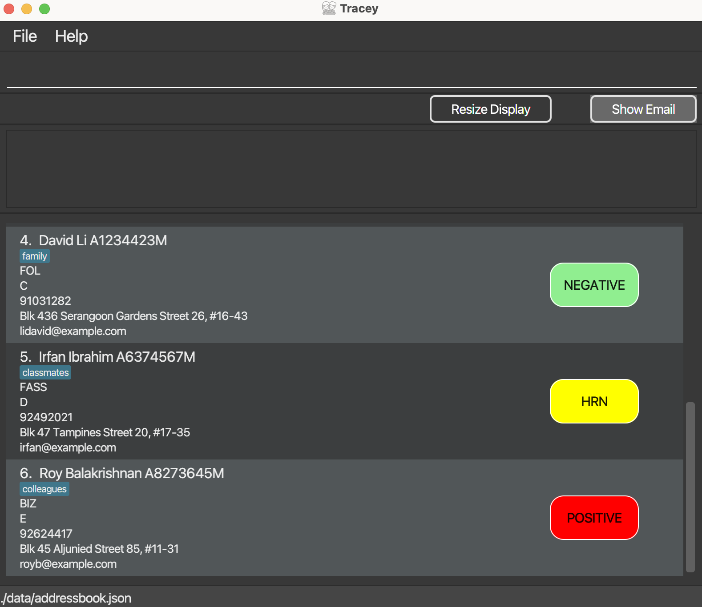

# Tracey

---------------------------------------------------------------------------------------------------------------

A Covid tracking web app for NUS Residential Hall Admins to **manage the health** of students living on campus.

## Introduction

---------------------------------------------------------------------------------------------------------------

* Tracey can get your students' health statuses easily and have Covid-tracking done faster than any other forms of tracking system.
* Quick import feature and fus-free updating of student list.
* Filter out relevant Covid-related information with a single command.
* Additional functionality to generate charts for a quick overview.
* The way to facilitate management of Covid status tracking amongst the Halls of NUS population.

## More Info

---------------------------------------------------------------------------------------------------------------

* If you are interested in our application, refer to our **[website](https://ay2122s2-cs2103t-t12-3.github.io/tp/UserGuide.html#quick-start)** to find out more.
* This project was adopted from the existing AB3 se-education.org project. Refer to the AB3 product website **[here](https://se-education.org/addressbook-level3/)**.
* Get to know the team behind **[Tracey](https://ay2122s2-cs2103t-t12-3.github.io/tp/AboutUs.html)**.
