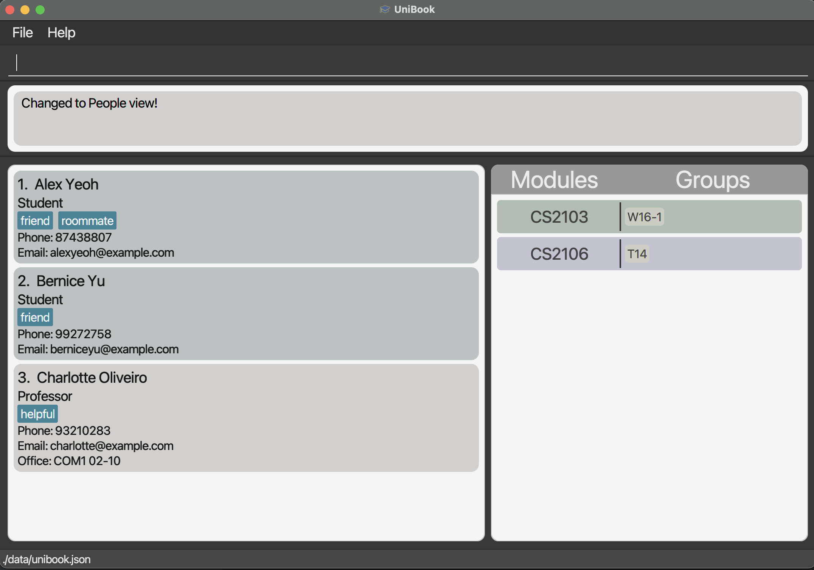

* This is a project created under CS2103 software engineering module in NUS.
* This application is written predominantly in Java, with a simple GUI using JavaFX. 
* Its purpose is to provide university students with a way to manage university contacts related to their studies in an organised manner.
* This project is based on the AddressBook-Level3 project created by the [SE-EDU initiative](https://se-education.org).
