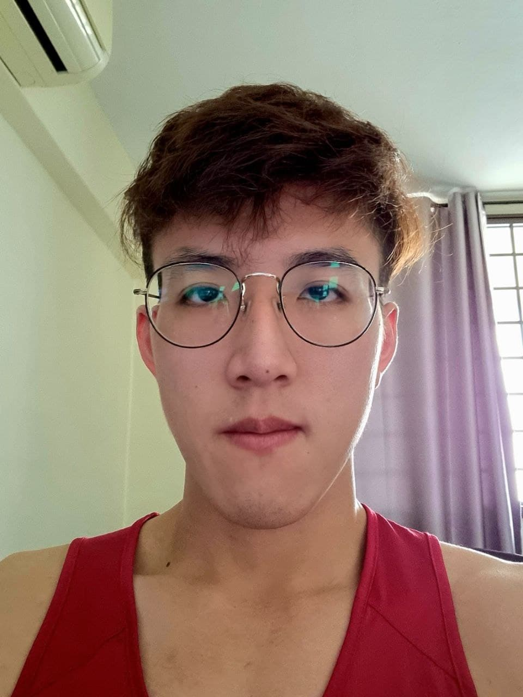

We are a team based in the [School of Computing, National University of Singapore](http://www.comp.nus.edu.sg).

You can reach us at the email `seer[at]comp.nus.edu.sg`

## Project team

### Frederick Tang 

[[github](https://github.com/fredtwt)][[portfolio](team/fredtwt.md)]

* Role: Team Lead / Developer [tbd]
* Responsibilities: 
  * Oversee the entire project

### Ong Kim Lai 

[[github](http://github.com/ongkimlai)][[portfolio](team/ongkimlai.md)]

* Role: Deliverables and deadlines / Developer [tbd]
* Responsibilities: 
  * Handle project deliverables and plan deadlines

### Vikrant

[[github](http://github.com/johndoe)] [[portfolio](team/johndoe.md)]

* Role: Testing / Developer [tbd]
* Responsibilities: 
  * Testing of project to ensure everything is proper 

### Manusha

[[github](http://github.com/johndoe)]
[[portfolio](team/johndoe.md)]

* Role: Documentation / Code Quality / Developer [tbd]
* Responsibilities: 
  * Ensures project documentation done properly
  * Ensures code adheres to coding standards 
