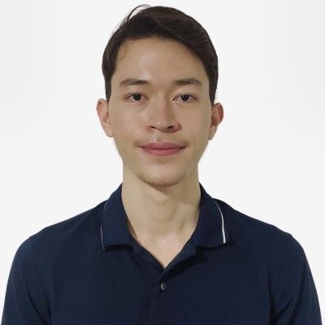
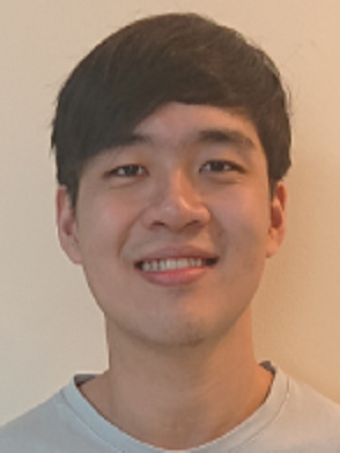
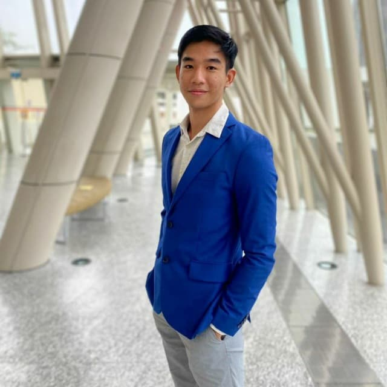
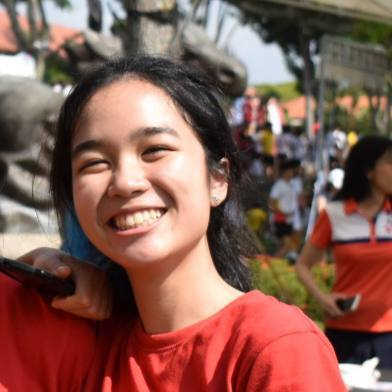

We are a team based in the [School of Computing, National University of Singapore](http://www.comp.nus.edu.sg).

## Project team

### Ben Murphy

[[github](https://github.com/benmurphyy)]
[[portfolio](team/benmurphyy.md)]

* Role: Team Lead
* Responsibilities: UI, Storage

### Loy Yoke Yue

[[github](http://github.com/yokester98)]
[[portfolio](team/yokester98.md)]

* Role: Code Quality
* Responsibilities: Add Command functionality

### Gerald Neo

[[github](http://github.com/geraldneo567)] [[portfolio](team/geraldneo567.md)]

* Role: Documentation
* Responsibilities: List command functionality

### Ryan Walter Lee

[[github](http://github.com/ryanwalterlee)]
[[portfolio](team/ryanwalterlee.md)]

* Role: Developer
* Responsibilities: Delete command functionality

### Sophie Ng

[[github](http://github.com/sophiien)]
[[portfolio](team/sophiien.md)]

* Role: Developer
* Responsibilities: Edit command functionality

