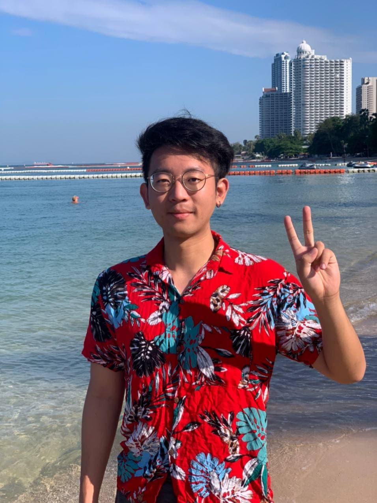
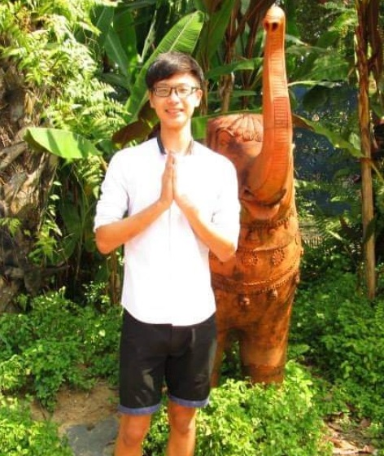
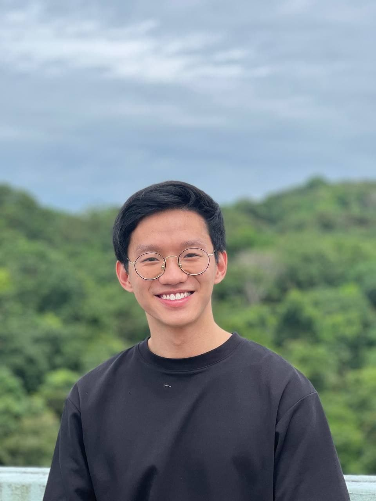
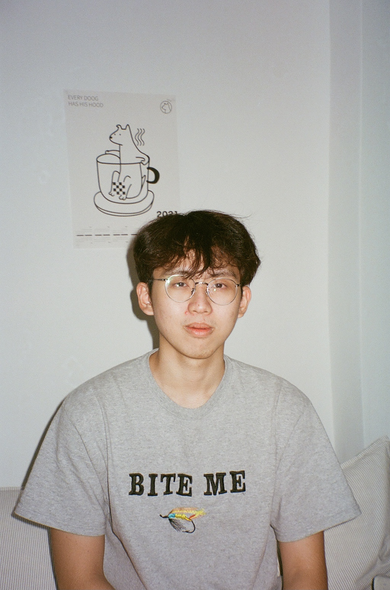

We are a team based in the [School of Computing, National University of Singapore](http://www.comp.nus.edu.sg).

## Project team

### Kuo Chun Yuan

[[github](https://github.com/kevinkuo0320)]
[[portfolio](team/kevinkuo0320.md)]

* Role: Developer
* Responsibilities: Code integration and UI design

### Chua Wen Quan

[[github](http://github.com/cwq2326)]
[[portfolio](team/cwq2326.md)]

* Role: Developer & Co-Integration
* Responsibilities: Code integration and Tracking

### Malcom Tan

[[github](http://github.com/DannyDakota)] [[portfolio](team/dannydakota.md)]

* Role: Developer & Code-Quality
* Responsibilities: Code integration and Testing

### Tan Chin Kiat

[[github](http://github.com/tanchinkiat99)]
[[portfolio](team/tanchinkiat99.md)]

* Role: Developer & Documentation
* Responsibilities: Testing and Code Quality

### Chee Jia Le

[[github](http://github.com/jiale-c)]
[[portfolio](team/jiale-c.md)]

* Role: Team Lead & Integration
* Responsibilities: Scheduling and Code integration
