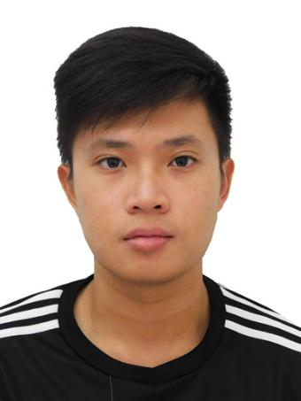
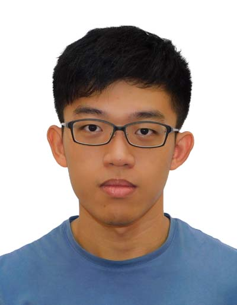
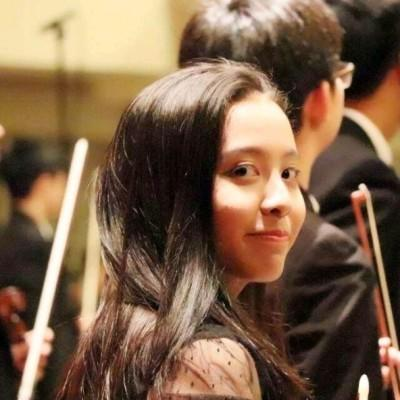
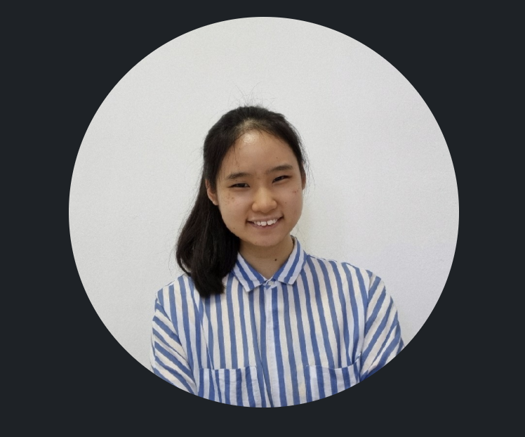

We are a team based in the [School of Computing, National University of Singapore](http://www.comp.nus.edu.sg).

You can reach us at the ownerName `seer[at]comp.nus.edu.sg`

## Project team

### Thia Su Mian

[[github](https://github.com/tsumian)]
[[portfolio](team/tsumian.md)]

* Role: Deliverables and deadlines

### S Dinesh Raj

[[github](http://github.com/dineshraj555)]
[[portfolio](team/dineshraj555.md)]

* Role: Developer

### Teo Hao Yu

[[github](http://github.com/tobihy)] 
[[portfolio](team/tobihy.md)]

* Role: Developer

### Shaine Goh Si Hui

[[github](http://github.com/soloplxya)]
[[portfolio](team/soloplxya.md)]

* Role: Developer
* Responsibilities: Developer 

### Lin Hui Xin Tiffany

[[github](http://github.com/Tiffanylin21)]
[[portfolio](team/tiffanylin21.md)]

* Role: Developer
* Responsibilities: Developer
