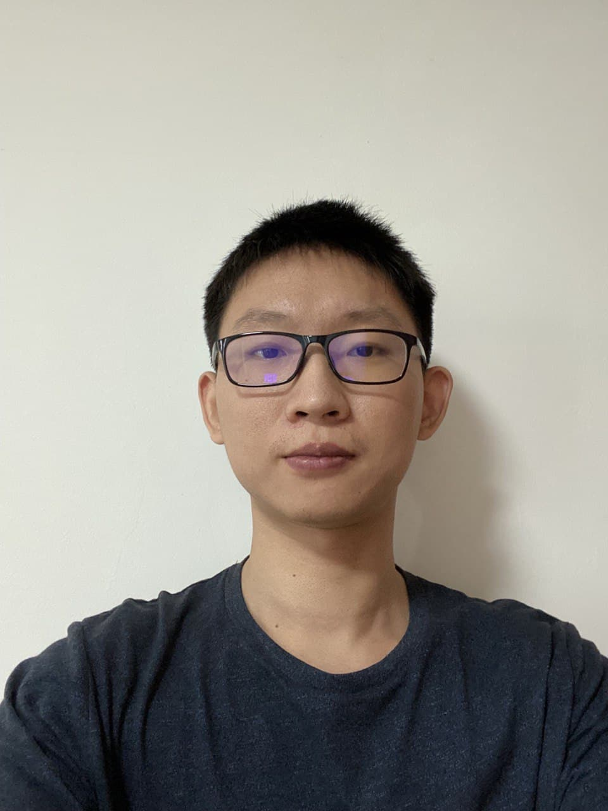

We are a team based in the [School of Computing, National University of Singapore](http://www.comp.nus.edu.sg).

## Project team

### John Doe

[[homepage](http://www.comp.nus.edu.sg/~damithch)]
[[github](https://github.com/johndoe)]
[[portfolio](team/johndoe.md)]

* Role: Project Advisor

### Yong Kai Qi

[[github](https://github.com/flairekq)]
[[portfolio](team/flairekq.md)]

* Role: Team Lead, Developer
* Responsibilities: Deliverables & deadlines, scheduling & tracking

### Wu HanHui

[[github](https://github.com/hanhuiice)]
[[portfolio](team/hanhuiice.md)]

* Role: Developer
* Responsibilities: Data + Features

### Isabel Teo

[[github](https://github.com/isabelteo)]
[[portfolio](team/isabelteo.md)]

* Role: Developer
* Responsibilities: UI
