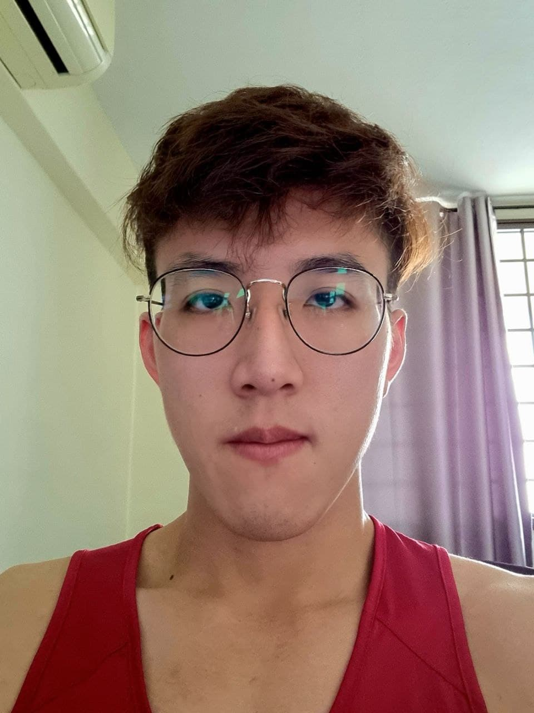

We are a team based in the [School of Computing, National University of Singapore](http://www.comp.nus.edu.sg).

## Project team

### Frederick Tang

[[github](https://github.com/fredtwt)][[portfolio](team/fredtwt.md)]

* Roles: Team Lead / Developer / Scheduling and tracking
* Responsibilities:
  * Oversee the entire project
  * Storage, Model, Logic Components

### Ong Kim Lai

[[github](http://github.com/ongkimlai)][[portfolio](team/ongkimlai.md)]

* Roles: Deliverables and deadlines / Developer / Documentation
* Responsibilities:
  * Handle project deliverables and plan deadlines
  * UI, Logic Components

### Vikrant

[[github](http://github.com/viki0526)] [[portfolio](team/viki0526.md)]

* Roles: Testing / Developer
* Responsibilities:
  * Testing of project to ensure everything is proper
  * Logic Component

### Manusha

[[github](http://github.com/manu2002g)]
[[portfolio](team/manu2002g.md)]

* Roles: Developer
* Responsibilities:
  * Ensures project documentation done properly
  * Ensures code adheres to coding standards
  * Logic Component
