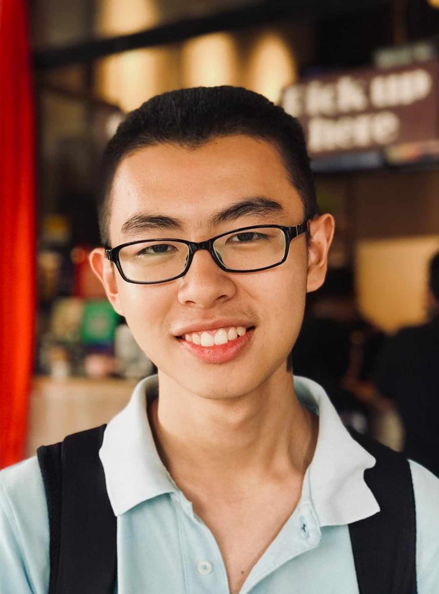
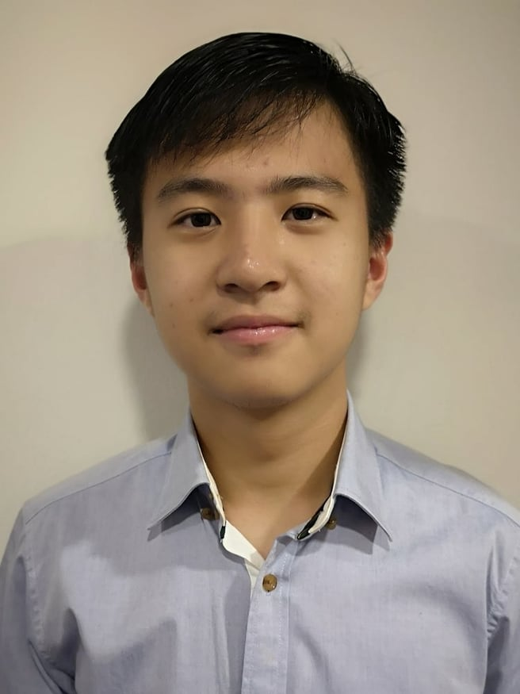
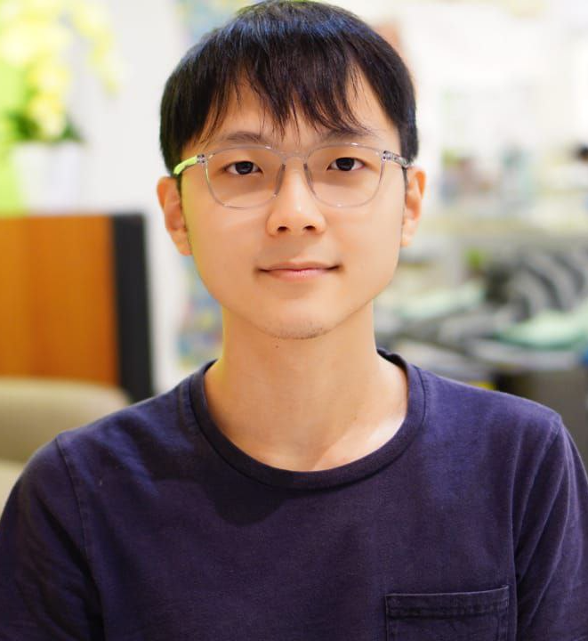
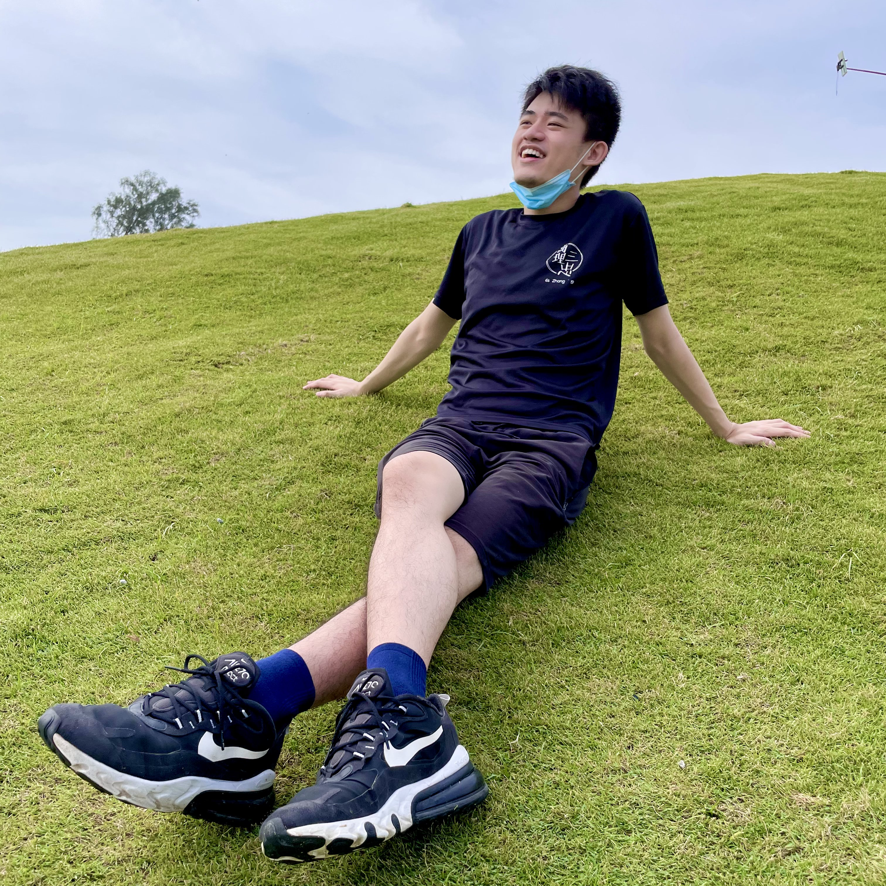

We are a team based in the [School of Computing, National University of Singapore](http://www.comp.nus.edu.sg).

You can reach us at the email `seer[at]comp.nus.edu.sg`

## Project team

### Desmond Tan

[[homepage](http://www.comp.nus.edu.sg/~damithch)]
[[github](https://github.com/mazx4960)]
[[portfolio](team/mazx4960.md)]

* Role: Integration, Testing, Code quality

### Lai Mei Tin

[[github](http://github.com/1001mei)]
[[portfolio](team/1001mei.md)]

* Role: Developer
* Responsibilities: Documentation

### Loo Xin Wei

[[github](http://github.com/redpelican2108)] [[portfolio](team/redpelican2108.md)]

* Role: Developer
* Responsibilities: Data

### Tan Kel Zin

[[github](http://github.com/mechfrog88)]
[[portfolio](team/mechfrog88.md)]

* Role: Developer
* Responsibilities: In charge of UI, JavaFX expert

### Tan Weiu Cheng

[[github](http://github.com/DavidTan0527)]
[[portfolio](team/weiucheng.md)]

* Role: Developer
* Responsibilities: Integration, Code Quality, Git expert
