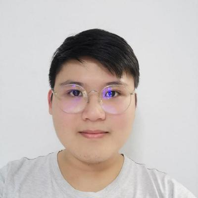
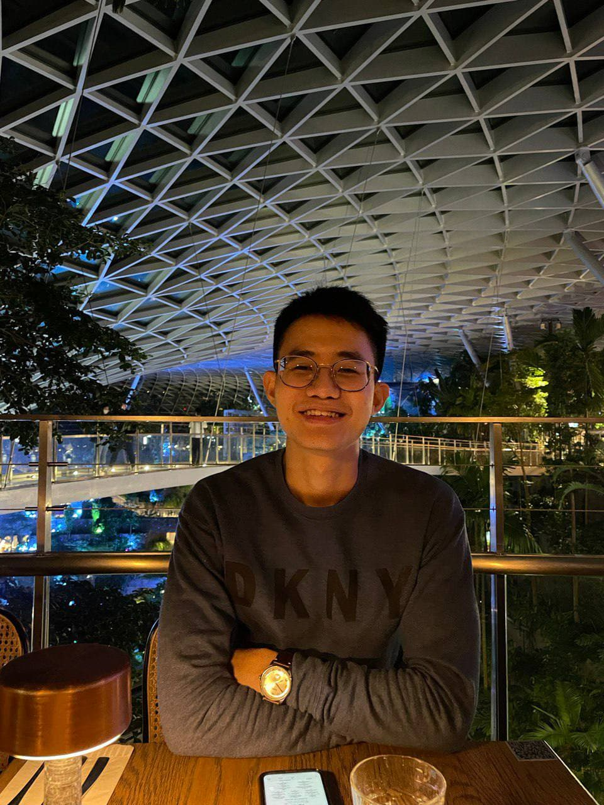
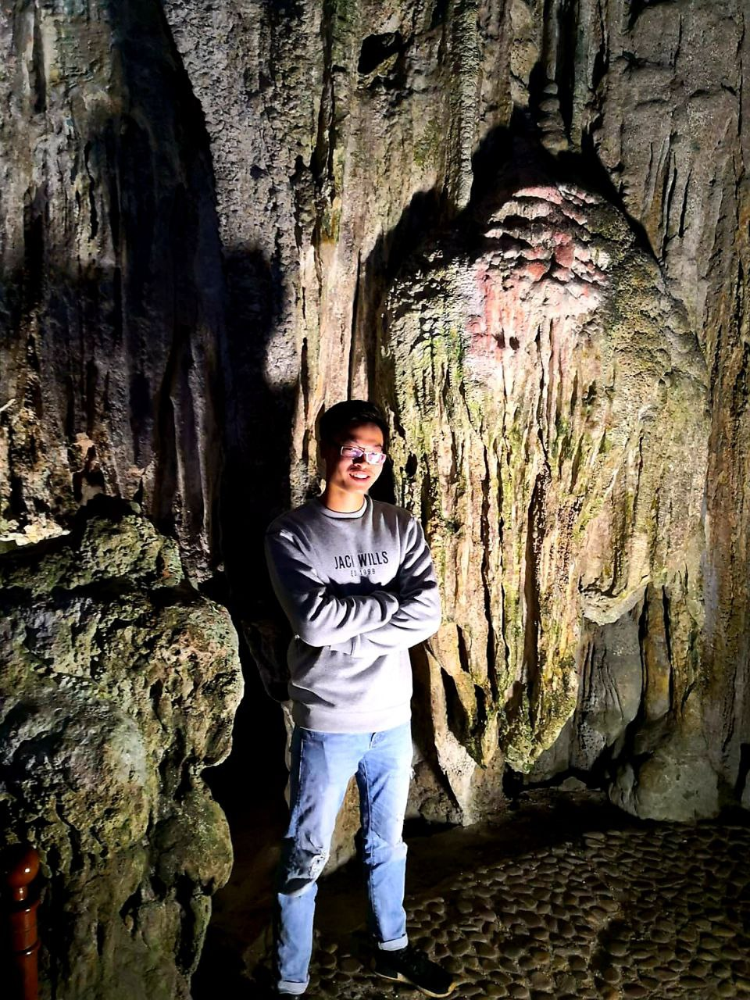

We are a team based in the [School of Computing, National University of Singapore](http://www.comp.nus.edu.sg).

You can reach us at the email `seer[at]comp.nus.edu.sg`

## Project team

### Bian Yuqi

[[homepage](https://github.com/Jacky142857)]
[[portfolio](team/jacky142857.md)]

* Role: Developer
* Responsibilities: Documentation and testing.

### Chua Shi Hong

[[github](https://github.com/chuashihong)]
[[portfolio](team/chuashihong.md)]

* Role: Developer
* Responsibilities: Testing, UI

### Ho Qi Yuan, Janald

[[github](http://github.com/janald99)] [[portfolio](team/janald99.md)]

* Role: Developer
* Responsibilities: Code Quality, Documentation

### Wang Jun Hong

[[github](http://github.com/WJunHong)]
[[portfolio](team/wjunhong.md)]

* Role: Team Lead
* Responsibilities: Ensure overall team coordination

### Phua Jun Heng

[[github](http://github.com/cwnm)] [[portfolio](team/cwnm.md)]

* Role: Developer
* Responsibilities: Deliverables and deadlines, Scheduling and tracking

