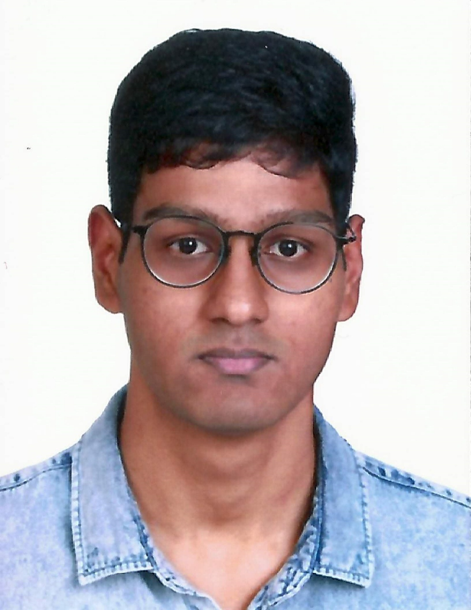
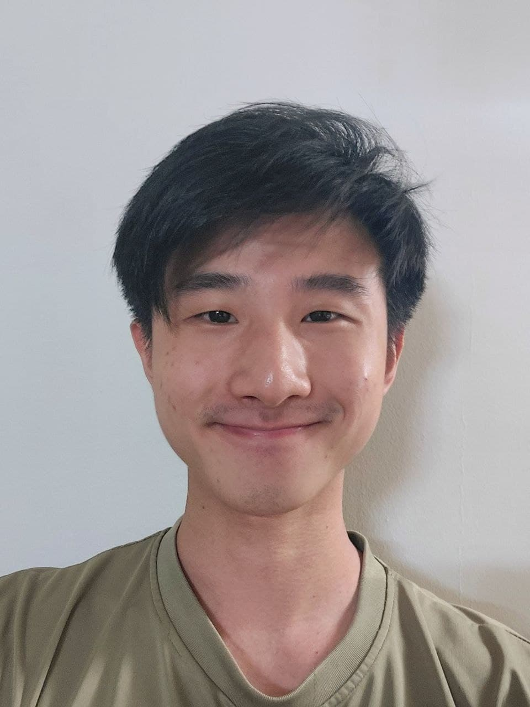
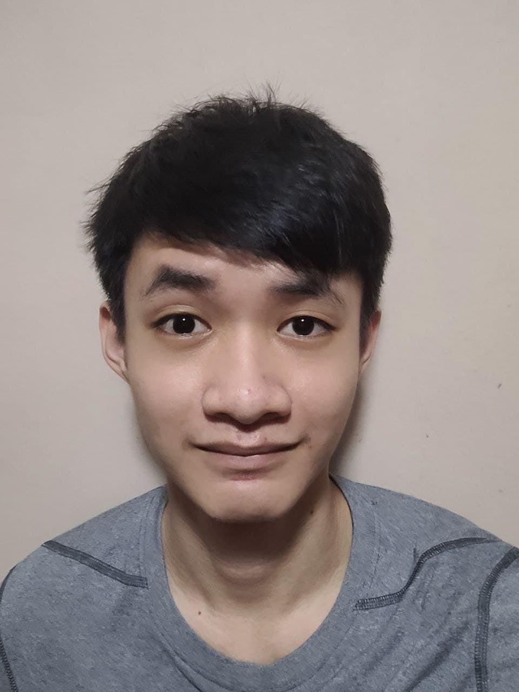
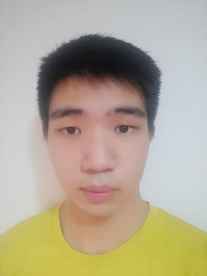

We are a team based in the [School of Computing, National University of Singapore](http://www.comp.nus.edu.sg).

You can reach us at the email `shafik@u.nus.edu`

## Project team

### Vishwanth

[[github](http://github.com/vishwanth2210)]
[[portfolio](team/vishwanth2210.md)]

* Role: Developer + Team Lead
* Responsibilities: Dev Ops + Threading

### Kuan Jian Rong

[[github](https://github.com/kuanjr)]
[[portfolio](team/kuanjr.md)]

* Role: Developer + Deliverables and Deadlines

### Mohd Shafik

[[github](https://github.com/AD-NAP/)]
[[portfolio](team/ad-nap.md)]

* Role: Developer + Scheduling and Tracking
* Responsibilities: Code

### Jack Ng

[[github](http://github.com/j4ck990)]
[[portfolio](team/j4ck990.md)]

* Role: Developer + Integration
* Responsibilities: Data

### Wee Heng

[[github](http://github.com/decaxical)]
[[portfolio](team/decaxical.md)]

* Role: Developer + Testing
* Responsibilities: UI
