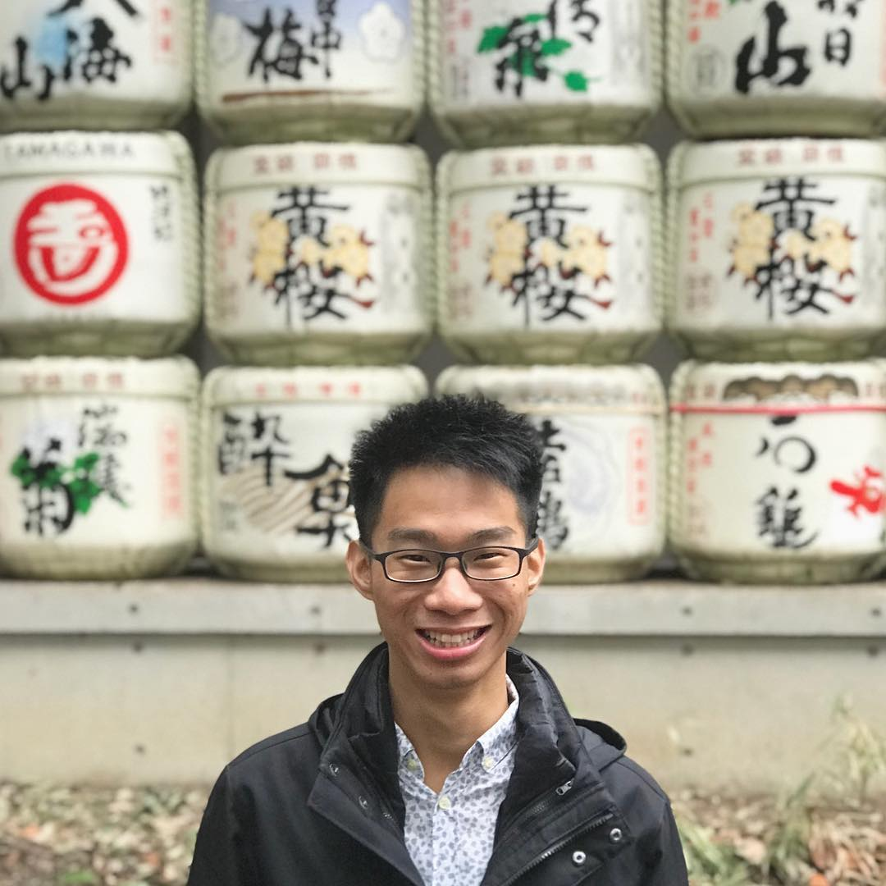
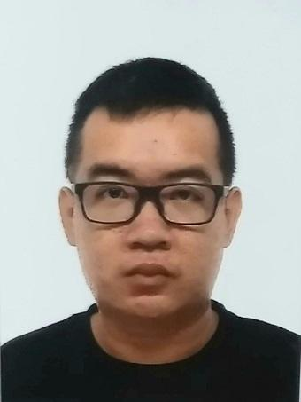

We are a team based in the [School of Computing, National University of Singapore](http://www.comp.nus.edu.sg).

You can reach us at the email `seer[at]comp.nus.edu.sg`

## Project team

### John Doe

[[homepage](http://www.comp.nus.edu.sg/~damithch)]
[[github](https://github.com/johndoe)]
[[portfolio](team/johndoe.md)]

* Role: Project Advisor

### Alfred Koh

[[github](http://github.com/alfredkohhh)]
[[portfolio](team/johndoe.md)]

* Role: Developer
* Responsibilities: Integration, Documentation, Deliverables and Deadlines
* In Charge of: Storage

### Johnny Doe

[[github](http://github.com/johndoe)] [[portfolio](team/johndoe.md)]

* Role: Developer
* Responsibilities: Data

### Jean Doe

[[github](http://github.com/johndoe)]
[[portfolio](team/johndoe.md)]

* Role: Developer
* Responsibilities: Dev Ops + Threading

### Chan Wei Jie

[[github](http://github.com/chanweijie)]
[[portfolio](team/johndoe.md)]

* Role: Developer
* Responsibilities: Integration, Documentation, Deliverables and Deadlines  
* In Charge of Component Model
