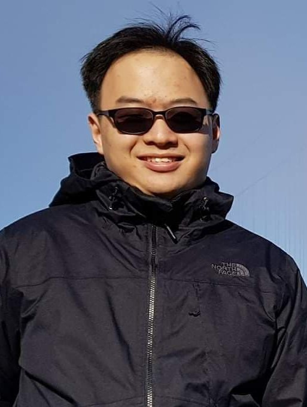

We are a team based in the [School of Computing, National University of Singapore](http://www.comp.nus.edu.sg).

You can reach us at the email `seer[at]comp.nus.edu.sg`

## Project team

### Li KangLi

[[github](https://github.com/lkldev)]
[[portfolio](team/lkldev.md)]

* Role: Team Lead
* Responsibilities: Code quality / Scheduling and tracking

### Gernene Tan

[[github](http://github.com/Gernene)]
[[portfolio](team/gernene.md)]

* Role: Developer
* Responsibilities: UI and Documentation

### Liong Wen Xuan

[[github](http://github.com/wxliong)] [[portfolio](team/wxliong.md)]

* Role: Developer
* Responsibilities: Testing

### Meng An

[[github](http://github.com/evaderfati)]
[[portfolio](team/evaderfati.md)]

* Role: Developer
* Responsibilities: Integration

### Tan Jia Xin

[[github](http://github.com/jxt00)]
[[portfolio](team/jxt00.md)]

* Role: Developer
* Responsibilities: Deliverables and deadlines / Scheduling and tracking
