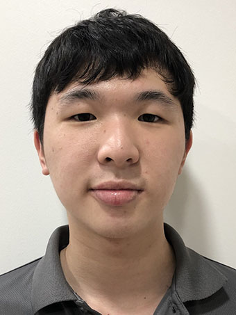
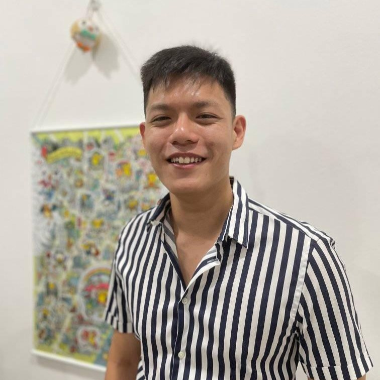
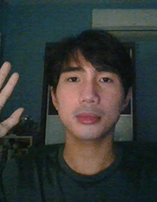
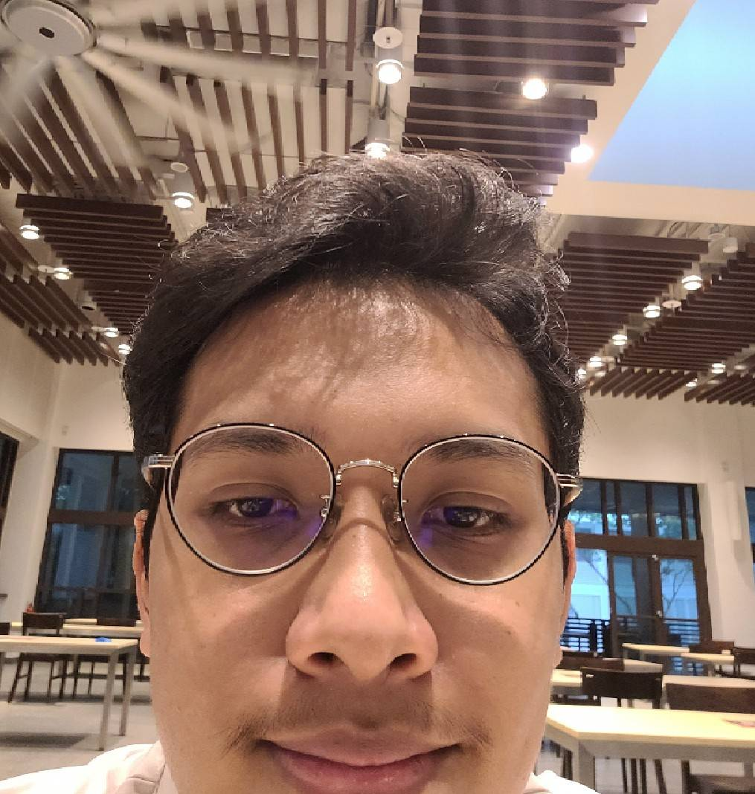

We are a team based in the [School of Computing, National University of Singapore](http://www.comp.nus.edu.sg).

You can reach us at the email `seer[at]comp.nus.edu.sg`

## Project team

### John Doe

[[homepage](http://www.comp.nus.edu.sg/~damithch)]
[[github](https://github.com/johndoe)]
[[portfolio](team/johndoe.md)]

* Role: Project Advisor

### Angie

[[github](https://github.com/LapisRaider)][[portfolio](team/lapisraider.md)]

* Role: Team Lead
* Responsibilities: Project Manager, Coder 

### Keith

[[github](http://github.com/keithczw)][[portfolio](team/keithczw.md)]

* Role: Developer
* Responsibilities: Data

### Terry

[[github](http://github.com/typedefinition)]
[[portfolio](team/typedefinition.md)]

* Role: Developer
* Responsibilities: Dev Ops + Threading

### Dane

[[github](http://github.com/DaneMarc)]
[[portfolio](team/danemarc.md)]

* Role: Developer
* Responsibilities: Documentation + Search

### Daffa

[[github](http://github.com/zunedz)][[portfolio](team/zunedz.md)]

* Role: Developer
* Responsibilities: Code, Testing
