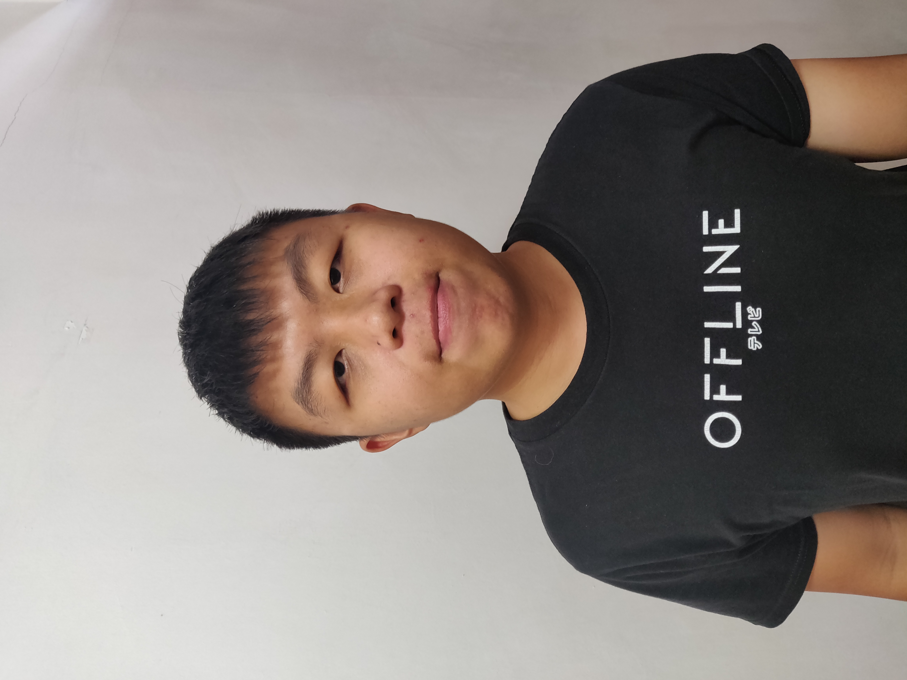
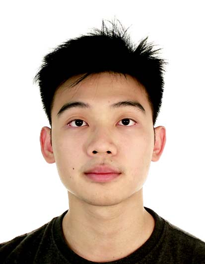
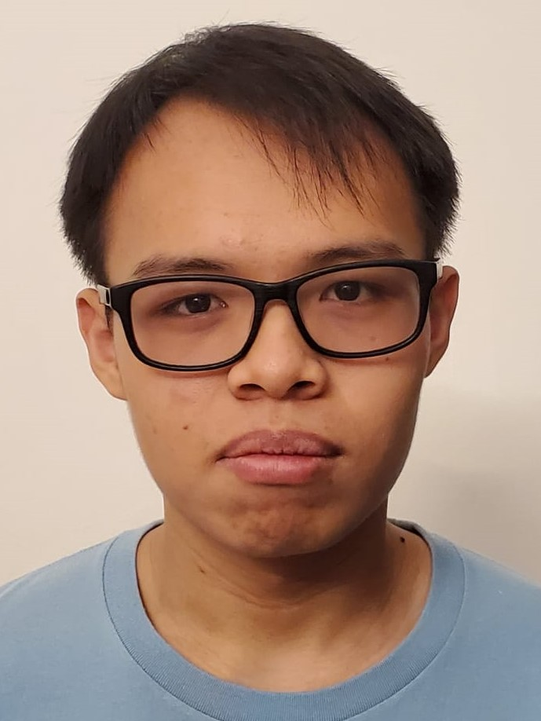

We are a team based in the [School of Computing, National University of Singapore](http://www.comp.nus.edu.sg).

## Project team

### Jonathan Yeo

 &nbsp; &nbsp; &nbsp;

|   Role    | Responsibilities   |
|:---------:|:-------------------|
| Developer | Team Lead   UI |

### Ang Wei Jun

 &nbsp; &nbsp; &nbsp;

|   Role    | Responsibilities        |
|:---------:|:------------------------|
| Developer | Integration   Model |

### Low Kaiwei

 &nbsp; &nbsp; &nbsp;

|   Role    | Responsibilities         |
|:---------:|:-------------------------|
| Developer | Code Quality   Logic |

### Lim Shao Cong

 &nbsp; &nbsp; &nbsp;

|   Role    | Responsibilities            |
|:---------:|:----------------------------|
| Developer | Documentation   Storage |

### Zachary Chan

 &nbsp; &nbsp; &nbsp;

|   Role    | Responsibilities                |
|:---------:|:--------------------------------|
| Developer | Quality Assurance   Command |
