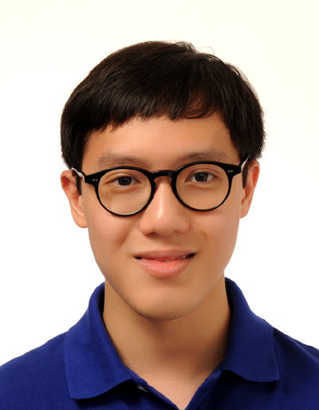
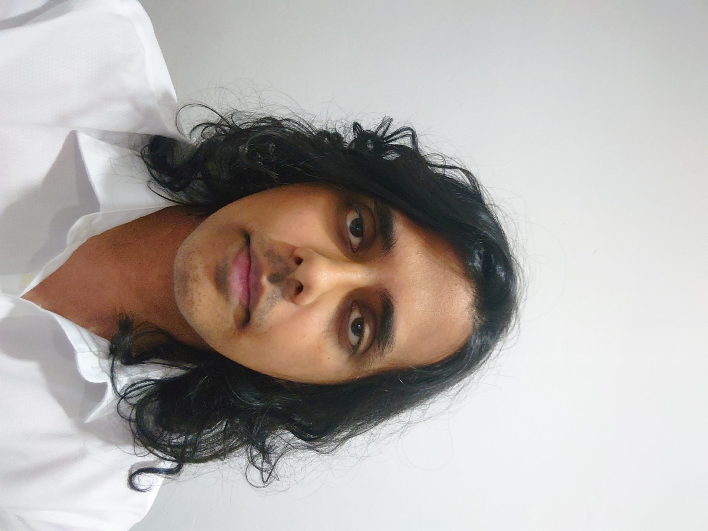

We are a team based in the [School of Computing, National University of Singapore](http://www.comp.nus.edu.sg).

## Project team

### James Yeap

* [github](http://github.com/jamesyeap)
* [portfolio](team/jamesyeap.md)

* Role: Developer
* Responsibilities: `Model`, `Storage` components

### Samuel Tee

* [github](http://github.com/kidsnd274)
* [portfolio](team/kidsnd274.md)

* Role: Developer
* Responsibilities: `UI`, `Logic` components

### Nyayapati Nikhil

* [github](http://github.com/nnmoq)
* [portfolio](team/nnmoq.md)
* Role: Developer
* Responsibilities: `Model`, `Storage` components

### Ryan Low

* [GitHub](http://github.com/Ryan-L98)
* [Portfolio](team/ryan-l98.md)

* Role: Developer
* Responsibilities: `Model`, `UI` components
