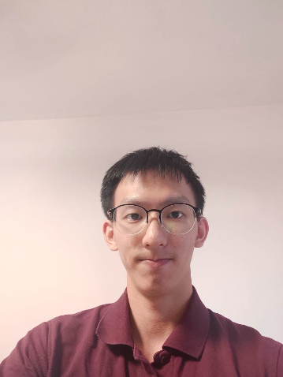
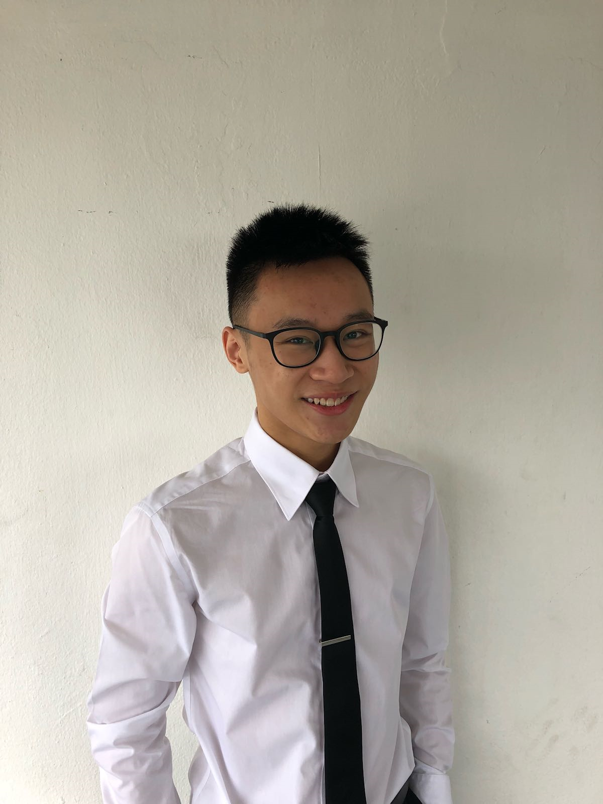
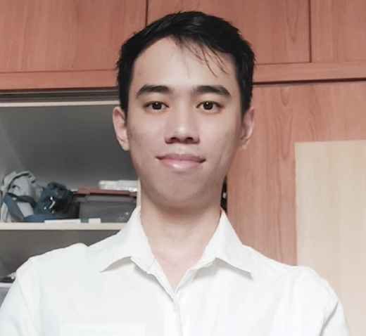
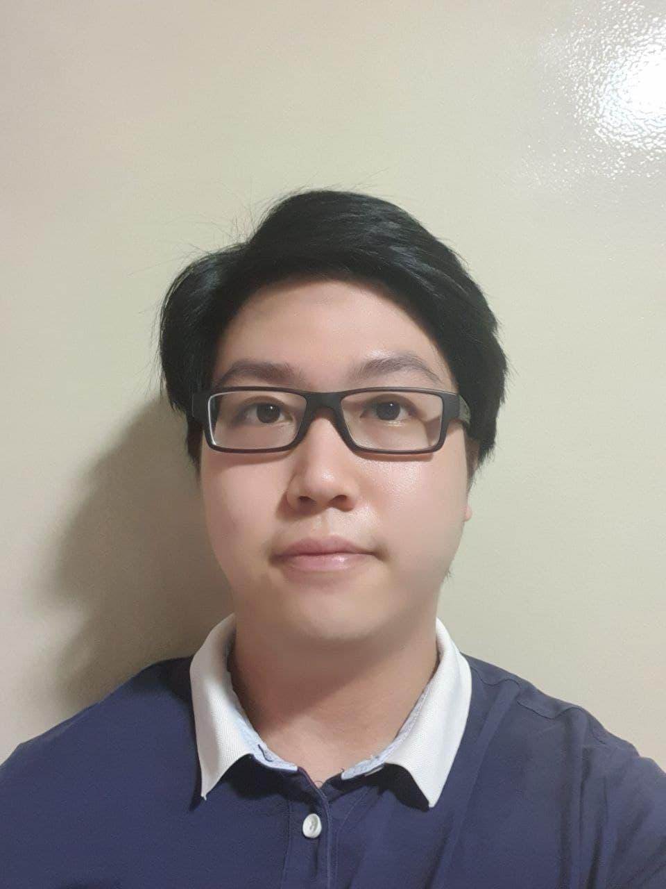
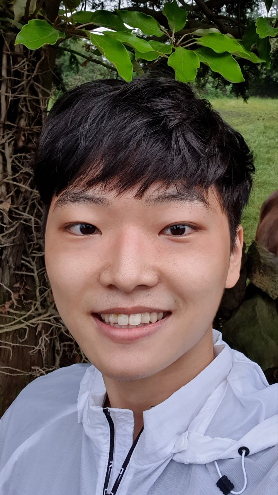

We are a team based in the [School of Computing, National University of Singapore](http://www.comp.nus.edu.sg).

## Project team

### Toh Zhan Qing

[[github](http://github.com/tzhan98)][[portfolio](team/tzhan98.md)]

* Role: Developer
* Responsibilities: Documentation + Skill feature

### Alex Teo

[[github](http://github.com/alexteo98)][[portfolio](team/alexteo98.md)]

* Role: Developer
* Responsibilities: Unit Testing and Code Coverage

### Lye Jia Yang

[[github](http://github.com/jiaaa-yang)][[portfolio](team/jiaaa-yang.md)]

* Role: Developer
* Responsibilities: Code Quality

### Melvin Chan Zijun

[[github](https://github.com/MelvinCZJ)][[portfolio](team/melvinczj.md)]

* Role: Developer
* Responsibilities: Functionality

### Junha Park

[[github](http://github.com/B1LLP4RK)]
[[portfolio](team/b1llp4rk.md)]

* Role: Developer
