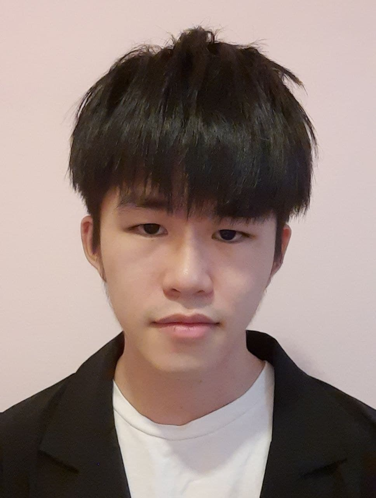
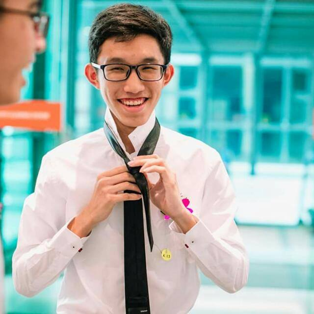
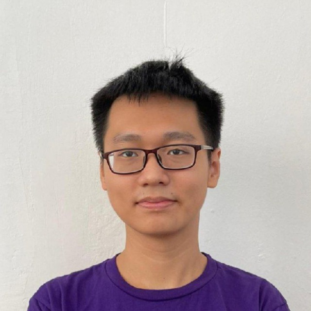
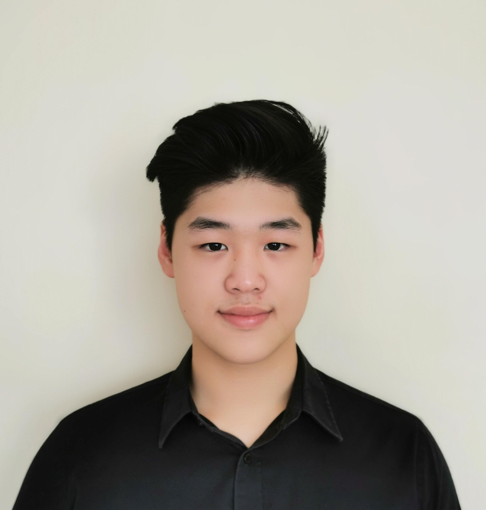

We are a team based in the [School of Computing, National University of Singapore](http://www.comp.nus.edu.sg).

## Project team

### Loo Chee Kean

[[github](https://github.com/cheekean5848)]
[[portfolio](team/cheekean5848.md)]

* Role: Team Lead, Deliverables and deadlines
* Responsibilities: Logic

### Clement Tee

[[github](http://github.com/clement0010)]
[[portfolio](team/clement0010.md)]

* Role: Code quality, Scheduling and tracking
* Responsibilities: UI

### Si Binh Ho

[[github](http://github.com/sibinhho99-nus)]
[[portfolio](team/sibinhho99-nus.md)]

* Role: Developer, Integration
* Responsibilities: Storage

### Joey Chance

[[github](http://github.com/joey-chance)]
[[portfolio](team/joey-chance.md)]

* Role: Developer, Testing
* Responsibilities: Model

### Justin Lam

[[github](http://github.com/justinlam19)]
[[portfolio](team/justinlam19.md)]

* Role: Documentation
* Responsibilities: Ui
