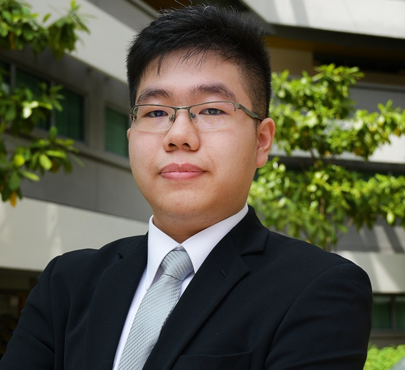
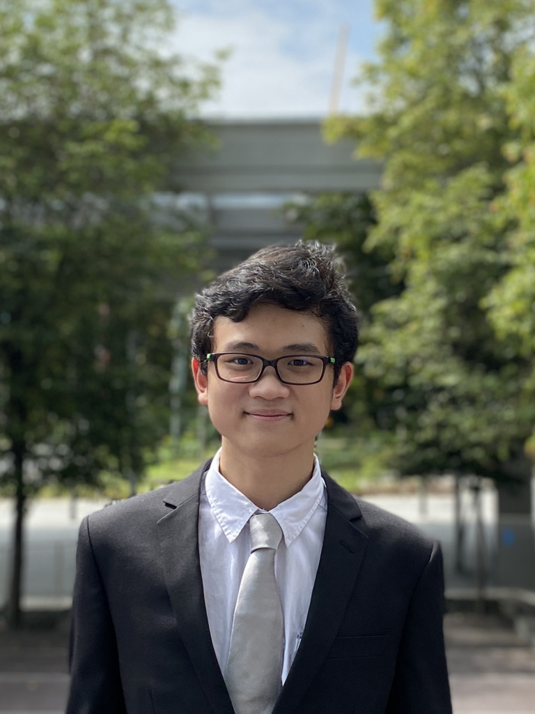
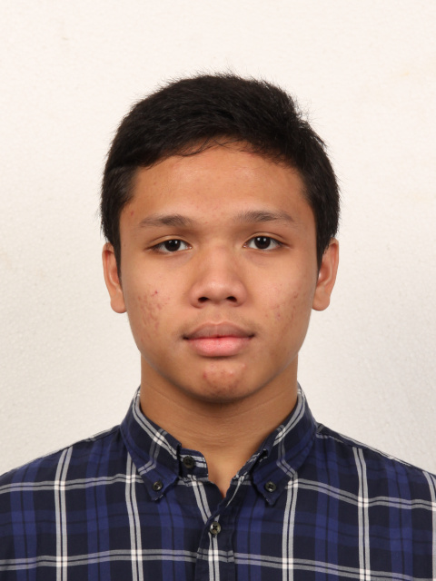

We are a team based in the [School of Computing, National University of Singapore](http://www.comp.nus.edu.sg).

You can reach us at the email `seer[at]comp.nus.edu.sg`

## Project team

### John Doe

[[homepage](http://www.comp.nus.edu.sg/~damithch)]
[[github](https://github.com/johndoe)]
[[portfolio](team/johndoe.md)]

* Role: Project Advisor

### Albert Sutiono

[[github](https://github.com/albertsutz)]
[[linkedin](https://www.linkedin.com/in/albert-sutiono/)]
[[portfolio](./team/albertsutz.md)]

* Role: Developer
* Responsibilities: TBD  

I am an eager Y2 computer science undergraduate with the desire to learn and improve myself in this field. I aim to delve deeper into the world of software engineering and cybersecurity which address and solve real world problems with the focus on privacy and data security.

### Edward Alvin

[[github](http://github.com/theprevailingone)] [[portfolio](team/theprevailingone.md)]

* Role: Developer
* Responsibilities: TBD

Computer Science undergraduate passionate about software engineering and game development. Capable developer, having devised and developed multiple projects. Proficient in a range of modern technologies including Python, Javascript and Java. Interested in UI/UX Design and Data Science. Looking for new opportunities and challenges.

### Steven Chua

[[homepage](https://www.linkedin.com/in/stevengkchua)]
[[github](http://github.com/graphcalibur)]
[[portfolio](team/graphcalibur.md)]

* Role: Developer
* Responsibilities: TBD

I'm a Year 2 Computer Science undergraduate science with a passion for technology, games, and cybersecurity.
I'm always looking for ways to improve my skills and widen my knowledge.

### Muhammad Radhya Fawza

[[github](https://github.com/mradhyaf)]
[[linkedin](https://www.linkedin.com/in/mradhyaf/)]
[[portofolio](./team/mradhyaf.md)]

* Role: Developer
* Responsibilities: TBD

