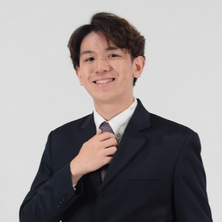
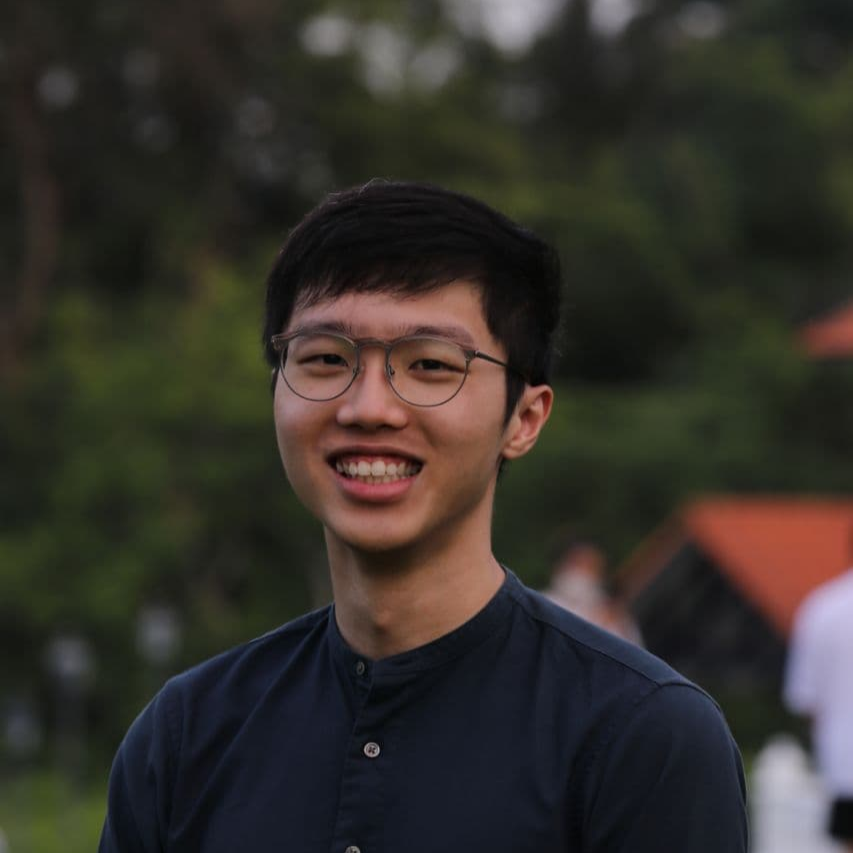
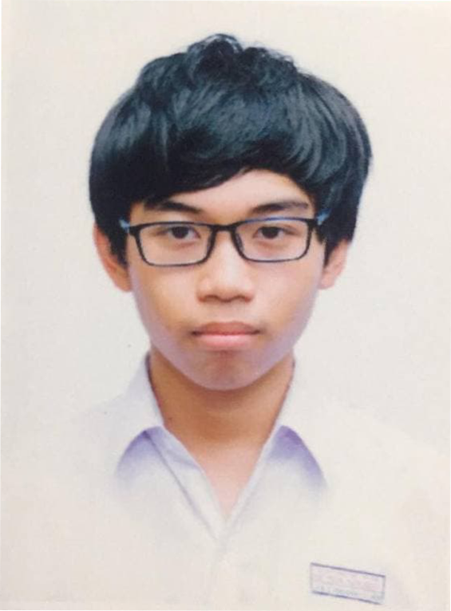
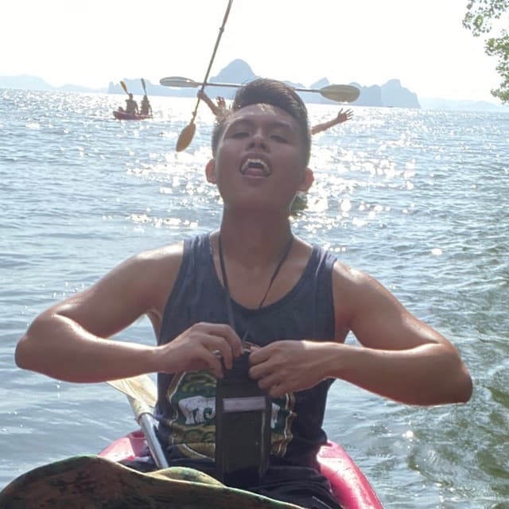

We are a team based in the [School of Computing, National University of Singapore](http://www.comp.nus.edu.sg).

## Project Team

### Bryan Ong

[[github](https://github.com/likeabowx)]
[[portfolio](team/likeabowx.md)]

* Role: Developer
* Responsibilities: Integration of code, and in charge of `Filter` commands

### Chong Kok Leong

[[github](http://github.com/SethCKL)]
[[portfolio](team/sethckl.md)]

* Role: Developer
* Responsibilities: Project Management, Documentation, and in charge of `Applicant` component

### Le Nguyen Quang Dang Khoa

[[github](https://github.com/khoahre123)]
[[portfolio](team/khoahre123.md)]

* Role: Developer
* Responsibilities: Deliverables and deadlines and in charge of 
`help` commands

### Lee Yi Hern

[[github](https://github.com/YiHern-Lee)]
[[portfolio](team/yihern-lee.md)]

* Role: Developer
* Responsibilities: Code quality and in charge of `Position` component  

### Tan Wei Howe

[[Github](http://github.com/goalfix)]
[[portfolio](team/goalfix.md)]

* Role: Developer
* Responsibilities: Git expert, Scheduling and tracking, In charge of `Interview` component.
