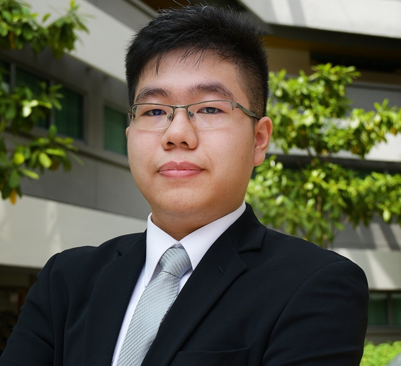

We are a team based in the [School of Computing, National University of Singapore](http://www.comp.nus.edu.sg).

You can reach us at the email `seer[at]comp.nus.edu.sg`

## Project team

### John Doe

[[homepage](http://www.comp.nus.edu.sg/~damithch)]
[[github](https://github.com/johndoe)]
[[portfolio](team/johndoe.md)]

* Role: Project Advisor

### Albert Sutiono

[[github](https://github.com/albertsutz)]
[[linkedin](https://www.linkedin.com/in/albert-sutiono/)]

* Role: Developer
* Responsibilities: TBD  

I am an eager Y2 computer science undergraduate with the desire to learn and improve myself in this field. I aim to delve deeper into the world of software engineering and cybersecurity which address and solve real world problems with the focus on privacy and data security.

### Johnny Doe

[[github](http://github.com/johndoe)] [[portfolio](team/johndoe.md)]

* Role: Developer
* Responsibilities: Data

### Muhammad Radhya Fawza

[[github](https://github.com/mradhyaf)]
[[linkedin](https://www.linkedin.com/in/mradhyaf/)]

* Role: Developer
* Responsibilities: TBD

### James Doe

[[github](http://github.com/johndoe)]
[[portfolio](team/johndoe.md)]

* Role: Developer
* Responsibilities: UI
