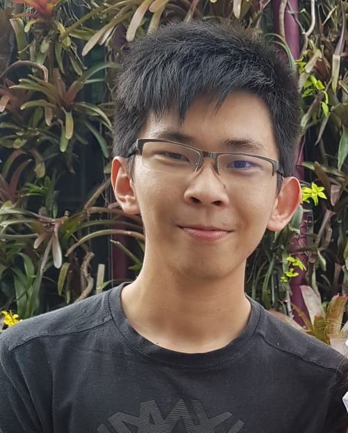
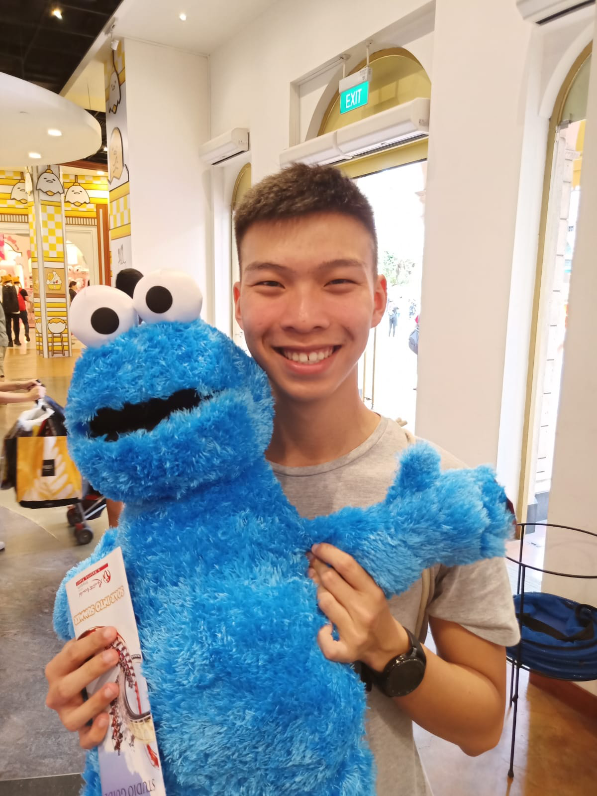
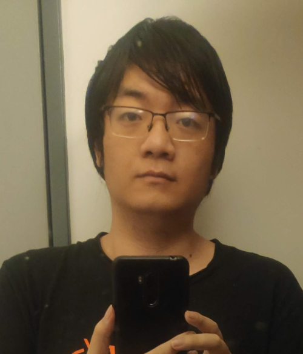

We are a team based in the [School of Computing, National University of Singapore](http://www.comp.nus.edu.sg).

You can reach us at the email `seer[at]comp.nus.edu.sg`

## Project team

### Ho Zong Han

[[github](http://github.com/sharpstorm)]
[[portfolio](team/sharpstorm.md)]

* Role: Team Lead
* Responsibilities: Code Quality, Scheduling and Deadlines, Progress Tracking, In Charge of Appointments Subcomponent

### Daniel Lee Min Qiang

[[github](https://github.com/dandaandaaaaaan)]
[[portfolio](team/dandaandaaaaaan.md)]

* Role: Developer
* Responsibilities: CI/CD and Workflow Management, Repository Administration, In Charge of Import/Export Subcomponent

### Ong Wei Xin

[[github](https://github.com/wei-xinn)]
[[portfolio](team/wei-xinn.md)]

* Role: Developer
* Responsibilities: In Charge of User Onboarding Subcomponent

### Kwan Hao Wei

[[github](http://github.com/kwanhw)]
[[portfolio](team/kwanhw.md)]

* Role: Developer
* Responsibilities: In Charge of Tag Management Subcomponent

### Han Jiyao

[[github](http://github.com/hanjiyao)]
[[portfolio](team/hanjiyao.md)]

-   Role: Developer
-   Responsibilities: In Charge of Bulk Operations Subcomponent
