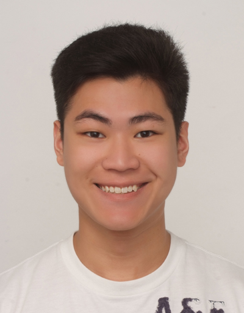
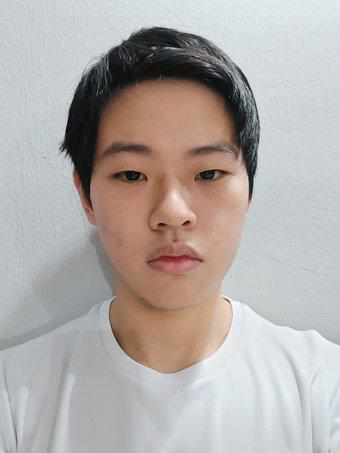
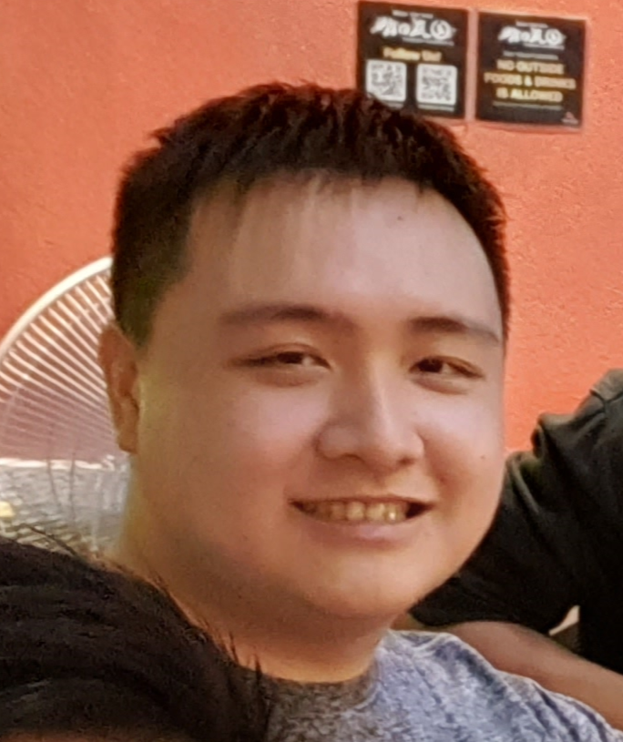

We are a team based in the [School of Computing, National University of Singapore](http://www.comp.nus.edu.sg).

## Project team

### Brandon Kheng

[[github](https://github.com/brelkh)]
[[portfolio](team/brelkh.md)]

* Role: Developer

### Benjamin Koh Wei Jie

[[github](http://github.com/benjykoh)]
[[portfolio](team/benjykoh.md)]

* Role: Developer
* Responsibilities: Documentation, Testing, Integration

### Jet Tan

[[github](http://github.com/medajet)]
[[portfolio](team/medajet.md)]

* Role: Developer
* Responsibilities: Documentation, Testing, Integration

### Saravanan Anuja Harish

[[github](http://github.com/harish-coding)]
[[portfolio](team/harish-coding.md)]

* Role: Developer
* Responsibilities: Documentation, Testing, Integration

### Terng Yan Long

[[github](http://github.com/korochii)]
[[portfolio](team/korochii.md)]

* Roles: Team Lead, Developer
* Responsibilities: Documentation, Testing, Integration
