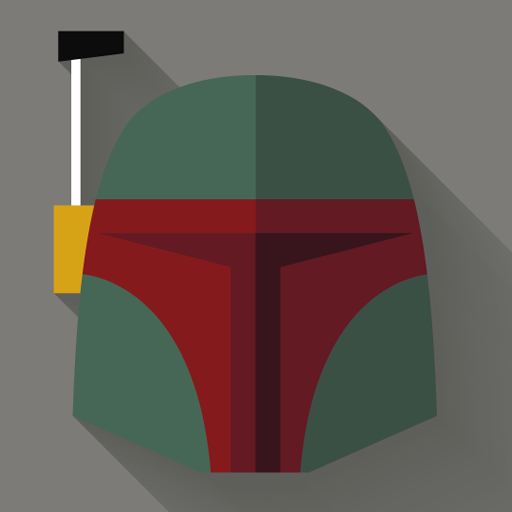
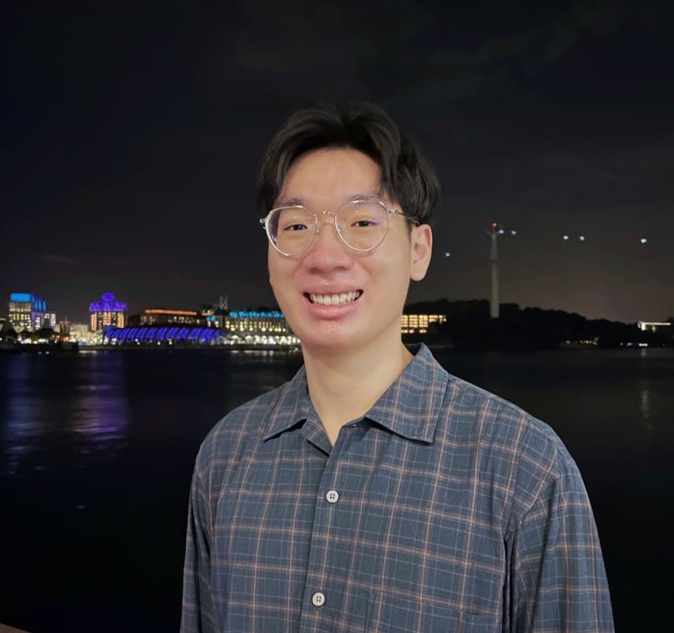
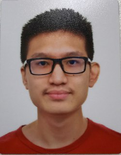
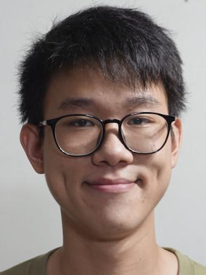
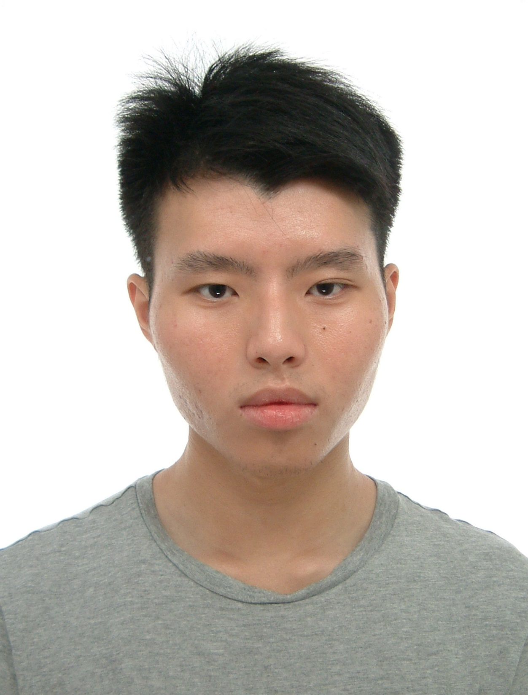

We are a team based in the [School of Computing, National University of Singapore](http://www.comp.nus.edu.sg).

You can reach us at the email `seer[at]comp.nus.edu.sg`

## Project team

### Bryan Tan Jing Kai

[[github](https://github.com/fantablack)]
[[portfolio](team/fantablack.md)]

* Role: Developer
* Responsibilities: Developer

### Benjamin Tay Keck Bin

[[github](https://github.com/Btaykb)]
[[portfolio](team/btaykb.md)]

* Role: Developer
* Responsibilities: TBC

### Julio Harjo

[[github](https://github.com/junlee1991)] 
[[portfolio](team/junlee1991.md)]

* Role: Developer
* Responsibilities: Data

### Wei Jie

[[github](http://github.com/bakano98)]
[[portfolio](team/bakano98.md)]

* Role: Developer
* Responsibilities: GUI, features enhancement

### Law Wei Ming

[[github](http://github.com/lawwm)]
[[portfolio](team/lawwm.md)]

* Role: Developer
* Responsibilities: UI
