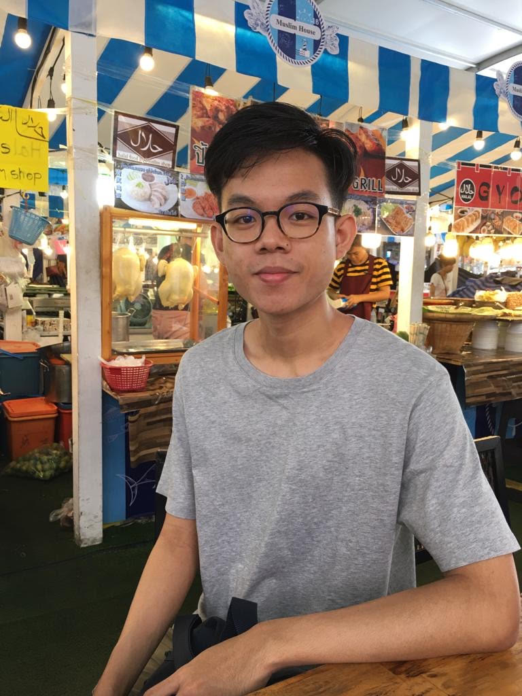
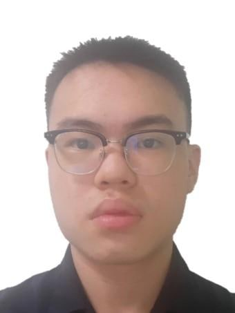
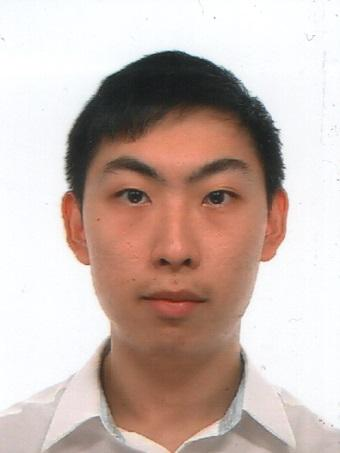
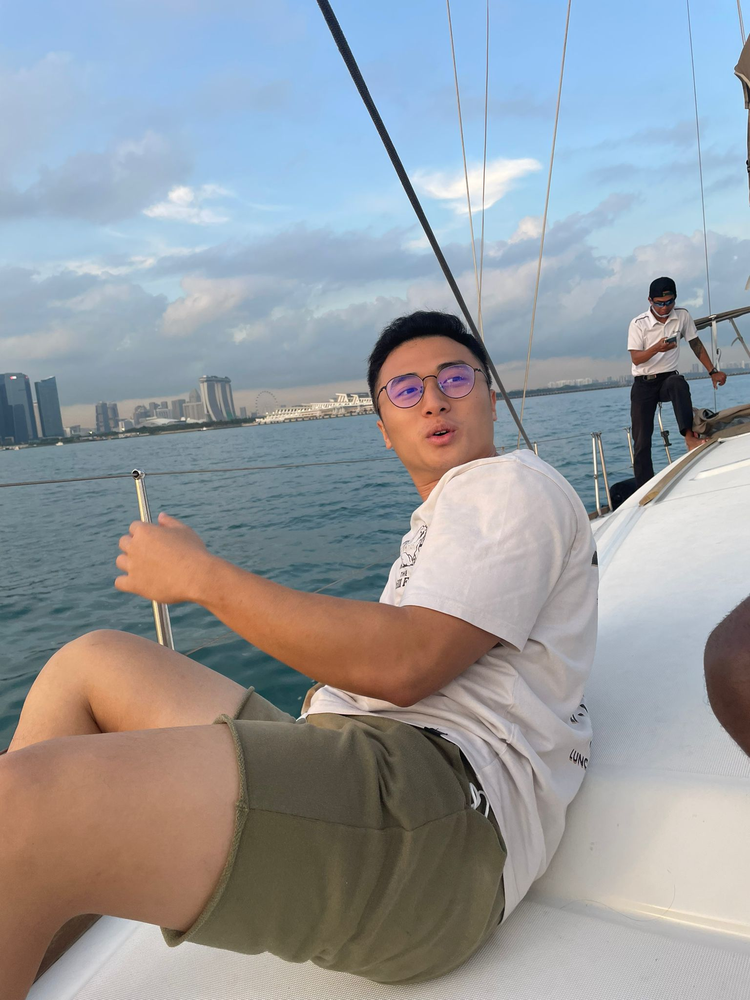
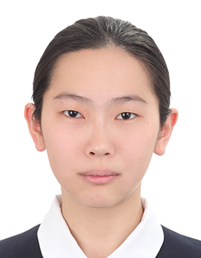

We are a team based in the [School of Computing, National University of Singapore](http://www.comp.nus.edu.sg).

You can reach us at the email `seer[at]comp.nus.edu.sg`

## Project team

### Haikal Yusuf

[[github](http://github.com/waffledood)]
[[portfolio](team/waffledood.md)]

* Role: Team Lead
* Responsibilities: UI

### Howard Wong

[[github](http://github.com/howardwhw2)]
[[portfolio](team/howardwhw2.md)]

* Role: Developer
* Responsibilities: User Guide

### Bryan Zheng

[[github](http://github.com/ashuh)]
[[portfolio](team/ashuh.md)]

* Role: Developer
* Responsibilities: Data

### HsiaoJietNg

[[github](https://github.com/hsiaojietng)]
[[portfolio](team/hsiaojietng.md)]

* Role: Developer
* Responsibilities: Dev Ops + Threading

### Yang Xiquan

[[github](http://github.com/cindyangXQ)]
[[portfolio](team/cindyangxq.md)]

* Role: Developer
* Responsibilities: Dev Ops + Threading
