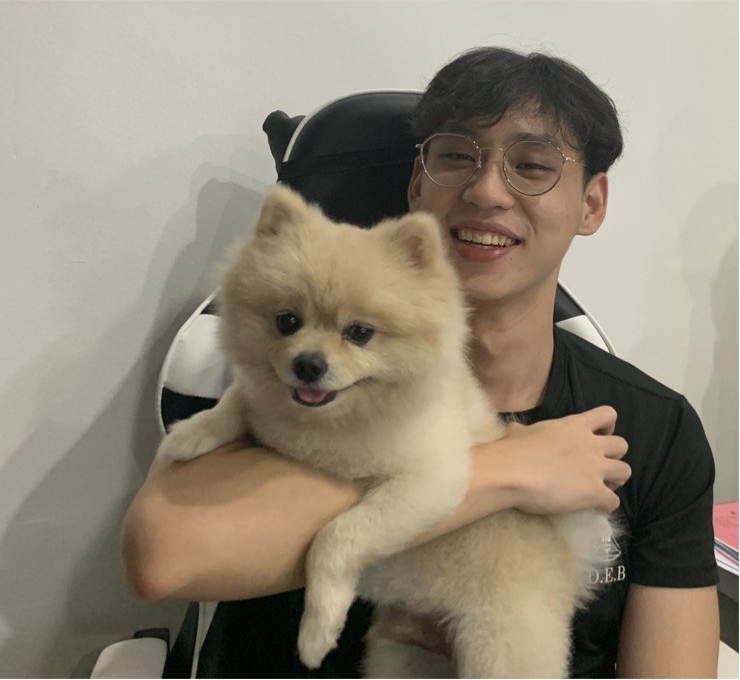
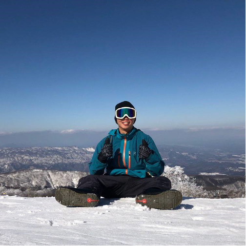

We are a team based in the [School of Computing, National University of Singapore](http://www.comp.nus.edu.sg).

You can reach us at the email `cs2103tATeam@gmail.com`

## Project team

### NANAYAKKARAWASAM PERU KANDAGE NUWAN JANAKA

[[github](https://github.com/janakanuwan)]
[[portfolio](team/janakanuwan.html)]

* Role: Project Advisor

### Brendon Lau

[[github](https://github.com/BrendonLau)]
[[portfolio](team/brendonlau.html)]

* Role: Team Lead
* Responsibilities: Git

### Ng Hong Liang

[[github](http://github.com/jinnhl)]
[[portfolio](team/jinnhl.html)]

* Role: Integration Reviewer
* Responsibilities:

### Justin Yip

[[github](http://github.com/justinyjt)] [[portfolio](team/justinyjt.html)]

* Role: Code Quality and Documentation Reviewer
* Responsibilities:

### Kerby Soh

[[github](http://github.com/kerbysoh)]
[[portfolio](team/kerbysoh.html)]

* Role: Testing Reviewer
* Responsibilities: Dev Ops + Threading

### Peter Jung

[[github](http://github.com/petermonky)]
[[portfolio](team/petermonky.html)]

* Role: Frontend Developer
* Responsibilities: GUI
