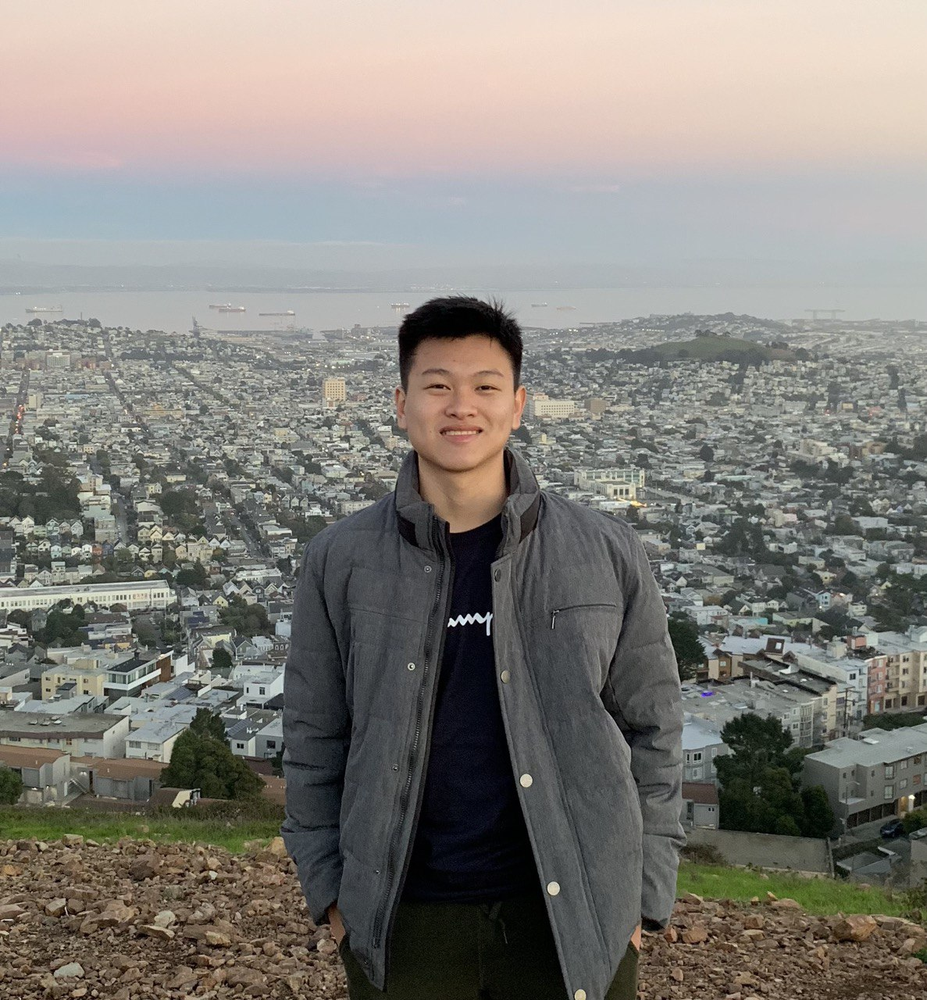
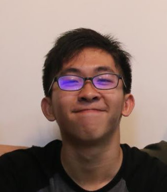

We are a team based in the [School of Computing, National University of Singapore](http://www.comp.nus.edu.sg).

You can reach us at the email `seer[at]comp.nus.edu.sg`

## Project team

### Wee Jun Hong

[[github](https://github.com/whoisjunhong)]
[[portfolio](team/whoisjunhong.md)]

* Role: Project Advisor

### Joshua Yap

[[github](http://github.com/e0544333)]
[[portfolio](team/e0544333.md)]

* Role: Team Lead
* Responsibilities: UI

### Louis Davin Lie

[[github](http://github.com/louisdavinlie)]
[[portfolio](team/louisdavinlie.md)]

* Role: Developer
* Responsibilities: Data

### Tan Yong Rui

[[github](http://github.com/fenway17)]
[[portfolio](team/fenway17.md)]

* Role: Developer
* Responsibilities: Dev Ops + Threading

### Lye Zi Foong

[[github](http://github.com/lzf834)]
[[portfolio](team/lzf834.md)]

* Role: Developer
* Responsibilities: UI
