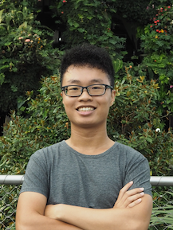

We are a team based in the [School of Computing, National University of Singapore](http://www.comp.nus.edu.sg).

You can reach us at the email `(placeholder for email address)`

## Project team

### Charmaine Ho

[[github](http://github.com/charmainehly)] [[portfolio](team/charmainehly.md)]

* Role: Developer
* Responsibilities: Scheduling & Tracking, Testing

### Dominic Lim

[[github](http://github.com/domlimm)]
[[portfolio](team/domlimm.md)]

* Role: Developer
* Responsibilities: Integration, Testing

### Ho Lanzan

[[github](https://github.com/lzan98)]
[[portfolio](team/lzan98.md)]

* Role: Developer
* Responsibilities: Deliverables and deadlines

### Lee En En

[[github](http://github.com/leeenen)]
[[portfolio](team/leeenen.md)]

* Role: Developer
* Responsibilities: Documentation

### Tiew Wei Jian

[[github](http://github.com/tiewweijian)]
[[portfolio](team/tiewweijian.md)]

* Role: Developer
* Responsibilities: Code Quality, UI
