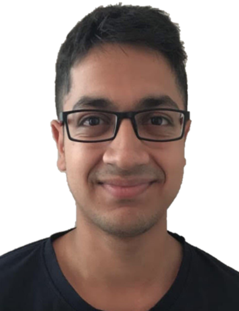

We are a team based in the [School of Computing, National University of Singapore](http://www.comp.nus.edu.sg).

## Project team

### Aryan Sarswat

[[github](https://github.com/AryanSarswat)]
[[portfolio](team/aryansarswat.md)]

* Role: Developer
* Responsibilities:
  * IC for UI and Integration
  * Implement, test and maintain `editfriend`, `showfriends`
  * Implement, test and maintain Tab management feature
  * Create python script to stress test application

### Dione Goh

[[github](http://github.com/dionegoh)]
[[portfolio](team/dionegoh.md)]

* Role: Developer
* Responsibilities: 
  * IC for Logic and code quality
  * Implement, test and maintain all features related to `friends` feature

### Lim Wei Liang

[[github](http://github.com/limweiliang)] [[portfolio](team/limweiliang.md)]

* Role: Developer
* Responsibilities:
  * Implement `Event` related commands
  * Update relevant documentation
  * Monitor changes to `Model` and Documentation

### Naaman Tan

[[github](http://github.com/tanyjnaaman)]
[[portfolio](team/tanyjnaaman.md)]

* Role: Developer
* Responsibilities: 
  * IC for testing and storage
  * Implement, test and maintain all features related to `insights` feature
  * Implement, test and maintain all features related to `logs` feature

