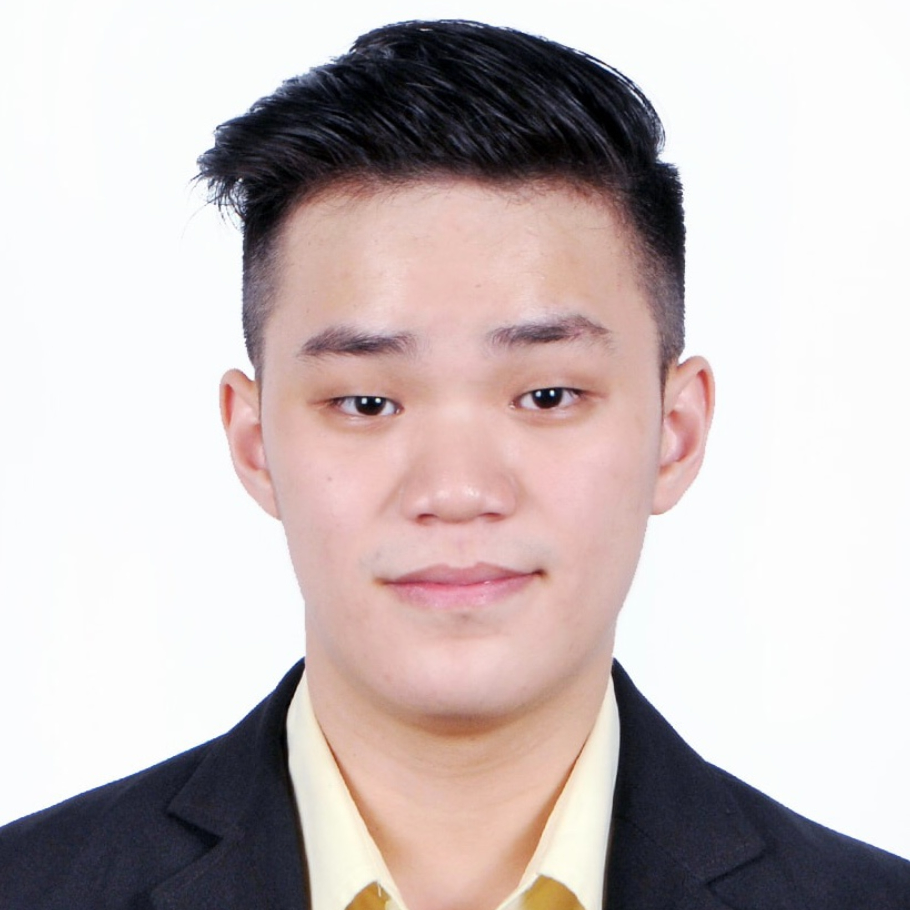

# About Us
We are team TAddressBook.

We are a team based in the [School of Computing, National University of Singapore](http://www.comp.nus.edu.sg).

## Project team

### Bryan seah

[[github](https://github.com/bryans17)]
[[portfolio](team/bryans17.md)]

* Role: Developer
* Responsibilities: Team Lead, Integration

### Channe Chwa

[[github](http://github.com/channne)]
[[portfolio](team/channne.md)]

* Role: Developer
* Responsibilities: Documentation, Testing

### Ryan Tan Gee Teng

[github](http://github.com/geetengtan)
[portfolio](team/geetengtan.md)

* Role: Developer
* Responsibilities: Code Quality, Deliverables and deadlines
