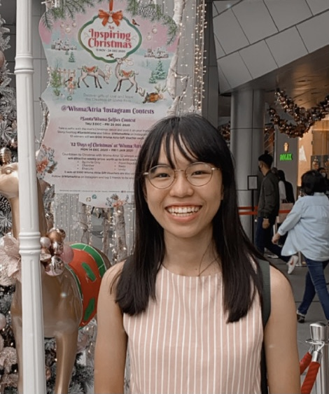
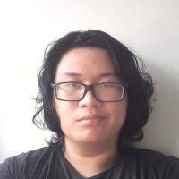
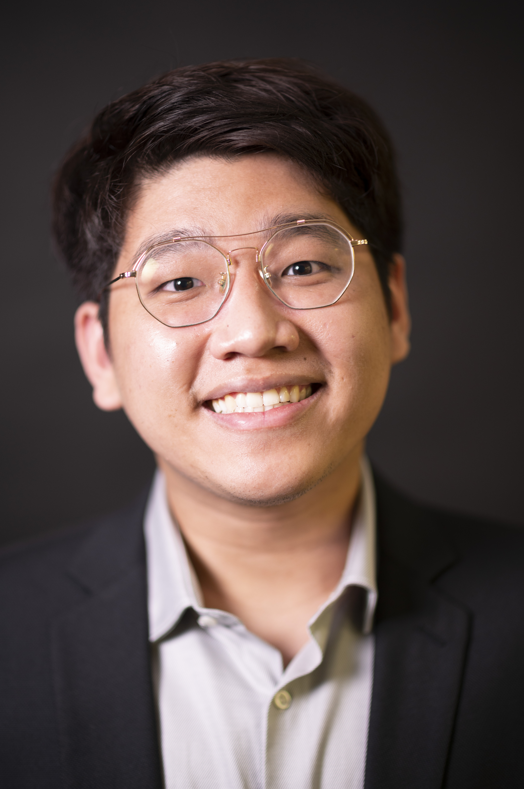

We are a team based in the [School of Computing, National University of Singapore](http://www.comp.nus.edu.sg).

You can reach us at the email `seer[at]comp.nus.edu.sg`

## Project team

### Papattarada Apithanangsiri

[[github](https://github.com/Punpun1643)]
[[portfolio](team/punpun1643.md)]

* Role: Team Lead
* Responsibilities: Deliverables and deadlines

### Raja Dishafnya Achadi

[[github](http://github.com/Rdac0)]
[[portfolio](team/rdac0.md)]

* Role: Developer
* Responsibilities: Code Quality and Documentation

### Quek Kah Leong

[[github](http://github.com/kahleongq)] 
[[portfolio](team/kahleongq.md)]

* Role: Testing
* Responsibilities: Ensures tests are done correctly and on time.

### KRISTOPHER PUTRA TASLIM

[[github](http://github.com/johndoe)]
[[portfolio](team/punpun1643.md)]

* Role: Developer
* Responsibilities: Dev Ops + Threading

### LOW LIK HERN

[[github](http://github.com/johndoe)]
[[portfolio](team/punpun1643.md)]

* Role: TBC
* Responsibilities: TBC
