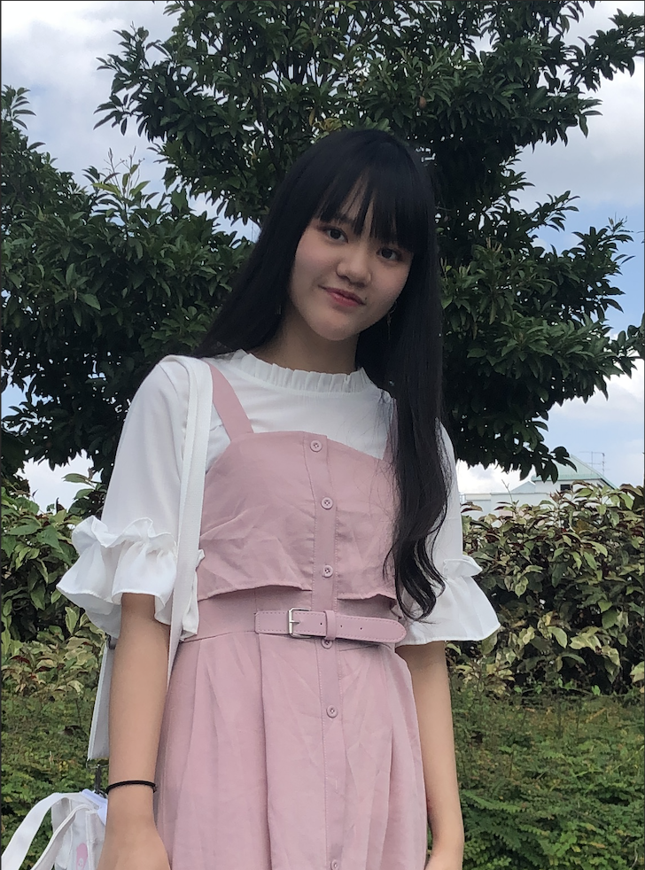

We are a team based in the [School of Computing, National University of Singapore](http://www.comp.nus.edu.sg).

You can reach us at the email `seer[at]comp.nus.edu.sg`

## Project team

### Sim SiLeng

[[github](https://github.com/pnutzz-0207)]
[[portfolio](team/pnutzz-0207.md)]

* Role: Team lead
* Responsibilities: Model

### Wang Zihao

[[github](https://github.com/9teMare)]
[[portfolio](team/9temare.md)]

* Role: Developer
* Responsibilities: UI

### Dai TianLe

[[github](http://github.com/ddx-510)] [[portfolio](team/ddx-510.md)]

* Role: Developer
* Responsibilities: Data

### Teoh Jun Jie

[[github](http://github.com/junjieteoh)]
[[portfolio](team/junjieteoh.md)]

* Role: Developer
* Responsibilities: Dev Ops + Threading
