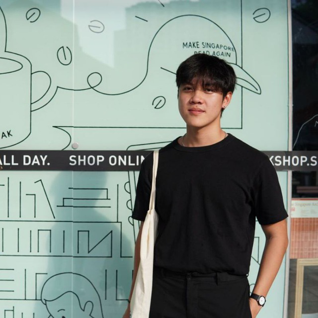

We are a team based in the [School of Computing, National University of Singapore](http://www.comp.nus.edu.sg).

You can reach us at the email `seer[at]comp.nus.edu.sg`

## Project team

### Kevin Kuo

[[homepage](http://www.comp.nus.edu.sg/~damithch)]
[[github](https://github.com/johndoe)]
[[portfolio](team/johndoe.md)]

* Role: Project Advisor

### Chua Wen Quan

[[github](http://github.com/cwq2326)]
[[portfolio](team/johndoe.md)]

* Role: Developer
* Responsibilities: Features

### Malcom Tan

[[github](http://github.com/DannyDakota)] [[portfolio](team/dannydakota.md)]

* Role: Developer
* Responsibilities: Data

### Tan Chin Kiat

[[github](http://github.com/tanchinkiat99)]
[[portfolio](team/tanchinkiat99.md)]

* Role: Developer
* Responsibilities: Dev Ops + Threading

### Chee Jia Le

[[github](http://github.com/jiale-c)]
[[portfolio](team/jiale-c.md)]

* Role: Developer
* Responsibilities: Features and testings
