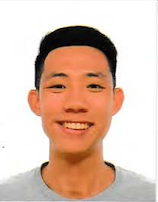

We are a team based in the [School of Computing, National University of Singapore](http://www.comp.nus.edu.sg).

You can reach us at the email `seer[at]comp.nus.edu.sg`

## Project team

### Bryan Ong

[[github](https://github.com/likeabowx)]
[[portfolio](team/likeabowx.md)]

* Role: Developer
* Responsibilities: Integration of code, and in charge of `Filter` commands

### Jane Doe

[[github](http://github.com/johndoe)]
[[portfolio](team/johndoe.md)]

* Role: Team Lead
* Responsibilities: UI

### Johnny Doe

[[github](http://github.com/johndoe)] [[portfolio](team/johndoe.md)]

* Role: Developer
* Responsibilities: Data

### Lee Yi Hern

[[github](https://github.com/YiHern-Lee)]
[[portfolio](team/yihern-lee.md)]

* Role: Developer
* Responsibilities: Code quality and in charge of `Position` component  

### Tan Wei Howe

[Github](http://github.com/goalfix)
[portfolio](team/goalfix.md)

* Role: Developer
* Responsibilities: Git expert, Scheduling and tracking, In charge of `Interview` component.
