## Table of Contents
* [Acknowledgements](#acknowledgements)
* [Setting up, getting started](#setting-up-getting-started)
* [Design](#design)
    * D1
    * D2
* [Implementation](#implementation)
    * I1
    * I2
* [Documentation, logging, testing, configuration, dev-ops](#documentation-logging-testing-configuration-dev-ops)
* [Appendix: Requirements](#appendix-requirements)
    * [Product Scope](#product-scope)
    * [User Stories](#user-stories)
    * [Use cases](#use-cases)
    * [Non-Functional Requirements](#non-functional-requirements)
    * [Glossary](#glossary)
* [Appendix: Instructions for manual testing](#appendix-instructions-for-manual-testing)
    * A1
    * A2

--------------------------------------------------------------------------------------------------------------------

## **Acknowledgements**

* {list here sources of all reused/adapted ideas, code, documentation, and third-party libraries -- include links to the original source as well}

--------------------------------------------------------------------------------------------------------------------

## **Setting up, getting started**

Refer to the guide [_Setting up and getting started_](SettingUp.md).

--------------------------------------------------------------------------------------------------------------------

## **Design**

:bulb: **Tip:** The `.puml` files used to create diagrams in this document can be found in the [diagrams](https://github.com/se-edu/addressbook-level3/tree/master/docs/diagrams/) folder. Refer to the [_PlantUML Tutorial_ at se-edu/guides](https://se-education.org/guides/tutorials/plantUml.html) to learn how to create and edit diagrams.

### Architecture

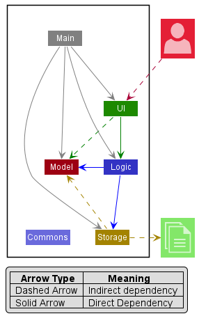

The ***Architecture Diagram*** given above explains the high-level design of the App.

Given below is a quick overview of main components and how they interact with each other.

**Main components of the architecture**

**`Main`** has two classes called [`Main`](https://github.com/se-edu/addressbook-level3/tree/master/src/main/java/seedu/address/Main.java) and [`MainApp`](https://github.com/se-edu/addressbook-level3/tree/master/src/main/java/seedu/address/MainApp.java). It is responsible for,
* At app launch: Initializes the components in the correct sequence, and connects them up with each other.
* At shut down: Shuts down the components and invokes cleanup methods where necessary.

[**`Commons`**](#common-classes) represents a collection of classes used by multiple other components.

The rest of the App consists of four components.

* [**`UI`**](#ui-component): The UI of the App.
* [**`Logic`**](#logic-component): The command executor.
* [**`Model`**](#model-component): Holds the data of the App in memory.
* [**`Storage`**](#storage-component): Reads data from, and writes data to, the hard disk.

**How the architecture components interact with each other**

The *Sequence Diagram* below shows how the components interact with each other for the scenario where the user issues the command `delete 1`.

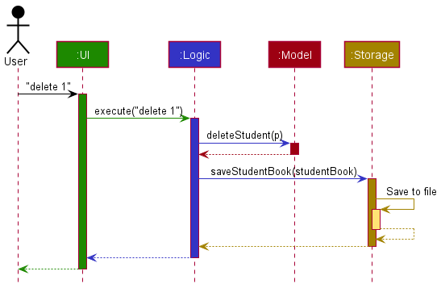

Each of the four main components (also shown in the diagram above),

* defines its *API* in an `interface` with the same name as the Component.
* implements its functionality using a concrete `{Component Name}Manager` class (which follows the corresponding API `interface` mentioned in the previous point.

For example, the `Logic` component defines its API in the `Logic.java` interface and implements its functionality using the `LogicManager.java` class which follows the `Logic` interface. Other components interact with a given component through its interface rather than the concrete class (reason: to prevent outside component's being coupled to the implementation of a component), as illustrated in the (partial) class diagram below.

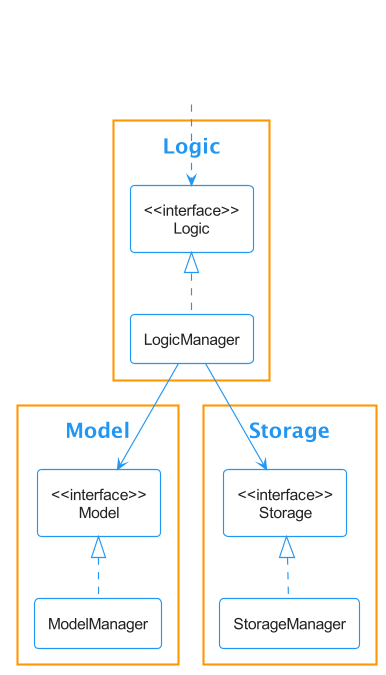

The sections below give more details of each component.

### UI component

The **API** of this component is specified in [`Ui.java`](https://github.com/se-edu/addressbook-level3/tree/master/src/main/java/seedu/address/ui/Ui.java)

The UI consists of a `MainWindow` that is made up of parts e.g.`CommandBox`, `ResultDisplay`, `PersonListPanel`, `StatusBarFooter` etc. All these, including the `MainWindow`, inherit from the abstract `UiPart` class which captures the commonalities between classes that represent parts of the visible GUI.

The `UI` component uses the JavaFx UI framework. The layout of these UI parts are defined in matching `.fxml` files that are in the `src/main/resources/view` folder. For example, the layout of the [`MainWindow`](https://github.com/se-edu/addressbook-level3/tree/master/src/main/java/seedu/address/ui/MainWindow.java) is specified in [`MainWindow.fxml`](https://github.com/se-edu/addressbook-level3/tree/master/src/main/resources/view/MainWindow.fxml)

The `UI` component,

* executes user commands using the `Logic` component.
* listens for changes to `Model` data so that the UI can be updated with the modified data.
* keeps a reference to the `Logic` component, because the `UI` relies on the `Logic` to execute commands.
* depends on some classes in the `Model` component, as it displays `Person` object residing in the `Model`.

### Logic component

**API** : [`Logic.java`](https://github.com/se-edu/addressbook-level3/tree/master/src/main/java/seedu/address/logic/Logic.java)

Here's a (partial) class diagram of the `Logic` component:

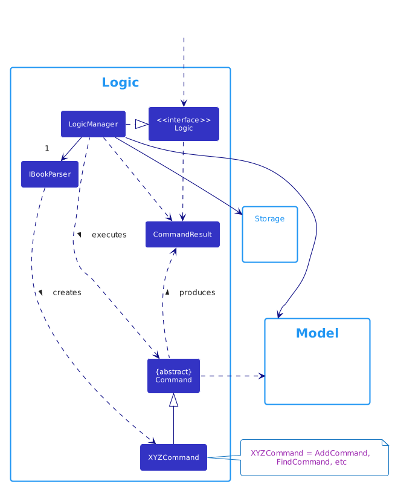

How the `Logic` component works:
1. When `Logic` is called upon to execute a command, it uses the `AddressBookParser` class to parse the user command.
1. This results in a `Command` object (more precisely, an object of one of its subclasses e.g., `AddCommand`) which is executed by the `LogicManager`.
1. The command can communicate with the `Model` when it is executed (e.g. to add a person).
1. The result of the command execution is encapsulated as a `CommandResult` object which is returned back from `Logic`.

The Sequence Diagram below illustrates the interactions within the `Logic` component for the `execute("delete 1")` API call.

:information_source: **Note:** The lifeline for `DeleteCommandParser` should end at the destroy marker (X) but due to a limitation of PlantUML, the lifeline reaches the end of diagram.

Here are the other classes in `Logic` (omitted from the class diagram above) that are used for parsing a user command:

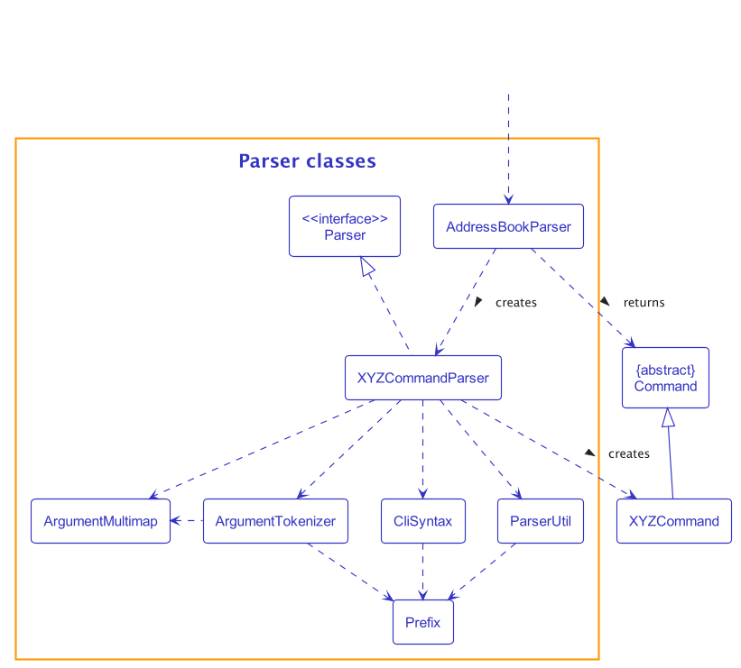

How the parsing works:
* When called upon to parse a user command, the `AddressBookParser` class creates an `XYZCommandParser` (`XYZ` is a placeholder for the specific command name e.g., `AddCommandParser`) which uses the other classes shown above to parse the user command and create a `XYZCommand` object (e.g., `AddCommand`) which the `AddressBookParser` returns back as a `Command` object.
* All `XYZCommandParser` classes (e.g., `AddCommandParser`, `DeleteCommandParser`, ...) inherit from the `Parser` interface so that they can be treated similarly where possible e.g, during testing.

### Model component
**API** : [`Model.java`](https://github.com/se-edu/addressbook-level3/tree/master/src/main/java/seedu/address/model/Model.java)

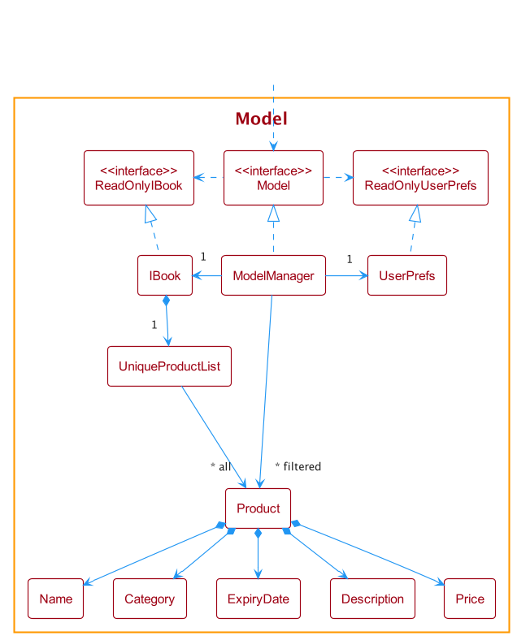

The `Model` component,

* stores the address book data i.e., all `Person` objects (which are contained in a `UniquePersonList` object).
* stores the currently 'selected' `Person` objects (e.g., results of a search query) as a separate _filtered_ list which is exposed to outsiders as an unmodifiable `ObservableList<Person>` that can be 'observed' e.g. the UI can be bound to this list so that the UI automatically updates when the data in the list change.
* stores a `UserPref` object that represents the user’s preferences. This is exposed to the outside as a `ReadOnlyUserPref` objects.
* does not depend on any of the other three components (as the `Model` represents data entities of the domain, they should make sense on their own without depending on other components)

:information_source: **Note:** An alternative (arguably, a more OOP) model is given below. It has a `Tag` list in the `AddressBook`, which `Person` references. This allows `AddressBook` to only require one `Tag` object per unique tag, instead of each `Person` needing their own `Tag` objects. 

### Storage component

**API** : [`Storage.java`](https://github.com/se-edu/addressbook-level3/tree/master/src/main/java/seedu/address/storage/Storage.java)

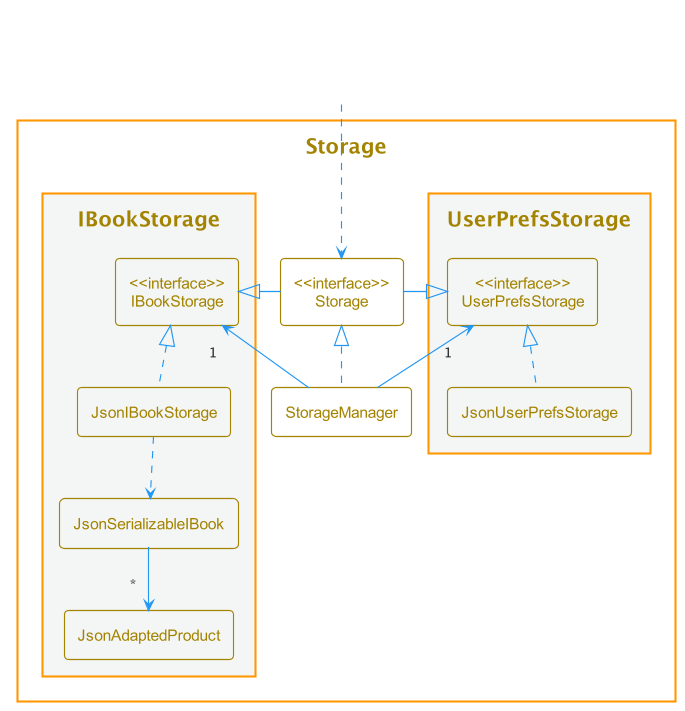

The `Storage` component,
* can save both address book data and user preference data in json format, and read them back into corresponding objects.
* inherits from both `AddressBookStorage` and `UserPrefStorage`, which means it can be treated as either one (if only the functionality of only one is needed).
* depends on some classes in the `Model` component (because the `Storage` component's job is to save/retrieve objects that belong to the `Model`)

### Common classes

Classes used by multiple components are in the `seedu.addressbook.commons` package.

--------------------------------------------------------------------------------------------------------------------

## **Implementation**

This section describes some noteworthy details on how certain features are implemented.

### Adding optional attributes to fit for Client

When handling clients, it would be beneficial to track the previous date met with the client, and additional information
regarding the clients. Therefore, these two new attributes need to be added to the current Person class. The new prefix used
are `d/` and `i/` for date previous met and additional info respectively.

On top of that, modifications to add and edit command are needed to handle the two new attributes. Since both attributes
are optional, `d/` and `i/` may be omitted when using the add command, a default value is given to each attribute. This
decision was made to avoid the use of null values. For date attribute, the date of the client being added would be its
default value, whereas "No further info" will be the default value for additional info attribute. 

The following sequence diagram shows how adding a new person without any previous date met and additional info specified.

(WILL BE ADDED IN THE FUTURE)

The following activity diagram summarizes the different possible paths when adding a client to HustleBook.

(WILL BE ADDED IN THE FUTURE)

#### Design considerations:

**Aspect: Default value of optional data:**

* **Alternative 1 (current choice):** Non-null values.
    * Pros: Less likely to face any errors as no null values are used.
    * Cons: Considerations of non-null values as the default value has to make sense for users.

* **Alternative 2:** Use null values are default values.
    * Pros: Easier and faster to implement.
    * Cons: Code wise is more prone to errors and more defensive approach have to be used when handling the new attributes.

### Flagging important clients

The feature is implemented to provide functionality and visual representation of important clients. 
Feature is needed for several user stories involving important clients. A new attribute is thus added to the current 
Person class. Flag command is created to shorten the process of flagging a client, instead of needing to use the edit 
command. 

Additionally, a new prefix, `f/`, can be used in the add and edit command to specify the flag status directly. 
This prefix is optional and can be left out during the creation of a new client contact. 

All new clients will adopt a default `unflagged` state when the flag status is not specified. 

The following sequence diagram shows how the `flag`/`unflag` command works:

**[COMING SOON]**

The following activity diagram summarizes how to flag a client.

**[COMING SOON]**

#### Design considerations:

**Aspect: Ease of use of flag commands:**

* **Alternative 1 (current choice):** `flag` and `unflag` split into separate commands. 
    * Pros: More intuitive to use as compared to alternative 2 for any user.
    * Cons: More commands to test and maintain.

* **Alternative 2:** Single `flag` command and use an `f/` prefix to set new flag.
    * Pros: Only one command for both scenarios and fewer tests needed.
    * Cons: Usage is not very intuitive to a user.

### \[Proposed\] Undo/redo feature

#### Proposed Implementation

The proposed undo/redo mechanism is facilitated by `VersionedAddressBook`. It extends `AddressBook` with an undo/redo history, stored internally as an `addressBookStateList` and `currentStatePointer`. Additionally, it implements the following operations:

* `VersionedAddressBook#commit()` — Saves the current address book state in its history.
* `VersionedAddressBook#undo()` — Restores the previous address book state from its history.
* `VersionedAddressBook#redo()` — Restores a previously undone address book state from its history.

These operations are exposed in the `Model` interface as `Model#commitAddressBook()`, `Model#undoAddressBook()` and `Model#redoAddressBook()` respectively.

Given below is an example usage scenario and how the undo/redo mechanism behaves at each step.

Step 1. The user launches the application for the first time. The `VersionedAddressBook` will be initialized with the initial address book state, and the `currentStatePointer` pointing to that single address book state.

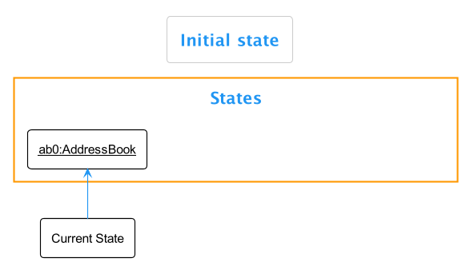

Step 2. The user executes `delete 5` command to delete the 5th person in the address book. The `delete` command calls `Model#commitAddressBook()`, causing the modified state of the address book after the `delete 5` command executes to be saved in the `addressBookStateList`, and the `currentStatePointer` is shifted to the newly inserted address book state.

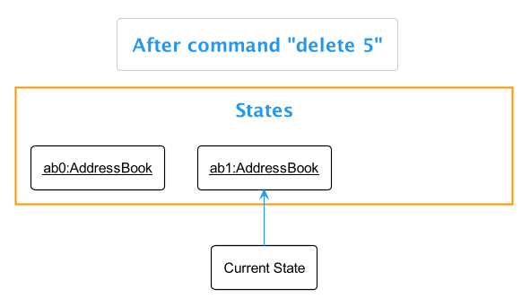

Step 3. The user executes `add n/David …​` to add a new person. The `add` command also calls `Model#commitAddressBook()`, causing another modified address book state to be saved into the `addressBookStateList`.

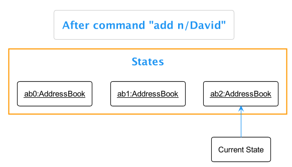

:information_source: **Note:** If a command fails its execution, it will not call `Model#commitAddressBook()`, so the address book state will not be saved into the `addressBookStateList`.

Step 4. The user now decides that adding the person was a mistake, and decides to undo that action by executing the `undo` command. The `undo` command will call `Model#undoAddressBook()`, which will shift the `currentStatePointer` once to the left, pointing it to the previous address book state, and restores the address book to that state.

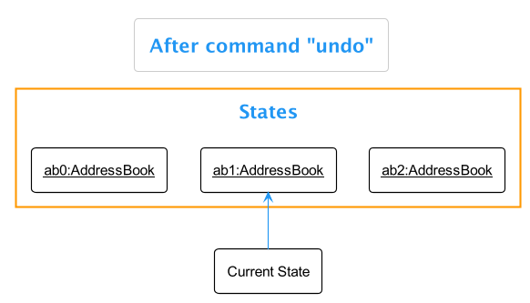

:information_source: **Note:** If the `currentStatePointer` is at index 0, pointing to the initial AddressBook state, then there are no previous AddressBook states to restore. The `undo` command uses `Model#canUndoAddressBook()` to check if this is the case. If so, it will return an error to the user rather
than attempting to perform the undo.

The following sequence diagram shows how the undo operation works:

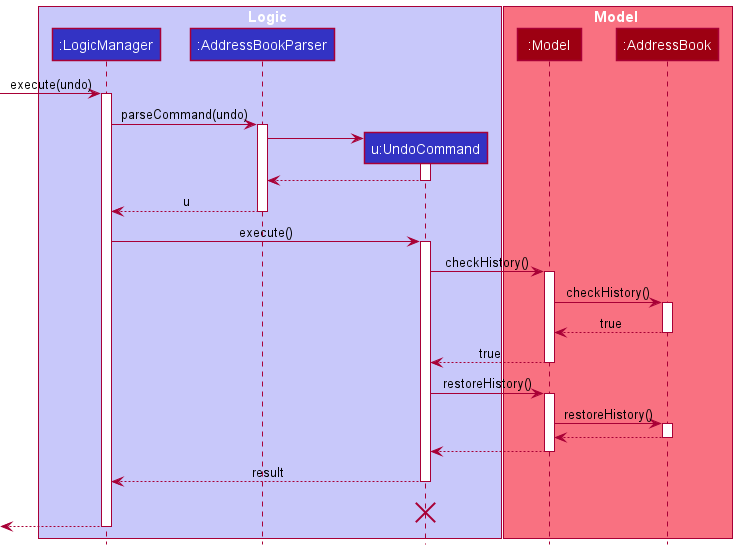

:information_source: **Note:** The lifeline for `UndoCommand` should end at the destroy marker (X) but due to a limitation of PlantUML, the lifeline reaches the end of diagram.

The `redo` command does the opposite — it calls `Model#redoAddressBook()`, which shifts the `currentStatePointer` once to the right, pointing to the previously undone state, and restores the address book to that state.

:information_source: **Note:** If the `currentStatePointer` is at index `addressBookStateList.size() - 1`, pointing to the latest address book state, then there are no undone AddressBook states to restore. The `redo` command uses `Model#canRedoAddressBook()` to check if this is the case. If so, it will return an error to the user rather than attempting to perform the redo.

Step 5. The user then decides to execute the command `list`. Commands that do not modify the address book, such as `list`, will usually not call `Model#commitAddressBook()`, `Model#undoAddressBook()` or `Model#redoAddressBook()`. Thus, the `addressBookStateList` remains unchanged.

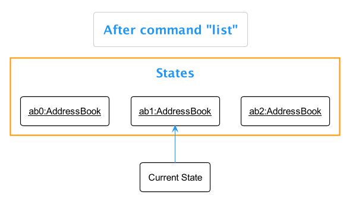

Step 6. The user executes `clear`, which calls `Model#commitAddressBook()`. Since the `currentStatePointer` is not pointing at the end of the `addressBookStateList`, all address book states after the `currentStatePointer` will be purged. Reason: It no longer makes sense to redo the `add n/David …​` command. This is the behavior that most modern desktop applications follow.

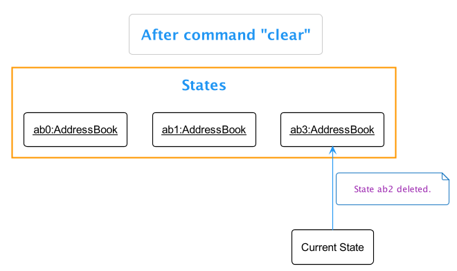

The following activity diagram summarizes what happens when a user executes a new command:

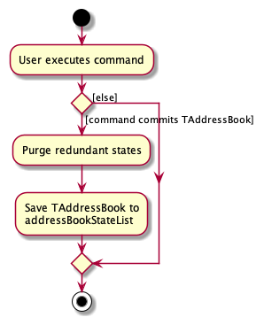

#### Design considerations:

**Aspect: How undo & redo executes:**

* **Alternative 1 (current choice):** Saves the entire address book.
    * Pros: Easy to implement.
    * Cons: May have performance issues in terms of memory usage.

* **Alternative 2:** Individual command knows how to undo/redo by
  itself.
    * Pros: Will use less memory (e.g. for `delete`, just save the person being deleted).
    * Cons: We must ensure that the implementation of each individual command are correct.

_{more aspects and alternatives to be added}_

### \[Proposed\] Data archiving

_{Explain here how the data archiving feature will be implemented}_

--------------------------------------------------------------------------------------------------------------------

## **Documentation, logging, testing, configuration, dev-ops**

* [Documentation guide](Documentation.md)
* [Testing guide](Testing.md)
* [Logging guide](Logging.md)
* [Configuration guide](Configuration.md)
* [DevOps guide](DevOps.md)

--------------------------------------------------------------------------------------------------------------------

## **Appendix: Requirements**

### Product scope

**Target user profile**:

* wealth managers managing a significant number of clients
* prefer desktop apps over other types
* can type fast
* prefers typing to mouse interactions
* is reasonably comfortable using CLI apps

**Value proposition**: keep track and be more organised with their clients

### User stories

Priorities: High (must have) - `* * *`, Medium (nice to have) - `* *`, Low (unlikely to have) - `*`

| Priority                               | As a …​              | I want to …​                                                        | So that I can…​                                                     |
|----------------------------------------|-------------------------|------------------------------------------------------------------------|------------------------------------------------------------------------|
| `* * *`                                | new user                | click on the help button for a user guide on how to use the HustleBook | learn on how to use the features in the HustleBook                     |
| `* * *`                                | new user                | clear the demo data                                                    | start using the HustleBook and enter their own data                    |
| `* * *`                                | new user                | view demo data                                                         | play around with the features                                          |
| `* * *`                                | new user                | create new contacts for each new client I get                          | keep track of my clients                                               | 
| `* * *`                                | new user                | Add relevant information of each client                                | keep important information regarding each client is captured           | 
| `* * *`                                | new user                | find which client they have not met in some time                       | contact them and get updates                                           |
| `* * *`                                | new user                | view client details                                                    | contact them and get updates                                           | 
| `* * *`                                | new user                | delete a contact                                                       | completely delete a contact so it clears up the list                   | 
| `* * *`                                | expert user             | tag clients for urgent meetings                                        | avoid forgetting important meetings                                    |
| `* * *`                                | expert user             | edit contact information                                               | update my client's details                                             |
| `* * *`                                | expert user             | find a person by name                                                  | locate details of persons without having to go through the entire list |
| `* *`                                  | expert user             | archive old contacts                                                   | keep the contact list clean and free clutter                           |
| `* *`                                  | new user                | add a meet up information to a client                                  | track when is the next meet up                                         |
| `* *`                                  | new user                | get tips on existing features                                          | get the required info without referring to help section                |
| `* *`                                  | expert user             | load up previous work before shutting                                  | be more efficient                                                      |
| `* *`                                  | expert user             | filter important clients                                               | prioritise them                                                        |
| `* *`                                  | expert user             | list meet ups for a specific day                                       | view and manage the meet ups with the clients                          |
| `* *`                                  | busy user               | be alerted when any meeting clashes                                    | make sure my meetings with my clients are scheduled                    |
| `* *`                                  | busy user               | be reminded if I haven't met a client in a long time                   | maintain contact with my clients                                       |
| `* *`                                  | busy and forgetful User | tag certain clients as priority                                        | be constantly reminded as to not forget them                           | 
| `* *`                                  | busy user               | identify conflicting names by index                                    | perform operations more accurately                                     |
| `*`                                    | new user                | Add social media data for clients                                      | access their social media details                                      |

### Use cases

(For all use cases below, the **System** is the `HustleBook` and the **Actor** is the `user`, unless specified otherwise)

**Use case: UC01 - Add a client**

**MSS**
1. User requests to add a client.
2. HustleBook adds the client information into the list.

   Use case ends.

**Extension:**

* 1a. HustleBook detects insufficient information.
    * 1a1. HustleBook informs user the minimal data needed to add a client.
    * 1a2. User enters the correct data.

      Steps 1a1-1a2 are repeated until the data entered is sufficient.

      Use case resumes at step 2.

* 1b. HustleBook detects incorrect format.
    * 1b1. HustleBook informs user the format to follow.
    * 1b2. User enters the correct format.

      Steps 1b1-1b2 are repeated until a valid format and data is entered.

      Use case resumes at step 2.

* 1c. There are multiple clients with the same given name.
    * 1c1. HustleBook requests confirmation from the user to add client with same name. 
    * 1c2. User enters his confirmation.
    * 1c3. User accepts to add the client.

      Use case resumes at step 2.
      
* 1d. Same as 1c, except that user rejects to add the client at step 1c3.
    * 1d1. HustleBook requests confirmation from the user to add client with same name.
    * 1d2. User enters his confirmation.
    * 1d3. User rejects to add the client.

      Use case ends.

**Use case: UC02 - Find Client**

**MSS**

1. User requests to find a client.
2. HustleBook shows a client whose name matches the given name.

   Use case ends.

**Extensions**

* 2a. Client list is empty.
    * 2a1. HustleBook informs the user that the list is empty.

      Use case ends.

* 2b. Specified person does not exist on the list.
    * 2b1. HustleBook informs the user that the client is not in the list.

      Use case ends.

* 2c. There are multiple clients with the same given name.
    * 2c1. HustleBook shows list of clients whose name matches search term.

      Use case ends.

**Use case: UC03 - Flag a client**

**MSS**

1. User requests to list clients.
2. HustleBook shows a list of clients.
3. User requests to add a flag to a specific client in the list.
4. HustleBook adds a flag to the client.
5. User requests to list clients again.
6. HustleBook shows flagged client at the top of the list.

   Use case ends.

**Extensions**

* 2a. The list is empty.
    * 2a1. HustleBook informs the user that the list is empty.

      Use case ends.

* 3a. Specified person does not exist on the list.
    * 3a1. HustleBook informs the user that the client is not in the list.

      Use case resumes at step 2.

* 3b. There are multiple clients with the same given name.
    * 3b1. HustleBook shows a list of clients that match the specified name.
    * 3b2. HustleBook requests for index of the client to update the information to.
    * 3b3. User enters an index.

      Step 3b2-3b3 is repeated until a valid index is entered.

      Use case resumes at step 4.

**Use case: UC04 - Edit a client's information**

**MSS**

1. User requests to list clients.
2. HustleBook shows a list of clients.
3. User requests to edit the information of a specific client in the list.
4. HustleBook updates the client's information with the given information.
5. HustleBook shows the client's updated information.

   Use case ends.

**Extensions**

* 2a. The list is empty.
    * 2a1. HustleBook informs the user that the list is empty.

      Use case ends.

* 3a. Specified person does not exist on the list.
    * 3a1. HustleBook informs the user that the client is not in the list.

      Use case resumes at step 2.

* 3b. There are multiple clients with the same given name.
    * 3b1. HustleBook shows a list of clients with the same given name.
    * 3b2. HustleBook requests for index of the client to update the information to.
    * 3b3. User enters an index.

      Step 3b2-3b3 is repeated until a valid index is entered.

      Use case resumes at step 4.

* 3c. HustleBook detects insufficient information.
    * 3c1. HustleBook informs user the minimal data needed to add a client.
    * 3c2. User enters the correct data.

      Steps 3c1-3c2 are repeated until the data entered is sufficient.
  
      Use case resumes at step 2.

* 3d. HustleBook detects incorrect format.
    * 3d1. HustleBook informs user the format to follow.
    * 3d2. User enters the correct format.

      Steps 3d1-3d2 are repeated until a valid format and data is entered.

      Use case resumes at step 2.

**Use case: UC05 - Delete a person**

**MSS**

1.  User requests to list persons.
2.  HustleBook shows a list of persons.
3.  User requests to delete a specific person in the list.
4.  HustleBook deletes the person.

    Use case ends.

**Extensions**

* 2a. The list is empty.
    * 2a1. HustleBook informs the user that the list is empty.

      Use case ends.

* 3a. Specified person does not exist on the list.
    * 3a1. HustleBook informs the user that the client is not in the list.

      Use case resumes at step 2.

* 3b. There are multiple clients with the same given name.
    * 3b1. HustleBook shows a list of clients with the same given name.
    * 3b2. HustleBook requests for index of the client to delete.
    * 3b3. User enters an index.

      Step 3b2-3b3 is repeated until a valid index is entered.

      Use case resumes at step 4.

### Non-Functional Requirements

* **Data requirement**:
    * HustleBook should be able to handle up to 250 clients.
    * Each client’s data should be able to be edited anytime.

* **Constraints**:
    * A user with above average typing speed for regular English text (i.e. not code, not system admin commands) should be able to accomplish most of the tasks faster using commands than using the mouse.

* **Environment requirements**:
    * System should work on _mainstream OS_ with java 11 or above installed.

* **Technical requirements**:
    * System should be able to scale up and handle clients with the same name.

* **Process requirements**:
    * The project is expected to adhere to a schedule that delivers a feature set every two weeks (v1.2 and v1.3).

* **Notes about project scope**:
    * The product is not required to handle exporting of data to files for printing or other purposes.

### Glossary

* **Mainstream OS**: Windows, Linux, Unix, OS-X
* **HB (HustleBook)**: The app that is being used to record client details.
* **CLI (Command Line Interface)**: The text box where users can type their inputs and commands.

--------------------------------------------------------------------------------------------------------------------

## **Appendix: Instructions for manual testing**

Given below are instructions to test the app manually.

:information_source: **Note:** These instructions only provide a starting point for testers to work on;
testers are expected to do more *exploratory* testing.

### Launch and shutdown

1. Initial launch

    1. Download the jar file and copy into an empty folder

    1. Double-click the jar file Expected: Shows the GUI with a set of sample contacts. The window size may not be optimum.

1. Saving window preferences

    1. Resize the window to an optimum size. Move the window to a different location. Close the window.

    1. Re-launch the app by double-clicking the jar file. 
       Expected: The most recent window size and location is retained.

1. _{ more test cases …​ }_

### Deleting a person

1. Deleting a person while all persons are being shown

    1. Prerequisites: List all persons using the `list` command. Multiple persons in the list.

    1. Test case: `delete 1` 
       Expected: First contact is deleted from the list. Details of the deleted contact shown in the status message. Timestamp in the status bar is updated.

    1. Test case: `delete 0` 
       Expected: No person is deleted. Error details shown in the status message. Status bar remains the same.

    1. Other incorrect delete commands to try: `delete`, `delete x`, `...` (where x is larger than the list size) 
       Expected: Similar to previous.

1. _{ more test cases …​ }_

### Saving data

1. Dealing with missing/corrupted data files

    1. _{explain how to simulate a missing/corrupted file, and the expected behavior}_

1. _{ more test cases …​ }_
