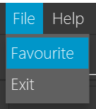

# Acknowledgements

This is a brownfield project that bases from the Project template [AddressBook Level 3 (AB3)](https://se-education.org/docs/templates.html) from se-education.org.

# Setting up, getting started

Get started by following these instructions from our [guide](https://www.notion.so/Setting-up-and-getting-started-28e77333ad24494093cc39f79194a1e2).

# Design

Take a look at our design which is mostly based off on [AddressBook Level 3 (AB3)](https://se-education.org/addressbook-level3/DeveloperGuide.html#design).

##Architecture

##UI Component

# Implementation

This section describes some noteworthy details on how certain features are implemented.

## Favourite feature/Window

### Proposed Implementation

The proposed `favourite` mechanism will make use of a new attribute called ‘Favourite’ under a ‘Person’. How we went about creating this function is by going through the list of Persons and check if their attribute ‘Favourite’ returns “Favourited” when `toString()` is called.

We decided on this design for now because the sole purpose of it now is just to display Persons that are favourited, thus we made use of an attribute to do that.

Given below is an example of how the `favourite`mechanism behaves with the `favourite`window.

Step 1. The user starts the application with pre-loaded data of Persons.

Step 2. Assuming there is a Person with the number 1. User then executes `favourite 1` command to favourite the first Person in the application. The system will create a new Person with the ‘favourite’ attribute set as true. Then calls `Model#setPerson()` to set Person 1 to be a favourited Person.

<aside>
💡 **Note:** Every newly added Person will have the default value of `False` for ‘Favourite’ attribute, thus will never appear in the FavouriteWindow before the `favourite` command is called on them.

</aside>

Step 3. User can access the `Favourite`Window by navigating to the menu item as shown in the diagram, which pops up a new window that contains only those Persons that have ‘Favourite’ attribute set as True.

# Documentation, logging, testing, configuration, dev-ops

This is how we do our [documentation](https://se-education.org/addressbook-level3/Documentation.html).

This is how we do our [testing](https://se-education.org/addressbook-level3/Testing.html).

This is how we do our [logging](https://se-education.org/addressbook-level3/Logging.html).

This is how we do our [configurations](https://se-education.org/addressbook-level3/Configuration.html).

This is how we do our [DevOps](https://se-education.org/addressbook-level3/DevOps.html).

<aside>
💡 **Note:** We decided to follow the procedure that AddressBook Level 3 (ABL3) implements as we identified that their process suited our needs as well.

</aside>

# Appendix: Requirements

## Target user profile

- has a need to manage a significant number of clients
- prefer desktop apps over other types
- can type fast and prefer typing to mouse interactions
- is reasonably comfortable using CLI apps
- has a need to retain the contact information of all clients

## Value Proposition

Manage clients faster that a typical mouse/GUI driven app.

## User stories

| Priority | As a ... | I want to ... | So that i can... |
| --- | --- | --- | --- |
| High | User | Delete my client’s information on the app | Remove this redundant information after he/she is not my client anymore |
| High | User | To edit my clients’ information on the app | Ensure all information of my clients are always up to date |
| High | User | To list out my clients’ information on the app | View all of my clients’ information in one place |
| High | User | Differentiate my clients’ on the app (e.g. buyers, sellers) | Know if a client is looking for a property to buy or is trying sell a property |
| High | User | Add my clients’ information on the app | Gain access to all these information in one place   |
| High | User | Favorite a client | Separate clients based on whose information I frequent the most (favorited) and those that are not |
| High | User | To create a preference for a client who is a buyer | Have information of potential properties that the buyer would want to buy |
| High | User | Match my clients (e.g. buyer with seller) | Spot if there are any properties being sold by a seller that a buyer has a preference for. |
| High | User | Be able to understand how the app works from start to end | Able to provide the necessary inputs to perform a particular action on the app |

## Use cases

## Non-functional Requirements

1. Should be able to work on any mainstream OS as long as it has Java 11 or above installed
2. A user with above average typing speed for regular English text (i.e. not code, not system admin commands) should be able to accomplish most of the tasks faster using commands than using the mouse.
3. No lag of more then one second when executing commands
4. Should be able to hold up to 1000 Persons without a noticeable sluggishness in performance for typical usage.
5. The application will not be able to prevent any data privacy violated by other programs.

## Glossary

**Buyer** - Client that is looking to buy a property based on some preferences

**Seller -** Client that is looking to sell a property for at around a particular price

# Appendix: Instructions for manual testing

Given below are instructions to test the app manually.

<aside>
💡 **Note:** Please bear in mind to extend your testing to more *exploratory* testing after following these steps.

</aside>

## Launch and shutdown

1. Initial launch
    1. Download the jar file and copy into an empty folder
    2. Double-click the jar file Expected: Shows the GUI with a set of sample contacts. The window size may not be optimum.
2. Saving window preferences
    1. Resize the window to an optimum size. Move the window to a different location. Close the window.
    2. Re-launch the app by double-clicking the jar file.Expected: The most recent window size and location is retained.
3. Shutting down
    1. First way you can do it is to click on the X button on the application.
    2. Another way is to click on ‘File’ menu item and click on ‘Exit’.
    3. Lastly, you can enter the `exit`command.

## Deleting a person

1. Deleting a person while all persons are being shown
    1. Prerequisites: List all persons using the `list` command. Multiple persons in the list.
    2. Test case: `delete 1`Expected: First contact is deleted from the list. Details of the deleted contact shown in the status message. Timestamp in the status bar is updated.
    3. Test case: `delete 0`Expected: No person is deleted. Error details shown in the status message. Status bar remains the same.
    4. Other incorrect delete commands to try: `delete`, `delete x`, `...` (where x is larger than the list size or smaller than 0)Expected: Similar to previous.

