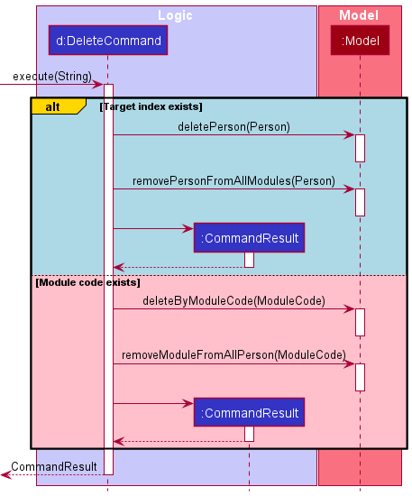

* Table of Contents
{:toc}

--------------------------------------------------------------------------------------------------------------------

## **Acknowledgements**

--------------------------------------------------------------------------------------------------------------------

## **Setting up, getting started**

Refer to the guide [_Setting up and getting started_](SettingUp.md).

--------------------------------------------------------------------------------------------------------------------

## **Design**

:bulb: **Tip:** The `.puml` files used to create diagrams in this document can be found in the [diagrams](https://github.com/se-edu/addressbook-level3/tree/master/docs/diagrams/) folder. Refer to the [_PlantUML Tutorial_ at se-edu/guides](https://se-education.org/guides/tutorials/plantUml.html) to learn how to create and edit diagrams.

### Architecture

The ***Architecture Diagram*** given above explains the high-level design of the App.

Given below is a quick overview of main components and how they interact with each other.

**Main components of the architecture**

**`Main`** has two classes called [`Main`](https://github.com/se-edu/addressbook-level3/tree/master/src/main/java/seedu/address/Main.java) and [`MainApp`](https://github.com/se-edu/addressbook-level3/tree/master/src/main/java/seedu/address/MainApp.java). It is responsible for,
* At app launch: Initializes the components in the correct sequence, and connects them up with each other.
* At shut down: Shuts down the components and invokes cleanup methods where necessary.

[**`Commons`**](#common-classes) represents a collection of classes used by multiple other components.

The rest of the App consists of four components.

* [**`UI`**](#ui-component): The UI of the App.
* [**`Logic`**](#logic-component): The command executor.
* [**`Model`**](#model-component): Holds the data of the App in memory.
* [**`Storage`**](#storage-component): Reads data from, and writes data to, the hard disk.

**How the architecture components interact with each other**

The *Sequence Diagram* below shows how the components interact with each other for the scenario where the user issues the command `delete 1`.

Each of the four main components (also shown in the diagram above),

* defines its *API* in an `interface` with the same name as the Component.
* implements its functionality using a concrete `{Component Name}Manager` class (which follows the corresponding API `interface` mentioned in the previous point.

For example, the `Logic` component defines its API in the `Logic.java` interface and implements its functionality using the `LogicManager.java` class which follows the `Logic` interface. Other components interact with a given component through its interface rather than the concrete class (reason: to prevent outside component's being coupled to the implementation of a component), as illustrated in the (partial) class diagram below.

The sections below give more details of each component.

### UI component

The **API** of this component is specified in [`Ui.java`](https://github.com/se-edu/addressbook-level3/tree/master/src/main/java/seedu/address/ui/Ui.java)

The UI consists of a `MainWindow` that is made up of parts e.g.`CommandBox`, `ResultDisplay`, `PersonListPanel`, `StatusBarFooter` etc. All these, including the `MainWindow`, inherit from the abstract `UiPart` class which captures the commonalities between classes that represent parts of the visible GUI.

The `UI` component uses the JavaFx UI framework. The layout of these UI parts are defined in matching `.fxml` files that are in the `src/main/resources/view` folder. For example, the layout of the [`MainWindow`](https://github.com/se-edu/addressbook-level3/tree/master/src/main/java/seedu/address/ui/MainWindow.java) is specified in [`MainWindow.fxml`](https://github.com/se-edu/addressbook-level3/tree/master/src/main/resources/view/MainWindow.fxml)

The `UI` component,

* executes user commands using the `Logic` component.
* listens for changes to `Model` data so that the UI can be updated with the modified data.
* keeps a reference to the `Logic` component, because the `UI` relies on the `Logic` to execute commands.
* depends on some classes in the `Model` component, as it displays `Person` object residing in the `Model`.

### Logic component

**API** : [`Logic.java`](https://github.com/se-edu/addressbook-level3/tree/master/src/main/java/seedu/address/logic/Logic.java)

Here's a (partial) class diagram of the `Logic` component:

How the `Logic` component works:
1. When `Logic` is called upon to execute a command, it uses the `AddressBookParser` class to parse the user command.
1. This results in a `Command` object (more precisely, an object of one of its subclasses e.g., `AddCommand`) which is executed by the `LogicManager`.
1. The command can communicate with the `Model` when it is executed (e.g. to add a person).
1. The result of the command execution is encapsulated as a `CommandResult` object which is returned back from `Logic`.

The Sequence Diagram below illustrates the interactions within the `Logic` component for the `execute("delete 1")` API call.

:information_source: **Note:** The lifeline for `DeleteCommandParser` should end at the destroy marker (X) but due to a limitation of PlantUML, the lifeline reaches the end of diagram.

Here are the other classes in `Logic` (omitted from the class diagram above) that are used for parsing a user command:

How the parsing works:
* When called upon to parse a user command, the `AddressBookParser` class creates an `XYZCommandParser` (`XYZ` is a placeholder for the specific command name e.g., `AddCommandParser`) which uses the other classes shown above to parse the user command and create a `XYZCommand` object (e.g., `AddCommand`) which the `AddressBookParser` returns back as a `Command` object.
* All `XYZCommandParser` classes (e.g., `AddCommandParser`, `DeleteCommandParser`, ...) inherit from the `Parser` interface so that they can be treated similarly where possible e.g, during testing.

### Model component
**API** : [`Model.java`](https://github.com/se-edu/addressbook-level3/tree/master/src/main/java/seedu/address/model/Model.java)

The `Model` component,

* stores the address book data i.e., all `Person` objects (which are contained in a `UniquePersonList` object).
* stores the currently 'selected' `Person` objects (e.g., results of a search query) as a separate _filtered_ list which is exposed to outsiders as an unmodifiable `ObservableList<Person>` that can be 'observed' e.g. the UI can be bound to this list so that the UI automatically updates when the data in the list change.
* stores a `UserPref` object that represents the user’s preferences. This is exposed to the outside as a `ReadOnlyUserPref` objects.
* does not depend on any of the other three components (as the `Model` represents data entities of the domain, they should make sense on their own without depending on other components)

:information_source: **Note:** An alternative (arguably, a more OOP) model is given below. It has a `Tag` list in the `AddressBook`, which `Person` references. This allows `AddressBook` to only require one `Tag` object per unique tag, instead of each `Person` needing their own `Tag` objects. 

### Storage component

**API** : [`Storage.java`](https://github.com/se-edu/addressbook-level3/tree/master/src/main/java/seedu/address/storage/Storage.java)

The `Storage` component,
* can save both address book data and user preference data in json format, and read them back into corresponding objects.
* inherits from both `AddressBookStorage` and `UserPrefStorage`, which means it can be treated as either one (if only the functionality of only one is needed).
* depends on some classes in the `Model` component (because the `Storage` component's job is to save/retrieve objects that belong to the `Model`)

### Common classes

Classes used by multiple components are in the `unibook.commons` package.

--------------------------------------------------------------------------------------------------------------------

## **Implementation**

### List feature
The list feature enables the user to customise which modules/people are currently visible. As an example, the sequence
diagram below shows the flow using the input `list o/type ty/professors`.

The command is first parsed with `execute("list o/type ty/professors", true, false)` where `true` and `false` are
boolean variables indicating whether the `Person` view or `Module` view is currently active. Subsequently, the 
`parseCommand` method in `UniBookParser` is called which will call `ListCommandParser`, which creates the 
`ListCommand` for `ListCommandParser` to pass to `UniBookParser`. Subsequently the `ListCommand` is returned to 
`LogicManager` and the `execute` method is run. In this case the `Model` instance is accessed to update the predicate
which changes the view to the appropriate one (in this case showing all professors), 
before finally returning the `CommandResult`.

Note that the `List` command can also list modules and in this case the flow would be very similar, just that the 
appropriate boolean variables will be flipped to represent the correct view. 

### Delete Command

Above is a sequence diagram of how the delete command works. Currently, there are 2 actions that delete can do. They are:

1. delete [INDEX] (Only works on Person view)
2. delete [MODULECODE] (Only works on Module view)

If action 1, the code will take the top alternate path as seen in the diagram and if action 2, the bottom path is taken.

In each path, it makes 2 method calls to `Model`. Let's take deleting index as an example. Say we want to delete a
Person named Alex. Alex will first be removed from the list of all persons through the method call to `Model::deletePerson`.
As each `Module` object contains a list of people taking the module, we also have to delete the instance of that person
from all `Module` objects if they exist within them using the `Model::removePersonFromAlModules` method.

Similarly, when a `Module` is deleted, we have to delete that modules from the list of modules and also delete that
module inside every `Person` object if it exists.

In both cases, a `CommandResult` object is returned.

--------------------------------------------------------------------------------------------------------------------

## **Documentation, logging, testing, configuration, dev-ops**

* [Documentation guide](Documentation.md)
* [Testing guide](Testing.md)
* [Logging guide](Logging.md)
* [Configuration guide](Configuration.md)
* [DevOps guide](DevOps.md)

--------------------------------------------------------------------------------------------------------------------

## **Appendix: Requirements**

### Product scope

**Target user profile**:

* university student taking modules in the curriculum 
* has a need to manage a significant number of contacts
* has a need to find relevant contacts pertaining to a specific module
* is reasonably comfortable using CLI apps

**Value proposition**: allows user to find relevant contacts (eg professors, classmates) from a specific module quickly

### User stories

Priorities: High (must have) - `* * *`, Medium (nice to have) - `* *`, Low (unlikely to have) - `*`

| Priority | As a …​                                    | I want to …​                     | So that I can…​                                                        |
| -------- | ------------------------------------------ | ------------------------------ | ---------------------------------------------------------------------- |
| `* * *`  | student                                    | add contacts of other students taking a specific module | I can easily contact other students for help |
| `* * *`  | student                                    | remove contacts of students who have finished the module | I can see only those students who are still in the module |
| `* * *`  | student/professor                          | view all my contacts |
| `* * *`  | student                                    | edit specific details of a contact  | 
| `* * *`  | professor                                  | edit specific details of a contact  | 
| `* * *`  | student                                    | find the relevant contact details (eg office location, email) to reach my TAs/professors | I am able to find the information I need quickly |
| `* * *`  | student                                    | find classmates and their contact details taking the same module |  I can form teams with them for group projects                                                                      |
| `* * `  | student with many modules                   | flag any important contacts to saved contacts | I can easily find the relevant contact in a hassle-free manner in the future |
| `* `  | student with many modules                     | organise any saved contacts into categories | I can easily find the relevant contact in a hassle-free manner |
| `*  `  | professor teaching multiple modules          | organise students into their respective modules | locate details of students in each module without having to go through the entire list |
| `* `    | tech savvy user who is well-versed in using command-line interfaces | use command-lines to carry out a command (eg email cs2103 prof)  | I can easily contact the relevant person with one command |
| `*`      | student/professor with many contacts in the UniBook | sort persons by name | locate a person easily |

*{More to be added}*

### Use cases

**Use Case: UC01 - Add a Person**

Actor: User

**MSS**

1. User requests to add a person
2. UniBook adds the appropriate person object to the system.

Use case ends.

**Extensions**
* 1a. The UniBook list is currently full.
  - Use case ends.
  
* 1a. The user request is wrongly formatted/incomplete.
    - 1a1. User is prompted to enter the format correctly.
    - Use case ends.

**Use case: UC02 - List Persons**

Actor: User

**MSS**

1. User requests to list persons
2. UniBook displays persons according to listing criteria.

Use case ends.

**Use Case: UC03 - Edit Person/Module**

Actor: User

**Guarantees**

- No changes will be made to any data if the user request is wrongly formatted/incomplete.

**MSS**

1. User requests to edit person/module
2. UniBook updates the relevant data according to the user command.

Use case ends.

**Extensions**
* 1a. The person/module does not exist in UniBook.
    - The user is notified that the person/module does not exist.
    - Use case ends.

* 1a. The user request is wrongly formatted/incomplete.
    - 1a1. User is prompted to enter the format correctly.
    - Use case ends.

**Use Case: UC04 - Finding specific persons**

Actor: User

**MSS**

1. User requests to find a specific person.
2. UniBook displays the people who match the specified search criteria.

Use case ends.

**Use Case: UC05 - Deleting**

Actor: User

**MSS**

1. User requests to delete a specified set of data.
2. UniBook removes the specified set of data from the system.
3. The UI is updated to no longer reflect or display this data.

Use case ends.

### Non-Functional Requirements

1.  Should be able to work on any Popular Operating System as long as Java is installed.
2.  The program should be able to handle up to 500 students per module.
3. System should respond to commands within 2 seconds.
4. There should be no memory leaks.

### Glossary

* **User**: A user of UniBook, either a student or a professor.
* **Module**: A group of students led by professor(s), representing a university course. 
* **Popular Operating System**: Windows, Linux, Unix, MacOS

--------------------------------------------------------------------------------------------------------------------

## **Appendix: Instructions for manual testing**

Given below are instructions to test the app manually.

:information_source: **Note:** These instructions only provide a starting point for testers to work on;
testers are expected to do more *exploratory* testing.

### Launch and shutdown

1. Initial launch

   1. Download the jar file and copy into an empty folder

   1. Double-click the jar file Expected: Shows the GUI with a set of sample contacts. The window size may not be optimum.

1. Saving window preferences

   1. Resize the window to an optimum size. Move the window to a different location. Close the window.

   1. Re-launch the app by double-clicking the jar file. 
       Expected: The most recent window size and location is retained.

1. _{ more test cases …​ }_

### Deleting a person

1. Deleting a person while all persons are being shown

   1. Prerequisites: List all persons using the `list` command. Multiple persons in the list.

   1. Test case: `delete 1` 
      Expected: First contact is deleted from the list. Details of the deleted contact shown in the status message. Timestamp in the status bar is updated.

   1. Test case: `delete 0` 
      Expected: No person is deleted. Error details shown in the status message. Status bar remains the same.

   1. Other incorrect delete commands to try: `delete`, `delete x`, `...` (where x is larger than the list size) 
      Expected: Similar to previous.

1. _{ more test cases …​ }_

### Saving data

1. Dealing with missing/corrupted data files

   1. _{explain how to simulate a missing/corrupted file, and the expected behavior}_

1. _{ more test cases …​ }_
