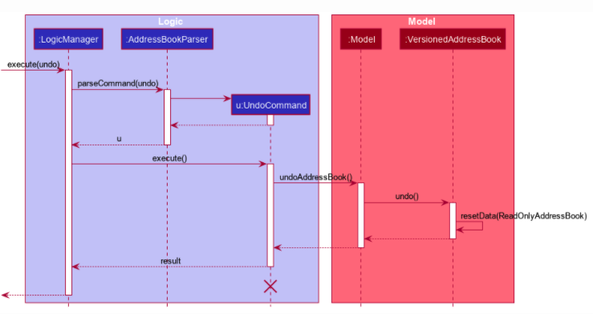

## Table of Content
- [Requirements](#requirements)
  - [Product scope](#product-scope)
  - [User stories](#user-stories)
  - [Use cases](#use-cases)
  - [Non-Functional Requirements](#non-functional-requirements)
  - [Glossary](#glossary)

---
## **Implementation**

This section describes some noteworthy details on how certain features are implemented.

### Add medical information (`add t/medical`) feature
* `AddMedicalCommandParser` parses input and builds needed `nric` and `Medical` objects. It returns an `AddMedicalCommand` with needed `nric` and `Medical` objects as parameters.
* Model does needful processing to save the medical information in temporary and persistent storage.
* UI is updated accordingly.

### View medical information (`view t/medical`) feature
* `ViewMedicalCommandParser` parses input and returns a `ViewMedicalCommand` with optional `nric` parameter.
* `ViewMedicalCommand`, which extends `Command`, is executed. `FilteredMedicalList` is updated accordingly.
* UI is updated accordingly.

### Delete medical information (`delete 1`) feature
* `DeleteMedicalCommandParser` parses input and returns a `DeleteMedicalCommand` with index to delete as parameter.
* Model deletes the medical information.
* UI is updated accordingly.

## Requirements

### Product scope

**Target user profile**:

Our target users would be doctors who need to keep track of their patient's medical information, health status and appointments.

**Value proposition**: MedBook is a health monitoring system for healthcare professionals that simplifies tracking a patient’s medical details and scheduling appointments. MedBook delivers a seamless workflow for doctors and healthcare professionals to search for or update patients' medical information, billing and appointments through a simple and easy-to-use platform.

### User stories

Priorities: High (must have) - `* * *`, Medium (nice to have) - `* *`, Low (unlikely to have) - `*`

| Priority | As a …​ | I want to …​                                                                  | So that I can…​                                              |
| -------- | ------- | ----------------------------------------------------------------------------- | ------------------------------------------------------------ |
| `* * *`  | user    | add, update and delete a patient's profile with their personal information    | keep track of my patients’ data                              |
| `* * *`  | user    | retrieve a patient's past diagnoses based on their name                       | have more information to make diagnoses                      |
| `* * *`  | user    | retrieve a patient's medicine administration history based on their name      | have more information to make diagnoses                      |
| `* * *`  | user    | view the progress of my patient's condition by viewing their health analytics | check if they are healing or getting better                  |
| `* * *`  | user    | to create patient medical information                                         | so that I can retrieve the record in the future efficiently. |
| `* * *`  | doctor  | make prescriptions (add, update and delete a medicine list and export it      |                                                              |
| `* * *`  | user    | I can add, update and delete a patient's test results                         | can make diagnoses                                           |
| `* * *`  | user    | retrieve a patient's visit history based on their name                        | have more information to make diagnoses                      |
| `* * *`  | user    | retrieve the contact details of the patient from the address book             | communicate with the patient effectively                     |
| `* * *`  | user    | retrieve patient's medical history based on a given date                      | pinpoint the patient's cause of disease more efficiently     |
| `* * *`  | user    | retrieve the medical history, information of the patient                      | assess the patient more accurately and quickly               |
| `* * *`  | user    | input my patient's information and medical history                            | store my patient’s medical data                              |
| `* * *`  | user    | delete patient's medical record                                               | better protect their privacy                                 |

_{More to be added}_

### Use cases

(For all use cases below, the System is the MedBook and the Actor is the user, unless specified otherwise)

Use Case: Delete a Patient’s Contact Information

**MSS**

1.  User requests to list patients
2.  MedBook shows a list of patients
3.  User requests to delete a specific patient in the list
4.  MedBook deletes the patient

    Use case ends.

**Extensions**

- 2a. The list is empty.

  Use case ends.

- 3a. 3a. The given NRIC is invalid.

  - 3a1. MedBook shows an error message.

    Use case resumes at step 2.

_{More to be added}_

### Non-Functional Requirements

1.  Should work on any mainstream OS as long as it has Java 11 or above installed.
2.  Should be able to hold up to 1000 patients without a noticeable sluggishness in performance for typical usage.
3.  A user with above average typing speed for regular English text (i.e. not code, not system admin commands) should be able to accomplish most of the tasks faster using commands than using the mouse.

_{More to be added}_

### Glossary

- **Mainstream OS**: Windows, Linux, Unix, OS-X

---
