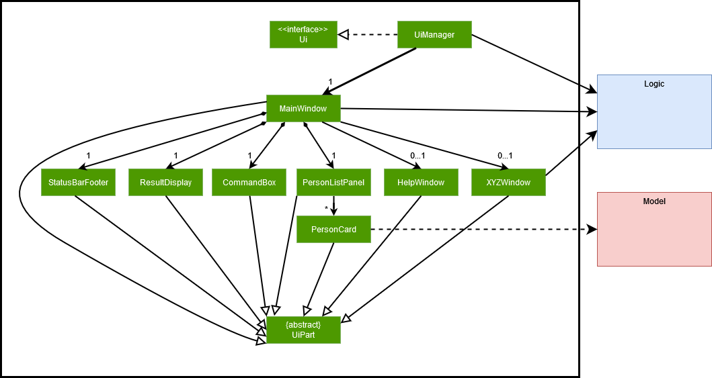

# Acknowledgements

This is a brownfield project that bases from the Project template [AddressBook Level 3 (AB3)](https://se-education.org/docs/templates.html) from se-education.org.

# Setting up, getting started

Get started by following these instructions from our [guide](https://www.notion.so/Setting-up-and-getting-started-28e77333ad24494093cc39f79194a1e2).

# Design

Take a look at our design which is mostly based off on [AddressBook Level 3 (AB3)](https://se-education.org/addressbook-level3/DeveloperGuide.html#design).

##Architecture

##UI Component

# Implementation

This section describes some noteworthy details on how certain features are implemented.

## Favourite feature and Favourites window

### Proposed Implementation

The proposed `favourite` mechanism will make use of a new attribute called `Favourite` under a `Person`. How we went about creating this mechanism is by going through the list of Persons and checking if their `Favourite` instance returns "🌟" (represents favourited) when `toString()` is called.

Given below is an example of how the `favourite` mechanism behaves with the Favourites window.

Step 1. The user starts the application with pre-loaded data of Persons.

Step 2. Assuming there is a Person with the number 1. User then executes `favourite 1` command to favourite the first Person in the application. The system will create a new Person with the `Favourite` instance's value set as true. Then calls `Model#setPerson()` to set Person 1 to be a favourited Person.

<aside>
💡 **Note:** Every newly added Person will have the default value of `False` for `Favourite` attribute, thus will never appear in the Favourites window before the `favourite` command is called on them.

</aside>

Step 3. User can access the Favourites window by navigating to the menu item as shown in the diagram, which pops up a new window that contains only those Persons that have ‘Favourite’ instance's value set as True or can input the command `fw` to open up the Favourites window through this CLI command.

## Match feature/Window
The `match` opens a new `MatchWindow`, in which all matches are displayed in pairs.
The left column shows the sellers, while the right column shows the buyers.

Two `Person` make a match if the seller has at least one `property` that matches the buyer's `preference`.

## Help Feature and Window
The `help` command and selecting help from the dropdown opens the `helpwindow`.

The contents of `helpPanePlaceHolder` is then replaced according to which tab
that the user has selected to view more details about a specific feature or general features
of Realestatepro

## Property
The `Property` is a new attribute that can be added to a `Person` that represents a real estate property listing. A `Person` is able to hold multiple properties including none.

The `Property` itself consists of the following attributes: `Region`, `Address`, `Size`, `Price`.

- `Region` represents the general location of the `Address` of the `Property`. It is an enum that can be one of the following: `NORTH`, `SOUTH`, `EAST`, `WEST`, `CENTRAL`.

- `Address` represents the exact location of the `Property`.

- `Size` represents the size of the `Property` in terms of the number of rooms it has. It is an enum that can be one of the following: `ONE_ROOM`, `TWO_ROOM`, `THREE_ROOM`, `FOUR_ROOM`, `FIVE_ROOM`.

- `Price` represents the price of the `Property`. It's `toString()` method returns the price in the form of `$###` or `$###.#K` or `$###.#M` depending on the value of the `Price` for easier readability.

## Preference
The `Preference` is a new attribute that can be added to a `Person`. A `Person` can either have a `Preference` or not.

A `Preference` contains the following attributes: `Region`, `Size`, `lowPrice`, `highPrice`,
among which the first two is explained in the previous sector.
The latter two specifies the expected range of money the buyer would like to pay.

## UserType
The `UserType` represents an attribute that is added to a `Person` & represents the `Person` as a `buyer` or `seller`. A `Person` is only either a `buyer` or `seller` at a given time. They cannot be both or none. The `UserType` of a `Person` is derived from the presence of a `Property` or `Preference`. If the `Person` has a `Property`, then they are a `seller`, but if the person has a `Preference`, then they are a `buyer`.

Unlike other attributes of a `Person`, the `UserType` of a `Person` cannot be edited _directly_ via the `edit` command. A `Person` can be changed from a `buyer` to a `seller` & vice versa if the person's property or preference is changed. This can be done with the command: `edit INDEX pr/PROPERTY_DETAILS` or `edit INDEX pf/PREFERENCE_DETAILS`. This means editing a `Person` to have a `Property` instead of a `Preference` will change them from a `buyer` (had a `Preference` initially) to a `seller` (now has a `Property`). In other cases where other attributes of a `Person` are being edited, e.g. phone number, address, the `UserType` of that `Person` being edited will remain the same.

## [Proposed] Remind feature
The remind feature is implemented by storing a static list of Persons the user wants to be reminded of. 

- `ReminderTask` -- Schedules and handles the work of activating the Reminders window. 
- `ReminderPersons` -- Stores a `HashSet` of `Person`s, because only 1 reminder can be set per person & thus only 1 occurrence of a Person in this data structure is allowed.
- `ReminderWindow` --  A Window to display all `Person`s the client set reminders for.
- Both `ReminderTask` and `ReminderWindow` classes are singletons as there can only ever be 1 occurrence of these classes.

The remind feature can be activated by typing `remind INDEX` where INDEX is the `Person` the user wants to set a reminder for.

Given below is an example usage scenarios and the behavior of the program specific to this feature.

Step 1: The user launches the app. Within 5 seconds, a Reminder window pops up & displays any reminders the user has actively set. As the User does not have any active reminders set, they can add a reminder.

Step 2: User executes the `remind` command by typing in `remind 1`, as the user wants to set a reminder for the client with `Index` 1. The `RemindCommandParser` parses the `Index` the `User` inputted & creates a `RemindCommand`. The `RemindCommand` is executed & retrieves the `Person` corresponding to the `Index` from `Model`. This `Person` is then added to the HashSet in `ReminderPersons`. The `CommandResult` returned is created with the input argument `showReminders` marked as true. This then gets executed by MainWindow and the `ReminderWindow` is launched. 

Step 3: The User will be prompted with the Reminder window, containing the client the user just set a `Reminder` for.

Step 4: The User uses the app for their normal use, after 1 minute of the Reminder window popping up, the Reminder window launches again to actively remind the User of any reminders.

## [Proposed] Upload Image
The upload image feature is implemented by storing a set of `UserImage` containing
a `FilePath` to an image file and optional `description` of the image. A `LinkedHashSet` in order
to retain order based on the order of insertion.

- `UserImage` -- Contains all information needed to display the image that has been associated with the person
- `FilePath` -- Leads to a file that is located in the user's system

There are two commands that are associated with the feature which are namely `upload` and `viewimage`.

Below is an example usage scenerio and the behaviour of the program:

Step 1: User calls the `upload` command.
`UploadCommandParser` would then be used to parse the command inputted to obtain the `index` of the `Person` to add
the image with, the `filepath` to the file which is checked whether it is an existing file and
the `description` if provided.

Step 2: A `UserImage` is created from the parameters obtained from `UploadCommandParser` that checks to ensure that the
file `FilePath` leads to is an image before adding it to the
`Person`.

Step 3: User calls the `viewimage` command that `ViewImageCommandParser` parsers to get the `index` of the `Person` to
view the all the `UserImage` in the `Person`.

Step 4: The set of `UserImage` is then passed to `model` via `model#updateViewPerson(Set<UserImage>)`.
The `viewImageWindow` is the displayed after it retrieves the set from `model`

Step 5: The set of `UserImage` is then converted into a `ArrayList` and the first image is displayed in the window.

## Statistics feature/Window
The `stats` opens a new `StatisticsWindow` that displays a pie chart with the information of the number of sellers & buyers in the 5 different regions namely {North, South, East, West, Central}.

This allows the user to be visualize his/her client's data to make better business decisions.

## [Proposed] Sorting

The sorting feature allows the user to sort the list of `Person` displayed.

The following table shows the attributes that the list can be sorted by and their corresponding keywords.

| Attribute            | Keyword        |
|----------------------|----------------|
| `Name`               | `name`         |
| `Phone`              | `phone`        |
| `Email`              | `email`        |
| `Favourite`          | `favourite`    |
| `Address`            | `address`      |
| `UserType`           | `usertype`     |
| Number of `Property` | `num_property` |

Sorting the list is done by using the `sort` command, which has the following syntax: `sort [KEYWORD]...`.

If multiple attributes are specified, the first attribute is given the highest priority, while the last attribute is given the lowest priority. For example, `sort address name` will sort the list by `Address` first, followed by `Name` if `Address` is equal.

The sorting feature is implemented by using a `SortedList<Person>` to observe the `FilteredList<Person>` in `ModelManager`.

Whenever the underlying application data is modified, the `FilteredList<Person>` is notified first and will filter the data. If there is any change in the `FilteredList<Person>`, the `SortedList<Person>` is notified and will sort the filtered data.

## Feature `find` enhanced
In addition to the original `NameContainsKeywordsPredicate`, more predicates concerning each of the attributes in a `Person` are created.
They can be fed to the `FindCommand` to filter out `Person` with the specified keywords in the specified attribute. 

# Documentation, logging, testing, configuration, dev-ops

This is how we do our [documentation](https://se-education.org/addressbook-level3/Documentation.html).

This is how we do our [testing](https://se-education.org/addressbook-level3/Testing.html).

This is how we do our [logging](https://se-education.org/addressbook-level3/Logging.html).

This is how we do our [configurations](https://se-education.org/addressbook-level3/Configuration.html).

This is how we do our [DevOps](https://se-education.org/addressbook-level3/DevOps.html).

<aside>
💡 **Note:** We decided to follow the procedure that AddressBook Level 3 (ABL3) implements as we identified that their process suited our needs as well.

</aside>

# Appendix: Requirements

## Target user profile

- has a need to manage a significant number of clients
- prefer desktop apps over other types
- can type fast and prefer typing to mouse interactions
- is reasonably comfortable using CLI apps
- has a need to retain the contact information of all clients

## Value Proposition

Manage clients faster that a typical mouse/GUI driven app.

## User stories

| Priority | As a ... | I want to ...                                                                                                                                                                      | So that i can...                                                                                   |
| --- | --- |------------------------------------------------------------------------------------------------------------------------------------------------------------------------------------|----------------------------------------------------------------------------------------------------|
| High | User | Delete my client’s information on the app                                                                                                                                          | Remove this redundant information after he/she is not my client anymore                            |
| High | User | To edit my clients’ information on the app                                                                                                                                         | Ensure all information of my clients are always up to date                                         |
| High | User | To list out my clients’ information on the app                                                                                                                                     | View all of my clients’ information in one place                                                   |
| High | User | Differentiate my clients’ on the app (e.g. buyers, sellers)                                                                                                                        | Know if a client is looking for a property to buy or is trying sell a property                     |
| High | User | Add my clients’ information on the app                                                                                                                                             | Gain access to all these information in one place                                                  |
| High | User | Favorite a client                                                                                                                                                                  | Separate clients based on whose information I frequent the most (favorited) and those that are not |
| High | User | View favourited clients                                                                                                                                                            | Have a compact display of clients that I frequent the most                                         |
| High | User | To create a preference for a client who is a buyer                                                                                                                                 | Have information of potential properties that the buyer would want to buy                          |
| High | User | Match my clients (e.g. buyer with seller)                                                                                                                                          | Spot if there are any properties being sold by a seller that a buyer has a preference for.         |
| High | User | Be able to understand how the app works from start to end                                                                                                                          | Able to provide the necessary inputs to perform a particular action on the app                     |
| High | User | display data of the number of sellers & buyers based on the particular region that the seller has properties in or the buyer having a preference of when looking to buy properties | Be able to make the better business decision to look for more clients in the most popular region   |

## Use cases

## Non-functional Requirements

1. Should be able to work on any mainstream OS as long as it has Java 11 or above installed
2. A user with above average typing speed for regular English text (i.e. not code, not system admin commands) should be able to accomplish most of the tasks faster using commands than using the mouse.
3. No lag of more then one second when executing commands
4. Should be able to hold up to 1000 Persons without a noticeable sluggishness in performance for typical usage.
5. The application will not be able to prevent any data privacy violated by other programs.

## Glossary

**Buyer** - Client that is looking to buy a property based on some preferences

**Seller -** Client that is looking to sell a property for at around a particular price

# Appendix: Instructions for manual testing

Given below are instructions to test the app manually.

<aside>
💡 **Note:** Please bear in mind to extend your testing to more *exploratory* testing after following these steps.

</aside>

## Launch and shutdown

1. Initial launch
    1. Download the jar file and copy into an empty folder
    2. Double-click the jar file Expected: Shows the GUI with a set of sample contacts. The window size may not be optimum.
2. Saving window preferences
    1. Resize the window to an optimum size. Move the window to a different location. Close the window.
    2. Re-launch the app by double-clicking the jar file.Expected: The most recent window size and location is retained.
3. Shutting down
    1. First way you can do it is to click on the X button on the application.
    2. Another way is to click on ‘File’ menu item and click on ‘Exit’.
    3. Lastly, you can enter the `exit`command.

## Deleting a person

1. Deleting a person while all persons are being shown
    1. Prerequisites: List all persons using the `list` command. Multiple persons in the list.
    2. Test case: `delete 1`Expected: First contact is deleted from the list. Details of the deleted contact shown in the status message. Timestamp in the status bar is updated.
    3. Test case: `delete 0`Expected: No person is deleted. Error details shown in the status message. Status bar remains the same.
    4. Other incorrect delete commands to try: `delete`, `delete x`, `...` (where x is larger than the list size or smaller than 0)Expected: Similar to previous.

