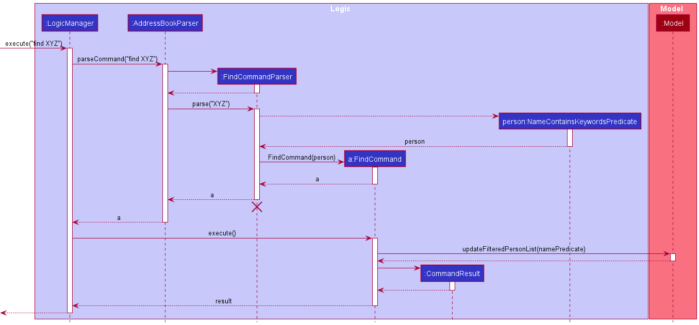
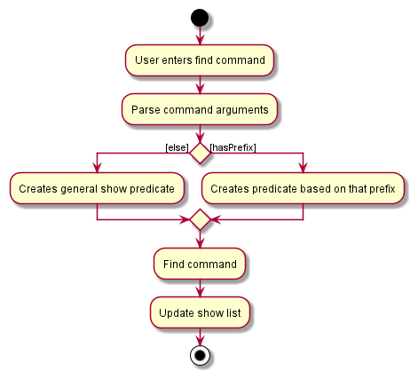
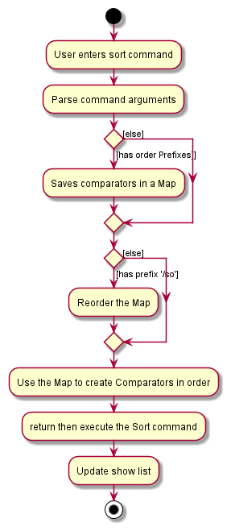
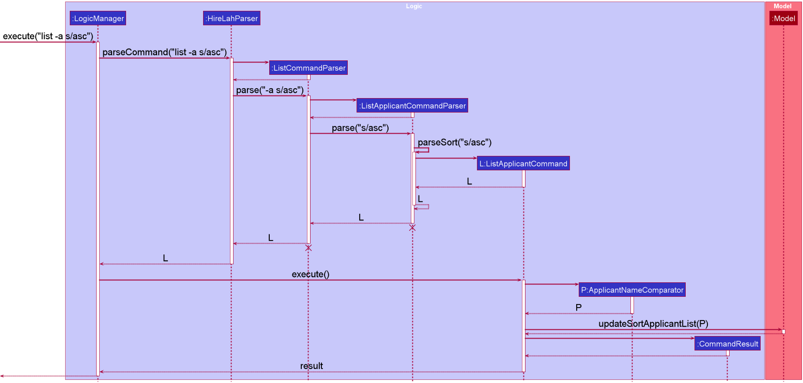

### Table of Contents

* [**Acknowledgements**](#acknowledgements)
* [**Setting up, getting started**](#setting-up-getting-started)
* [**Design**](#design)
    * [Architecture](#architecture)
    * [UI component](#ui-component)
    * [Logic component](#logic-component)
    * [Model component](#model-component)
    * [Storage component](#storage-component)
    * [Common classes](#common-classes)
* [**Implementation**](#implementation)
    * [Find command feature](#find-command-feature)
        * [What it does](#what-it-does)
        * [Implementation](#implementation-1)
        * [Design consideration](#design-considerations)
            * [How find executes](#aspect-how-find-executes)
    * [Sort command feature](#sort-command-feature)
      * [What it does](#what-it-does-1)
        * [Implementation](#implementation-2)
        * [Design consideration](#design-considerations-1)
            * [How sort executes](#aspect-how-sort-executes)
* [**Documentation, logging, testing, configuration, dev-ops**](#documentation-logging-testing-configuration-dev-ops)
* [**Appendix: Requirements**](#appendix-requirements)
    * [Product scope](#product-scope)
    * [User stories](#user-stories)
    * [Use cases](#use-cases)
    * [Non-Functional Requirements](#non-functional-requirements)
    * [Glossary](#glossary)
* [**Appendix: Instructions for manual testing**](#appendix-instructions-for-manual-testing)
    * [Launch and shutdown](#launch-and-shutdown)
    * [Adding a show](#adding-a-show)
    * [Deleting a show](#deleting-a-show)
    * [Editing a show](#editing-a-show)
    * [Edit a comment](#edit-comment)
    * [Saving data](#saving-data)
    * [Finding a show](#finding-a-show)

---

## **Acknowledgements**

* {list here sources of all reused/adapted ideas, code, documentation, and third-party libraries -- include links to the original source as well}
* The find feature and documentation were adopted from imPoster created by team [AY2021S2-CS2103T-T12-4](https://ay2021s2-cs2103t-t12-4.github.io/tp/DeveloperGuide.html), [stackoverflow](https://stackoverflow.com/questions/24553761/how-to-apply-multiple-predicates-to-a-java-util-stream) and [AB-3](https://se-education.org/addressbook-level3/DeveloperGuide.html).
* The help window feature was adopted from the video [here](https://youtu.be/vego72w5kPU).

[return to top ](#table-of-contents)

---

## **Setting up, getting started**

Refer to the guide [_Setting up and getting started_](SettingUp.md).

[return to top ](#table-of-contents)

---

## **Design**

:bulb: **Tip:** The `.puml` files used to create diagrams in this document can be found in the [diagrams](https://github.com/AY2122S2-CS2103T-T09-3/tp/tree/master/docs/diagrams/) folder. Refer to the [_PlantUML Tutorial_ at se-edu/guides](https://se-education.org/guides/tutorials/plantUml.html) to learn how to create and edit diagrams.

### Architecture

The ***Architecture Diagram*** given above explains the high-level design of the App.

Given below is a quick overview of main components and how they interact with each other.

**Main components of the architecture**

**`Main`** has two classes called [`Main`](https://github.com/AY2122S2-CS2103T-T09-3/tp/tree/master/src/main/java/seedu/address/Main.java) and [`MainApp`](https://github.com/AY2122S2-CS2103T-T09-3/tp/tree/master/src/main/java/seedu/address/MainApp.java). It is responsible for,
* At app launch: Initializes the components in the correct sequence, and connects them up with each other.
* At shut down: Shuts down the components and invokes cleanup methods where necessary.

[**`Commons`**](#common-classes) represents a collection of classes used by multiple other components.

The rest of the App consists of four components.

* [**`UI`**](#ui-component): The UI of the App.
* [**`Logic`**](#logic-component): The command executor.
* [**`Model`**](#model-component): Holds the data of the App in memory.
* [**`Storage`**](#storage-component): Reads data from, and writes data to, the hard disk.

**How the architecture components interact with each other**

The *Sequence Diagram* below shows how the components interact with each other for the scenario where the user issues the command `delete 1`.

Each of the four main components (also shown in the diagram above),

* defines its *API* in an `interface` with the same name as the Component.
* implements its functionality using a concrete `{Component Name}Manager` class (which follows the corresponding API `interface` mentioned in the previous point.

For example, the `Logic` component defines its API in the `Logic.java` interface and implements its functionality using the `LogicManager.java` class which follows the `Logic` interface. Other components interact with a given component through its interface rather than the concrete class (reason: to prevent outside component's being coupled to the implementation of a component), as illustrated in the (partial) class diagram below.

The sections below give more details of each component.

[return to top ](#table-of-contents)

---

### UI component

The **API** of this component is specified in [`Ui.java`](https://github.com/AY2122S2-CS2103T-T09-3/tp/tree/master/src/main/java/seedu/address/ui/Ui.java)

The UI consists of a `MainWindow` that is made up of parts e.g.`CommandBox`, `ResultDisplay`, `ShowListPanel`, `StatusBarFooter` etc. All these, including the `MainWindow`, inherit from the abstract `UiPart` class which captures the commonalities between classes that represent parts of the visible GUI.

The `UI` component uses the JavaFx UI framework. The layout of these UI parts are defined in matching `.fxml` files that are in the `src/main/resources/view` folder. For example, the layout of the [`MainWindow`](https://github.com/AY2122S2-CS2103T-T09-3/tp/tree/master/src/main/java/seedu/address/ui/MainWindow.java) is specified in [`MainWindow.fxml`](https://github.com//AY2122S2-CS2103T-T09-3/tp/tree/master/src/main/resources/view/MainWindow.fxml)

The `UI` component,

* executes user commands using the `Logic` component.
* listens for changes to `Model` data so that the UI can be updated with the modified data.
* keeps a reference to the `Logic` component, because the `UI` relies on the `Logic` to execute commands.
* depends on some classes in the `Model` component, as it displays `Show` object residing in the `Model`.

[return to top ](#table-of-contents)

---

### Logic component

**API** : [`Logic.java`](https://github.com/AY2122S2-CS2103T-T09-3/tp/tree/master/src/main/java/seedu/address/logic/Logic.java)

Here's a (partial) class diagram of the `Logic` component:

How the `Logic` component works:
1. When `Logic` is called upon to execute a command, it uses the `TrackermonParser` class to parse the user command.
1. This results in a `Command` object (more precisely, an object of one of its subclasses e.g., `AddCommand`) which is executed by the `LogicManager`.
1. The command can communicate with the `Model` when it is executed (e.g. to add a show).
1. The result of the command execution is encapsulated as a `CommandResult` object which is returned back from `Logic`.

The Sequence Diagram below illustrates the interactions within the `Logic` component for the `execute("delete 1")` API call.

:information_source: **Note:** The lifeline for `DeleteCommandParser` should end at the destroy marker (X) but due to a limitation of PlantUML, the lifeline reaches the end of diagram.

Here are the other classes in `Logic` (omitted from the class diagram above) that are used for parsing a user command:

How the parsing works:
* When called upon to parse a user command, the `TrackermonParser` class creates an `XYZCommandParser` (`XYZ` is a placeholder for the specific command name e.g., `AddCommandParser`) which uses the other classes shown above to parse the user command and create a `XYZCommand` object (e.g., `AddCommand`) which the `TrackermonParser` returns back as a `Command` object.
* All `XYZCommandParser` classes (e.g., `AddCommandParser`, `DeleteCommandParser`, ...) inherit from the `Parser` interface so that they can be treated similarly where possible e.g, during testing.

[return to top ](#table-of-contents)

---

### Model component

**API** : [`Model.java`](https://github.com/se-edu/addressbook-level3/tree/master/src/main/java/seedu/address/model/Model.java)

The `Model` component,

* stores the show list data i.e., all `Show` objects (which are contained in a `UniqueShowList` object).
* stores the currently 'selected' `Show` objects (e.g., results of a search query) as a separate _filtered_ list which is exposed to outsiders as an unmodifiable `ObservableList<Show>` that can be 'observed' e.g. the UI can be bound to this list so that the UI automatically updates when the data in the list change.
* stores a `UserPref` object that represents the user’s preferences. This is exposed to the outside as a `ReadOnlyUserPref` objects.
* does not depend on any of the other three components (as the `Model` represents data entities of the domain, they should make sense on their own without depending on other components)

:information_source: **Note:** An alternative (arguably, a more OOP) model is given below. It has a `Tag` list in the `ShowList`, which `Show` references. This allows `ShowList` to only require one `Tag` object per unique tag, instead of each `Show` needing their own `Tag` objects. 

[return to top ](#table-of-contents)

---

### Storage component

**API** : [`Storage.java`](https://github.com/AY2122S2-CS2103T-T09-3/tp/blob/master/src/main/java/seedu/address/storage/Storage.java)

The `Storage` component,
* can save both show list data and user preference data in json format, and read them back into corresponding objects.
* inherits from both `ShowListStorage` and `UserPrefStorage`, which means it can be treated as either one (if only the functionality of only one is needed).
* depends on some classes in the `Model` component (because the `Storage` component's job is to save/retrieve objects that belong to the `Model`)

[return to top ](#table-of-contents)

---

### Common classes

Classes used by multiple components are in the `seedu.trackermon.commons` package.

[return to top ](#table-of-contents)

---

## **Implementation**

This section describes some noteworthy details on how certain features are implemented.

### Find command feature

#### What it does 

Looks for a show in a list of shows and displays all the shows that match the user's input. If the user's input contains no prefixes, `find` will do a general search through all fields in the `Show` class.

#### Implementation
After entering the find command, the `ArgumentTokenizer` will map any prefixes in the user's input to Trackermon's prefix syntax.Then, the parser will do a check whether there are any prefixes in the input. If prefixes are specified, a `FindCommand` object will be created with predicates looking through the specified prefixes. Else, a general show predicate will be created by scanning through the name, status and tag fields of the `Show` class. `FindCommand` is a class that inherits the `Command` abstract class. `FindCommand` implements the `execute()` method from the `Command` abstract class where on execution, it will scan through the shows in the model's list of shows and check if any shows match the user's input. The model is then udpated with the filtered show list.

Given below is an example usage scenario and the step-by-step flow of the find command.

Step 1: The user launches Trackermon and is presented with a list of all shows retrieved from local storage `Trackermon.json`.

Step 2: The user executes `find t/Anime t/Action` to find a show.

Step 3: The find command will check and see whether any shows contain the tags `Anime` and `Action` using the `Model#updateFilteredShowList` method.

Step 4:
`Model#updateFilteredShowList` will be called and model will be updated without modifying the original show list. If no shows match the keywords given by the user, an empty list will be displayed.

**:information_source: Note:** 
`find Shingeki no Kyojin` will also work, however it will scan through the name, status and tag fields instead of the name field only

The following sequence diagram summarizes what happens when a user executes a valid find command on tags only:

The following activity diagram summarizes what happens when a user executes a valid find command:

#### Design considerations:
##### Aspect: How find executes
- **Alternative 1 (current choice):** The `find` command checks for keywords after the prefix. If there are no prefixes, it will perform a general search using `ShowContainsKeywordsPredicate` which scans through the name, status and tag fields in the `Show` class. Else, `ArgumentMultimap#arePrefixesPresent` will check and return a new predicate for each value after each prefix if it is present and then generate a keyword predicate that will match values in that field. A for loop is implemented for the name and tag predicates. This will allow an `AND` search within a list of keywords within these two parameters. The user does not need to type in the full word for any find searches as each predicate uses a fragmented search.
  - Pros: Abstraction of predicates and encapsulating the checking of shows allows the predicates to be used more flexibly elsewhere to match other shows.
  - Cons: More abstraction may make developers take a longer time to extend the functionality if new prefixes are being added.

- **Alternative 2:** Directly check whether the show is in the show list in the find command parser without a predicate.
  - Pros: Developers can easily understand the code and its functionality as all of the code is condensed in a single class.
  - Cons: Bad coding and Object-Oriented Programming (OOP) practices is prominent due to the lack of abstraction.

[return to top ](#table-of-contents)

---

### Sort command feature

#### What it does

Sort the list of shows according user's input prefix. If the user's input contains no prefixes, sort will sort by name in ascending order. If both prefixes for ascending and descending are used, it will only sort by ascending. If both prefixes for name and status are used, by default it will sort by name then by status.

#### Implementation
After entering the sort command, the tokenizer in parser will map any prefixes in the user's input to Trackermon's prefix syntax. Then, the parser will do a check whether there are any prefixes in the input. If prefixes are specified, a `SortCommand` object will be created with `Comparator` according to the specified prefixes. Else, a `NameComparator` will be created which can be used to sort names in ascending order. `SortCommand` is a class that inherits the `Command` abstract class. `SortCommand` implements the `execute()` method from the `Command` abstract class where on execution, sort the model's list of shows according to the `Comparator`. The model is then updated with the sorted show list.

Given below is an example usage scenario and the step-by-step flow of the sort command.

Step 1: The user launches Trackermon and enters `sort sna/ ssd/` to sort the list of shows.

Step 2: The sort command parser will check for prefixes and generate the appropriate `Comparator` for the SortCommand. In this case it generate a `NameComparator().thenComparing(StatusComparator().reverse()))`

Step 3: When the sort command executes, it will call`Model#updateSortedShowList` method.

Step 4: The sorted list in model will apply the Comparator and model will be updated in order by ascending name then descending status.

The following activity diagram summarizes what happens when a user executes a sort command:

The following sequence diagram summarizes what happens when a user executes a sort command, in this case sort with no prefix:

#### Design considerations:
##### Aspect: How sort executes
- **Alternative 1 (current choice):** The `sort` command checks for the optional prefix. If the user's input contains no prefixes, sort will sort by name in ascending order. If both prefixes for ascending and descending are used, it will only sort by ascending. If both prefixes for name and status are used, it will sort by name then by default.

  - Pros: No invalid commands input by the user
  - Cons: Users need to get use to the prefixes used.

- **Alternative 2:** The `sort` command checks for the non-optional prefix. Users have to provide valid input to specify which attribute to sort by and by ascending or descending. 
    - Pros: Users have fewer prefixes to remember
    - Cons: Users need to remember valid inputs

[return to top ](#table-of-contents)

---

### Status feature

#### What it does it do
`Status` class is an attribute within the `Show` class. `Status` represents the 
watched status of the show which can be represented by `completed` and `watching`. 

#### Implementation

`Status` class is implemented as a `enum` class. Enumerations 
are a list of named constants, where the named constants are `completed` and `watching`.
It is also possible to implement `Status` as a normal class encapsulating a String or Integer which would 
represent the status of the show (`watching` & `completed`). However, the former implementation
is chosen due to certain advantages that it offers.

#### Design considerations:

1. Enumerations offer compile time type safety, reducing the risk of runtime errors.
2. Enumerations implementation would have better space complexity. With the `enum` implementation, all the shows would 
reference the same `enum` class. However, for the class implementation, a new `Status` instance is
instantiated each time a `Show` object is created.

---

## **Documentation, logging, testing, configuration, dev-ops**

* [Documentation guide](Documentation.md)
* [Testing guide](Testing.md)
* [Logging guide](Logging.md)
* [Configuration guide](Configuration.md)
* [DevOps guide](DevOps.md)

[return to top ](#table-of-contents)

---

## **Appendix: Requirements**

### Product scope

**Target user profile**:

* wants to keep track of their shows
* prefer desktop apps over other interfaces
* can type fast and prefers typing to mouse interactions.
* wants to be able to maintain a local copy of their list of shows

**Value proposition**:

* Helps users to keep track of all their shows in a single application.
* No need to create an account unlike traditional web based services.
* Able to keep a local copy of their list of shows.
* Clean and minimal user interface.

[return to top ](#table-of-contents)

---

### User stories

Priorities: High (must have) - `* * *`, Medium (nice to have) - `* *`, Low (unlikely to have) - `*`

| Priority | As a …​        | I want to …​                                          | So that I can…​                                        |
|----------|----------------|-------------------------------------------------------|--------------------------------------------------------|
| `* * *`  | user           | add shows                                             | add new shows into the list                            |
| `* * *`  | user           | delete shows  		                                      | delete wrong entries in the list                       |
| `* * *`  | user           | find a show                                           | find whether a specific show is in the list            |
| `* * *`  | user           | list out all of my shows                              | see the details of all my shows in the list            |
| `* *`    | new user       | see usage instructions                                | refer to instructions when I forget how to use the App |
| `* * *`  | user           | edit show from the list                               | edit the name or status or tag of my show in the list  |
| `* * `   | long time user | find shows of specific genres                         | recommend those shows to my friends                    |
| `* * `   | long time user | find a show I may or may not have watched             | decide whether to watch that show or not               |
| `* * `   | long time user | find whether a show I am watching is completed or not | continue with it if it is not completed                |
| `* * `   | long time user | sort the list of show                                 | view the list in a organised manner                    |

[return to top ](#table-of-contents)

---

### Use cases

(For all use cases below, the **System** is `Trackermon` and the **Actor** is the `user`, unless specified otherwise)

---

**Use case: UC01 - Add a show**

**Preconditions: Trackermon application is started.**

**Guarantees: Show will be added into Trackermon only if the user input matches the command format.**

**MSS**

1.  User requests to list shows.
2.  Trackermon shows a list of shows.
3.  User adds a show in Trackermon.
4.  Trackermon stores the show in its storage.

    Use case ends.

**Extensions**

* 2a. The list is empty.

  Use case resumes at step 3.

* 3a. User adds a duplicate show.

    * 3a1. Trackermon shows an error message to user, indicating that there is a duplicate show in the list and requests the user to either delete the show in the list or add another show.

      Use case resumes at step 3.

* 3b. User enters command with the wrong syntax.

    * 3b1. Trackermon shows an error message to user, indicating the format for adding shows is incorrect, and attaches the correct syntax format.

      Use case resumes at step 3.

[return to top ](#table-of-contents)

---

**Use case: UC02 - Delete a show**

**Preconditions: Trackermon application is started.**

**Guarantees: Show will be deleted from Trackermon only if the user input matches the command format.**

**MSS**

1.  User requests to list shows.
2.  Trackermon shows a list of shows.
3.  User requests to delete a specific show in the list.
4.  Trackermon deletes the show.

    Use case ends.

**Extensions**

* 2a. The list is empty.

  Use case ends.

* 3a. The given index is invalid.

    * 3a1. Trackermon shows an error message,  indicating the format for deleting shows is incorrect, and attaches the correct syntax format.

      Use case resumes at step 3.

[return to top ](#table-of-contents)

---

**Use case: UC03 - List a show**

**Preconditions: Trackermon application is started.**

**Guarantees: A list of shows will be displayed for the user.**

**MSS**

1.  User requests to list shows.
2.  Trackermon shows a list of shows.

    Use case ends.

**Extensions**

* 2a. The list is empty.

  Use case ends.

[return to top ](#table-of-contents)

---

**Use case: UC04 - Tag a show** (coming in v1.3)

**Preconditions: Trackermon application is started.**

**Guarantees: Show will be tagged in Trackermon only if the user input matches the command format.**

**MSS**

1.  User requests to list shows.
2.  Trackermon shows a list of shows.
3.  User requests to tag a specific show in the list.
4.  Trackermon tags the show.

    Use case ends.

**Extensions**

* 2a. The list is empty.

  Use case ends.

* 3a. User uses the command with the wrong syntax.

    * 3a1. Trackermon shows an error message to user, indicating the format for adding shows is incorrect, and attaches the correct syntax format.

      Use case resumes at step 3.

[return to top ](#table-of-contents)

---

**Use case: UC05 - Request a list of commands**

**Preconditions: Trackermon application is started.**

**Guarantees: A URL to the user-guide will be provided.**

**MSS**

1.  User requests a list of commands that are available in Trackermon.
2.  Trackermon shows the URL of the user-guide that contains a list of commands available in Trackermon.

    Use case ends.

[return to top ](#table-of-contents)

---

**Use case: UC06 - Exiting Trackermon**

**Preconditions: Trackermon application is started.**

**Guarantees: Trackermon will exit and display an exit message for the user.**

**MSS**

1. User enters the command in Trackermon.
2. Trackermon saves all changes into the disk.
3. Trackermon displays a message to tell the user that the app has successfully closed.

   Use case ends.

[return to top ](#table-of-contents)

---

**Use case: UC07 - Edit a show**

**Preconditions: Trackermon application is started.**

**Guarantees: Show will be edited from Trackermon only if the user input matches the command format.**

**MSS**

1.  User requests to list shows.
2.  Trackermon shows a list of shows.
3.  User requests to edit a specific show in the list.
4.  Trackermon edits the show.

    Use case ends.

**Extensions**

* 2a. The list is empty.

  Use case ends.

* 3a. The given index is invalid.

    * 3a1. Trackermon shows an error message,  indicating the format for editing shows is incorrect, and attaches the correct syntax format.

      Use case resumes at step 3.

[return to top ](#table-of-contents)

---

**Use case: UC08 - Find a show**

**Preconditions: Trackermon application is started.**

**Guarantees: Show will be found in Trackermon only if the user input matches the command format.**

**MSS**

1. User requests to find shows.
2. Trackermon searches the existing show list.
3. Trackermon shows a list of shows that matches the keyword entered by user.

    Use case ends.

**Extensions**

* 1a. User enters the command with the wrong syntax.

    * 1a1. Trackermon shows an error message to user, indicating the format for finding shows is incorrect, and attaches the correct syntax format.

      Use case resumes at step 1.
  
* 3a. Trackermon shows an empty search result.
    * 3a1. Trackermon shows a message informing the user that 0 shows are found.
  
    Use case ends.

[return to top ](#table-of-contents)

---
**Use case: UC09 - Sort the list of shows**

**Preconditions: Trackermon application is started.**

**Guarantees: A list of sorted shows will be displayed for the user.**

**MSS**

1. User requests to sort the current list of shows.
2. Trackermon sort the show list.
3. Trackermon shows a list of shows in a sorted order.

   Use case ends.

[return to top ](#table-of-contents)

---

**Use case: UC09 - Add a comment**

**Preconditions: Trackermon application is started.**

**Guarantees: Comment of the show will be edited from Trackermon only if the user input matches the command format.**

**MSS**

1.  User requests to list shows.
2.  Trackermon shows a list of shows.
3.  User requests to edit the comment of a specific show in the list.
4.  Trackermon edits the comment.

    Use case ends.

**Extensions**

* 2a. The list is empty.

  Use case ends.

* 3a. The given index is invalid.

    * 3a1. Trackermon shows an error message,  indicating the format for editing the comment of the show is incorrect, and attaches the correct syntax format.

      Use case resumes at step 3.

[return to top ](#table-of-contents)

---

### Non-Functional Requirements

1.  Should work on any _mainstream OS_ as long as it has Java `11` or above installed.
2.  Should be able to hold up to 1000 shows without a noticeable sluggishness in performance for typical usage.
3.  A user with above average typing speed for regular English text (i.e. not code, not system admin commands) should be able to accomplish most of the tasks faster using commands than using the mouse.

[return to top ](#table-of-contents)

---

### Glossary

* **Mainstream OS**: Windows, Linux, Unix, OS-X

[return to top ](#table-of-contents)

---

## **Appendix: Instructions for manual testing**

Given below are instructions to test the app manually.

:information_source: **Note:** These instructions only provide a starting point for testers to work on;
testers are expected to do more *exploratory* testing.

---

### Launch and shutdown

1. Launching the app
   1. Prerequisites: Have a copy of `Trackermon.jar` in your computer.
      1. [Download](https://github.com/AY2122S2-CS2103T-T09-3/tp/releases) the jar file and copy the file into an empty folder.
   2. Double-click the jar file.
   3. Test case: Initial launch   
      Expected: Application launched with a set of sample shows.
   4. Test case: Subsequent Launch   
      Expected: Application launched with user saved shows.

2. Saving window preferences
   1. Launch the app.   
      Expected: The window size may not be optimum.
   2. Resize the window to an optimum size. Move the window to a different location. Close the window.
   3. Re-launch the app.   
      Expected: The most recent window size and location is retained.

[return to top ](#table-of-contents)

---

### Adding a show

1. Prerequisites: None.
2. Test case: Adding a valid show
   1. Condition: Show named `Inception` must not exist in the show list.
   2. Command: `add n/Inception s/watching`   
      Expected: Show is added into the show list. Added show details shown in the result display.
3. Test case: Adding an invalid show
   1. Condition: Show named `"Inception"` exists in the show list.
   2. Command: `add n/Inception s/watching`   
      Expected: Show is not added into the show list. Error details shown in the result display.

[return to top ](#table-of-contents)

---

### Deleting a show

1. Prerequisites: None, but if the list is empty, all deletions will result in an error.
   1. [Add shows](#adding-a-show) into the show list.
2. List all shows using the `list` command.
3. Test case: Deleting a show based on list index
   1. Condition: Range of shows must be within size of show list.
   2. Command: `delete 1`   
      Expected: Show at specified index is deleted from the list. Deleted show details shown in the result display.
4. Test case: Invalid delete index
   1. Condition: Range of shows must be outside of list size.
   2. Command: `delete 0` `delete` `delete <out_of_bound_integer>`   
      Expected: No show is deleted. Error details shown in the result display.

[return to top ](#table-of-contents)

---

### Editing a show

1. Prerequisites: None, but if the list is empty, all edits will result in an error.
   1. [Add shows](#adding-a-show) into the show list.
2. List all shows using the `list` command.
   1. Test case: Edit show name
      1. Condition: Show named `One Piece` must not exist in the show list.
      2. Command: `edit 1 n/One Piece`  
         Expected: Name of show at specified index is changed to `One Piece`. Edited show details shown in the result display.
3. Test case: Edit show status
   1. Condition: None, if show status is already `completed`, expected output will be the same.
   2. Command: `edit 1 s/completed`  
      Expected: Status of show at specified index is changed to `completed`. Edited show details shown in the result display.

4. Test case: Invalid edit index
   1. Condition: Range of shows must be outside of list size.
   2. Command: `edit 0` `edit 1` `edit <out_of_bound_integer>` `edit`  
      Expected: No show is edited. Error details shown in the result display.

5. Test case: Invalid edit name
   1. Condition: Show named `Inception` exists in the show list.
   2. Command: `edit n/Inception`  
      Expected: No show is edited. Error details shown in the result display.

[return to top ](#table-of-contents)

---

### Edit comment

1. Edit comment show while all shows are being shown

    1. Prerequisites: List all shows using the `list` command. Multiple shows in the list.

    1. Test case: `comment 1 c/Hello` 
       Expected: Comment of the first show in the list is edited to "Hello".

    1. Test case: `comment 1` 
       Expected: Comment of the first show in the list is deleted.

    1. Test case: `comment 0` 
       Expected: No comments are edited. Error details shown in the status message. Status bar remains the same.

    1. Other incorrect comment commands to try: `comment`, `comment x` (where x is larger than the list size) 
       Expected: Similar to previous.

[return to top ](#table-of-contents)

---

### Saving data

1. Saving data between sessions
   1. Launch the app.
   2. Modify the show list using any commands that affects the details of a show.
   3. Relaunch the app.   
      Expected: The most recent changes made to the shows is retained.
    
2. Dealing with missing files
   1. Prerequisites: JSON file is missing.
      1. Delete the `data/trackermon.json` file to simulate a missing file.
   2. Relaunch the app.   Expected: The app starts with the default list of show list.

3. Dealing with corrupted files
   1. Prerequisites: JSON file is corrupted.
      1. Modify the `data/trackermon.json` file with any software that would break the JSON format to simulate corrupted file.
   2. Relaunch the app.   Expected: The app starts with an empty show list.

[return to top ](#table-of-contents)

---

### Finding a show

1. Finding a show (General Find)
   1. Prerequisites: None, but if the list is empty, all searches will lead to no results.

   2. Test case: Find single keyword
      1. Command: `find shingeki`  
         Expected: Looks through the name, status and tag fields for any partial or full word of `shingeki` then displays them on the show list.  
         E.g. `shingeki` from name, status, or tag fields will be matched.  
      
   3. Test case: Find multiple keywords
      1. Command: `find shingeki shutter`  
         Expected: Looks through the name, status and tag fields for any partial or full word of `shingeki` or `shutter` then displays them on the show list.  
         E.g. `shingeki` or `shutter` from name, status, or tag fields will be matched (`OR` search).
   
      2. Command: `find 86 shutter`  
         Expected: Looks through the name, status and tag fields for any partial or full word of `86` or `shutter` then displays them on the show list.  
         E.g. `86` or `shutter` from name, status, or tag fields will be matched (`OR` search).
   
   4. Test case: Invalid command format
      1. Command: `find`  
         Expected: No show is found. Error details shown in the result display, with a result message saying `Invalid command format!...`.  
   
   5. Test case: Unknown command
      1. Command: `find2`  
         Expected: No show is found. Error details shown in the result display, with a result message saying `Unknown command`.  
      
2. Find a show (Precise Find)
   1. Prerequisites: None, but if the list is empty, all searches will lead to no results.
   
   2. Test case: Finding with a single prefix
      1. Command: `find n/shingeki`  
         Expected: Looks through the name field for any partial or full word of `shingeki` then displays them on the show list.  
         E.g. `shingeki` from the name field will be matched.  
      2. Command: `find n/shingeki no kyojin`  
         Expected: Looks through the name field for any partial or full word of `shingeki` and `no` and `kyojin` then displays them on the show list.  
         E.g. `shingeki` and `no` and `kyojin` from the name field will be matched (`AND` search within a single prefix).  
   
   3. Test case: Finding with multiple prefixes
      1. Command: `find n/shingeki s/completed`  
         Expected: Looks through the name field for any partial or full word of `shingeki` and the status field for any partial or full word of `completed` then displays them on the show list.  
         E.g. **Both** `shingeki` from the name field and `completed` from the status field must be present to be matched (`AND` search between multiple prefixes).
   
      2. Command: `find n/shingeki t/seinen`  
         Expected: Looks through the name field for any partial or full word of `shingeki` and the tag field for any partial or full word of `seinen` then displays them on the show list.  
         E.g. **Both** `shingeki` from the name field and `seinen` from the tag field must be present to be matched (`AND` search between multiple prefixes).
   
      3. Command: `find n/shingeki no kyojin t/seinen`  
         Expected: Looks through the name field for any partial or full word of `shingeki` and `no` and `kyojin` and the tag field for any partial or full word of `seinen` then displays them on the show list.  
         E.g. `shingeki` and `no` and `kyojin` from the name field and `seinen` from the tag field will be matched (`AND` search within a single prefix and `AND` search between multiple prefixes).
   
   4. Test case: Invalid command format
      1. Command: `find n/`  
         Expected: No show is found. Error details shown in the result display, with a result message saying `Invalid command format!...`.  
      2. Command: `find t/Action Anime`  
         Expected: No show is found. Error details shown in the result display, with a result message saying `Invalid command format!...`.  
   
   5. Test case: Multiple of the same prefix
      1. Command: `find n/shingeki n/shutter`  
         Expected: Looks through the name field for any partial or full word of `shutter` then displays them on the show list (Ignores the first instance of n/)  
         E.g. `shutter` from the name field will be matched.

[return to top ](#table-of-contents)

---

### Sorting the list of shows

1. Prerequisites: None, but if the list is empty, all sorts will lead to no results.
2. Test case: Sort with no prefix
   1. Command: `sort`  
      Expected: The list of shows will default to being sorted by name in ascending order.

3. Test case: Sort with single prefix 
   1. Command: `sort sna/`  
      Expected: The list of shows is sorted by name in ascending order.
   
   2. Command: `sort snd/`  
      Expected: The list of shows is sorted by name in descending order.

   3. Command: `sort ssa/`  
      Expected: The list of shows is sorted by status in ascending order.
   
   4. Command: `sort ssd/`  
      Expected: The list of shows is sorted by status in descending order.
   
4. Test case: Sort with multiple same prefixes 
   1. Command: `sort sna/ snd/`  
      Expected: The list of shows is sorted by name in ascending order.
   
   2. Command: `sort ssa/ ssd/`  
      Expected: The list of shows is sorted by status in ascending order. 
   
5. Test case: Sort with multiple different prefixes
   1. Command: `sort sna/ ssd/`  
      Expected: The list of shows is sorted by name in ascending order followed by status in descending order.
   
   2. Command: `sort sna/ ssd/ so/` 
      Expected: The list of shows is sorted by status in descending order followed by name in ascending order.

[return to top ](#table-of-contents)

---
