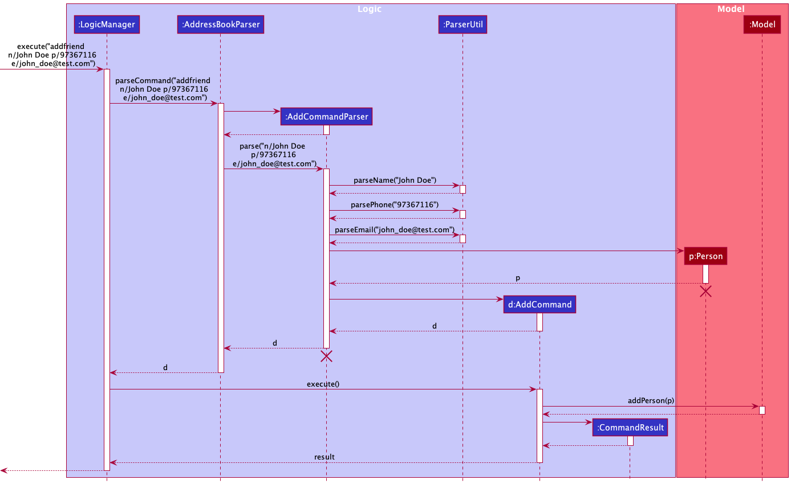
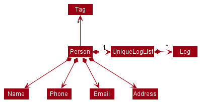
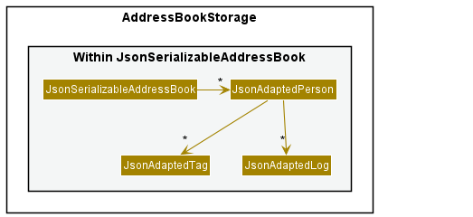
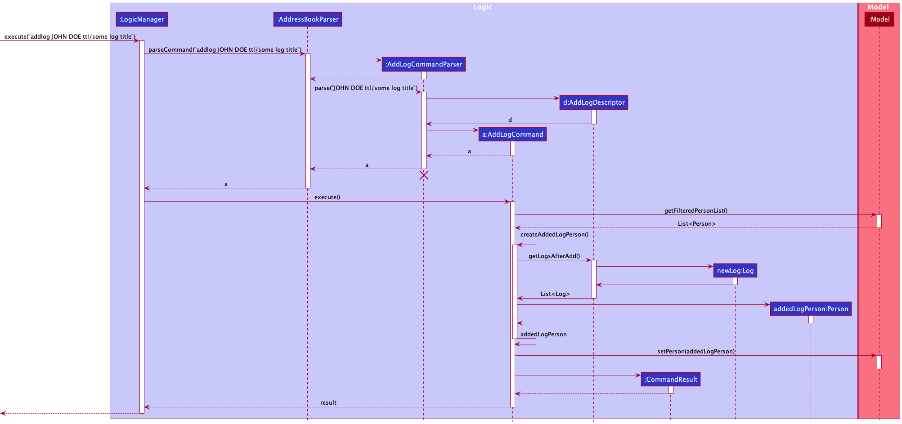

* Table of Contents
{:toc}

--------------------------------------------------------------------------------------------------------------------

## **Acknowledgements**

* {list here sources of all reused/adapted ideas, code, documentation, and third-party libraries -- include links to the original source as well}

--------------------------------------------------------------------------------------------------------------------

## **Setting up, getting started**

Refer to the guide [_Setting up and getting started_](SettingUp.md).

--------------------------------------------------------------------------------------------------------------------

## **Design**

:bulb: **Tip:** The `.puml` files used to create diagrams in this document can be found in the [diagrams](https://github.com/se-edu/addressbook-level3/tree/master/docs/diagrams/) folder. Refer to the [_PlantUML Tutorial_ at se-edu/guides](https://se-education.org/guides/tutorials/plantUml.html) to learn how to create and edit diagrams.

### Architecture

The ***Architecture Diagram*** given above explains the high-level design of the App.

Given below is a quick overview of main components and how they interact with each other.

**Main components of the architecture**

**`Main`** has two classes called [`Main`](https://github.com/se-edu/addressbook-level3/tree/master/src/main/java/seedu/address/Main.java) and [`MainApp`](https://github.com/se-edu/addressbook-level3/tree/master/src/main/java/seedu/address/MainApp.java). It is responsible for,
* At app launch: Initializes the components in the correct sequence, and connects them up with each other.
* At shut down: Shuts down the components and invokes cleanup methods where necessary.

[**`Commons`**](#common-classes) represents a collection of classes used by multiple other components.

The rest of the App consists of four components.

* [**`UI`**](#ui-component): The UI of the App.
* [**`Logic`**](#logic-component): The command executor.
* [**`Model`**](#model-component): Holds the data of the App in memory.
* [**`Storage`**](#storage-component): Reads data from, and writes data to, the hard disk.

**How the architecture components interact with each other**

The *Sequence Diagram* below shows how the components interact with each other for the scenario where the user issues the command `delete 1`.

Each of the four main components (also shown in the diagram above),

* defines its *API* in an `interface` with the same name as the Component.
* implements its functionality using a concrete `{Component Name}Manager` class (which follows the corresponding API `interface` mentioned in the previous point.

For example, the `Logic` component defines its API in the `Logic.java` interface and implements its functionality using the `LogicManager.java` class which follows the `Logic` interface. Other components interact with a given component through its interface rather than the concrete class (reason: to prevent outside component's being coupled to the implementation of a component), as illustrated in the (partial) class diagram below.

The sections below give more details of each component.

### UI component

The **API** of this component is specified in [`Ui.java`](https://github.com/se-edu/addressbook-level3/tree/master/src/main/java/seedu/address/ui/Ui.java)

The UI consists of a `MainWindow` that is made up of parts e.g.`CommandBox`, `ResultDisplay`, `PersonListPanel`, `StatusBarFooter` etc. All these, including the `MainWindow`, inherit from the abstract `UiPart` class which captures the commonalities between classes that represent parts of the visible GUI.

The `UI` component uses the JavaFx UI framework. The layout of these UI parts are defined in matching `.fxml` files that are in the `src/main/resources/view` folder. For example, the layout of the [`MainWindow`](https://github.com/se-edu/addressbook-level3/tree/master/src/main/java/seedu/address/ui/MainWindow.java) is specified in [`MainWindow.fxml`](https://github.com/se-edu/addressbook-level3/tree/master/src/main/resources/view/MainWindow.fxml)

The `UI` component,

* executes user commands using the `Logic` component.
* listens for changes to `Model` data so that the UI can be updated with the modified data.
* keeps a reference to the `Logic` component, because the `UI` relies on the `Logic` to execute commands.
* depends on some classes in the `Model` component, as it displays `Person` object residing in the `Model`.

### Logic component

**API** : [`Logic.java`](https://github.com/se-edu/addressbook-level3/tree/master/src/main/java/seedu/address/logic/Logic.java)

Here's a (partial) class diagram of the `Logic` component:

How the `Logic` component works:
1. When `Logic` is called upon to execute a command, it uses the `AddressBookParser` class to parse the user command.
1. This results in a `Command` object (more precisely, an object of one of its subclasses e.g., `AddCommand`) which is executed by the `LogicManager`.
1. The command can communicate with the `Model` when it is executed (e.g. to add a person).
1. The result of the command execution is encapsulated as a `CommandResult` object which is returned back from `Logic`.

The Sequence Diagram below illustrates the interactions within the `Logic` component for the `execute("delete 1")` API call.

:information_source: **Note:** The lifeline for `DeleteCommandParser` should end at the destroy marker (X) but due to a limitation of PlantUML, the lifeline reaches the end of diagram.

Here are the other classes in `Logic` (omitted from the class diagram above) that are used for parsing a user command:

How the parsing works:
* When called upon to parse a user command, the `AddressBookParser` class creates an `XYZCommandParser` (`XYZ` is a placeholder for the specific command name e.g., `AddCommandParser`) which uses the other classes shown above to parse the user command and create a `XYZCommand` object (e.g., `AddCommand`) which the `AddressBookParser` returns back as a `Command` object.
* All `XYZCommandParser` classes (e.g., `AddCommandParser`, `DeleteCommandParser`, ...) inherit from the `Parser` interface so that they can be treated similarly where possible e.g, during testing.

### Model component
**API** : [`Model.java`](https://github.com/se-edu/addressbook-level3/tree/master/src/main/java/seedu/address/model/Model.java)

The `Model` component,

* stores the address book data i.e., all `Person` objects (which are contained in a `UniquePersonList` object).
* stores the currently 'selected' `Person` objects (e.g., results of a search query) as a separate _filtered_ list which is exposed to outsiders as an unmodifiable `ObservableList<Person>` that can be 'observed' e.g. the UI can be bound to this list so that the UI automatically updates when the data in the list change.
* stores a `UserPref` object that represents the user’s preferences. This is exposed to the outside as a `ReadOnlyUserPref` objects.
* does not depend on any of the other three components (as the `Model` represents data entities of the domain, they should make sense on their own without depending on other components)

:information_source: **Note:** An alternative (arguably, a more OOP) model is given below. It has a `Tag` list in the `AddressBook`, which `Person` references. This allows `AddressBook` to only require one `Tag` object per unique tag, instead of each `Person` needing their own `Tag` objects. 

### Storage component

**API** : [`Storage.java`](https://github.com/se-edu/addressbook-level3/tree/master/src/main/java/seedu/address/storage/Storage.java)

The `Storage` component,
* can save both address book data and user preference data in json format, and read them back into corresponding objects.
* inherits from both `AddressBookStorage` and `UserPrefStorage`, which means it can be treated as either one (if only the functionality of only one is needed).
* depends on some classes in the `Model` component (because the `Storage` component's job is to save/retrieve objects that belong to the `Model`)

### Common classes

Classes used by multiple components are in the `seedu.addressbook.commons` package.

--------------------------------------------------------------------------------------------------------------------

## **Implementation**

This section describes some noteworthy details on how certain features are implemented.

### 1. Friends Feature

- Add friend
- Delete friend
- 

#### 1.1 Add friend

##### Implementation

The implementation of adding a friend into Amigos is facilitated by the 'AddCommand', 'AddCommandParser' in the `Logic` component,
`UniquePersonList` and `Person` classes in the `Model` component, and `JsonAdaptedPerson` in the `Storage` component.

A friend is a `Person` containing attributes - `FriendName`, `Phone`, `Address`, `Email`, `Description`, `Set<Tag>`
containing a set of `Tag` objects and a `UniqueLogList` containing a list of `Log` objects.

Given below is an example usage scenario and how the `Logic` and `Model` components behave at every
step.

1. User keys in a valid `AddCommand` `e.g. addfriend n/John Doe t/Friend` into the command box of the GUI.
2. `AddressBookParser` calls `AddCommandParser::parse` and parses the input.
   - `AddCommandParser::parse` converts the arguments entered by user into `Person` attributes by calling 
       the`ParserUtil`class. It then instantiates a new `Person` with the given attributes returned by `ParserUtil`. 
       (`ParserUtil` checks for the validity of the inputs according to the respective attribute constraints.
       Next, an `AddCommand` is created with the new `Person` passed into it.
3. When `AddCommand::execute` is called, the `Model` component will check if the `Person` to be added already
   exists in Amigos. This check is done using `Model::hasPerson` which ultimately uses `Person::isSamePerson`
   to check if two `Person` are equal by name only. 
4. If no duplicate person exists, then `Model::addPerson` will be called and the newly created `Person` will 
   be set into the `model` and added into the `UniquePersonList`.

A sequence diagram showing the interactions between `AddCommand`, `AddCommandParser`, `ParserUtil` and `model`, 
after the user has entered a valid `FriendName`, `Phone`, and `Email`.

##### Design Considerations

**Aspect**: How to store optional fields in a Person
Minimally, the `AddCommand` requires the user to enter the `FriendName` of the new `Person` to be added using the `n/` prefix. 
The other fields are optional. This is to allow flexibility for the user to add a friend into Amigos even if the user is unsure 
about certain particulars (e.g `Address`/ `Email`) of a friend.

* Current implementation
  - To allow this, we place a `null` value into the value of the optional attribute that was not provided by the user.
   For example, if an address is not given, then for the newly created `Person` object `p`, `p.address.value` will be `null`.
  - Whenever a `Person` object is instantiated, we ensure that all the attributes are non-null.
  
* Alternative implementation
  - An alternative way is to simply pass `null` directly into the `Person` attributes. For example, if an address is not given,
    then simply make `p.address` to be `null`. 
  - While this may seem more convenient, it is error-prone because we would be passing null values around which
    makes the occurrence of exceptions such as `NullPointerException` highly likely.
 
**Aspect**: How to check that a `Person` already exists in Amigos
Similar to AB3, Amigos prevents a user from adding a duplicate `Person`. 

* Current implementation
  - We check whether a `Person` is already in Amigos by `Person::isSamePerson` which makes use of `FriendName::equals`.
    Furthermore, we made `FriendName::equals` case-insensitive, thus disallowing users from adding a person with the same 
    name but in different capitalisation. 

* Alternative implementations 
  - An alternative way is to define equality of 2 `Person` objects in a stricter way - to make sure that all the attributes
    are the same (not just the `FriendName`) for 2 `Person` objects to be considered as duplicates. This means that more
    checks must be done. 
  - Another alternative way to define equality of 2 `Person` objects would be by using case-sensitive `FriendName`, but
    we decided that our current implementation makes more logical sense. 

    

#### 1.2 Delete friend

##### Implementation

### 2. Events Feature

- Add event
- Delete event
- Show events
- Edit event

#### 2.1 Add Event

##### Implementation

#### 2.2 Delete event

##### Implementation

#### 2.3 Show event

#### Implementation

The following is a detailed explanation of the operations which take place when the `showevents` command is called

1. After successfully parsing of user input the `ShowEventCommand#exeucte(Model model)` method is called.
2. Since all events are stored in a `FilteredList`, a `PREDICATE_SHOW_ALL_EVENTS` is passed to the list so that it now contains all the events in the addressbook. The `PREDICATE_SHOW_EVENTS` essentially returns `true` for every entry in the `FilteredList` i.e no item is being filtered out, thus all the events in the addressbook can be accessed through the list.
3. The GUI contains a pointer to the `FilteredList` present in the `ModelManager`, thus it is able to retrieve all the events present in the addressbook and represent them as a `EventCard` class which is a JavaFX UI feature which visually depicts the event's name, date and time, description and the names of any friends associated with the event.
4. The `MainWindow` class receives the `CommandResult` after `ShowEventsCommand::execute` is done executing, a boolean `event` within `CommandResult` decides whether `MainWindow::changeInterface` is called which changes the tab from `Friends` tab to `Events` or vice versa.

The following sequence diagram summarizes what happens when a user executes the `ShowEventsCommand`

#### Design Considerations

- Current Implementation
  - The current implementation fits very well with AB3 and is backward compatible as well. 

- Alternate Implementations
  - Another possibility is to have a list representing which commands refer to the Friends tab and which commands refer to the Events tab, this list can be checked once a command is entered and the tab can accordingly be switched. However, this implementation involves a lot of maintenance as everytime a new commands is created it will need to be added here, thus we did not choose to proceed with this implementation.

#### 2.4 Edit event

##### Implementation

The following is a detailed explanations of the operations which take place for an event to be executed.

1. After successful parsing of arguments by the `EditEventCommandParser` all the edited fields are passed to a descriptor object `EditEventDescriptor`. This object stores the details of all edited and non-edited fields of event.
2. A `EditEventCommand` instance is then created which contains the index of the event to be edited and the descriptor of the edited event.
3. Upon calling `EditEventCommand::execute`, first the index will verified, next the `UniqueEventList` will be checked for any duplicate events which may arise from the edit, if this is the case the transaction will be aborted. Lastly the friend list of the edited event will be verified as well.
4. A new `Event` is created by `createEditedEvent` method from the details provided by the `EditEventDescriptor`
5. Lastly the method `setEvent` from model is called which replaces the event at the specified index with the new event containing the edited fields.

The following activity diagram summarizes what happens when a user executes the `EditEventCommand`:

#### Design Considerations

- Current implementation 
  - The current implementation relies on the index for identifying which event is to be edited.

- Alternative implementation Considered
  - We considered using the `EventName` and `EventDate` to be used to identify the event to be edited. However, we realised that some events can have a very long name thus it is impractical for the user to have to type out the entire event name out, rather using the `showevents` command to identify the index of the event would be much more practical.

### 3. Logs Feature

- Add log
- Delete log
- Edit log

#### 3.1 Add Log

##### Implementation

The mechanism for adding logs is facilitated by the 'ByIndexByNameCommand', 'AddLogCommand', 'AddLogCommandParser' in the `Logic` component,
`UniqueLogList` and `Person` classes in the `Model` component, and `JsonAdaptedLog` in the `Storage` component.
In particular:
1. In the model, `Person` now has an additional `UniqueLogList` field encapsulating some number
   of `Log` objects.

2. 'JsonAdaptedLog' objects are used to save `Log` objects to json format, in an implementation analogous to that of
   'JsonAdaptedTag'.

3. To support adding logs by the name of a friend or the index in `Amigos`, `ByIndexByNameCommand` is implemented as
   a parent class that encapsulates methods useful to find the specified `Person` in the model to add logs to.
4. As in `AB3`, `AddLogCommand` executes the logic of adding a specified log to a specified person, while `AddLogCommandParser`
   parses the user input to create a relevant `AddLogCommand` object. Note that `AddLogCommand` has a nested class that encapsulates
   most of the logic of adding a new log to the specified person.

Given below is an example usage scenario and how the `Logic`, `Model` and `Storage` components behave at every
step.

1. User keys in a valid `addlog` command.`e.g. addlog JOHN DOE ttl/some log title`
2. `AddressBookParser` calls `AddLogCommandParser::parse` and parses the input. 
   1. `AddLogCommandParser::parse`wraps the log title and (optional) log description into an `AddLogDescriptor` object 
   and instantiates a new `AddLogCommand` object with it.
3. When `AddLogCommand::execute` is called, the parent method `getPersonByName` or `getPersonByIndex` is called, 
    returning the specified `Person` object.
   1. `AddLogCommand::createAddedLogPerson` is called, which calls `AddLogCommandDescriptor::getLogsAfterAdd`, and the 
   latter takes the specified person and duplicates him, instantiates a new `Log` and appends it to the existing list, 
   before returning it.
   2. Then the new `Person` object with the new `Log` is set in the `model`.

A sequence diagram shows, clearly, the interactions between `AddLogCommand`, `AddLogCommandParser`, `AddLogDescriptor` and `model`.

#### Design considerations

**Aspect: How `Log` objects should be represented in `Amigos`:**
* **Alternative 1 (current choice):** Store `Log` objects inside a `List`, inside a `Person`.
    * Pros: Easy to implement, intuitive, easy to maintain and test.
    * Cons: Downstream features such as `find` applied to logs may be more tedious, having to iterate through all `Person` objects.
* **Alternative 2:** Store `Log` objects inside a `List`, in some global data field part of the `AddressBook`.
    * Pros: Easier access to logs, since searching through a unified list in a single location.
    * Cons: Tedious to implement and maintain, higher degree of coupling.

**Aspect: Uniqueness of a `Log` object:**
* Intuitively, it makes sense that a `Log` has a title and description.
* **Alternative 1 (current choice):** No two logs can have the same title.
    * Pros: Easy to implement, intuitive, easy to maintain and test.
    * Cons: Some users may want logs with the same title, but different descriptions.
* **Alternative 2:** No two logs can have the same title and same description
    * Pros: Stricter notion of equality that makes intuitive sense.
    * Cons: Checks for uniqueness require two degrees of checking, and user is less likely to be able to
      look at and find logs easily.

**Aspect: How to support `Index` and `Name` based addition of logs:**
* **Alternative 1 (current choice):** Implement a parent class that has methods for retrieving specified person
  based on `Index` or `Name` from the model.
    * Pros: Easy to implement, intuitive, easy to maintain and test.
    * Cons: Lower degree of freedom for downstream changes, if desired.
* **Alternative 2:** Implement selection of `Person` from model at the command level.
    * Pros: Command-specific implementation of searching for people allows for later changes if switching from `Index` or
      `Name` based search to some other basis.
    * Cons: Duplication of code.

**Aspect: How to implement `AddLogCommand`:**
* **Alternative 1 (current choice):** Implement a nested class to encapsulate details of the new log.
    * Pros: Better encapsulation, easier to understand.
    * Cons: Longer code, higher complexity.
* **Alternative 2:** Implement logic within `Command::execute`.
    * Pros: Easy to implement.
    * Cons: Verbose code, poor extendability.

#### 3.2 Delete log

##### Implementation
##### Design considerations

### 4. Tabs Feature

Since our application had two primary classes `Friends` and `Events` we needed to be able to view instances of both of these classes without the GUI being cluttered with details. Thus, we decided to implement a Tab Pane with one `Friends` tab and an `Events` tab. 

The following images show how the Tabs feature look when the `Friends` tab is selected and when the `Events` tabs is selected

 

#### 4.1 Automatically Change tabs (By Command)

1. `CommandResult` class was modified to contain a boolean called `event`. This boolean indicates whether the command which was just executed requires us to switch to the events tab or not.
2. If `event` is true the GUI will switch to the events tabs by `MainWindow::changeInterface` otherwise this method will switch over to the `Friends` tab.

#### 4.2 Manually Change tabs (By Clicking)

1. Apart from commands automatically switching, since the `TabPane` class was used a user can click on the respective tab they want to view as well.

#### Design Consideration

- Current implementation
  - The current implementation uses the `TabPane` class to hold the `Friends` and `Events` tabs which hold their respective `eventList` and `personList`. This allowed us to seamlessly switch between views our friends and upcoming events. 

- Alternative implementation Considered
  - Create a new window for `Friends` and `Events`, however we decided against this as it would result in duplication of the commandBox and other artifacts in the mainwindow.

--------------------------------------------------------------------------------------------------------------------

## **Documentation, logging, testing, configuration, dev-ops**

* [Documentation guide](Documentation.md)
* [Testing guide](Testing.md)
* [Logging guide](Logging.md)
* [Configuration guide](Configuration.md)
* [DevOps guide](DevOps.md)

--------------------------------------------------------------------------------------------------------------------

## **Appendix: Requirements**

### Product scope

**Target user profile**:

* tech-savvy university students
* prefer desktop apps over other types
* can type fast and has plenty of experience with CLI application
* is often busy and struggles to manage important details about their relationships

**Value proposition**: The program will help busy university students to manage their friendships by keeping track of important details. An example of possible features include the tracking of birthdays, money owed, upcoming meetings etc. and providing relevant reminders, in addition to basic functionalities.

### User stories

Priorities: High (must have) - `* * *`, Medium (nice to have) - `* *`, Low (unlikely to have) - `*`

| Priority | As a …​        | I want to …​                                                                            | So that I can…​                                                                                             |
|----------|----------------|-----------------------------------------------------------------------------------------|-------------------------------------------------------------------------------------------------------------|
| `* * *`  | User           | add new friends                                                                         | keep track of any new friends I make                                                                        |
| `* * *`  | User           | remove friends I am no longer in contact with                                           | keep my friends list updated and remove irrelevant contacts                                                 |
| `* * *`  | User           | view all details, descriptions and logs that I previously wrote about my friend         | do a quick recap of important details about my friend                                                       |
| `* * *`  | User           | view all my friends                                                                     | ensure that the information I have added is saved and check all of my friends' details                      |
| `* * *`  | User           | add events relating to my friends                                                       | keep track of any future events                                                                             |
| `* * *`  | User           | remove an event                                                                         | cancel events previously added to keep my event list updated                                                |
| `* * *`  | User           | review my events for the next day along with their relevant details                     | take note and be prepared for the next day                                                                  |
| `* * *`  | Forgetful user | keep track of things that my friend has recently talked about                           | appear invested in my relationship and not forget important things about my friends                         |
| `* * *`  | Forgetful user | add descriptions and details about my friends that I would like to remember             | not stress about remember these details for the next time we meet                                           |
| `* * *`  | User           | remove a previous log recorded about a friend                                           | clear irrelevant details about my friend                                                                    |
| `* *`    | User           | update details about friends                                                            | keep my friends list up-to-date                                                                             |
| `* *`    | User           | update details of events                                                                | correct outdated or wrong information entered about any event                                               |
| `* *`    | User           | update previous logs recorded about a friend                                            | ensure that information about my friend is up-to-date and accurate                                          |
| `* *`    | User           | tag friends under different categories                                                  | better classify and organise my friend circle                                                               |
| `* *`    | User           | use a name search to find friends                                                       | view the friend I want to check out efficiently instead of scrolling through the list of friends            |
| `* *`    | New User       | access a help page                                                                      | learn how to use certain commands I am unfamiliar with                                                      |
| `* *`    | New User       | undo a command                                                                          | revert back accidental commands                                                                             | 
| `* *`    | New User       | reset the application to its default state                                              | properly experiment with the application before using it properly                                           |
| `* *`    | Forgetful User | use a keyword search to find a note written about someone                               | find out who I spoke to about a certain issue                                                               |
| `* *`    | Amateur User   | shorten command lengths                                                                 | increase my efficiency while using this application                                                         |
| `* *`    | Seasoned User  | see which of my friends I am closest to and which of them I have not visited in a while | reflect more about how I spend my time with my friend and maybe catch up with ones I have not met in awhile | 
| `* *`    | Seasoned User  | chain commands                                                                          | reduce the number of commands I need to type thereby increasing efficiency                                  |
| `*`      | New User       | know which features of the application I am not using as often                          | fully utilise the application to its maximum capability                                                     | 

### Use cases

(For all use cases below, the **System** is the `Amigos` and the **Actor** is the `user`, unless specified otherwise)

**Use case: F01 - Add a friend**

**Guarantees** 
* A new friend will be added into Amigos only if there does not already exist a friend with the same name in it.

**MSS**

1. User requests to add a friend.
2. Amigos proceeds to add the friend.
3. Amigos clears the user input.

   Use case ends. 

**Extensions**
* 1a. A friend with the same name already exists in Amigos.
    * 1a1. Amigos displays the existing friend with the same name and the corresponding error message.
    * 1a2. Amigos clears the user input.

    Use case ends

**Use case: F02 - Edit a friend**

**Guarantees**
* The field(s) of an existing friend will be updated only if the user input is valid.

**MSS**

1.  User requests to list friends.
2.  Amigos shows a list of friends.
3.  User requests to edit details of a specific friend in the list.
4.  Amigos edits the details of the friend accordingly and clears user input.

    Use case ends.

**Extensions**

* 2a. The list is empty.
    * Use case ends.

* 3a. No name is entered by the user.
    * 3a1. Amigos requests user to enter a name.
    * 3a2. User reenters the command along with a valid name and other relevant fields (at least one) to edit.

  Use case resumes at step 4 if newly-entered user input is valid, otherwise it may reach 3a/3b/3c again.

* 3b. Amigos finds no contact with the given name.
    * 3b1. Amigos requests user to check input and reenter.
    * 3b2. User reenters the command along with a valid name and other relevant fields (at least one) to edit.

  Use case resumes at step 4 if newly-entered user input is valid, otherwise it may reach 3a/3b/3c again.

* 3c. A valid name is entered by user but no fields to edit are given.
    * 3c1. Amigos requests user to enter at least one field to edit.
    * 3c2. User reenters command and name, along with at least one field to edit.

  Use case resumes at step 4 if newly-entered user input is valid, otherwise it may reach 3a/3b/3c again.

**Use case: F03 - Delete a friend**

**Guarantees** 
* An existing friend in Amigos will be deleted only if the name input matches that of an existing friend in Amigos.

**MSS**

1.  User requests to list friends.
2.  Amigos shows a list of friends.
3.  User requests to delete a specific friend in the list.
4.  Amigos deletes the friend and clears the user input.

    Use case ends.

**Extensions**

* 2a. The list is empty.
    * Use case ends.

* 2b. User requests to delete all friends.
   * 2b1. Amigos deletes all friends and clears the user input.
   
   Use case ends.
    

* 3a. No name is entered by the user. 
   * 3a1. Amigos requests user to enter a name.
   * 3a2. User reenters the command along with a valid name.
     
   Use case resumes at step 4 if newly-entered user input is valid, otherwise it may reach 3a/3b again. 

* 3b. Amigos finds no contact with the given name.
    * 3b1. Amigos requests user to check input and reenter.
    * 3b2. User reenters the command along with a valid name. 

    Use case resumes at step 4 if newly-entered user input is valid, otherwise it may reach 3a/3b again.

**Use case: F04 - Checking details of a friend**

**MSS**

1. User requests to see all friends in Amigos.
2. Amigos switches the GUI to the friends tab and shows all friends.
4. User requests to view full details of a particular friend.
5. Amigos displays a page containing the full details of that particular friend accompanied by some logs.

Use case ends

**Extensions**
* 3a. There are no existing friends.
    * 3a.1 Amigos displays an empty interface with the message “No friends yet”.

      Use case ends
  
* 4a. User wants to see all the logs of a person
    * 4a.1 Amigos displays a page containing the full details of that friend accompanied by all the logs
      
      Use Case ends.
  
* 4b. Amigos detects an issue in the input (e.g. incorrect input format, cannot find friend in the system)
    * 4b.1 Amigos displays the error feedback to the user.
  
      Use case resumes at 4

**Use case: L01 - Adding a new log to a friend**

**Guarantees:**
* If successful, log will be added to friend details and saved in storage.

**MSS**

1. User decides to add a new log to a specific friend. 
2. User keys in necessary details with the one-line command 
3. Amigos displays the friend and the specific log, and clears the input

    Use case ends.

**Extensions**

* 2a. Amigos finds no friend with the given name.
  * 2a1. Amigos clears the input, and requests user to check input and reenter.
  * 2a2. User corrects command, and keys in edited command.

  Use case resumes at step 3.

* 2b. Amigos detects that user has requested for a pop-up window in the command.
  * 2b1. Amigos creates a separate window, allowing for long-form text to be keyed in.
  * 2b2. User keys in long form text into pop-up window, with first line as title.
  * 2b3. User confirms entry, closing the window.

  Use case resumes at step 3.

* 2d. Amigos detects that an invalid format of the command has been keyed in.
  * 2d1. Amigos clears the input and prompts the user with potential corrections, and requests for input.
  * 2d2. User corrects command, and keys in edited command.
  
  Use case resumes at step 3.
  

**Use case: L02 - Editing a log of a single friend**

**Guarantees:**
* If successful, specified log will be overwritten and saved in storage.

**MSS**

1. User decides to edit a log in a specific friend. 
2. User keys in necessary details with the one-line command. 
3. Amigos clears the input and displays the friend and the specific log.

    Use case ends.

**Extensions**

* 2a. Amigos finds no friend with the given name.
    * 2a1. Amigos requests user to check input and reenter.
    * 2a2. User corrects command (if desired), and keys in edited command.

  Use case resumes at step 3.

* 2b. Amigos detects that the user has not requested to edit a specific log.
  * 2b1. Amigos clears the input and provides a list of all logs (their titles) and an accompanying index, asking the user to key in the index.
  * 2b2. User keys in the index.

  Use case resumes at step 3.

* 2c. Amigos detects that an invalid format of the command has been keyed in.
    * 2c1. Amigos clears the input and prompts the user with potential corrections, and requests for input.
    * 2c2. User corrects command, and keys in edited command.

    Use case resumes at step 3.

* 2d. Amigos detects that user has requested for a pop-up window in the command.
    * 2d1. Amigos creates a separate window, allowing for long-form text to be keyed in.
    * 2d2. User keys in long form text into pop-up window in an appropriate format.
    * 2d3. User confirms entry, closing the window.

  Use case resumes at step 3.

* 2e. Amigos detects that the requested friend has no logs to be edited.
    * 2e1. Amigos clears the input and notifies the user that this friend has no logs to be edited.

  Use case ends.

**Use case: L03 - Deleting a log/logs from a friend**

**Guarantees:**
* If successful, log will be deleted from friend and reflected in storage.

**MSS**

1. User decides to delete a log/logs in a specific friend.
2. User keys in necessary details with the one-line command.
3. Amigos clears the input and provides feedback of deletion success.

   Use case ends.

**Extensions**

* 2a. Amigos finds no friend with the given name.
    * 2a1. Amigos requests user to check input and reenter.
    * 2a2. User corrects command (if desired), and keys in edited command.

  Use case resumes at step 3.

* 2b. Amigos detects that the user has not requested to delete a specific log.
  * 2b1. Amigos clears the input and lists all logs of the friend with an index.
  * 2b2. User keys in index, and deletes the log.

  Use case resumes at step 3.

* 2c. Amigos detects User has requested to delete all logs of all friends.
  * 2c1. All logs in all friend are deleted.

  Use case resumes at step 3.

* 2d. Amigos detects that User has requested to delete all logs of a friend.
  * 2d1. Amigos deletes all logs of the friend.

  Use case resumes at step 3.

* 2e. Amigos detects an invalid combination of arguments.
  * 2e1. Amigos clears the input and requests the user to check input and reenter if necessary.

* 2f. Amigos detects that the requested friend has no logs.
    * 2f1. Amigos clears the input and notifies the user that this friend has no logs to be deleted.

  Use case ends.

**Use Case: E01 - Adding a new event**

**Preconditions**: User can remember the event details they want. (e.g. names of friends to add)

**Guarantees**: A new event will be created in Amigos, as long as the command was executed successfully.

**MSS**:
1. User chooses to add a new event, entering the details accordingly.
2. System applies the change and reflects the new event details to the user.
3. System clears the user input.

   Use case ends.

**Extensions**:
* 1a. System detects an issue in the given input. (e.g. missing/wrong flag, wrong formatting)
    * 1a1. System displays the error feedback to the user. 
    * 1a2. User edits and resends the input to the system. 
    
  Use case resumes at 1 but may reach 1a again if the input remains erroneous.

* 1b. System detects that an event with the same details already exists. 
  * 1b1. System displays the duplicate event to the user and the corresponding error message. 
  * 1b2. User cancels the operation.

  Use case ends.

* 3a. User realises they made a mistake in the event details. 
  * 3a1. User <u>edits the event details (E02)</u>.
  
  Use case ends.
       
**Use Case: E02 - Editing an existing event**
   
**Preconditions**: The event has already been created, and the user can remember what they want to change the event details to.
   
**Guarantees**: An existing event will be edited, as long as the command is executed successfully.
   
**MSS**:
   1. User chooses to search for the details of a specific event.
   2. System shows the search results to the user.
   3. User edits the details of an existing event through the system input.
   4. System applies the change and reflects the updated event details to the user.
   5. System clears the user input.

      Use case ends.
   
**Extensions:**
   * 3a. System detects an issue in the given input (e.g. missing/wrong flag, wrong formatting).
     * 3a1. System displays the error feedback to the user.
     * 3a2. User resends the command to the system.
     
     Use case resumes at 3 but may reach 3a again if the command remains erroneous.
     

   * 3b. System detects that an event with the same details already exists. 
     * 3b1. System displays the duplicate event to the user and the corresponding error message. 
     * 3b2. User cancels the operation.
     
     Use case ends.

**Use case: E03 - Checking all events**

**Guarantees**

* If any events exist within the system they will be displayed.

**MSS**

1. User requests to show all events
2. Amigos switches the GUI to the events tab and displays all the stored events.
    
   Use case ends.

**Extensions**
* 2a. There are no events to show.
    * 2a1. Amigos displays an empty interface with no entries and the message “No events”.
    
    Use case ends.

### Non-Functional Requirements

1. Should work on any _mainstream OS_ as long as it has Java `11` or above installed.
2. Should be able to hold up to 200 friends with up to 100 events/logs per person without a noticeable sluggishness in performance for typical usage (time taken to process any one command is 1 second at most).
3. A user with above average typing speed for regular English text (i.e. not code, not system admin commands) should be able to accomplish all the basic tasks faster using commands than using the mouse.
4. The project only supports managing of the user friendships and not other types of relationships.
5. The application should work with different screen sizes, resolutions and window sizes (minimum resolution is 600x450).

### Glossary

* **Mainstream OS**: Windows, Linux, Unix, OS-X
* **Log**: Details of interaction between user and friend
* **Event**: Upcoming meeting/ date of significance for a friend

--------------------------------------------------------------------------------------------------------------------

## **Appendix: Instructions for manual testing**

Given below are instructions to test the app manually.

:information_source: **Note:** These instructions only provide a starting point for testers to work on;
testers are expected to do more *exploratory* testing.

### Launch and shutdown

1. Initial launch

   1. Download the jar file and copy into an empty folder

   1. Double-click the jar file Expected: Shows the GUI with a set of sample contacts. The window size may not be optimum.

1. Saving window preferences

   1. Resize the window to an optimum size. Move the window to a different location. Close the window.

   1. Re-launch the app by double-clicking the jar file. 
       Expected: The most recent window size and location is retained.

1. _{ more test cases …​ }_

### Deleting a person

1. Deleting a person while all persons are being shown

   1. Prerequisites: List all persons using the `list` command. Multiple persons in the list.

   1. Test case: `delete 1` 
      Expected: First contact is deleted from the list. Details of the deleted contact shown in the status message. Timestamp in the status bar is updated.

   1. Test case: `delete 0` 
      Expected: No person is deleted. Error details shown in the status message. Status bar remains the same.

   1. Other incorrect delete commands to try: `delete`, `delete x`, `...` (where x is larger than the list size) 
      Expected: Similar to previous.

1. _{ more test cases …​ }_

### Saving data

1. Dealing with missing/corrupted data files

   1. _{explain how to simulate a missing/corrupted file, and the expected behavior}_

1. _{ more test cases …​ }_
