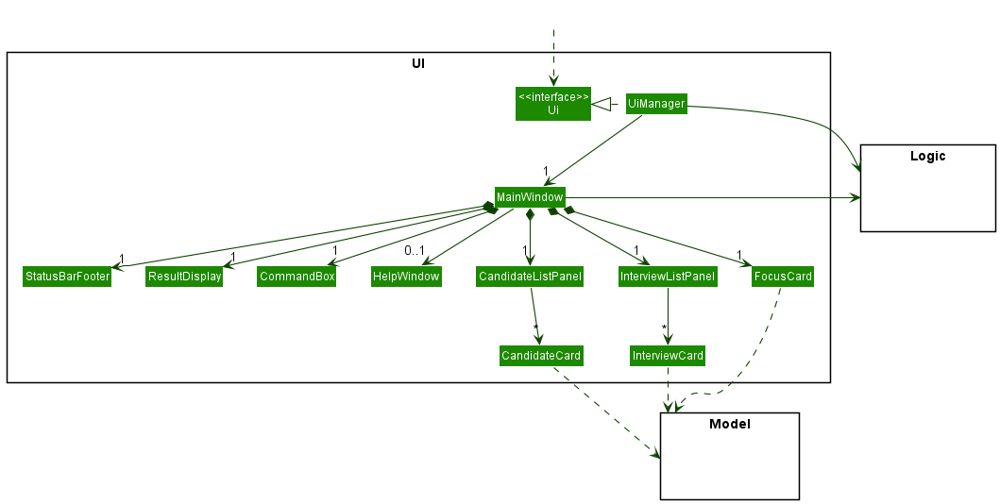
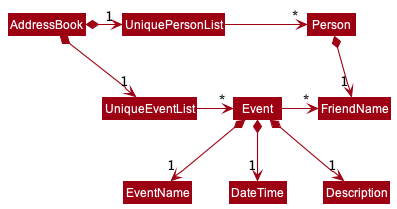

* Table of Contents
{:toc}

--------------------------------------------------------------------------------------------------------------------

## **Acknowledgements**

* {list here sources of all reused/adapted ideas, code, documentation, and third-party libraries -- include links to the original source as well}

--------------------------------------------------------------------------------------------------------------------

## **Setting up, getting started**

Refer to the guide [_Setting up and getting started_](SettingUp.md).

--------------------------------------------------------------------------------------------------------------------

## **Design**

:bulb: **Tip:** The `.puml` files used to create diagrams in this document can be found in the [diagrams](https://github.com/se-edu/addressbook-level3/tree/master/docs/diagrams/) folder. Refer to the [_PlantUML Tutorial_ at se-edu/guides](https://se-education.org/guides/tutorials/plantUml.html) to learn how to create and edit diagrams.

### Architecture

The ***Architecture Diagram*** given above explains the high-level design of the App.

Given below is a quick overview of main components and how they interact with each other.

**Main components of the architecture**

**`Main`** has two classes called [`Main`](https://github.com/AY2122S2-CS2103-F09-2/tp/tree/master/src/main/java/seedu/address/Main.java) and [`MainApp`](https://github.com/AY2122S2-CS2103-F09-2/tp/tree/master/src/main/java/seedu/address/MainApp.java). It is responsible for,
* At app launch: Initializes the components in the correct sequence, and connects them up with each other.
* At shut down: Shuts down the components and invokes cleanup methods where necessary.

[**`Commons`**](#common-classes) represents a collection of classes used by multiple other components.

The rest of the App consists of four components.

* [**`UI`**](#ui-component): The UI of the App.
* [**`Logic`**](#logic-component): The command executor.
* [**`Model`**](#model-component): Holds the data of the App in memory.
* [**`Storage`**](#storage-component): Reads data from, and writes data to, the hard disk.

**How the architecture components interact with each other**

The *Sequence Diagram* below shows how the components interact with each other for the scenario where the user issues the command `delete 1`.

Each of the four main components (also shown in the diagram above),

* defines its *API* in an `interface` with the same name as the Component.
* implements its functionality using a concrete `{Component Name}Manager` class (which follows the corresponding API `interface` mentioned in the previous point.

For example, the `Logic` component defines its API in the `Logic.java` interface and implements its functionality using the `LogicManager.java` class which follows the `Logic` interface. Other components interact with a given component through its interface rather than the concrete class (reason: to prevent outside component's being coupled to the implementation of a component), as illustrated in the (partial) class diagram below.

The sections below give more details of each component.

### UI component

The **API** of this component is specified in [`Ui.java`](https://AY2122S2-CS2103-F09-2/tp/tree/master/src/main/java/seedu/address/ui/Ui.java)

The UI consists of a `MainWindow` that is made up of parts e.g.`CommandBox`, `ResultDisplay`, `PersonListPanel`, `StatusBarFooter` etc. All these, including the `MainWindow`, inherit from the abstract `UiPart` class which captures the commonalities between classes that represent parts of the visible GUI.

The `UI` component uses the JavaFx UI framework. The layout of these UI parts are defined in matching `.fxml` files that are in the `src/main/resources/view` folder. For example, the layout of the [`MainWindow`](https://github.com/AY2122S2-CS2103-F09-2/tp/tree/master/src/main/java/seedu/address/ui/MainWindow.java) is specified in [`MainWindow.fxml`](https://github.com/se-edu/addressbook-level3/tree/master/src/main/resources/view/MainWindow.fxml)

The `UI` component,

* executes user commands using the `Logic` component.
* listens for changes to `Model` data so that the UI can be updated with the modified data.
* keeps a reference to the `Logic` component, because the `UI` relies on the `Logic` to execute commands.
* depends on some classes in the `Model` component, as it displays `Person` and `Event` objects residing in the `Model`.

### Logic component

**API** : [`Logic.java`](https://github.com/AY2122S2-CS2103-F09-2/tp/tree/master/src/main/java/seedu/address/logic/Logic.java)

Here's a (partial) class diagram of the `Logic` component:

How the `Logic` component works:
1. When `Logic` is called upon to execute a command, it uses the `AddressBookParser` class to parse the user command.
1. This results in a `Command` object (more precisely, an object of one of its subclasses e.g., `AddCommand`) which is executed by the `LogicManager`.
1. The command can communicate with the `Model` when it is executed (e.g. to add a person).
1. The result of the command execution is encapsulated as a `CommandResult` object which is returned back from `Logic`.

The Sequence Diagram below illustrates the interactions within the `Logic` component for the `execute("delete 1")` API call.

:information_source: **Note:** The lifeline for `DeleteCommandParser` should end at the destroy marker (X) but due to a limitation of PlantUML, the lifeline reaches the end of diagram.

Here are the other classes in `Logic` (omitted from the class diagram above) that are used for parsing a user command:

How the parsing works:
* When called upon to parse a user command, the `AddressBookParser` class creates an `XYZCommandParser` (`XYZ` is a placeholder for the specific command name e.g., `AddCommandParser`) which uses the other classes shown above to parse the user command and create a `XYZCommand` object (e.g., `AddCommand`) which the `AddressBookParser` returns back as a `Command` object.
* All `XYZCommandParser` classes (e.g., `AddCommandParser`, `DeleteCommandParser`, ...) inherit from the `Parser` interface so that they can be treated similarly where possible e.g, during testing.

### Model component
**API** : [`Model.java`](https://github.com/AY2122S2-CS2103-F09-2/tp/tree/master/src/main/java/seedu/address/model/Model.java)

The `Model` component,

* stores the data for Amigos, primarily through the `Person`, `Log` and `Event` classes. These classes are each contained in their respective `Unique{Object}List` object.
* contains `Insight` classes, which store summary details about friendships, are generated using the current Model data on demand. They are encapsulated within a `PersonInsight` object for each `Person` in Amigos.
* stores the currently 'selected' `Person` objects (e.g., results of a search query) as a separate _filtered_ list which is exposed to outsiders as an unmodifiable `ObservableList<Person>` that can be 'observed' e.g. the UI can be bound to this list so that the UI automatically updates when the data in the list change. This implementation also applies to `Event` objects.
* stores a `UserPref` object that represents the user’s preferences. This is exposed to the outside as a `ReadOnlyUserPref` objects.
* does not depend on any of the other three components (as the `Model` represents data entities of the domain, they should make sense on their own without depending on other components)

:information_source: **Note:** An alternative (arguably, a more OOP) model is given below. It has a `Tag` list in the `AddressBook`, which `Person` references. This allows `AddressBook` to only require one `Tag` object per unique tag, instead of each `Person` needing their own `Tag` objects. 

### Storage component

**API** : [`Storage.java`](https://github.com/AY2122S2-CS2103-F09-2/tp/tree/master/src/main/java/seedu/address/storage/Storage.java)

The `Storage` component,
* can save both address book data and user preference data in json format, and read them back into corresponding objects.
* inherits from both `AddressBookStorage` and `UserPrefStorage`, which means it can be treated as either one (if only the functionality of only one is needed).
* depends on some classes in the `Model` component (because the `Storage` component's job is to save/retrieve objects that belong to the `Model`)

### Common classes

Classes used by multiple components are in the `seedu.addressbook.commons` package.

--------------------------------------------------------------------------------------------------------------------

## **Implementation**

This section describes some noteworthy details on how certain features are implemented.

### 0. Accessing friends by name or by index

To improve CLI comfort, _Amigos_ supports accessing of persons by both index in the list and by name, so that users who know names by heart/can remember indices as they switch between tabs would have an easy time.

This by-index-by-name feature is supported for: 
- Add/Edit/Delete friend
- Add/Edit/Delete log

#### 0.1 Implementation

To support adding logs by the name of a friend or the index in _Amigos_, `ByIndexByNameCommand` is implemented as
a parent class that encapsulates methods useful to find the specified `Person` in the model.

#### 0.2 Main design consideration: in `Model` or `Command`?

There were two main approaches considered to "grouping" the by-index-by-name nature of these commands. The first was to do what we did and use a parent `Command` class to encapsulate the methods,
or to implement methods at the `Model` level. Both have arguments for that are valid. 

Using a parent class was chosen primarily for error handling - having a model-based method of retrieval by name or index would mean that the respective commands would have to handle errors thrown by 
the model. This made less sense (in our view) for two reasons. 

* The first is that the errors occur at command execution time, and it would make most sense to be thrown directly by an object of the command class, so
doing it by the model entailed creating model exception classes, which would be thrown by the model, caught by the command, then thrown again by the command - tedious! 

* The second reason is the duplication of code - each command would individually have to catch and handle and call methods. Seemed unnecessary.

### 1. Friends Feature

#### 1.1 Friends' representation in the model and storage

A friend is a `Person` containing attributes - `FriendName`, `Phone`, `Address`, `Email`, `Description`, `Set<Tag>`
containing a set of `Tag` objects and a `UniqueLogList` containing a list of `Log` objects. Relevant implementations in the 
model and storage follow from it.

#### 1.2 Execution of command for adding, deleting or editing details of a friend

All three (add, edit, delete) friends commands work the same at a high level.

1. `Parser` parses input
2. (Optional) Details wrapped into a `{Type}Descriptor` / `{Type}Person` 
3. `{Type}Command` takes in descriptor and executes with mode

##### 1.2.1 Choice of using descriptor subclasses

As with a general command, the friend-related commands could have put all the logic into the `Command::execute` method.

A conscious choice to use `Descriptor` objects arose from the complexity of editing person details - a lot could be edited, 
and having it all in the `Command::execute` implementation could lead to verbose code.
Having a parser decipher the specific action and wrapping error-handling logic to a `Descriptor` object allowed the
implementation to be clean and easily extendable.

##### 1.2.2 A concrete example: `addfriend`

The implementation of adding a friend into Amigos is facilitated by the `AddCommand`, `AddCommandParser` in the `Logic` component,
`UniquePersonList` and `Person` classes in the `Model` component, and `JsonAdaptedPerson` in the `Storage` component.

Given below is an example usage scenario and how the `Logic` and `Model` components behave at every
step.

1. User keys in a valid `AddCommand` `e.g. addfriend n/John Doe t/Friend` into the command box of the GUI.
2. `AddressBookParser` calls `AddCommandParser::parse` and parses the input.
   - `AddCommandParser::parse` converts the arguments entered by user into `Person` attributes by calling 
       the`ParserUtil`class. It then instantiates a new `Person` with the given attributes returned by `ParserUtil`. 
       (`ParserUtil` checks for the validity of the inputs according to the respective attribute constraints.
       Next, an `AddCommand` is created with the new `Person` passed into it.
3. When `AddCommand::execute` is called, the `Model` component will check if the `Person` to be added already
   exists in Amigos. This check is done using `Model::hasPerson` which ultimately uses `Person::isSamePerson`
   to check if two `Person` are equal by name only. 
4. If no duplicate person exists, then `Model::addPerson` will be called and the newly created `Person` will 
   be set into the `model` and added into the `UniquePersonList`.

A sequence diagram showing the interactions between `AddCommand`, `AddCommandParser`, `ParserUtil` and `model`, 
after the user has entered a valid `FriendName`, `Phone`, and `Email`.

#### 1.3 Storing optional fields in Person as "wrapped" nulls

Minimally, the `AddCommand` requires the user to enter the `FriendName` of the new `Person` to be added using the `n/` prefix. 
The other fields are optional. This is to allow flexibility for the user to add a friend into Amigos even if the user is unsure 
about certain particulars (e.g `Address`/ `Email`) of a friend.

* **Current implementation**
  - To allow this, we place a `null` value into the value of the optional attribute that was not provided by the user.
   For example, if an address is not given, then for the newly created `Person` object `p`, `p.address.value` will be `null`.
  - Whenever a `Person` object is instantiated, we ensure that all the attributes are non-null.
  
* **Alternative implementation**
  - An alternative way is to simply pass `null` directly into the `Person` attributes. For example, if an address is not given,
    then simply make `p.address` to be `null`. 
  - Pros:
    - More convenient and less hassle required to wrap `null` in the value. 
  - Cons:
    - It is error-prone because we would be passing null values around which
    makes the occurrence of exceptions such as `NullPointerException` highly likely.
 
#### 1.4 Setting a duplicate `Person` as a case-insensitive match

Similar to AB3, Amigos prevents a user from adding a duplicate `Person`. 

* **Current implementation**
  - We check whether a `Person` is already in Amigos by `Person::isSamePerson` which makes use of `FriendName::equals`.
    Furthermore, we made `FriendName::equals` case-insensitive, thus disallowing users from adding a person with the same 
    name but in different capitalisation.

* **Alternative implementations** 
  - An alternative way is to define equality of 2 `Person` objects in a stricter way - to make sure that all the attributes
    are the same (not just the `FriendName`) for 2 `Person` objects to be considered as duplicates. This means that more
    checks must be done. 
  - Another alternative way to define equality of 2 `Person` objects would be by using case-sensitive `FriendName`, but
    we decided that our current implementation makes more logical sense. 
  

#### 1.5 Finding friends

##### 1.5.1 Storing the user inputs as attributes, rather than `String`.

* **Current implementation**
    - The user inputs are stored as attributes.
    - Inputs beginning with `n/`, `t/`, `ttl` are converted to `FriendName`, `Tag`, `LogName` respectively.
    - Pros:
       - Each of the `FriendName`, `Tag` , `LogName` inputs would be subject to their respective regex constraints.
       - Any invalid input will throw an error. For example, `findfriend n/!` would throw an error because a `FriendName`
         should only contain alphanumeric characters and spaces.
    - Cons:
       - Overhead required to wrap the user input in their respective objects, and then extracting out their values again
         for the check comparison.
      
* **Alternative implementation**
    - An alternative way would be to store the inputs as `String` without converting them to their respective attributes.
    - Pros:
      - This reduces the amount of code needed, and possible errors due to conversion.
    - Cons:
      - The user would be allowed to search for invalid keywords.

##### 1.5.2 Concrete example of execution: `findfriend`

The implementation of searching for friends in Amigos is facilitated by the `FindCommand`, `FindCommandParser` in the `Logic`
component and `FriendFilterPredicate` class in the `Model` component.

Given below is an example usage scenario and how the `Logic` and `Model` components behave at every step.

1. User keys in a valid `FindCommand` `e.g findfriend n/Alex t/Friend ttl/Dinner` into the command box of the GUI.
2. `AddressBookParser` calls `FindCommandParser::parse` and parses the input.

    - `FindCommandParser::parse` converts the arguments entered by the user into a `FriendFilterPredicate` by
      grouping the user inputs into `Set<FriendName>`, `Set<Tag>` and `Set<LogName>` based on the input prefixes. Next,
      a `FindCommand` is created with the new `FriendFilterPredicate` passed into it.

    - `FriendFilterPredicate::test(Person person)` performs three checks and returns `true` if any of the checks are met:
        - For each name keyword entered by the user, whether the person's name contains the keyword.
        - For each tag keyword entered by the user, whether any of the person's tags contains the keyword.
        - For each log title keyword entered by the user, whether any of the person's log title contains the keyword.

        - When `FindCommand::execute` is called, the `FilteredList<Person>` in `ModelManager` will be updated to only contain
          friends who have passed the predicate test.

An activity diagram showing the implementation of the feature:  

#### 1.6 Show friend

This feature provides users with a way of seeing details of a friend more in depth.

##### 1.6.1 Concrete example of execution: `showfriend`

The implementation of showing a specific friend in Amigos is facilitated by `ShowFriendCommand`, `ShowFriendCommandParser`, and `CommandResult`
in the `Logic`component, as well as `ExpandedPersonCard`, `ExpandedPersonListPanel`, and `MainWindow` in the `UI` component.

Given below is how the different classes work together in an example usage scenario.

1. User keys in a valid `ShowFriendCommand` `e.g showfriend n/Alex Yeoh` into the command box of the GUI.
2. `AddressBookParser` calls `ShowFriendCommandParser::parse` and parses the input, creating a `ShowFriendCommand`.
    - `ShowFriendCommand` extends from `ByIndexByNameCommand` and accepts either an `Index` or a `FriendName` in its constructors
       to identify the particular friend.
3. `ShowFriendCommand` filters the friend list on the GUI to be of length 1, only showing the friend requested by the user.
    It also filters the event list on the GUI to only show upcoming events for the particular friend.
    - A `CommandResult` is returned, with a boolean field `showDetails` in its constructor instantiated to be `True`.
    
4. `MainWindow` switches the view on the GUI to the `ExpandedPersonListPanel` in the Friends tab.
    This is done by calling `StackPane::requestFocus()` and `StackPane::toFront()`, bringing the `ExpandedPersonListPanel`
    to the front.
    As the list panel has already been filtered in `ShowFriendCommand::execute`, only a single `ExpandedPersonCard` 
    would be shown.
    The following are details displayed on the `ExpandedPersonCard`:
    - `FriendName`, `Address`, `Email`, `Phone` 
    - `Description`
    - Upcoming `Event`s related to the friend, wrapped in a `StackPane`
    - All `Log`s of the friend

   An object diagram showing the `ExpandedPersonCard` of a friend named `Alex Yeoh`:
   

##### 1.6.2 Thought process behind switching view from `PersonCard` to `ExpandedPersonCard`

* **Current implementation**
    - Both `PersonListPanel` and `ExpandedPersonListPanel` are superimposed on each other and
      `StackPane::toFront()` is called to bring the selected list to the front based on the command entered by 
      the user.
    - Pros: 
       - User will be able to see all details pertaining to the particular friend in full view.
    - Cons: 
       - Overhead required as both lists are running simultaneously in the foreground/background.
       - May not be extendable to larger features with a large number of lists.

* **Alternative implementation**
    - Have a SplitPane, with the left pane showing the `PersonListPanel` and the right pane showing the
      `ExpandedPersonListPanel`.
    - Pros:
       - Do not have to keep calling `StackPane::toFront()` each time a friend-related command is called.
    - Cons:
       - Have to fill the `ExpandedPersonListPanel` with something to display upon start up.
       - There will be duplicate information on both the left and right pane when `ShowFriend` is called.

### 2. Events Feature

Events in Amigos are implemented in a similar fashion to Persons in AB3, for the sake of consistency in the codebase. Thus, we have a `UniqueEventList` in the `AddressBook`, which is the analogue of `UniquePersonList`. The UI will then refer to a filtered event list contained within `ModelManager` to get the Events to be displayed.

Each event contains a `Name`, `DateTime`, `Description`, and a `FriendName` set. The latter represents the Friends that are linked to this event.

#### 2.1 Implementing Event-Person relationships
Key Consideration: How to implement & maintain the validity of the relationship between `Event` and `Person` objects, since Events contain a list of friends involved.

* **Current Implementation**
  * This relationship is represented by a `FriendName` set that is encapsulated within the `Event` class. (see above diagram)
  * `AddressBook` is responsible for the maintenance of the relationship's validity, since it encapsulates both the `UniquePersonList` and `Unique EventList`. The relationship is maintained by the following processes:
    * The validity of the friend names (i.e. they must always correspond to actual `Person` objects in Amigos) is checked during the creation of and when editing an `Event`.
    * After a `Person` class is edited or deleted, the changes are cascaded to the `FriendName` set as well.
  * Pros:
    * Reduce coupling between the `Event` and `Person` classes by making it a one-way dependency.
    * Reduce dependency further by only storing the `FriendName` object and not the entire `Person` object.
  * Cons:
    * Prone to errors if validity checks are overlooked.
    * Not terribly efficient, because to check validity there is a need to loop through the entire list of `Person` objects for each `FriendName` stored. Similarly, it is inefficient when querying which `Event` objects contain a specific `Person`.
    * Need to either constantly mutate or replace an `Event` to reflect changes to `FriendName`, which can be troublesome.

* **Alternative Implementation**
  * The relationship could alternatively be represented using an association class between `Event` and `Person`. This `EventPersonAssociation` could then be stored in a list in the `AddressBook`.
  * Pros:
    * Improve abstraction and cohesion by storing and handling the details of the Event-Person relationship in a separate class.
    * This allows us to avoid modifications to the `Event` and `Person` classes, and reduce coupling between them as the dependency is one-way from the `EventPersonAssociation` class.
  * Cons:
    * Additional overhead as new class(es) will have to be created and tested.
    * Does not solve the error-proneness of maintaining the relationship validity after changes to `Event` or `Person`.
    * If implemented using a `EventPersonAssociation` list, will not be very efficient as well when making queries/changes,especially if there are a large number of associations in the list

#### 2.2 Notes about implementing `listevent`

Key Consideration: How to implement `listevents` when there exists multiple tabs and other `show` commands such as `listfriends` and `showinsights`.

The following sequence diagram summarizes what happens when a user executes the `ShowEventsCommand`, the sequence diagram is similar for the other types of `show` commands which exist in Amigos.

* **Current Implementation**
  * Using a `FilteredList` we are able to segregate events into past events and future events and display these events according to user's preference, this is largely similar to AB3's implementation of `list`, however we need to add the ability to automatically change tabs once this command is called, thus the `CommandResult` class was modified to contain a boolean `isEvent` which is `true` for any command related to events and enables the seamless switching between tabs.
  * Pros
    * Allows for easy traversal between the Friends, Events and insights tab.
    * It is easily extendable, for any new features we simply need to add a boolean which represents that feature, and create an overloaded constructor to initialize that variable to `true`
    * Enforces the abstraction barrier between the UI component and Logic component
  * Cons
    * Although easily extendable, to ensure backward compatibility we need to ensure that the old constructor initialize the boolean for this new feature as `false`
    * If many features are added, can lead to many overloaded constructor which will make the entire `CommandResult` class convoluted

* **Alternate Implementation**
  * We can implement a check in `MainWindow` which uses switch cases to detect which command is executed and accordingly switch tabs. The implementation of the representation of `Events` using a `FilteredList` remains the same.
  * Pros
    * This is very similar to the implementation in `AddressBookParser`, it easily extendable, as we simply need to add new switch statements for new features and commands
  * Cons
    * Violates the Law of Demeter as the UI does not need to know exactly which command is executed, it simply needs to know whether to switch tabs to event or not
    * Increases the coupling between the `Commands` classes and the `MainWindow` since now we need to add a new switch case for every new command created.
    * Involves a lot of code duplication as well
    
#### 2.3 Notes about implementing the `findevent` command
Key Consideration: Keeping track of the various filtering conditions that could be potentially set by the user, so that it is easily maintained and extended.

* **Current Implementation**:
  * The `FindEventCommandParser` class takes in the user's input and produces a List containing all the `Predicate<Event>` that can be derived from the input.
  * Each predicate type implements the `Predicate<Event>` interface in its own class. e.g. `EventDateIsBeforePredicate`
  * This list of `Predicate<Event>` is then passed to the `FindEventCommand` class via its constructor, and it will later filter the event list accessed by the UI based on all the given predicates.
  * The sequence diagram shows how this process is carried out (with unnecessary details omitted) given two filtering conditions - by event name and by event date
  * Pros:
    * Easy to add new predicates and modify existing ones
  * Cons: 
    * A bit of extra overhead in code, as we need to create a class for each predicate to override the equals() method, which is needed in testing.
    
* **Alternative Implementation**:
  * Create a single class that acts as a predicate for all possible filtering conditions i.e. an `EventFilterPredicate`.
  * The `FindEventCommandParser` will instead initialize this predicate class and pass it on to the `FindEventCommand` class which will use it to filter the list.
  * Pros: Less overhead because we only need to create a single predicate class for filtering the Event list.
  * Cons:
    * Violates both Separation of Concerns and the Single Responsibility Principle
    * Harder to test due to increased complexity of the single predicate class
    * Decreased modularity means it is harder to modify and extend in the future e.g. if we wanted to add more filtering conditions

### 3. Logs Feature

_Amigos_ supports logs, via `addlog`, `deletelog` and `editlog` features.

In this section we will go through the high-level design details and notes to take about the implementation for these features.

#### 3.1 Log's representation in the model and storage

1. In the model, `Person` now has an additional `UniqueLogList` field encapsulating some number
   of `Log` objects. 

2. 'JsonAdaptedLog' objects are used to save `Log` objects to json format, in an implementation analogous to that of
   'JsonAdaptedTag'.

#### 3.2 Execution of a log-related command 

All three (add, edit, delete) log commands work the same at a high level. 

1. `Parser` parses input
2. Details wrapped into `{Type}LogDescriptor`
3. `{Type}LogCommand` takes in descriptor and executes with model

##### 3.2.1 Choice of using descriptors
As with a general command, the log-related commands could have put all the logic into the `Command::execute` method. 

A conscious choice to use `Descriptor` objects arose from the complexity of the features, as users had multiple permutations 
that were possible. e.g. `deletelog` allows a user to delete all logs, delete a specifc log, or all logs of a user. 
Having a parser decipher the specific action and wrapping error-handling logic to a `Descriptor` object allowed the 
implementation to be clean and easily extendable.

##### 3.2.2 A concrete example: `addlog`

Given below is an example usage scenario and how the `Logic`, `Model` and `Storage` components behave at every
step. In particular, take note how the parent `ByIndexByNameCommand` is involved.

1. User keys in a valid `addlog` command.`e.g. addlog JOHN DOE ttl/some log title`
2. `AddressBookParser` calls `AddLogCommandParser::parse` and parses the input.
    1. `AddLogCommandParser::parse`wraps the log title and (optional) log description into an `AddLogDescriptor` object
       and instantiates a new `AddLogCommand` object with it.
3. When `AddLogCommand::execute` is called, the parent method `getPersonByName` or `getPersonByIndex` is called,
   returning the specified `Person` object.
    1. `AddLogCommand::createAddedLogPerson` is called, which calls `AddLogCommandDescriptor::getLogsAfterAdd`, and the
       latter takes the specified person and duplicates him, instantiates a new `Log` and appends it to the existing list,
       before returning it.
    2. Then the new `Person` object with the new `Log` is set in the `model`.

A sequence diagram shows, clearly, the interactions between `AddLogCommand`, `AddLogCommandParser`, `AddLogDescriptor` and `model`.

#### 3.3 Some considerations in designing Log's representation

**Aspect: How should `Log` objects should be implemented in `Amigos`?**
* **Alternative 1 (current choice):** Store `Log` objects inside a `List`, inside a `Person`.
    * Pros: Easy to implement, intuitive, easy to maintain and test.
    * Cons: Downstream features such as `find` applied to logs may be more tedious, having to iterate through all `Person` objects.
* **Alternative 2:** Store `Log` objects inside a `List`, in some global data field part of the `AddressBook`.
    * Pros: Easier access to logs, since searching through a unified list in a single location.
    * Cons: Tedious to implement and maintain, higher degree of coupling.
* **Resolution:** Alternative 1 was chosen since no "global" level features e.g. logs tied to events were on the horizon.

**Aspect: Uniqueness of a `Log` object**
* Intuitively, it makes sense that a `Log` has a title and description.
* **Alternative 1 (current choice):** No two logs can have the same title (case-sensitive).
    * Pros: Easy to implement, intuitive, easy to maintain and test.
    * Cons: Some users may want logs with the same title, but different descriptions.
* **Alternative 2:** No two logs can have the same title and same description
    * Pros: Stricter notion of equality that makes intuitive sense.
    * Cons: Checks for uniqueness require two degrees of checking, and user is less likely to be able to
      look at and find logs easily.
* **Resolution:** Alternative 1 was chosen since at the end of the day, so long as a user can distinguish two logs
it is functional. So we consider logs duplicates if they have the same title case-sensitively.

### 4. Tabs Feature

Key consideration: How to display information about Friends, Events and insights

* **Current Implementation**
  * Since our application had three primary classes Friends, Events and Insights we needed to be able to view instances of all of these classes without the GUI being cluttered with details. Thus, we decided to implement a Tab Pane with one tab for each of our features.
  * Pros
    * All the features displayed in an organised fashion, since each feature is represented by their own tabs.
    * It is highly extendable, any new feature can easily be incorporated by the addition of new tabs
    * It is very intuitive, allowing user to change their view by clicking on the tab they wish to view (Interactive)
    * Aesthetically pleasing
  * Cons
    * Changing of tabs can create issues with updating of lists
    * Increases complexity of GUI

* **Alternate Implementation**
  * Superimpose all the scenes for each feature and call `requestFocus()` to bring the specific feature we want to observe to the forefront.
  * Pros
    * Easy implementation
  * Cons
    * Can get messy very fast, since the fxml doc will have multiple `FeaturePlaceHolders` on top of each other
    * Not easily extendable, only suitable for a few features
    * Can get very cluttered

The following images show how the Tabs feature look when the tab for each feature is selected.

  

--------------------------------------------------------------------------------------------------------------------

## **Documentation, logging, testing, configuration, dev-ops**

* [Documentation guide](Documentation.md)
* [Testing guide](Testing.md)
* [Logging guide](Logging.md)
* [Configuration guide](Configuration.md)
* [DevOps guide](DevOps.md)

--------------------------------------------------------------------------------------------------------------------

## **Appendix: Requirements**

### Product scope

**Target user profile**:

* tech-savvy university students
* prefer desktop apps over other types
* can type fast and has plenty of experience with CLI application
* is often busy and struggles to manage important details about their relationships

**Value proposition**: The program will help busy university students to manage their friendships by keeping track of important details. An example of possible features include the tracking of birthdays, money owed, upcoming meetings etc. and providing relevant reminders, in addition to basic functionalities.

### User stories

Priorities: High (must have) - `* * *`, Medium (nice to have) - `* *`, Low (unlikely to have) - `*`

| Priority | As a …​         | I want to …​                                                                    | So that I can…​                                                                                  |
|----------|-----------------|---------------------------------------------------------------------------------|--------------------------------------------------------------------------------------------------|
| `* * *`  | User            | add new friends                                                                 | keep track of any new friends I make                                                             |
| `* * *`  | User            | remove friends I am no longer in contact with                                   | keep my friends list updated and remove irrelevant contacts                                      |
| `* * *`  | User            | view all details, descriptions and logs that I previously wrote about my friend | do a quick recap of important details about my friend                                            |
| `* * *`  | User            | view all my friends                                                             | ensure that the information I have added is saved and check all of my friends' details           |
| `* * *`  | User            | add events relating to my friends                                               | keep track of any future events                                                                  |
| `* * *`  | User            | remove an event                                                                 | cancel events previously added to keep my event list updated                                     |
| `* * *`  | User            | review my upcoming events along with their relevant details                     | take note and be prepared for them                                                               |
| `* * *`  | Forgetful user  | add descriptions and logs about my friends that I would like to remember        | not stress about remember these details for the next time we meet                                |
| `* * *`  | User            | remove a previous log recorded about a friend                                   | clear irrelevant details about my friend                                                         |
| `* *`    | User            | update details about friends                                                    | keep my friends list up-to-date                                                                  |
| `* *`    | User            | update details of events                                                        | correct outdated or wrong information entered about any event                                    |
| `* *`    | User            | update previous logs recorded about a friend                                    | ensure that information about my friend is up-to-date and accurate                               |
| `* *`    | Organized User  | tag friends under different categories                                          | better classify and organise my friend circle                                                    |
| `* *`    | User            | find specific friends using a keyword search                                    | view the friend I want to check out efficiently instead of scrolling through the list of friends |
| `* *`    | Forgetful User  | use a keyword search to find a note written about someone                       | find out who I spoke to about a certain issue                                                    |
| `* *`    | User            | view upcoming events tied to a specific friend                                  | take note and be prepared for specific events                                                    |
| `* *`    | User            | find specific events using certain search criteria                              | view the specific event(s) I want to see efficiently and flexibly                                |
| `* *`    | Reflective user | look at summary statistics about my friendships                                 | reflect about how well my friendships are doing                                                  |
| `* *`    | New User        | access a help page                                                              | learn how to use certain commands I am unfamiliar with                                           |
| `* *`    | New User        | reset the application to its default state                                      | properly experiment with the application before using it properly                                |
| `* *`    | Seasoned User   | shorten command lengths                                                         | increase my efficiency while using this application                                              |
| `*`      | Careless User   | undo a command                                                                  | revert back accidental commands                                                                  | 
| `*`      | Seasoned User   | chain commands                                                                  | reduce the number of commands I need to type thereby increasing efficiency                       |
| `*`      | New User        | know which features of the application I am not using as often                  | fully utilise the application to its maximum capability                                          | 

### Use cases

(For all use cases below, the **System** is the `Amigos` and the **Actor** is the `user`, unless specified otherwise)

**Use case: F01 - Add a friend**

**Guarantees** 
* A new friend will be added into Amigos only if there does not already exist a friend with the same name in it.

**MSS**

1. User requests to add a friend.
2. Amigos proceeds to add the friend.
3. Amigos clears the user input.

   Use case ends. 

**Extensions**
* 1a. A friend with the same name already exists in Amigos.
    * 1a1. Amigos displays the existing friend with the same name and the corresponding error message.

    Use case ends

**Use case: F02 - Edit a friend**

**Guarantees**
* The field(s) of an existing friend will be updated only if the user input is valid.

**MSS**

1.  User requests to list friends.
2.  Amigos shows a list of friends.
3.  User requests to edit details of a specific friend in the list.
4.  Amigos edits the details of the friend accordingly and clears user input.

    Use case ends.

**Extensions**

* 2a. The list is empty.
    * Use case ends.

* 3a. No name or index is entered by the user.
    * 3a1. Amigos requests user to enter a name or index.
    * 3a2. User reenters the command along with a valid name or index and other relevant fields (at least one) to edit.

  Use case resumes at step 4 if newly-entered user input is valid, otherwise it may reach 3a/3b/3c again.

* 3b. Amigos finds no contact with the given name or invalid index is given.
    * 3b1. Amigos requests user to check input and reenter.
    * 3b2. User reenters the command along with a valid name or index and other relevant fields (at least one) to edit.

  Use case resumes at step 4 if newly-entered user input is valid, otherwise it may reach 3a/3b/3c again.

* 3c. A valid name or index is entered by user but no fields to edit are given.
    * 3c1. Amigos requests user to enter at least one field to edit.
    * 3c2. User reenters command and name or index, along with at least one field to edit.

  Use case resumes at step 4 if newly-entered user input is valid, otherwise it may reach 3a/3b/3c again.

**Use case: F03 - Delete a friend**

**Guarantees** 
* An existing friend in Amigos will be deleted only if the name input matches that of an existing friend in Amigos
  or a valid index is provided.

**MSS**

1.  User requests to list friends.
2.  Amigos shows a list of friends.
3.  User requests to delete a specific friend in the list.
4.  Amigos deletes the friend and clears the user input.

    Use case ends.

**Extensions**

* 2a. The list is empty.
    * Use case ends.

    
* 3a. No name or index is entered by the user. 
   * 3a1. Amigos shows an error message showing the correct command format.
   * 3a2. User reenters the command along with a valid name or index.
     
   Use case resumes at step 4 if newly-entered user input is valid, otherwise it may reach 3a/3b/3c again. 

* 3b. Amigos finds no contact with the given name.
    * 3b1. Amigos throws an error message that the name entered is invalid.
    * 3b2. User reenters the command along with a valid name. 

    Use case resumes at step 4 if newly-entered user input is valid, otherwise it may reach 3a/3b/3c again.

* 3c. An invalid index is provided.
    * 3c1. Amigos throws an error message that the index entered is invalid.
    * 3c2. User reenters the command along with a valid index.

  Use case resumes at step 4 if newly-entered user input is valid, otherwise it may reach 3a/3b again.

**Use case: F04 - Checking details of a friend**

**MSS**

1. User requests to see all friends in Amigos.
2. Amigos switches the GUI to the friends tab and shows all friends.
3. User requests to view full details of a particular friend.
4. Amigos displays a page containing the full details of that particular friend.

Use case ends

**Extensions**
* 3a. The friend does not exist.
    * 3a1. Amigos shows an error message.

      Use case ends
  

* 3b. Amigos detects an issue in the input (e.g. incorrect input format)
    * 3b1. Amigos displays the error feedback to the user.
    * 3b2. User reenters command with a valid input. 
  
      Use case resumes at 4 if newly-entered user input is valid, otherwise it may reach 3a/3b again.

**Use case: F05 - Finding a friend**

**MSS**

1. User requests to list friends.
2. Amigos shows a list of friends.
3. User enters search keyword(s) to find a specific friend/friends based on name/tags/log titles.
4. Amigos displays a list containing friends who match at least one of the keyword(s) entered by user.

Use case ends

**Extensions**

* 3a. User enters invalid keywords.
    * 2a1. Amigos throws an error message and requests user to check input.
    * 2a2. User corrects command, and keys in edited command.

  Use case resumes at step 4 if newly-entered command is valid.

**Use case: L01 - Adding a new log to a friend**

**Guarantees:**
* If successful, log will be added to friend details and saved in storage.

**MSS**

1. User decides to add a new log to a specific friend. 
2. User keys in necessary details.
3. Amigos adds the log to the friend.

    Use case ends.

**Extensions**

* 2a. Amigos finds no friend with the given name or index.
  * 2a1. Amigos requests user to check input and reenter.
  * 2a2. User corrects command, and keys in edited command.

  Use case resumes at step 3.

* 2b. Amigos detects that an invalid format of the command has been keyed in.
  * 2b1. Amigos clears the input and prompts the user with potential corrections, and requests for input.
  * 2b2. User corrects command, and keys in edited command.
  
  Use case resumes at step 3.
  

**Use case: L02 - Editing a log of a single friend**

**Guarantees:**
* If successful, specified log will be overwritten and saved in storage.

**MSS**

1. User decides to edit a log in a specific friend. 
2. User keys in necessary details. 
3. Amigos edits the specific log of the friend.

    Use case ends.

**Extensions**

* 2a. Amigos finds no friend with the given name or index.
    * 2a1. Amigos requests user to check input and reenter.
    * 2a2. User corrects command (if desired), and keys in edited command.

  Use case resumes at step 3.

* 2b. Amigos detects that the user has not requested to edit a specific log.
  * 2b1. Amigos clears the input and provides a list of all logs (their titles) and an accompanying index, asking the user to key in the index.
  * 2b2. User keys in the index.

  Use case resumes at step 3.

* 2c. Amigos detects that an invalid format of the command has been keyed in.
    * 2c1. Amigos clears the input and prompts the user with potential corrections, and requests for input.
    * 2c2. User corrects command, and keys in edited command.

    Use case resumes at step 3.

* 2d. Amigos detects that the requested friend has no logs to be edited.
    * 2d1. Amigos throws an error message saying that the log does not exist.

  Use case ends.

**Use case: L03 - Deleting a log/logs from a friend**

**Guarantees:**
* If successful, log will be deleted from friend and reflected in storage.

**MSS**

1. User decides to delete a log/logs in a specific friend.
2. User keys in necessary details.
3. Amigos clears the input and provides feedback of deletion success.

   Use case ends.

**Extensions**

* 2a. Amigos finds no friend with the given name or index.
    * 2a1. Amigos throws an error message saying that name or index is invalid.
    * 2a2. User corrects command (if desired), and keys in edited command.

  Use case resumes at step 3.

* 2b. Amigos detects User has requested to delete all logs of all friends.
  * 2b1. All logs in all friend are deleted.

  Use case resumes at step 3.

* 2c. Amigos detects that User has requested to delete all logs of a friend.
  * 2c1. Amigos deletes all logs of the friend.

  Use case resumes at step 3.

* 2d. Amigos detects an invalid combination of arguments.
  * 2d1. Amigos clears the input and requests the user to check input and reenter if necessary.

* 2e. Amigos detects that the requested friend has no logs.
    * 2e1. Amigos clears the input and notifies the user that this friend has no logs to be deleted.

  Use case ends.

**Use Case: E01 - Adding a new event**

**Preconditions**: User can remember the event details they want. (e.g. names of friends to add)

**Guarantees**: A new event will be created in Amigos, as long as the command was executed successfully.

**MSS**:
1. User chooses to add a new event, entering the details accordingly.
2. System applies the change and reflects the new event details to the user.
3. System clears the user input.

   Use case ends.

**Extensions**:
* 1a. System detects an issue in the given input. (e.g. missing/wrong flag, wrong formatting)
    * 1a1. System displays the error feedback to the user. 
    * 1a2. User edits and resends the input to the system. 
    
  Use case resumes at 1 but may reach 1a again if the input remains erroneous.

* 1b. System detects that an event with the same details already exists. 
  * 1b1. System displays the duplicate event to the user and the corresponding error message. 
  * 1b2. User cancels the operation.

  Use case ends.

* 3a. User realises they made a mistake in the event details. 
  * 3a1. User <u>edits the event details (E02)</u>.
  
  Use case ends.
       
**Use Case: E02 - Editing an existing event**
   
**Preconditions**: The event has already been created, and the user can remember what they want to change the event details to.
   
**Guarantees**: An existing event will be edited, as long as the command is executed successfully.
   
**MSS**:
   1. User chooses to search for the details of a specific event.
   2. System shows the search results to the user.
   3. User edits the details of an existing event through the system input.
   4. System applies the change and reflects the updated event details to the user.
   5. System clears the user input.

      Use case ends.
   
**Extensions:**
   * 3a. System detects an issue in the given input (e.g. missing/wrong flag, wrong formatting).
     * 3a1. System displays the error feedback to the user.
     * 3a2. User resends the command to the system.
     
     Use case resumes at 3 but may reach 3a again if the command remains erroneous.
     

   * 3b. System detects that an event with the same details already exists. 
     * 3b1. System displays the duplicate event to the user and the corresponding error message. 
     * 3b2. User cancels the operation.
     
     Use case ends.

**Use case: E03 - Checking upcoming events**

**Guarantees**

* If any upcoming events exist within the system they will be displayed.

**MSS**

1. User requests to show all upcoming events.
2. Amigos switches the GUI to the events tab and displays all the upcoming events.
    
   Use case ends.

**Extensions**

* 1a. User requests to show all events, both past and upcoming. 
    * 1a1. Amigos switches the GUI to the events tab and displays all stored events.
    
    Use case ends.

* 2a. There are no events to show.
    * 2a1. Amigos displays an empty interface.
    
    Use case ends.

**Use case: E04 - Finding events**

**MSS**

1. User requests to list events.
2. Amigos shows a list of events.
3. User enters search keyword(s) to find a specific event(s) based on the event name / date / friends 
   involved in the event.
4. Amigos displays a list of events matching all the keyword(s) entered by user.

Use case ends

**Extensions**

* 3a. User enters invalid keywords.
    * 2a1. Amigos throws an error message and requests user to check input.
    * 2a2. User corrects command, and keys in edited command.

Use case resumes at step 4 if newly-entered command is valid.

**Use case : S01 - Show insights**

**Guarantees**

* Insights (number of logs and number of events) of each friend would be displayed.

**MSS**

1. User requests view insights of all friends in Amigos.
2. Amigos switches the GUI to the Insights tab and displays all statistics.

   Use case ends.

**Extensions**

* 2a. There are no friends to show insights of.
    * 2a1. Amigos displays an empty interface.

  Use case ends.

### Non-Functional Requirements

1. Should work on any _mainstream OS_ as long as it has Java `11` or above installed.
2. Should be able to hold up to 200 friends with up to 100 events/logs per person without a noticeable sluggishness in performance for typical usage (time taken to process any one command is 1 second at most).
3. A user with above average typing speed for regular English text (i.e. not code, not system admin commands) should be able to accomplish all the basic tasks faster using commands than using the mouse.
4. The project only supports managing of the user friendships and not other types of relationships.
5. The application should work with different screen sizes, resolutions and window sizes (minimum resolution is 600x450).

### Glossary

* **Mainstream OS**: Windows, Linux, Unix, OS-X
* **Log**: Details of interaction between user and friend
* **Event**: Upcoming meeting/ date of significance for a friend
* **Insight**: Some summary statistic(s) about a friend

--------------------------------------------------------------------------------------------------------------------

## **Appendix: Instructions for manual testing**

Given below are instructions to test the app manually.

:information_source: **Note:** These instructions only provide a starting point for testers to work on;
testers are expected to do more *exploratory* testing.

### Launch and shutdown

1. Initial launch

   1. Download the jar file and copy into an empty folder

   2. Double-click the jar file  Expected: Shows the GUI with a set of sample friends. The window size may not be optimum.

1. Saving window preferences

   1. Resize the window to an optimum size. Move the window to a different location. Close the window.

   1. Re-launch the app by double-clicking the jar file. 
       Expected: The most recent window size and location is retained.

### Friend management

#### Adding a friend

1. Adding a friend while all friends are being shown
    1. Test case: `addfriend n/John Doe p/92402912 e/johndoe@example.com`  
       Expected: a new entry in the `Friends` tab with the name `John Doe`, phone number `92402912` and email `johndoe@example.com` should appear.
    2. Test case: `addfriend n/John& Doe`  
       Expected: an error message regarding incorrect name format should be displayed
    3. Test case: `addfriend p/942142412 n/Jane Doe`  
       Expected: Order of arguments does not matter, command should create a friend `Jane Doe` with the phone number `942142412`.

2. Adding a friend while in another tab
    1. Prerequisites: Must be in either `Events` or `Insights` tab.
    
    2. Test case: `addfriend n/Jennifer Doe`  
       Expected: Tab should switch to `Friends` tab and a new friend `Jennifer Doe` should be present in the friends list.

#### Deleting a friend

1. Deleting a friend while all friends are being shown

   1. Prerequisites: List all persons using the `listfriend` command. Multiple friends in the list.

   2. Test case: `deletefriend 1` 
      Expected: First friend is deleted from the list. Details of the deleted contact shown in the status message.

   3. Test case: `deletefriend 0` 
      Expected: No friend is deleted. Error details shown in the status message. Status bar remains the same.

   4. Other incorrect delete commands to try: `deletefriend`, `deletefriend x`, `...` (where x is larger than the list size) 
      Expected: Similar to previous.

#### Editing a friend

1. Editing a friend while all friends are being shown
   1. Prerequisites: At least 3 friends present, with one their names being `Alex Yeoh`

   2. Test case: `editfriend cn/Alex Yeoh nn/Alex Row d/Best friend`  
      Expected: Friend with the name `Alex Yeoh` edited to have a new name `Alex Row` and a new description `Best friend`
   
   3. Test case: `editfriend 2 nn/Barney Smith t/Cartoon`  
      Expected: Friend with index `2` in the friend list is edited to have a new name `Barney Smith` and all tags are replaced with `Cartoon`.

   4. Test case: `editfriend 3 cn/Alex Yeoh p/29529592`  
      Expected: Error message stating that either a name is provided or an index, but not both.
   
#### Finding a friend

1. finding a friend while all friends are being shown
    1. Prerequisites: At least 3 friends present, with one their names being `Alex Row`, one of them having a tag `colleagues` and one of them having a log titled `Dinner`

    2. Test case: `findfriend n/Alex Row`  
       Expected: Contacts whose names contain the substring `Alex Row` are displayed

    3. Test case: `findfriend ttl/Dinner`  
       Expected: Contacts whose log titles contain the substring `Dinner` are displayed

    4. Test case: `findfriend t/colleagues`  
       Expected: Contacts whose tags contain `colleagues` is displayed

    5. Test case: `findfriend n/Alex Row ttl/Dinner t/colleagues`  
       Expected: All the above 3 contacts are displayed

### Log management

#### Adding a log

1. Adding a log while all friends being shown
   1. Prerequisites Atleast 1 friend present

   2. Test case: `addlog n/Alex Row ttl/Dinner`  
      Expected: Log added to `Alex Row`, GUI updated to display log title
   
   3. Test case: `addlog 1 ttl/Bday`  
      Expected: Log added to friend in index 1, GUI updated to display log title as well

   4. Test case: `addlog 1 n/Alex Row ttl/Event_Log`  
      Expected: Error either the name is provided or the index, not both
   
#### Deleting a log

1. Deleting a log from a friend while all friend are being shown

    1. Prerequisites: List all persons using the `listfriend` command. Multiple friends in the list, log must be present to delete

    2. Test case: `deletelog n/Alex Row id/1` 
       Expected: Alex Row's first log is deleted

    3. Test case: `deletelog 1 id/1` 
       Expected: The first log of the friend who is at index 1 is deleted

    4. Other incorrect delete commands to try: `deletelog 1 n/Alex Row id/1`, `deletelog 1 id/x`, `...` (where x is larger than the list size) 
       Expected: Error message provided for incorrect format or, incorrect index provided.

#### Editing a log

1. Editing a friend's log while all friends are being shown
    1. Prerequisites: Atleast two friends each with a log is present.

    2. Test case: `editlog n/Alex Yeoh id/1 ttl/New Log Title`  
       Expected: `Alex Yeoh`'s first log's title is changed to `New Log description`

    3. Test case: `editlog 2 id/1 d/The new description`  
       Expected: First log's description of friend at index `2` in the friend list is edited to have a description `New Log description`
    
### Event management

#### Adding an event

1. Adding an event while all upcoming events are being shown
    1. Test case: `addevent n/Old Event dt/14-04-2020 1600`  
       Expected: No change in the GUI as the event is past event, although if `listevent -a` is run this event should be visable.
    2. Test case: `addevent n/Future Event dt/14-04-2023 1300`  
       Expected: GUI should be updated with a new event called `Future Event`
    3. Test case: `addfriend n/Date Check dt/99-04-2023 1240`  
       Expected: Error message should be displayed concerning the incorrect format of date.

2. Adding an event while in another tab
    1. Prerequisites: Must be in either `Friends` or `Insights` tab.

    2. Test case: `addevent n/Party dt/14-04-2023 1400 d/Cool party`  
       Expected: Tab should switch to `Events` tab and a new event `Party` should be present in the events list.

#### Deleting an event

1. Deleting an event while all events are being shown

    1. Prerequisites: List all events using the `listevents` command. Multiple events in the list.

    2. Test case: `deletevent 1` 
       Expected: First event is deleted from the list. Details of the deleted event shown in the status message.

    3. Test case: `deletefriend 0` 
       Expected: No event is deleted. Error details shown in the status message. Status bar remains the same.

    4. Other incorrect delete commands to try: `deleteevent`, `deleteevent x`, `...` (where x is larger than the list size) 
       Expected: Similar to previous.

#### Editing an event

1. Editing an event while all events are being shown

    1. Prerequisites: Atleast 3 events present, with one their names being `Birthday`

    2. Test case: `editevent 1 n/Alex's Birthday d/Alex's 26th birthday`  
       Expected: Event at index 1 is changed to have the name `Alex's Birthday` and description `Alex's 26th birthday`

    3. Test case: `editevent 1 af/Alex Yeoh rf/Bernice Yu`  
       Expected: `Alex Yeoh` is added to the first event and `Bernice Yu` is removed from the first event.

    4. Test case: `editevent x n/New Event Title` (where x is larger than the list size)  
       Expected: No event edited, index error message provided.

#### Finding an event

1. finding an event while all events are being shown
    1. Prerequisites: Atleast 3 events present, with one their names being `Birthday`, one of them having a friend `Alex Row` and one of having a starting date of `10-03-2022`

    2. Test case: `findevent n/Birthday`  
       Expected: Events whose names contain the substring `Birthday` are displayed

    3. Test case: `findevent f/Alex Row`  
       Expected: Events whose friends contain `Alex Row` are displayed

    4. Test case: `findevent ds/10-03-2022`  
       Expected: Events which occur on `10-03-2022` and after are displayed,
   
    5. Test case: `findevent n/Birthday f/Alex Row  ds/10-03-2022`  
       Expected: All the events matching the above predicates are displayed

### Saving data

1. Dealing with corrupted data files

   1. To test whether `Amigos` can detect corrupted data files, navigate to the data folder of `Amigos`.
      and modify some data in `addressbook.json` to be invalid. For example, change an email to be of an invalid format (e.g `alexyeoh@e`).
   2. Upon running `Amigos` after editing `addressbook.json`, `Amigos` should start without any data in it due to the error.
   3. To revert `Amigos` back to its previous state, reopen `addressbook.json` and undo the edits made in step 1, or alternatively delete the `addressbook.json` to initialise a template `addressbook.json`.

