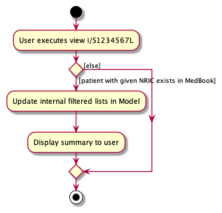

## **Table of Content**
- [**Acknowledgements**](#acknowledgements)
- [**Setting up, getting started**](#setting-up-getting-started)
- [**Design**](#design)
  - [Architecture](#architecture)
  - [UI component](#ui-component)
  - [Logic component](#logic-component)
  - [Model component](#model-component)
  - [Storage component](#storage-component)
  - [Common classes](#common-classes)
- [**Implementation**](#implementation)
  - [Dynamic Ui Rendering](#dynamic-ui-rendering)
    - [Design Consideration](#design-consideration)
    - [Implementation](#implementation-1)
  - [Create](#create)
    - [Design Consideration](#design-consideration-1)
    - [Implementation](#implementation-2)
    - [Usage](#usage)
  - [View](#view)
    - [Design Consideration](#design-consideration-2)
    - [Implementation](#implementation-3)
    - [Usage](#usage-1)
  - [Safe Delete](#safe-delete)
    - [Design Consideration](#design-consideration-3)
    - [Implementation](#implementation-4)
    - [Usage](#usage-2)
      

  - [Find](#find)
    - [Design Consideration](#design-consideration-4)
    - [Implementation](#implementation-5)
    - [Usage](#usage-3)
  - [Summary](#summary)
    - [Design Consideration](#design-consideration-5)
    - [Implementation](#implementation-6)
    - [Usage](#usage-4)
- [**Documentation, logging, testing, configuration, dev-ops**](#documentation-logging-testing-configuration-dev-ops)
- [**Appendix: Requirements**](#appendix-requirements)
  - [Product scope](#product-scope)
  - [User stories](#user-stories)
  - [Use cases](#use-cases)
  - [Non-Functional Requirements](#non-functional-requirements)
  - [Glossary](#glossary)
- [**Appendix: Instructions for manual testing**](#appendix-instructions-for-manual-testing)
  - [Launch and shutdown](#launch-and-shutdown)
  - [Deleting a person](#deleting-a-person)
  - [Saving data](#saving-data)

---

## **Acknowledgements**

* [Encrypting and Decrypting Files in Java](https://www.baeldung.com/java-cipher-input-output-stream) from Baeldung

---

## **Setting up, getting started**

Refer to the guide [_Setting up and getting started_](SettingUp.md).

---

## **Design**

:bulb: **Tip:** The `.puml` files used to create diagrams in this document can be found in the [diagrams](https://github.com/AY2122S2-CS2103T-T11-1/tp/tree/master/docs/diagrams) folder. Refer to the [_PlantUML Tutorial_ at se-edu/guides](https://se-education.org/guides/tutorials/plantUml.html) to learn how to create and edit diagrams.

### Architecture

The ***Architecture Diagram*** given above explains the high-level design of the App.

Given below is a quick overview of main components and how they interact with each other.

**Main components of the architecture**

**`Main`** has two classes called [`Main`](https://github.com/AY2122S2-CS2103T-T11-1/tp/blob/master/src/main/java/seedu/address/Main.java) and [`MainApp`](https://github.com/AY2122S2-CS2103T-T11-1/tp/blob/master/src/main/java/seedu/address/MainApp.java). It is responsible for,
* At app launch: Initializes the components in the correct sequence, and connects them up with each other.
* At shut down: Shuts down the components and invokes cleanup methods where necessary.

[**`Commons`**](#common-classes) represents a collection of classes used by multiple other components.

The rest of the App consists of four components.

* [**`UI`**](#ui-component): The UI of the App.
* [**`Logic`**](#logic-component): The command executor.
* [**`Model`**](#model-component): Holds the data of the App in memory.
* [**`Storage`**](#storage-component): Reads data from, and writes data to, the hard disk.
* [**`Authentication`**](#authentication-component): Authenticate the App with a user password.
* [**`Encryption`**](#encryption-component): Encrypts and decrypt user generated data.

**How the architecture components interact with each other**

The *Sequence Diagram* below shows how the components interact with each other for the scenario where the user issues the command `delete 1`. We also assume the user has authenticated to the application.

Each of the six main components (also shown in the diagram above),

* defines its *API* in an `interface` with the same name as the Component.
* implements its functionality using a concrete `{Component Name}Manager` class (which follows the corresponding API `interface` mentioned in the previous point.

For example, the `Logic` component defines its API in the `Logic.java` interface and implements its functionality using the `LogicManager.java` class which follows the `Logic` interface. Other components interact with a given component through its interface rather than the concrete class (reason: to prevent outside component's being coupled to the implementation of a component), as illustrated in the (partial) class diagram below.

### UI component

The **API** of this component is specified in [`Ui.java`](https://github.com/AY2122S2-CS2103T-T11-1/tp/blob/master/src/main/java/seedu/address/ui/Ui.java)

The UI consists of a `MainWindow` that is made up of parts e.g.`CommandBox`, `ResultDisplay`, `XYZListPanel` (XYZ is a placeholder for specific information type e.g., Patient, Contact, etc.), `StatusBarFooter` etc. All these, including the `MainWindow`, inherit from the abstract `UiPart` class which captures the commonalities between classes that represent parts of the visible GUI.

The `UI` component uses the JavaFx UI framework. The layout of these UI parts are defined in matching `.fxml` files that are in the `src/main/resources/view` folder. For example, the layout of the [`MainWindow`](https://github.com/AY2122S2-CS2103T-T11-1/tp/blob/master/src/main/java/seedu/address/ui/MainWindow.java) is specified in [`MainWindow.fxml`](https://github.com/AY2122S2-CS2103T-T11-1/tp/blob/master/src/main/resources/view/MainWindow.fxml)

The `UI` component,

* executes user commands using the `Logic` component.
* listens for changes to `Model` data so that the UI can be updated with the modified data.
* keeps a reference to the `Logic` component, because the `UI` relies on the `Logic` to execute commands.
* depends on some classes in the `Model` component, as it displays `XYZ` object (e.g. Patient, Contact, Prescription, etc.) residing in the `Model`.

### Logic component

**API** : [`Logic.java`](https://github.com/AY2122S2-CS2103T-T11-1/tp/blob/master/src/main/java/seedu/address/logic/Logic.java)

Here's a (partial) class diagram of the `Logic` component:

How the `Logic` component works:
1. When `Logic` is called upon to execute a command, it uses the `MedBookParser` class to parse the user command.
1. This results in a `Command` object (more precisely, an object of one of its subclasses e.g., `AddCommand`) which is executed by the `LogicManager`.
1. The command can communicate with the `Model` when it is executed (e.g. to add a person).
1. The result of the command execution is encapsulated as a `CommandResult` object which is returned back from `Logic`.

The Sequence Diagram below illustrates the interactions within the `Logic` component for the `execute("delete 1")` API call when the prescription screen is displayed.

:information_source: **Note:** The lifeline for `DeletePrescriptionCommandParser` should end at the destroy marker (X) but due to a limitation of PlantUML, the lifeline reaches the end of diagram.

Here are the other classes in `Logic` (omitted from the class diagram above) that are used for parsing a user command:

How the parsing works:
* When called upon to parse a user command, the `MedBookParser` class creates an `XYZCommandParser` (`XYZ` is a placeholder for the specific command name e.g., `AddCommandParser`) which uses the other classes shown above to parse the user command and create a `XYZCommand` object (e.g., `AddCommand`) which the `MedBookParser` returns back as a `Command` object.
* All `XYZCommandParser` classes (e.g., `AddCommandParser`, `DeleteCommandParser`, `AddContactParser`, ...) inherit from the `Parser` interface so that they can be treated similarly where possible e.g, during testing.

### Model component
**API** : [`Model.java`](https://github.com/AY2122S2-CS2103T-T11-1/tp/blob/master/src/main/java/seedu/address/model/Model.java)

The `Model` component,

* stores the address book data i.e., all `XYZ` objects which are contained in a `UniqueXYZList` object (`XYZ` is a placeholder for the specific information type e.g., `Patient`, `Contact`, etc. Different `XYZ` objects also stores different type of information objects. For example, Patient store Name, Phone, Email, Address, Tag objects.).
* stores the currently 'selected' `XYZ` objects (e.g., results of a search query) as a separate _filtered_ list which is exposed to outsiders as an unmodifiable `ObservableList<XYZ>` that can be 'observed' e.g. the UI can be bound to this list so that the UI automatically updates when the data in the list change.
* stores a `UserPref` object that represents the user’s preferences. This is exposed to the outside as a `ReadOnlyUserPref` objects.
* does not depend on any of the other three components (as the `Model` represents data entities of the domain, they should make sense on their own without depending on other components)

[//]: # (
:information_source: **Note:** An alternative &#40;arguably, a more OOP&#41; model is given below. It has a `Tag` list in the `AddressBook`, which `Person` references. This allows `AddressBook` to only require one `Tag` object per unique tag, instead of each `Person` needing their own `Tag` objects. )

[//]: # ()

[//]: # (
)

### Storage component

**API** : [`Storage.java`](https://github.com/AY2122S2-CS2103T-T11-1/tp/blob/master/src/main/java/seedu/address/storage/Storage.java)

The `Storage` component,
* can save both med book data and user preference data in json format, and read them back into corresponding objects.
* inherits from both `MedBookStorage` and `UserPrefStorage`, which means it can be treated as either one (if only the functionality of only one is needed).
* depends on some classes in the `Model` component (because the `Storage` component's job is to save/retrieve objects that belong to the `Model`)

:information_source: **Note:** `XYZ` is a placeholder for the specific type of information e.g., Patient, Contact, Prescription, etc. Among them, JsonAdaptedPatient and JsonAdaptedContact contain JsonAdaptedTag.

### Authentication component

**API** : [`Authentication.java`](https://github.com/AY2122S2-CS2103T-T11-1/tp/blob/master/src/main/java/seedu/address/authentication/Authentication.java)

The `Authentication` component,

- Lorem
  - lorema iadp

### Encryption component

**API** : [`Encryption.java`](https://github.com/AY2122S2-CS2103T-T11-1/tp/blob/master/src/main/java/seedu/address/encryption/Encryption.java)

The `Encryption` component,

- encrypts data files and writes to `.enc` format.
  - accepts file in any format for encryption, per the supplied `Path`.
- decrypts data files from `.enc` format.
  - writes to file in any format after decryption, per the supplied `Path`.
- performs the encryption using a secret key supplied by the `EncryptionKeyGenerator` utility class and the cipher algorithm.

### Common classes

Classes used by multiple components are in the `seedu.addressbook.commons` package.

---

## **Implementation**

The sections below give more details on how the following features are implemented.
* [**Navigation of Command Input History**](#navigation-of-command-input-history)
* [**Add Feature**](#add-feature)
* [**View Feature**](#view-feature)
* [**Delete Feature**](#delete-feature)
* [**Find Feature**](#find-feature)
* [**Summary**](#summary)

### Navigation of Command Input History
This navigation mechanism will save the successful executed command. It allows user to navigate through the
successful executed command input by pressing `↑` and `↓` key arrows.

#### Design Consideration
There are few data structure that can be used to implement this mechanism. We decide to use Array as our data
structure because it has the following advantages:

* Easy to implement
* Navigating and accessing the data is fast
* adding data to array is fast

#### Implementation
This navigation of command input history is facilitated by `CommandHistory` which can be found in `seedu.address.commons.history`
package. `CommandHistory` has an array and a pointer pointing to the current position of the input. Whenever the user execute
a valid command, the input will be saved and the pointer will be increased to point to latest position. The position of the pointer
will be changed according to the pressing activity of the `↑` or `↓` key arrows by the user.

The following sequence diagram shows how the mechanism works when the user enter a valid command:

#### Usage

Given below is an example usage scenario and how the navigation works:

Step 1: The user launches the application, the `CommandHistory` will initialize an empty array.

Step 2: The user decides to add a patient, so he enters a valid add command to add the patient, the `CommandHistory`
saves the command input and the pointer will be pointed to end of array.

Step 3: The user decides to add another patient by modifying from the previous command, he presses `↑` arrow key.
The pointer in `CommandHistory` will point to the one before it and return the data.

Step 4: The command box will show the input previously and hence the user can modify from there.

### Add Feature
The add mechanism is facilitated by `MedBook`. It allows users to create and store records belonging to a patient.
These records include a `Patient`'s `Contact` details, `Medical` information, `Consultation` notes,`Prescription` and
`TestResult`. For each of the records, there is a corresponding class to add the record into the `MedBook`.

Example: `TestResult` can be added into the `MedBook` using the `AddTestResultCommand` which allows users to add a new
and unique record regarding the results of a medical test taken if this record is not a duplicate.

It extends the abstract class `Command` and has additional fields to store the patient's `NRIC` and their
corresponding records.

It implements the abstract method `execute` to add and store the record in `MedBook` and this operation is exposed in
the `LogicManager` class.
#### Design Consideration
Aspect: How add executes:
* Alternative 1: Extends `AddCommand` class
  * Pros: easy to follow AB3's OOP design
  * Cons: more code is needed to make the subclasses compatible with `AddCommand` and this design may also violate the
    Liskov Substitution Principle since the subclasses are more restrictive
* Alternative 2 (current choice): Extends `Command` class
  * Pros: easy to implement because the abstract class `Command` only has one abstract method
  * Cons: commands that aim to do the same thing (add records to the `MedBook`) are not grouped together and this may
    not be an intuitive approach to OOP
#### Implementation

#### Usage
Given below is an activity diagram which shows the example usage scenario for when a user adds the `Medical` information
for a `Patient` and how the add mechanism behaves at each step:

### View Feature
#### Design Consideration
##### Aspects: How view executes:
* Alternative 1 (current choice): type in the type, along with the arguments that specify view boundaries
  * Pros: Straightforward to implement, works well.
  * Cons: Cumbersome to type out, esp if a lot of parameters are needed.

#### Implementation
The view mechanism is facilitated by `MedBook`. It allows users to view various items within the provided parameters 
issued in the command. This is achieved by using a filtered list for each type, and then filtering the list 
according to the given parameters. These types include a `Patient`'s `Contact` details, `Medical` information, 
`Consultation` notes,`Prescription` and `TestResult`. For each of the records types, there is a corresponding class 
to view the record types into the `MedBook`.

The view mechanism is facilitated by `CommandManager`. It implements `CommandManager#parseViewCommandType()` which parse the
type of view command, and the arguments passed in the command string, which specify the boundaries of which elements to
include in the filtered list. From here, let `XXX` be the type determined from `CommandManager#parseViewCommandType()`.
It then creates a new instance of `ViewXXXCommandParser`, which parses the view command
according to how the type in meant to be parsed, and then creates a new instance of `ViewXXXCommand`, which extends
Command. It implements the abstract method `execute` to invoke `Model` and update `filteredXXXList` in `MedBook`.
This operation is exposed in the `LogicManager` class. `UI` is then updated accordingly, displaying in the Main Window
the desired filtered list.

Example: `view t/consultation i/S1234567L` makes `MedBook` display the `filteredConsultationList` which
has been filtered beforehand according to the given parameter of patient ID S1234567L.

The following sequence diagram shows view consultation works:

#### Usage
Given below is an example usage scenario about how `view t/consultation` works:

Step 1: The user launches the application for the first time, The `CommandManager` will initialize
the view state to default, which is the patient state

Step 2: The user types in view t/consultation i/S1234567L. This command  will call `CommandManager#parseVewCommandType`
to parse what is the current type, which is consultation.

From here, let `XXX` be the type determined in `CommandManager#parseViewCommandType()`.

Step 3: It then creates a new instance of `ViewXXXCommandParser` and passes the arguments into the new instance.

Step 4: This then creates a new instance of `ViewXXXCommand`, which extends Command. Its `execute` method invokes
Model's `Model#updateFilteredXXXList` to update the `filteredXXXList` according to the argument passed into the method.

Step 5: `UI` is then updated accordingly, displaying in the Main Window the desired filtered list.

### Delete Feature
#### Design Considerations

##### Aspects: How delete executes:
* Alternative 1 (current choice): delete the index with the current view
  * Pros: Easy to implement
  * Cons: The user needs to view the field before he/she can perform the delete actions.
* Alternative 2: delete the field by specifying the NRIC, index and the type of field.
  * Pros: The user can delete any field at any page.
  * Cons: Harder to implement, it is not very intuitive for a user to delete a field without viewing it.

#### Implementation
The delete mechanism is facilitated bby `CommandManager`. It extends MedBook
with the latest view state, stored internally as a currentViewType.
It implements `CommandManager#parseDeleteCommandType()` which parse the type
of delete command according to the latest view type.

The following sequence diagram shows delete prescription works:

#### Usage
Given below is an example usage scenario and how the delete prescription works:

Step 1: The user launches the application for the first time, The `CommandManager` will initialize
view state to default, which is the patient state.

Step 2: The user view t/prescription i/S1234567L, `CommandManager` will change the view state to prescription.

Step 3: The user decide to delete the 2nd prescription of this patient, The user executes `delete 2`
command. This command  will call `CommandManager#parseDeleteCommandType` to parse what is the current type, which is
prescription. It will then delete the 2nd prescription from prescription model and save to storage.

### Find Feature
The find mechanism is facilitated by `MedBook`. It allows users to filter records on the current display page based on keywords specified by the user.
For `Patient` records, the filter is based on the name of the desired patients. For all other records, the filter is based on any keyword matching any of the fields stored in that record.

Example: 
* For `Patient` records: Calling `view` then `find Alice` filters the list of patients to show only those whose name contains Alice 
* For all other records: `find KEYWORD` filters the currently displayed list to show only those containing the `KEYWORD`

#### Design Consideration
#### Aspect: How find executes:
* Alternative 1 (current choice): find records in the current view
  * Pros: Easy to implement
  * Cons: Requires keeping track of the currently viewed patient using the `ViewedNric` class which may result in higher coupling 
* Alternative 2: find the record by specifying the patient's NRIC and type of record to find from
  * Pros: The user can find any record when viewing any page
  * Cons: Harder to implement and it is not very intuitive for a user to filter records that are not in the current view
#### Implementation
The following sequence diagram shows how `find x-ray` works when viewing a patient's test results:

#### Usage
Given below is an example usage scenario and how the `find x-ray` works:

Step 1: The user launches the application for the first time. The `CommandManager` will initialize
`CommandType` to DEFAULT, which is the PATIENT state, and the `ViewedNric` to NULL.

### Summary
#### Design Consideration
Alternative 1 (current choice): Use the existing `updateFilteredXXXList(NRIC_PREDICATE)` methods in the `Model`. When the summary command is executed, update all existing filtered lists with NRIC predicate. Then update the `UI` using the existing filtered lists.

Pros:
- Easy to implement
- Less code duplication as we can reuse the logic that is used for filtering other entities

Cons:
- Increased coupling. For example, originally, `AddXXXCommand`s look for the patient in the latest filtered list of patients to add new entities to. Since at the summary screen the list is in the filtered state, we cannot add to other patients apart from the one being viewed. `AddXXXCommand`s had to be modified as a result.

Alternative 2: Having a dedicated model class `Summary`. A `Summary` object holds all information to be displayed. The `Summary` object is to be created by iterating over all existing unfiltered lists in `MedBook` to retrieve required entities.

Pros:
- No coupling. Summary is not dependent on the state of the filtered lists

Cons:
- The logic to retrieve the needed entities is a bit of a duplicate
- One would need to manage the construction and flow of the `Summary` object and parse it for display, so more tedious to implement

#### Implementation
The viewing summary mechanism is implemented by modifying the existing `ViewCommand` and reusing the existing `Model#updateFilteredXXXList(NRIC_PREDICATE)` operations.

`ViewCommand` is augmented with an additional `nric` parameter. `ViewCommandParser` is enhanced to conditionally parse the NRIC parameter the user enters.
An additional operation `Model#updateSummary(nric)` is implemented. When `ViewCommand` calls `Model#updateSummary(nric)`, the method invokes the existing `Model#updateFilteredXXXList(NRIC_PREDICATE)` operations to update the state of the filtered lists in `Model`. The `UI` is then updated accordingly.

The following sequence diagram shows how the summary feature works:

The following activity diagram summarizes what happens when a user attempts to view a patient's summary

#### Usage
Given below is an example usage scenario of how summary feature works:

Step 1: The user types in `view i/S1234567L`. This command will call `CommandManager#parseViewCommandType`

Step 2: It then creates a new instance of `ViewCommandParser` and passes the arguments into the new instance

Step 3: This creates a new instance of `ViewCommand` with `nric` parameter

Step 4: `Model#updateSummary(nric)` is invoked as `ViewCommand` is executed, which updates all filtered lists for the entities in `Model`

Step 5: `UI` is then updated accordingly, displaying the patient's summary

---

## **Documentation, logging, testing, configuration, dev-ops**

* [Documentation guide](Documentation.md)
* [Testing guide](Testing.md)
* [Logging guide](Logging.md)
* [Configuration guide](Configuration.md)
* [DevOps guide](DevOps.md)

---

## **Appendix: Requirements**

### Product scope

**Target user profile**:

Our target users are healthcare professionals who need to keep track of patient’s medical information and hospital records.

**Value proposition**: MedBook is a health monitoring system for healthcare professionals that simplifies tracking patient’s medical information and hospital records. MedBook delivers a seamless workflow for doctors and healthcare professionals to search for or update patients’ emergency contacts, medical information, medical tests, consultations and prescriptions through a simple and easy-to-use platform.

### User stories

Priorities: High (must have) - `* * *`, Medium (nice to have) - `* *`, Low (unlikely to have) - `*`

| Priority | As a …​  | I want to …​                                                               | So that I can…​                                           |
|---|----------|----------------------------------------------------------------------------|-----------------------------------------------------------|
| `* * *` | new user | see usage instructions                                                     | refer to instructions when I forget how to use the App    |
| `* * *` | user     | add, update and delete a patient’s profile with their personal information | keep track of my patient's data                           |
| `* * *` | user     | add, update and delete a patient's medical information                     | retrieve the record in the future                         |
| `* * *` | user     | add patient's emergency contact                                            | contact their next-of-kin when something emergency happen |
| `* * *` | user     | add, update and delete a patient’s test results                            | make diagnoses based on the result                        |
| `* * *` | user     | add patient's medical prescription                                         | keep track of the medicine consumption                    |
| `* * *` | user     | add patient's consultation history                                         | keep track of patient's health condition                  |

### Use cases

(For all use cases below, the System is the MedBook and the Actor is the user, unless specified otherwise)

Use Case: Delete a Patient’s Contact Information

**MSS**

1.  User requests to list patients
2.  MedBook shows a list of patients
3.  User requests to delete a specific patient in the list
4.  MedBook deletes the patient

    Use case ends.

**Extensions**

- 2a. The list is empty.

  Use case ends.

- 3a. 3a. The given NRIC is invalid.

  - 3a1. MedBook shows an error message.

    Use case resumes at step 2.

_{More to be added}_

### Non-Functional Requirements

1.  Should work on any mainstream OS as long as it has Java 11 or above installed.
2.  Should be able to hold up to 1000 patients without a noticeable sluggishness in performance for typical usage.
3.  A user with above average typing speed for regular English text (i.e. not code, not system admin commands) should be able to accomplish most of the tasks faster using commands than using the mouse.

_{More to be added}_

### Glossary

- **Mainstream OS**: Windows, Linux, Unix, OS-X

---

## **Appendix: Instructions for manual testing**

Given below are instructions to test the app manually.

:information_source: **Note:** These instructions only provide a starting point for testers to work on;
testers are expected to do more *exploratory* testing.

### Launch and shutdown

1. Initial launch

  1. Download the jar file and copy into an empty folder

  2. Double-click the jar file. 
     Expected: Shows the GUI prompting user to enter a password. The window size may not be optimum.

2. Saving window preferences

  1. Resize the window to an optimum size. Move the window to a different location. Close the window.

  2. Re-launch the app by double-clicking the jar file. 
     Expected: The most recent window size and location is retained.

### Adding a record to an existing patient

Prerequisites: A patient with NRIC `S1234567L` exists.

1. Test case: `add t/prescription i/S1234567L n/Paracetamol 500 mg dt/2021-09-15 s/2 tablets after meal everyday`
   Expected: A prescription record is added to patient with NRIC `S1234567L`. The command result display shows the newly added prescription, and a list of the patient's prescriptions is shown.

2. Test case: `add t/prescription i/S123456789L n/Paracetamol 500 mg dt/2021-09-15 s/2 tablets after meal everyday`
   Expected: No prescription added. Error details shown in the status message.

4. Other invalid `add t/prescription` commands (e.g. missing parameters, adding to a patient that does not exist, invalid date, etc.).
   Expected: Similar to previous.

### Saving data
Prerequisites: Set up a password prior to testing.

**Scenario 1:** Saving data upon exiting/closing the app
1. Launch the app and login with a password.
2. Type the command `exit` in the app.
3. Expected: Upon exiting the app, `medbook.json` is saved in the `data` directory.

**Scenario 2:** Missing/Corrupted `medbook.json` data files
1. To simulate missing data file, delete `medbook.json` from the `data` directory before you launch the app.
  1. Launch the app and login with a password.
  2. Expected: Upon successful login, the app will launch with your **last saved** data.
2. To simulate corrupted data file, edit `medbook.json` with a text editor (vim, nano or notepad) of your choice. Modify the file content such that the format or data is invalid.
  1. Launch the app and login with a password.
  2. Expected: Upon successful login, the app will launch with an **empty** data. The corrupted `medbook.json` will be overwritten upon exiting the app.

**Scenario 3:** Missing `secret.enc` password file
1. To simulate missing password file, delete `secret.enc` from the `data` directory before you launch the app.
2. Launch the app.
3. Expected: Shows a GUI prompting you to set up a new password. Upon setting up, the app will launch and read the data from `medbook.json``.

**Scenario 4:** Missing `medbook.json` and `secret.enc` data files
1. To simulate missing files, delete `medbook.json` and `secret.enc` from the `data` directory before you launch the app.
  1. Launch the app.
  2. Expected: Shows a GUI prompting you to set up a new password. Upon setting up, the app will launch with **new** sample data.

### Authentication
**Scenario 1:** Set up password for the first time
1. To simulate setting up password for the first time, move `MedBook.jar` to a new directory.
2. Launch the app.
3. Expected: Shows a GUI prompting you to set up a new password.

