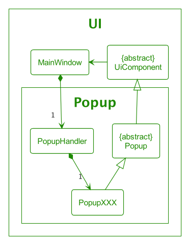
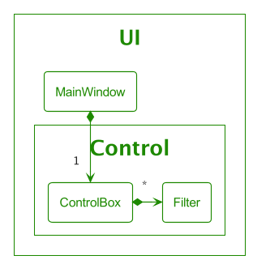
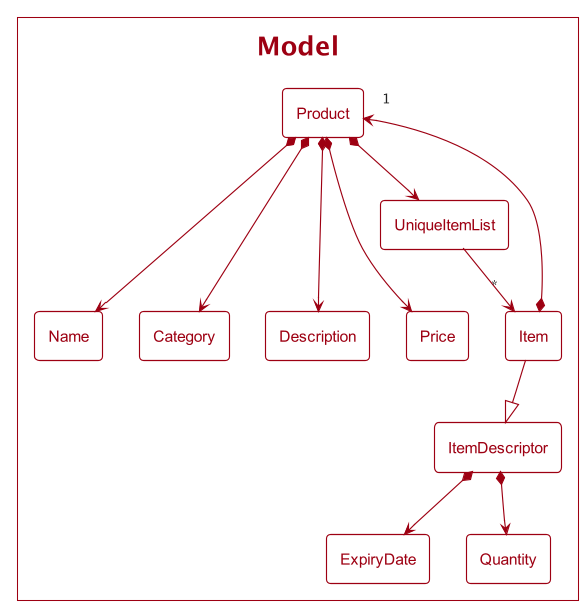
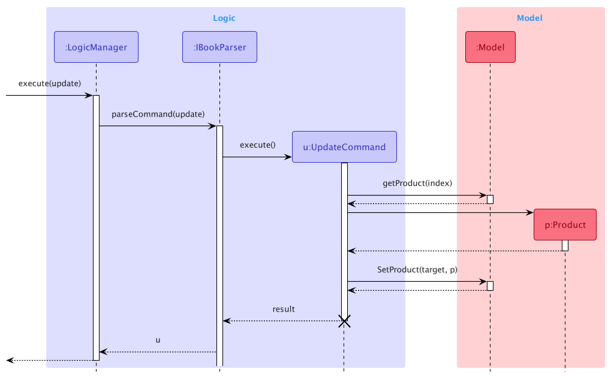
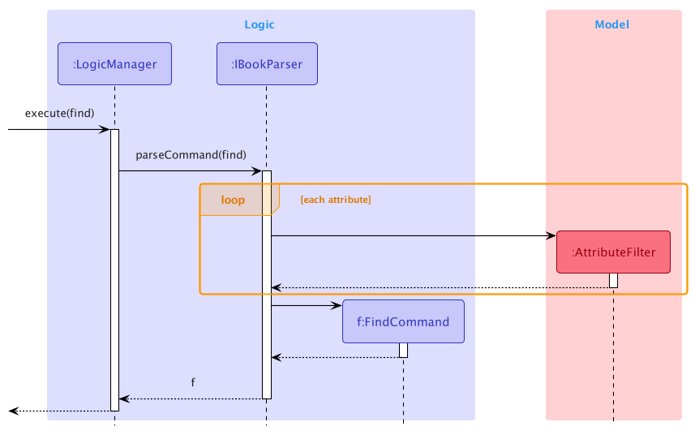
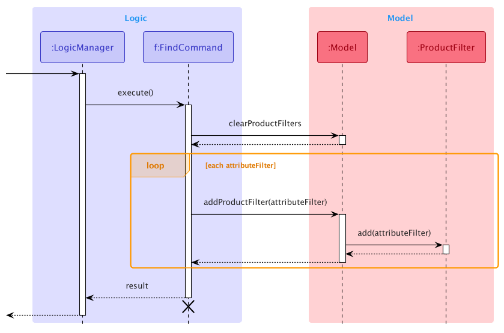
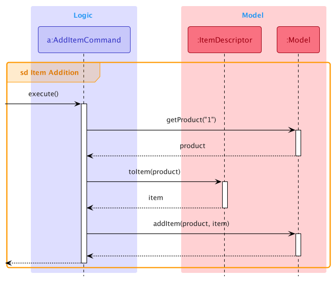

* Table of Contents
{:toc}

## **Acknowledgements**

* This project is based on the AddressBook-Level3 project created by the [SE-EDU initiative](https://se-education.org).

* Most of the images in Ui are taken from [Feather](https://feathericons.com/) - a collection of simply beautiful open source icons.

* The Ui design is inspired by [Warehouse Management System](https://dribbble.com/shots/16271310-Warehouse-Management-System) by Ashkan Fazeli

## **Setting up, getting started**

Refer to the guide [_Setting up and getting started_](SettingUp.md).

## **Design**

:bulb: **Tip:** The `.puml` files used to create diagrams in this document can be found in the [diagrams](https://github.com/se-edu/addressbook-level3/tree/master/docs/diagrams/) folder. Refer to the [_PlantUML Tutorial_ at se-edu/guides](https://se-education.org/guides/tutorials/plantUml.html) to learn how to create and edit diagrams.

### Architecture

The ***Architecture Diagram*** given above explains the high-level design of the app.

Given below is a quick overview of the main components and how they interact with each other.

**Main components of the architecture**

**`Main`** has two classes called [`Main`](https://github.com/AY2122S2-CS2103T-T09-4/tp/blob/master/src/main/java/seedu/ibook/Main.java) and [`MainApp`](https://github.com/AY2122S2-CS2103T-T09-4/tp/blob/master/src/main/java/seedu/ibook/MainApp.java). It is responsible for,
* At app launch: Initializes the components in the correct sequence, and connects them up with each other.
* At shut down: Shuts down the components and invokes cleanup methods where necessary.

[**`Commons`**](#common-classes) represents a collection of classes used by multiple other components.

The rest of the App consists of four components.

* [**`UI`**](#ui-component): The UI of the App.
* [**`Logic`**](#logic-component): The command executor.
* [**`Model`**](#model-component): Holds the data of the App in memory.
* [**`Storage`**](#storage-component): Reads data from, and writes data to, the hard disk.

**How the architecture components interact with each other**

The *Sequence Diagram* below shows how the components interact with each other for the scenario where the user issues the command `delete 1`.

Each of the four main components (also shown in the diagram above),

* defines its *API* in an `interface` with the same name as the Component.
* implements its functionality using a concrete `{Component Name}Manager` class (which follows the corresponding API `interface` mentioned in the previous point.

For example, the `Logic` component defines its API in the `Logic.java` interface and implements its functionality using the `LogicManager.java` class which follows the `Logic` interface. Other components interact with a given component through its interface rather than the concrete class (reason: to prevent outside component's being coupled to the implementation of a component), as illustrated in the (partial) class diagram below.

The sections below give more details about each component.

### Ui component

The **API** of this component is specified in [`Ui.java`](https://github.com/AY2122S2-CS2103T-T09-4/tp/tree/master/src/main/java/seedu/ibook/ui/i.java)

The diagram below shows a simplified view of the Ui component.

`XXX_Ui` represents `CommandBox`, `ProductTable`, `PopupHandler`, `ControlBox`, etc

The Ui consists of a `UiManager` that implements the Facade interface `Ui`.

`UiManager` consists of a `MainWindow` that holds all Ui components of the application. 

`UiComponent` is an abstract class that contains a reference to the MainWindow. 

By having `XXX_Ui` inherit from `UiComponent`, we enabled navigation from `XXX_Ui` to MainWindow. 

The navigation is helpful for some Ui components that are required to call methods in `UiManager`.

For example, `CommandBox` calls the method `executeCommand` in `MainWindow` when the user enters a command.

#### The Structure of The Table Component

Ui components that are related to the main display table are grouped in the `Table` package

The diagram below shows a simplified internal structure of `Table`.

The `MainWindow` contains a `ProductTable` that holds multiple `ProductCard` that represent `Product`.

Subsequently, each `ProductCard` may contain `ItemTable` which has multiple `ItemCard` to represent `Item`.

#### The Structure of The Popup Component

Ui components that are related to a popup are grouped in the `Popup` package

The diagram below shows a simplified internal structure of `Popup`.

`PopupXXX` represents `PopupAddProduct`, `PopupUpdateProduct`, `PopupAddItem`, etc

The `MainWindow` contains a `PopupHandler` that provides APIs for operations related to popup.

Every popup is inherited from the `Popup` abstract class which contains the implementation of the common methods required in all popups

e.g `show()`, `hide()`, `setFeedbackToUser()`, etc

The abstract class `Popup` is again inherited from `UiComponent` for navigability to `MainWindow`

#### The Structure of The Control Component

Ui components that are related to the `ControlBox` are grouped in the `Control` package.

The `ControlBox` is the box located just above the main display table. Its main usage is to hold `Add Product` button and `Filter` tags.

The diagram below shows a simplified internal structure of `Control`.

The `MainWindow` contains a `ControlBox` that holds multiple `Filter` that represents each `AttributeFilter`.

#### More about Ui

The `UI` component uses the JavaFx UI framework. The layout of these UI parts is defined in matching `.fxml` files that are in the `src/main/resources/view` folder. For example, the layout of the [`MainWindow`](https://github.com/AY2122S2-CS2103T-T09-4/tp/tree/master/src/main/java/seedu/ibook/ui/MainWindow.java) is specified in [`MainWindow.fxml`](https://github.com/AY2122S2-CS2103T-T09-4/tp/tree/master/src/main/resources/view/MainWindow.fxml)

The css files can be found in [`src/main/resources/view/css`](https://github.com/AY2122S2-CS2103T-T09-4/tp/tree/master/src/main/resources/view/css), the images used are located in [`src/main/resources/images`](https://github.com/AY2122S2-CS2103T-T09-4/tp/tree/master/src/main/resources/images)

The `UI` component,

* executes user commands using the `Logic` component.
* listens for changes to `Model` data so that the UI can be updated with the modified data.
* keeps a reference to the `Logic` component, because the `UI` relies on the `Logic` to execute commands.
* depends on some classes in the `Model` component, as it displays `Product`, `Item` object residing in the `Model`.

### Logic component

**API**: [`Logic.java`](https://github.com/AY2122S2-CS2103T-T09-4/tp/blob/master/src/main/java/seedu/ibook/logic/Logic.java)

Here's a (partial) class diagram of the `Logic` component:

How the `Logic` component works:
1. When `Logic` is called upon to execute a command, it uses the `IBookParser` class to parse the user command.
2. This results in a `Command` object (more precisely, an object of one of its subclasses e.g., `AddCommand`) which is executed by the `LogicManager`.
3. The command can communicate with the `Model` when it is executed (e.g. to add a product).
4. The result of the command execution is encapsulated as a `CommandResult` object which is returned from `Logic`.

Commands are separated into different packages depending on their functionalities. Thus, the commands package includes the item package for item commands, the product package for product commands.
The rest of the commands that do not fit into those two are directly under the command package.

The Sequence Diagram below illustrates the interactions within the `Logic` component for the `execute("delete 1")` API call.

:information_source: **Note:** The lifeline for `DeleteCommandParser` should end at the destroy marker (X) but due to a limitation of PlantUML, the lifeline reaches the end of the diagram.

Here are the other classes in `Logic` (omitted from the class diagram above) that are used for parsing a user command:

How the parsing works:
* When called upon to parse a user command, the `IBookParser` class creates an `XYZCommandParser` (`XYZ` is a placeholder for the specific command name e.g., `AddCommandParser`) which uses the other classes shown above to parse the user command and create a `XYZCommand` object (e.g., `AddCommand`) which the `IBookParser` returns back as a `Command` object.
* All `XYZCommandParser` classes (e.g., `AddCommandParser`, `DeleteCommandParser`, ...) inherit from the `Parser` interface so that they can be treated similarly where possible e.g, during testing.

### Model component
**API**: [`Model.java`](https://github.com/se-edu/addressbook-level3/tree/master/src/main/java/seedu/address/model/Model.java)

The `Model` component,

* stores the IBook data i.e., all `Product` objects (which are contained in a `UniqueProductList` object).
* stores the currently 'selected' `Product` objects (e.g., results of a search query) as a separate _filtered_ list which is exposed to outsiders as an unmodifiable `ObservableList<Product>` that can be 'observed' e.g. the UI can be bound to this list so that the UI automatically updates when the data in the list change.
* stores the current `ProductFilter` which is applied to the _filtered_ list.
* stores a `UserPrefs` object that represents the user’s preferences. This is exposed to the outside as a `ReadOnlyUserPrefs` object.
* does not depend on any of the other three components (as the `Model` represents data entities of the domain, they should make sense on their own without depending on other components)

A more detailed representation of the `Product` class is shown below which includes more details regarding the `Item` class.

* The `Item` object enforces a two-way relationship with `Product`.
* An `Item` can only belong to one `Product`, but a `Product` can contain many `Item`s.

### Storage component

**API**: [`Storage.java`](https://github.com/AY2122S2-CS2103T-T09-4/tp/blob/master/src/main/java/seedu/ibook/storage/Storage.java)

The `Storage` component,
* can save both IBook data and user preference data in json format, and read them back into corresponding objects.
* inherits from both `IBookStorage` and `UserPrefStorage`, which means it can be treated as either one when only one functionality is needed.
* depends on some classes in the `Model` component (because the `Storage` component's job is to save/retrieve objects that belong to the `Model`)

### Common classes

Classes used by multiple components are in the `seedu.addressbook.commons` package.

## **Implementation**

This section describes some noteworthy details on how certain features are implemented.

### Popups

#### Implementation

The diagram below shows a simplified internal structure of `Popup`.

`PopupXXX` represents `PopupAddProduct`, `PopupUpdateProduct`, `PopupAddItem`, etc

The implementation of popups is facilitated by the `PopupHandler` class and the `Popup` abstract class. Each popup is contained by `PopupHandler` which provides APIs for operations related to the popup.

The API provided by `PopupHandler` are:
* `isShowing()` Checks if any of the popups is showing
* `setFeedbackToUser(String feedbackToUser)` Shows feedback to the user in the showing popup
* `showPopupXXX()` Shows `PopupXXX`
* `HidePopup()` Hides the showing popup

The `showPopupXXX()` method in `PopupHandler` will make sure that at most one popup is showing at a time. This is to make sure that the number of popups will not flood the user's screen.

Every popup is inherited from the `Popup` abstract class which contains the implementation of the common methods required in all popups. 

The methods in `Popup` are:
* `show()` Shows the popup window
* `hide()` Hides the popup window
* `isShowing()` Checks if the popup is showing
* `setFeedbackToUser(String feedbackToUser)` Shows feedback to user in popup
* `execute(String commandText)` Executes the `commandText`

#### Showing a Popup

The following sequence diagram shows how a `Popup` is shown once a button is clicked.

`XXX_Ui` represents Ui components that have a button which will open a popup once it is clicked

e.g `ControlBox`, `ProductCard`, `ItemCard`, etc

`PopupYYY` represents different types of `Popup`

e.g `PopupAddProduct`, `PopupUpdateProduct`, `PopupAddItem`, etc

As you can see from the diagram, the components call `showPopupXXX(...)` in `MainWindow` instead of calling it from `PopupHandler` directly. 

This is to reduce coupling for each of the Ui components as they will not have a dependency on `PopupHandler` to call any of the popups. Also, it avoids the issue of having deeply nested passing of `PopupHandler`.

#### Executing command in Popup

The sequence diagram below shows the successful execution of a command in popup

`PopupYYY` represents different types of `Popup`

e.g `PopupAddProduct`, `PopupUpdateProduct`, `PopupAddItem`, etc

When a user clicked a button in `PopupYYY`, it will generate the associated command from the inputs. The command is then passed to `MainWindow` for execution.

This process is similar to how the command is executed from `CommandBox`.

The `commandResult` is then sent to `ResultWindow` for display and `PopupYYY` will be hidden.

#### Design Considerations

**Aspect: How to handle popup**
* **Alternative 1:** Pass in popups created at `MainWindow` to Ui components that require it
  * Pros: Fewer function calls and better performance
  * Cons: 
   1. Increase coupling as these popups might be required by deeply nested components.   e.g `ItemCard` has to call `PopupModifyItem` but it resides in `MainWindow > ProductTable > ItemTable`. This causes `ProductTable` and `ItemTable` to have an unnecessary dependency on `PopupModifyItem`

   &nbsp;

* **Alternative 2:** Create popup in Ui components that require it
  * Pros: Easy solution to reduce coupling
  * Cons: 
    1. Difficult to manage popups and check whether the popups are current showing
    2. Two same popups might be opened at the same time

   &nbsp;

* **Alternative 3 (current choice):** Create `PopupHandler` in `MainWindow` and provides a method for Ui component for all the `Popup`
  * Pros: Centralized control for popup and reduced coupling
  * Cons: 
    1. Increase complexity for `MainWindow`
    2. Less efficient as more function calls are required

### Product

#### Implementation

The implementation of product is entirely governed by the `Product` class. The `Product` class is immutable and guarantees that all fields are valid and immutable as well.

Thus updating a product will create a new product class, while copying the old items entirely into the `UniqueItemList` of the new class.

The following sequence diagram shows how the `Update` command works:

#### Design Considerations
**Aspect: How to design the product structure**
* **Alternative 1:** Make product mutable
  * Pros: Easy to Implement
  * Cons: Hard to track state in undo/redo feature

* **Alternative 2 (current choice):** Make product immutable
  * Pros: Removes the need for listeners for UI to track product states
  * Cons: The cost for updating a product maybe huge

### Product filters

#### Implementation

The implementation of product filter is facilitated by the `ProductFilter` class and the `AttributeFilter` class. `ProductFilter` contains a list of `AttributeFilter` which specifies the filter for the individual attributes of a product that was queried in the `Find` command. Both the `ProductFilter` as well as the `AttributeFilter` has a `test` method to test whether a given `Product` fulfills the query specified by the user.

Given below is the class diagram of the `ProductFilter` class and the `AttributeFilter` class.

The following sequence diagrams show how the `Find` command works:

The sequence diagram below shows how the `FindCommand` object is created:

The sequence diagram below shows how the `FindCommand` object is executed:

As different attributes have different constraints, the `parse` method in the `FindCommandParser` checks that all the attributes are valid before creating the `AttributeFilter` and the `FindCommand` objects. If there is any invalid attribute, an exception would be thrown.

When executing the `FindCommand`, the `clearProductFilters` method of the `Model` would be called to ensure that previous filters are removed. The individual `AttributeFilter`s would then be applied by calling the `addProductFilter` method in the `Model` class. This would then update the list of filtered products by checking if the product fulfills every condition in the `AttributeFilter` (i.e. returning true for when the `test` method is called with `Product` as the argument). The updated filtered product list would then be displayed in the GUI.

:bulb: **Tip:** Some `AttributeFilter`s like `NameFilter`, `CategoryFilter`, and `DescriptionFilter` can do partial matching so the query given does not have to exactly match the actual product.  

#### Design considerations

**Aspect: How to filter the products:**

* **Alternative 1:** Create a single predicate as the product filter.
    * Pros: Easy to implement.
    * Cons: The user does not have fine-grained control over the current filter.

* **Alternative 2 (current choice):** Create a `ProductFilter` that contains a list of `AttributeFilter`
    * Pros: Allow the UI to display the individual `AttributeFilter` being applied and delete any one of them individually.
    * Cons: More complicated to implement.

### Item

#### Implementation

The `Item` class is implemented to encapsulate two data fields, `ExpiryDate` and `Quantity`, under `Product` with a one-to-many relationship, i.e. one `Product` can have multiple `Item` objects under it.

Listed below are the few behavioral requirements for `Item`, along with the classes/interfaces related to it.

* A `Product` must not have two `Item` objects that are considered the same, this is enforced by `UniqueItemList`
* An `Item` without a `Parent` is characterised using the `ItemDescriptor`

`ItemDescriptor` contains a `ItemDescriptor#toItem(Product)` method to ensure the associated `Product` is given before creating the `Item` object.

The motivation for such implementation is due to the parsing of the `add-item` command when the fields of `Item` need to be populated before the associated `Product` is retrieved. We wanted to enforce the relationship between `Item` and `Product` to reduce unforeseen misuses and bugs.

*The reason for choosing this design solution will be justified in the next section.*

##### Adding an Item

Given below is a sequence diagram to show how `add-item 1 e:2022-12-13 q:10` is handled:

The details of `AddItemCommand#execute()` are omitted from the sequence diagram above, and are illustrated below:

The sequence diagram below shows how an `Item` is added to a `Product`'s `UniqueItemList`. This happens within `ModelManager` which implements the interface `Model` containing the method `Model#addItem(Product, Item)`.

##### Updating and deleting an Item
These two operations are similar to adding an `Item` as shown in the section above.

#### Design considerations

**Aspect: How to create `Item` and ensure it when the user executes `add-item` command:**

* **Alternative 1:** Retrieve the respective `Product` within the parser.
    * Pros: Easy solution.
    * Cons: Allows the parser to interact with model and logic, which also increases coupling.

      &nbsp;
* **Alternative 2:** Create command object with each field as a parameter.
    * Pros: Easy solution.
    * Cons:
        * Complicates the `AddItemCommand` constructor and requires modification of constructor signature whenever there are updates to `Item` fields.
        * If more commands that have the same issue are implemented, the amount of modification will increase.

      &nbsp;
* **Alternative 3 (current choice):** `ItemDescriptor` to temporarily hold the fields' value, then converted to `Item` later when `Product` is specified.
    * Pros: Good abstraction.
    * Cons: Requires an extra class to be created.

### Undo/redo feature

#### Implementation

The undo/redo mechanism is facilitated by `ReversibleIBook`. It extends `IBook` with versions of methods that are reversible and uses `StateChangeRecorder` to record all changes made to `IBook`, which internally stores changes as a `StateChange`. `ReversibleIBook` implements the following operations:

* `ReversibleIBook#prepareForChanges()` — Prepares a clean workspace to record next possible changes.
* `ReversibleIBook#saveChanges()` — Saves all changes made to `IBook` as a `StateChange` (recorded and stored in `StateChangeRecorder`).
* `ReversibleIBook#undo()` — Reverts the most current changes.
* `ReversibleIBook#redo()` — Restores the most currently undone changes.

These operations are exposed in the `Model` interface as `Model#prepareIBookForChanges()`, `Model#saveIBookChanges()`, `Model#undoIBook()` and `Model#redoIBook()` respectively.

Given below is an example usage scenario and how the undo/redo mechanism behaves at each step.

Step 1. The user launches the application for the first time. The `ReversibleIBook` will be initialized, which in turn initializes `StateChangeRecorder` with a `stateChanges` list consisting of zero `StateChange` records.

Step 2. The user executes `delete 3` command to delete the 3rd product in the iBook. The `delete` command calls `Model#saveIBookChanges()` after its execution, causing changes made to iBook to be recorded as a `StateChange` and stored in the `stateChanges` list. The `currentStateChange` is now pointing to this most recent `StateChange`.

Step 3. The user executes `update 1 n:Maggie​` to add a new product. This command also calls `Model#saveIBookChanges()`, causing another `StateChange` to be saved into the `stateChanges` list.

:information_source: **Note:** If a command fails its execution, it will not call `Model#saveIBookChanges()`, so no `StateChange` will be saved into the `stateChanges` list.

 
Step 4. The user now decides that adding the product was a mistake, and decides to undo that action by executing the `undo` command. The `undo` command will call `Model#undoIBook()`, which will get and execute the actions needed to revert this change. `currentStateChange` will then move once to the left, pointing to the most recent `stateChange` (with respect to the state of `IBook` after the `undo` command).

:information_source: **Note:** If the `currentStateChange` is not pointing to a valid `StateChange` (for example when there is no record in the `stateChanges` list), then there are no changes to revert. The `undo` command uses `Model#canUndoIBook()` to check if this is the case. If so, it will return an error to the user rather than attempting to perform the undo.

 
The following sequence diagram shows how the undo operation works:

:information_source: **Note:** The lifeline for `UndoCommand` should end at the destroy marker (X) but due to a limitation of PlantUML, the lifeline reaches the end of diagram.

 
The `redo` command does exactly the opposite — it calls `Model#redoIBook()`, which moves the `currentStateChange` once to the right, pointing to the previously reverted changes, then performs the actions needed to restore them.

:information_source: **Note:** If the `currentStateChange` is pointing at the latest record of the `stateChanges` list, then there are no reverted changes to restore. The `redo` command uses `Model#canRedoIBook()` to check if this is the case. If so, it will return an error to the user rather than attempting to perform the redo.

 
Step 5. The user then decides to execute the command `list`. Commands that do not make any changes to `Ibook`, such as `list`, will usually not call `Model#saveIBookChanges()`, `Model#undoIBook()` or `Model#redoIBook()`. Thus, state change records in `StateChangeRecorder` remain unchanged.

Step 6. The user executes `clear`, which again will call `Model#saveIBookChanges()` at the end of its execution. Since the `currentStateChange` is not pointing at the end of the `stateChanges` list, all state changes after the `currentStateChange` will be cleared. Reason: It does not make sense to redo the `update 1 n:Maggie​` command. This is the convention that most modern desktop applications follow.

The following activity diagram summarizes what happens when a user executes a new command:

#### Design considerations:

**Aspect: How undo & redo executes:**

* **Alternative 1:** Saves the entire `Ibook`.
  * Pros: Easy to implement.
  * Cons: May have performance issues in terms of memory usage.

* **Alternative 2 (current choice):** Individual method that makes changes to `IBook` knows how to undo/redo by itself.
  * Pros: Will use less memory (e.g. for `delete`, just save the product being deleted).
  * Cons: We must ensure that the implementation of each method is correct.

## **Documentation, logging, testing, configuration, dev-ops**

* [Documentation guide](Documentation.md)
* [Testing guide](Testing.md)
* [Logging guide](Logging.md)
* [Configuration guide](Configuration.md)
* [DevOps guide](DevOps.md)

## **Appendix: Requirements**

### Product scope

**Target user profile**: A storekeeper who

* has a need to manage different products in the store
* is comfortable with CLI but prefers GUI for certain occasions
* is forgetful and easily loses track of expiry dates in  a store
* is forgetful and sometimes forgets command syntax
* prefer desktop apps over other types

**Value proposition**: manage products and their expiry dates with ease using CLI

### User stories

Priorities: High (must have) - `* * *`, Medium (nice to have) - `* *`, Low (unlikely to have) - `*`

| Priority | As a …​                    | I want to …​                                                            | So that I can…​                                        |
|----------|----------------------------|-------------------------------------------------------------------------|--------------------------------------------------------|
| `* * *`  | user                       | add a product                                                           | input product data that I want to store                |
| `* * *`  | user                       | list all products added                                                 | check on all important details of all items at once    |
| `* * *`  | user                       | search for specific products by category                                | find the relevant products and its details quickly     |
| `* * *`  | user                       | delete a product                                                        | remove entries that I no longer need                   |
| `* * *`  | user                       | update a product's information                                          | keep the details relevant                              |
| `* *`    | beginner user              | learn about the basic features                                          | quickly get started with using the app                 |
| `* *`    | user                       | get reminders on which stocks are nearing the expiry dates              | prioritize their sales                                 |
| `* *`    | user familiar with the app | receive orders from an item and update in the app                       | easily manage large orders of several products         |
| `* *`    | user familiar with the app | add customer records                                                    | keep track of their spending habits                    |
| `* *`    | user familiar with the app | archive customer records                                                | ignore customers that are no longer active             |
| `* *`    | professional user          | automate the reduction of the price of items when near the expiry dates | easily sell out the products via a discount            |
| `* `     | user                       | import existing products to the application                             | transition to this app quickly                         |
| `* `     | user familiar with the app | create multiple accounts for my staff to use                            | restrict the access rights that they have              |
| `* `     | user familiar with the app | delete staff accounts                                                   | prevent staff no longer working from using the account |
| `* `     | user familiar with the app | add custom permissions for the staff accounts                           | modify their access rights related to their job scope  |
| `* `     | professional user          | create and use my own shortcut commands                                 | accomplish my task faster                              |

*{More to be added}*

### Use cases

(For all use cases below, the **System** is the `IBook` and the **Actor** is the `user`, unless specified otherwise)

#### UC1: Listing products

**MSS**

1. User requests to list all products.
2. IBook removes all active filters and shows the list of products.

   Use case ends.

**Extensions**

* 1a. The list is empty.

    * 1a1. IBook shows an empty table.

    Use case ends.

#### UC2: Adding a product

**MSS**

1. User request to add a product to IBook.
2. IBook adds the product.

   Use case ends.
   
**Extensions**

* 1a. Required fields are all present but are invalid.

    * 1a1. IBook shows an error message.

      Use case ends.

* 1b. Not all required fields are present (e.g. Name).

    * 1b1. IBook shows an error message.

      Use case ends.

* 1c. Optional fields like Category is missing.

    * 1c1. IBook automatically sets the category to miscellaneous.

      Use case resumes at step 2.

#### UC3: Delete a product

**MSS**

1. User requests to list products ([UC1](#uc1-listing-products)).
2. User requests to delete a product in the list specified by the index.
3. IBook deletes the product.

   Use case ends.

**Extensions**

* 2a. Index is not provided.

    * 2a1. IBook shows an error message.

      Use case ends.

* 2b. The given index is invalid.

    * 2b1. IBook shows an error message.

      Use case ends.

#### UC4: Update a product

**MSS**

1. User requests to list products ([UC1](#uc1-listing-products)).
2. User requests to update a product in the list specified by the index.
3. IBook updates the product.
   
   Use case ends.

**Extensions**

* 2a. Index is not provided.

    * 2a1. IBook shows an error message.

      Use case ends.

* 2b. The given index is invalid.

    * 2b1. IBook shows an error message.

      Use case ends.

#### UC5: Find products

**MSS**

1. User requests to find products by providing filters.
2. IBook updates the list to show the requested products.

   Use case ends.

**Extensions**

* 1a. Requested fields are invalid.

    * 1a1. IBook shows an error message.

      Use case ends.

* 1b. No product matches the given filter.

    * 1b1. IBook shows a cute image stating nothing found.

      Use case ends.

#### UC6: Find out of stock products

**MSS**

1. User requests to find products that are out of stock.
2. IBook updates the list to show the requested products.

   Use case ends.

**Extensions**

* 1a. No products found.

    * 1a1. IBook shows a cute image stating nothing found.

      Use case ends.

#### UC7: Add an item

**MSS**

1. User requests to list products ([UC1](#uc1-listing-products))
2. User request to add an item to a product in IBook.
3. IBook adds the item to the product.

   Use case ends.
   
**Extensions**

* 2a. Required fields are all present but are invalid.

    * 2a1. IBook shows an error message.

      Use case ends.

* 2b. Not all required fields are present (e.g. Expiry Date).

    * 2b1. IBook shows an error message.

      Use case ends.

* 2c. Optional fields like Quantity is missing.

    * 2c1. IBook automatically sets the quantity to 0.

      Use case resumes at step 3.

#### UC8: Delete an item

**MSS**

1. User requests to list products ([UC1](#uc1-listing-products)).
2. User requests to delete an item in the list specified by the index.
3. IBook deletes the item.

   Use case ends.

**Extensions**

* 2a. Index is not provided.

    * 2a1. IBook shows an error message.

      Use case ends.

* 2b. The given index is invalid.

    * 2b1. IBook shows an error message.

      Use case ends.

#### UC9: Update an item

**MSS**

1. User requests to list products ([UC1](#uc1-listing-products)).
2. User requests to update an item in the list specified by the index.
3. IBook updates the product.
   
   Use case ends.

**Extensions**

* 2a. Index is not provided.

    * 2a1. IBook shows an error message.

      Use case ends.

* 2b. The given index is invalid.

    * 2b1. IBook shows an error message.

      Use case ends.

#### UC10: Find items

**MSS**

1. User requests to find items by providing filters.
2. IBook updates the list to show the requested items.

   Use case ends.

**Extensions**

* 1a. Requested fields are invalid.

    * 1a1. IBook shows an error message.

      Use case ends.

* 1b. No product matches the given filter.

    * 1b1. IBook shows a cute image stating nothing found.

      Use case ends.

#### UC11: Find expired items

**MSS**

1. User requests to find items that are expired.
2. IBook updates the list to show the requested items.

   Use case ends.

**Extensions**

* 1a. No items found.

    * 1a1. IBook shows a cute image stating nothing found.

      Use case ends.

#### UC12: Find expiring items

**MSS**

1. User requests to find items that are expiring within a certain amount of days
2. IBook updates the list to show the requested items

   Use case ends.

**Extensions**

* 1a. Number of days is invalid.
		
    * 1a1. IBook show an error message.

      Use case ends.

* 1b. No items found.

    * 1b1. IBook shows a cute image stating nothing found.

      Use case ends.

#### UC13: Update all products

**MSS**

1. User finds products they want to update using the find command ([UC5](#uc5-find-products)).
2. User requests to update all products displayed in the list.
3. IBook updates the list to show all products updated.

   Use case ends.

**Extensions**

* 2a. Some provided fields are invalid.

    * 2a1. IBook shows an error message.

      Use case ends.

* 2b. The current display list is empty.

    * 2b1. IBook shows an error message.

      Use case ends.

#### UC14: Delete all products

**MSS**

1. User finds products they want to delete using the find command ([UC5](#uc5-find-products)).
2. User requests to delete all products displayed in the list.
3. IBook updates the list to show all products updated.

   Use case ends.

**Extensions**

* 2a. The current display list is empty.

    * 2a1. IBook shows an error message.

      Use case ends.

#### UC15: Undo changes

**MSS**

1. User requests to undo the most recent command that made changes to iBook.
2. IBook revert the most recent changes.
   
   Use case ends.

**Extensions**

* 1a. There are no changes that can be reverted.

    * 1a1. IBook shows an error message.

      Use case ends.

#### UC16: Redo changes

**MSS**

1. User requests to redo the most recent undone command that made changes to iBook.
2. IBook restore the most recent undone changes.
   
   Use case ends.

**Extensions**

* 1a. There are no changes that can be restored.

    * 1a1. IBook shows an error message.

      Use case ends.

*{More to be added}*

### Non-Functional Requirements

1. Should work on any _mainstream OS_ as long as it has Java `11` or above installed.
2. Should be able to hold up to 1000 products without a noticeable sluggishness in performance for typical usage.
3. A user with above average typing speed for regular English text (i.e. not code, not system admin commands) should be able to accomplish most of the tasks faster using commands than using the mouse.
4. Data should be auto saved locally each time a new command has been entered.
5. Should reload saved data accurately provided that data is not corrupted.
6. System should respond within 3 seconds.

### Glossary

* **Mainstream OS**: Windows, Linux, Unix, OS-X

## **Appendix: Instructions for manual testing**

Given below are instructions to test the app manually.

:information_source: **Note:** These instructions only provide a starting point for testers to work on;
testers are expected to do more *exploratory* testing.

### Launch and shutdown

1. Initial launch

   1. Download the jar file and copy into an empty folder

   2. Double-click the jar file.  
      Expected: Shows the GUI with a set of sample contacts. The window size may not be optimum.

2. Saving window preferences

   1. Resize the window to an optimum size. Move the window to a different location. Close the window.

   2. Re-launch the app by double-clicking the jar file. 
       Expected: The most recent window size and location is retained.

   3. _{ more test cases …​ }_

### Deleting product(s)

1. Deleting a product while all products are being shown

   1. Prerequisites: List all products using the `list` command. Multiple products in the list.

   2. Test case: `delete 1` 
      Expected: First product is deleted from the list. Details of the deleted product shown in the command output window.

   3. Test case: `delete 0` 
      Expected: No product is deleted. Error details shown in the command output window.

   4. Other incorrect delete commands to try: `delete`, `delete x`, `...` (where x is larger than the list size) 
      Expected: Similar to previous.

2. Deleting all products

    1. Prerequisites: There are existing products in the current displayed list.

    2. Test case: `delete-all` 
       Expected: All products shown in current list will be deleted. This can be verified by using `list` command to show all products in iBook.

3. _{ more test cases …​ }_

### Updating product(s)

1. Updating a product while all products are being shown

    1. Prerequisites: List all products using the `list` command. Multiple products in the list.

    2. Test case: `update 1 d:update description` 
       Expected: First product in the list is updated. Previous description will now become `update description`.

    3. Test case: `update 2 p:100.99 d:another description` 
       Expected: Second product in the list is updated. Previous price and description will now become `100.99` and `another description` respectively.

    4. Test case: `update 0 p:9.99` 
       Expected: No product is updated. Error details shown in the command output window.

    5. Other incorrect update commands to try: `update`, `update x`, `...` (where x is larger than the list size)  
       Expected: Similar to previous.

2. Updating all products

    1. Prerequisites: There are existing products in the current displayed list.

    2. Test case: `update-all p:19.99 d:Stock clearance sales` 
       Expected: All products shown in current list will be updated to have price `19.99` and description `Stock clearance sales`.

3. _{ more test cases …​ }_

### Finding products

1. Find products that match a certain attribute like (`NAME`, `CATEGORY`, `DESCRIPTION`, `PRICE`)

   1. Prerequisites: There are existing products in the list.

   2. Test case: `find n:kaya` 
      Expected: Products that contains `kaya` in the name is displayed. Details such as the number of products found would be shown in the status message.

   3. Test case: `find n:kaya c:bread` 
      Expected: Products that contains `kaya` in the name and `bread` in the category is displayed. Details such as the number of products found would be shown in the status message.

   4. Test case: `find` 
      Expected: Error details is shown in the command output window as at least one attribute needs to be specified in the command.

   5. Other incorrect find commands to try: `find blabla` 
      Expected: Similar to previous.

2. Find products that are out of stock

   1. Prerequisites: There are existing products in the list.

   2. Test case: `out-of-stock` 
      Expected: Products that have no items would be displayed.

3. Find items that have expired

    1. Prerequisites: There are existing products in the list.

    2. Test case: `expired` 
       Expected: Products that contain expired items would be displayed.

4. Find items that are expiring

   1. Prerequisites: There are existing products and items in the list.

   2. Test case: `remind 5` 
      Expected: Items that are expiring within the next 5 days would be displayed.

   3. Test case: `remind 0` 
      Expected: Items that are expiring on the same day would be displayed.

   4. Test case: `remind -1` 
      Expected: Error details is shown in the command output window as the days specified cannot be negative.

   5. Other incorrect commands to try: `remind blabla`, `remind 9999999999999` 
      Expected: Similar to previous.

### Undo/redo changes

1. Undo changes
   
    1. Prerequisites: There are existing products in the list. At least one command that makes changes to iBook (e.g. `add/update/delete`) have been performed.

    2. Test case: `undo` 
       Expected: The most recent command that makes changes to iBook is reverted. 

    3. Test case: `add n:new_product p:3.00` then `undo`  
       Expected: The `new_product` just added will be deleted.

    4. Test case: `undo haha` 
       Expected: Any additional input after the keyword `undo` will be ignored, as if this is a normal `undo` command.
       
2. Redo changes

    1. Prerequisites: A `undo` command has just been successfully executed.

    2. Test case: `redo` 
       Expected: The just undone changes will be redone again.

    3. Test case: `add n:new_product p:3.00` then `undo` then `redo`  
       Expected: The `new_product` just deleted by the `undo` command will be added back again.

    4. Test case: `redo haha` 
       Expected: Any additional input after the keyword `redo` will be ignored, as if this is a normal `redo` command.

### Saving data

1. Dealing with missing/corrupted data files

   1. Prerequisites: iBook is not currently running.
      
   2. Locate the data file of iBook at `[JAR file location]/data/ibook.json`.
    
   3. Delete the file or replace the data in it with random garbage values.  
      Expected: The following launch of iBook will have no data.
