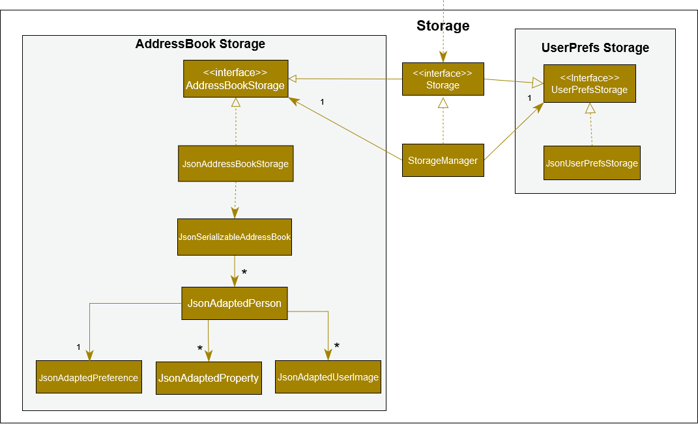

# Acknowledgements

This is a brownfield project that bases from the Project template [AddressBook Level 3 (AB3)](https://se-education.org/docs/templates.html) from se-education.org.

# Table of contents
- [Setting up, getting started](#setting-up-getting-started)
- [Design](#design)
  - [Architecture](#architecture)
    - [UI Component](#ui-component)
    - [Logic Component](#logic-component)
    - [Model Component](#model-component)
    - [storage Component](#storage-component)
    - [Common classes](#common-classes)
- [Implementation](#implementation)
- [Glossary](#glossary)
- [Documentation, logging, testing, configuration, dev-ops](#documentation-logging-testing-configuration-dev-ops)
- [Appendix: Requirements](#appendix-requirements)
  - [Target User Profile](#target-user-profile)
  - [Value proposition](#value-proposition)
  - [User Stories](#user-stories)
  - [Use cases](#use-cases)
  - [Non-functional Requirements](#non-functional-requirements)
- [Appendix: Instructions for manual testing](#appendix-instructions-for-manual-testing)
- [Appendix: Effort](#appendix-effort)
- 

# Setting up, getting started

Get started by following these instructions from our [guide](https://ay2122s2-cs2103-w16-4.github.io/tp/SettingUp.html).

# Design

Take a look at our design which is mostly based off [AddressBook Level 3 (AB3)](https://se-education.org/addressbook-level3/DeveloperGuide.html#design).

## Architecture

The ***Architecture Diagram*** given above explains the high-level design of the App.

Given below is a quick overview of main components and how they interact with each other.

**Main components of the architecture**

**`Main`** has two classes called [`Main`](https://github.com/AY2122S2-CS2103-W16-4/tp/blob/master/src/main/java/seedu/address/Main.java) and [`MainApp`](https://github.com/AY2122S2-CS2103-W16-4/tp/blob/master/src/main/java/seedu/address/MainApp.java). It is responsible for,
* At app launch: Initializes the components in the correct sequence, and connects them up with each other.
* At shut down: Shuts down the components and invokes cleanup methods where necessary.

[**`Commons`**](#common-classes) represents a collection of classes used by multiple other components.

The rest of the App consists of four components.

* [**`UI`**](#ui-component): The UI of the App.
* [**`Logic`**](#logic-component): The command executor.
* [**`Model`**](#model-component): Holds the data of the App in memory.
* [**`Storage`**](#storage-component): Reads data from, and writes data to, the hard disk.

**How the architecture components interact with each other**

The *Sequence Diagram* below shows how the components interact with each other for the scenario where the user issues the command `delete 1`.

Each of the four main components (also shown in the diagram above),

* defines its *API* in an `interface` with the same name as the Component.
* implements its functionality using a concrete `{Component Name}Manager` class (which follows the corresponding API `interface` mentioned in the previous point.

For example, the `Logic` component defines its API in the `Logic.java` interface and implements its functionality using the `LogicManager.java` class which follows the `Logic` interface. Other components interact with a given component through its interface rather than the concrete class (reason: to prevent outside component's being coupled to the implementation of a component), as illustrated in the (partial) class diagram below.

The sections below give more details of each component.

### UI Component

The **API** of this component is specified in `Ui.java`

The UI consists of a `MainWindow` that is made up of parts e.g.`CommandBox`, `ResultDisplay`, `PersonListPanel`, `StatusBarFooter` etc. All these, including the `MainWindow`, inherit from the abstract `UiPart` class which captures the commonalities between classes that represent parts of the visible GUI.
The `UI` component uses the JavaFx UI framework. The layout of these UI parts are defined in matching `.fxml` files that are in the src/main/resources/view folder. For example, the layout of the `MainWindow` is specified in `MainWindow.fxml`
The `UI` component,
- executes user commands using the `Logic` component.
- listens for changes to `Model` data so that the UI can be updated with the modified data.
- keeps a reference to the `Logic` component, because the `UI` relies on the `Logic` to execute commands.
- depends on some classes in the `Model` component, as it displays `Person` object residing in the `Model`.

Several user commands also involve the display and creation of `XYZWindows` (`matchwindow`, `statswindow`, `viewimagewindow`, `reminderwindow`, `favouritewindow`) which relies on the logic component in order to execute and display the information returned from the commands.

### Logic component

**API** : [`Logic.java`](https://github.com/AY2122S2-CS2103-W16-4/tp/blob/master/src/main/java/seedu/address/logic/Logic.java)

Here's a (partial) class diagram of the `Logic` component:

How the `Logic` component works:
1. When `Logic` is called upon to execute a command, it uses the `AddressBookParser` class to parse the user command.
1. This results in a `Command` object (more precisely, an object of one of its subclasses e.g., `AddCommand`) which is executed by the `LogicManager`.
1. The command can communicate with the `Model` when it is executed (e.g. to add a person).
1. The result of the command execution is encapsulated as a `CommandResult` object which is returned back from `Logic`.

The Sequence Diagram below illustrates the interactions within the `Logic` component for the `execute("delete 1")` API call.

:information_source: **Note:** The lifeline for `DeleteCommandParser` should end at the destroy marker (X) but due to a limitation of PlantUML, the lifeline reaches the end of diagram.

Here are the other classes in `Logic` (omitted from the class diagram above) that are used for parsing a user command:

How the parsing works:
* When called upon to parse a user command, the `AddressBookParser` class creates an `XYZCommandParser` (`XYZ` is a placeholder for the specific command name e.g., `AddCommandParser`) which uses the other classes shown above to parse the user command and create a `XYZCommand` object (e.g., `AddCommand`) which the `AddressBookParser` returns back as a `Command` object.
* All `XYZCommandParser` classes (e.g., `AddCommandParser`, `DeleteCommandParser`, ...) inherit from the `Parser` interface so that they can be treated similarly where possible e.g, during testing.

### Model component
**API** : [`Model.java`](https://github.com/AY2122S2-CS2103-W16-4/tp/blob/master/src/main/java/seedu/address/model/Model.java)

The `Model` component,
* stores the address book data i.e., all `Person` objects (which are contained in a `UniquePersonList` object).
* stores the currently 'selected' `Person` objects (e.g., results of a search query) as a separate _filtered_ list which is exposed to outsiders as an unmodifiable `ObservableList<Person>` that can be 'observed' e.g. the UI can be bound to this list so that the UI automatically updates when the data in the list change.
* stores a `UserPref` object that represents the user’s preferences. This is exposed to the outside as a `ReadOnlyUserPref` objects.
* does not depend on any of the other three components (as the `Model` represents data entities of the domain, they should make sense on their own without depending on other components)

### Storage component

**API** : [`Storage.java`](https://github.com/AY2122S2-CS2103-W16-4/tp/blob/master/src/main/java/seedu/address/storage/Storage.java)

The `Storage` component,
* can save both address book data and user preference data in json format, and read them back into corresponding objects.
* inherits from both `AddressBookStorage` and `UserPrefStorage`, which means it can be treated as either one (if only the functionality of only one is needed).
* depends on some classes in the `Model` component (because the `Storage` component's job is to save/retrieve objects that belong to the `Model`)

### Common classes

Classes used by multiple components are in the `seedu.addressbook.commons` package.

# Implementation

This section describes some noteworthy details on how certain features are implemented.

## Favourite feature and Favourites window

The proposed `favourite` mechanism will make use of a new attribute called `Favourite`. How we went about creating this mechanism is by going through the list of Persons and checking if their `Favourite` instance returns "🌟" (represents favourited) when `toString()` is called.

Given below is an example of how the `favourite` mechanism behaves with the Favourites window.

Step 1. The user starts the application with pre-loaded data of Persons.

Step 2. Assuming there is a Person with the index number 1. User then executes `favourite 1` command to favourite the Person with index number 1 in the application. The system will create a new Person with the `Favourite` instance's value set as true. Then calls `Model#setPerson()` to set this Person to be a favourited instance of the same Person.

<aside>
💡 **Note:** Every newly added Person will have the default value of `False` for `Favourite` attribute, thus will never appear in the Favourites window before the `favourite` command is called on them.

</aside>

Step 3. User can access the Favourites window by navigating to the menu item as shown in the diagram, which pops up a new window that contains only those Persons that have ‘Favourite’ instance's value set as True. The user can also input the command `fw` to open up the Favourites window through this CLI command.

## Match feature/Window
The `match` opens a new `MatchWindow`, in which all matches are displayed in pairs.
The left column shows the sellers, while the right column shows the buyers.

Two `Person` make a match if the seller has at least one `property` that matches the buyer's `preference`.

## Help Feature and Window
The `help` command and selecting help from the dropdown opens the `helpwindow`.

The contents of `helpPanePlaceHolder` is then replaced according to which tab
that the user has selected to view more details about a specific feature or general features
of RealEstatePro

## Property
The `Property` is a new attribute that can be added to a `Person` that represents a real estate property listing. A `Person` is able to hold multiple properties including none.

The `Property` itself consists of the following attributes: `Region`, `Address`, `Size`, `Price`.

- `Region` represents the general location of the `Address` of the `Property`. It is an enum that can be one of the following: `NORTH`, `SOUTH`, `EAST`, `WEST`, `CENTRAL`.

- `Address` represents the exact location of the `Property`.

- `Size` represents the size of the `Property` in terms of the number of rooms it has. It is an enum that can be one of the following: `ONE_ROOM`, `TWO_ROOM`, `THREE_ROOM`, `FOUR_ROOM`, `FIVE_ROOM`.

- `Price` represents the price of the `Property`. It's `toString()` method returns the price in the form of `$###` or `$###.#K` or `$###.#M` depending on the value of the `Price` for easier readability.

## Preference
The `Preference` is a new attribute that can be added to a `Person`. A `Person` can either have a `Preference` or none.

A `Preference` contains the following attributes: `Region`, `Size`, `lowPrice`, `highPrice`,
among which the first two is explained in the previous segment.
The latter two specifies the expected range of money the buyer would like to pay for a property.

## UserType
The `UserType` represents an attribute that is added to a `Person` & can represent the `Person` as a `buyer` or `seller`. A `Person` is only either a `buyer` or `seller` at a given time. They cannot be both or none. The `UserType` of a `Person` is derived from the presence of a `Property` or `Preference`. If the `Person` has a `Property`, then they are a `seller`, but if the Person has a `Preference`, then they are a `buyer`.

Unlike other attributes of a `Person`, the `UserType` of a `Person` cannot be edited _directly_ via the `edit` command. A `Person` can be changed from a `buyer` to a `seller` & vice versa if the Person's property or preference is changed. This can be done with the command: `edit INDEX pr/PROPERTY_DETAILS` or `edit INDEX pf/PREFERENCE_DETAILS`. This means editing a `Person` to have a `Property` instead of a `Preference` will change them from a `buyer` (had a `Preference` initially) to a `seller` (now has a `Property`). In other cases where other attributes of a `Person` are being edited, e.g. phone number, address, the `UserType` of that `Person` being edited will remain the same.

## Remind feature
The remind feature is implemented by storing a static list of Persons the user wants to be reminded of.

- `ReminderTask` -- Schedules and handles the work of activating the Reminders window.
- `ReminderPersons` -- Stores a `HashSet` of `Person`s, because only 1 reminder can be set per person & thus only 1 occurrence of a Person in this data structure is allowed.
- `ReminderWindow` --  A Window to display all `Person`s the client set reminders for.
- Both `ReminderTask` and `ReminderWindow` classes are singletons as there can only ever be 1 occurrence of these classes.

The remind feature can be activated by typing `remind INDEX r/ReminderDetails` where `INDEX` is the `Person` the user wants to set a reminder for and `ReminderDetails` are the details of the reminder in regard to the specific client.

Given below is an example usage scenarios and the behavior of the program specific to this feature.

Step 1: The user launches the app. Within 5 seconds, a Reminder window pops up & displays any reminders the user has actively set. As the User does not have any active reminders set, they can add a reminder.

Step 2: User executes the `remind` command by typing in `remind 1 r/arrange meeting`, as the user wants to set a reminder for the client with `Index` 1. The `RemindCommandParser` parses the `Index` the `User` inputted & creates a `RemindCommand`. The `RemindCommand` is executed & retrieves the `Person` corresponding to the `Index` from `Model`. This `Person` and the corresponding `Reminder` is then added to the HashMap in `ReminderPersons`. The `CommandResult` returned is created with the input argument `showReminders` marked as true. This then gets executed by MainWindow and the `ReminderWindow` is launched.

Step 3: The User will be prompted with the Reminder window, containing the Person the user just set a `Reminder` for.

Step 4: The User can continue using the app, but after a minute since the Reminder window last popped up, the Reminder window launches again to actively remind the User of any reminders.

## Upload Image
The upload image feature is implemented by storing a set of `UserImage` containing
a `FilePath` to an image file and an optional `description` of the image. A `LinkedHashSet` is utilized
to retain order based on the order of insertion.

- `UserImage` -- Contains all information needed to display the image that is associated with the Person
- `FilePath` -- Leads to a file that is located in the user's system

There are two commands that are associated with this feature, namely `upload` and `viewimage`.

Below is an example usage scenario and the behaviour of the program:

Step 1: User calls the `upload` command.
`UploadCommandParser` would then be used to parse the command inputted to obtain the `index` of the `Person` to add
the image with, the `filepath` to the file (the validity of the file is checked) and
the `description` if provided.

Step 2: A `UserImage` is created from the parameters obtained from `UploadCommandParser` that checks to ensure that the
file `FilePath` provided is an image before adding it to the
`Person`.

Step 3: User calls the `viewimage` command that `ViewImageCommandParser` parses to get the `index` of the `Person` to
view all the `UserImage` of the `Person`.

Step 4: The set of `UserImage` is then passed to `model` via `model#updateViewPerson(Set<UserImage>)`.
The `viewImageWindow` is then launched after it retrieves the set from `model` using `logic`

Step 5: The set of `UserImage` is then converted into an `ArrayList` and the first image is displayed in the window.

## Statistics feature/Window

The `stats` opens a new `StatisticsWindow` that displays a pie chart with the data of the number of sellers & buyers in the 5 different regions, namely {North, South, East, West, Central}.

This allows the user to be able to visualize his/her client's data to make better business decisions. (exp. Expand the user's influence in the most popular region for any potential sellers/buyers to contact him/her)

**[Future version]**  
Displaying statistics of the number of properties being sold/bought categorized by their room size to provide insight on the most popular number of rooms in a property.
Displaying statistics of the prices of properties sold/bought to provide insight on the average property price sold/bought.
Displaying statistics of lower price and higher price of preferences of clients to provide insight on the average asking price of a property.

## Sorting

The sorting feature allows the user to sort the list of `Person` displayed.

The following table shows the attributes that the list can be sorted by and their corresponding keywords.

| Attribute            | Keyword        |
|----------------------|----------------|
| `Name`               | `name`         |
| `Phone`              | `phone`        |
| `Email`              | `email`        |
| `Favourite`          | `favourite`    |
| `Address`            | `address`      |
| `UserType`           | `usertype`     |
| Number of `Property` | `num_property` |

Sorting the list is done by using the `sort` command, which has the following syntax: `sort [KEYWORD]...`.

If multiple attributes are specified, the first attribute is given the highest priority, while the last attribute is given the lowest priority. For example, `sort address name` will sort the list by `Address` first, followed by `Name` if `Address` is equal.

The sorting feature is implemented by using a `SortedList<Person>` to observe the `FilteredList<Person>` in `ModelManager`.

Whenever the underlying application data is modified, the `FilteredList<Person>` is notified first and will filter the data. If there is any change in the `FilteredList<Person>`, the `SortedList<Person>` is notified and will sort the filtered data.

## Feature `find` enhanced
In addition to the original `NameContainsKeywordsPredicate`, more predicates concerning each of the attributes in a `Person` are created.
They can be fed to the `FindCommand` to filter out `Person` with the specified keywords in the specified attribute.

## Glossary
- **Users**: Real estate agents.
- **Clients**: Customers of the real estate agents looking to buy or sell property each represented as an instance of `Person`
- **Buyers**: Clients that have engaged the real estate agent to help them buy a property.
- **Sellers**: Clients that have engaged the real estate agent to help them sell their property.

# Documentation, logging, testing, configuration, dev-ops

This is how we do our [documentation](https://ay2122s2-cs2103-w16-4.github.io/tp/Documentation.html).

This is how we do our [testing](https://ay2122s2-cs2103-w16-4.github.io/tp/Testing.html).

This is how we do our [logging](https://ay2122s2-cs2103-w16-4.github.io/tp/Logging.html).

This is how we do our [configurations](https://ay2122s2-cs2103-w16-4.github.io/tp/Configuration.html).

This is how we do our [DevOps](https://ay2122s2-cs2103-w16-4.github.io/tp/DevOps.html).

:bulb: **Tip:**
**Note:** We decided to follow the procedure that AddressBook Level 3 (ABL3) implements as we have identified that their process suits our needs (a CLI based application that can keep information of people).

# Appendix: Requirements

## Target user profile

Real estate agents who:
- has a need to manage a significant number of clients and their information (eg. contact, email, address...)
- prefer desktop apps over other types
- can type fast and prefer typing to mouse interactions
- is reasonably comfortable using CLI apps

## Value Proposition

RealEstatePro is faster that a typical mouse/GUI driven app that helps the real estate agent to
- Keep track of clients who are looking to buy and sell properties 
- Organize clients to be able to easily find their information when needed
- Buy and sell properties with greater efficiency

## User stories

| Priority | As a ... | I want to ...                                                                                                                                                                      | So that i can...                                                                                    |
|----------| --- |------------------------------------------------------------------------------------------------------------------------------------------------------------------------------------|-----------------------------------------------------------------------------------------------------|
| High     | User | Delete my client’s information on the app                                                                                                                                          | Remove this redundant information after he/she is not my client anymore                             |
| High     | User | To edit my clients’ information on the app                                                                                                                                         | Ensure all information of my clients are always up to date                                          |
| High     | User | To list out my clients’ information on the app                                                                                                                                     | View all of my clients’ information in one place                                                    |
| High     | User | Differentiate my clients’ on the app (e.g. buyers, sellers)                                                                                                                        | Know if a client is looking for a property to buy or is trying sell a property                      |
| High     | User | Add my clients’ information on the app                                                                                                                                             | Gain access to all these information in one place                                                   |
| High     | User | Favourite a client                                                                                                                                                                 | Separate clients based on whose information I frequent the most (favourited) and those that are not |
| High     | User | View favourited clients                                                                                                                                                            | Have a compact display of clients that I frequent the most                                          |
| High     | User | To create a preference for a client who is a buyer                                                                                                                                 | Have information of potential properties that the buyer would want to buy                           |
| High     | User | To add properties information of clients who are a seller                                                                                                                          | Know what kind of property my client is trying to sell so i can see if there is any suitable buyers |
| High     | User | Match my clients (e.g. buyer with seller)                                                                                                                                          | Spot if there are any properties being sold by a seller that a buyer has a preference for.          |
| High     | User | Be able to understand how the app works from start to end                                                                                                                          | Able to provide the necessary inputs to perform a particular action on the app                      |
| medium   | User | display data of the number of sellers & buyers based on the particular region that the seller has properties in or the buyer having a preference of when looking to buy properties | Be able to make the better business decision to look for more clients in the most popular region    |
| medium   | User | Upload images into the app                                                                                                                                                         | View and organise images that are related to the client                                             |
| medium   | User | Sort the list of clients by their attributes                                                                                                                                       | Better organize my clients                                                                          |
| medium   | User | set reminders for things to do                                                                                                                                                     | Make sure i do not forget to do certain tasks                                                       |
| medium   | User | Find clients based on their information                                                                                                                                            | Easily find a particular client to get the details i need                                           |

## Use cases
System: RealEstatePro (REP)

**Use case: Add a client**

Actor: User

**MSS**
1. User requests to add a client.
2. REP adds the client to the system.

**Extensions:**

* 1a. REP detects error in details
   * 1a1. REP displays an error message.

     Use case resumes at step 1

**Use Case: Edit a client**

Actor: User

**MSS**
1. User requests to list clients
2. REP shows a list of clients
3. User requests to edit a specific client
4. REP edits the client in the system

**Extensions:**

* 1a. The list is empty

  Use case ends

* 3a. The given index is invalid
  * 3b1. REP displays an error message

    Use case resumes at step 2

* 3b. REP detects error in details
   * 3a1. REP displays an error message

     Use case resumes at step 3

**Use Case: Delete a client**

Actor: User

**MSS**
1. User requests to list clients
2. REP shows a list of clients
3. User requests to delete a specific client
4. REP deletes the client from the system

**Extensions:**
* 1a. The list is empty
  Use case ends

* 3a. The given index is invalid
   * 3a1. REP displays an error message

     Use case resumes at step 2

**Use Case: Upload Image**

Actor: User

**MSS**
1. User requests to list clients
2. REP shows a list of clients
3. User requests to upload image for a specific client
4. REP associates image to the client

**Extensions:**
* 1a. The list is empty
  Use case ends

* 3a. The given index is invalid
   * 3a1. REP displays an error message

     Use case resumes at step 2

* 3b. Image given is invalid
   * 3b1. REP displays an error message

     Use case resumes at step 3

**Use Case: View Image**

Actor: User

**MSS**
1. User requests to list clients
2. REP shows a list of clients
3. User requests to view images of a specific client
4. REP displays images associated to the client

**Extensions:**
* 1a. The list is empty
  Use case ends

* 3a. The given index is invalid
   * 3a1. REP displays an error message

     Use case resumes at step 2

* 3b. Client has no images
   * 3b1. REP displays an error message

     Use case resumes at step 2

## Non-functional Requirements

1. Should be able to work on any mainstream OS as long as it has Java 11 or above installed
2. A user with above average typing speed for regular English text (i.e. not code, not system admin commands) should be able to accomplish most of the tasks faster using commands than using the mouse.
3. No lag of more than one second when executing commands
4. Should be able to hold up to 1000 Persons without a noticeable sluggishness in performance for typical usage.
5. The application will not be able to prevent any data privacy violated by other programs.

# Appendix: Instructions for manual testing

Given below are instructions to test the app manually.

:bulb: **Tip:**
💡 **Note:** Please bear in mind to extend your testing to more *exploratory* testing after following these steps.

## Launch and shutdown

1. Initial launch
    1. Download the jar file and copy into an empty folder
    2. Double-click the jar file Expected: Shows the GUI with a set of sample contacts. The window size may not be optimum.
2. Saving window preferences
    1. Resize the window to an optimum size. Move the window to a different location. Close the window.
    2. Re-launch the app by double-clicking the jar file.Expected: The most recent window size and location is retained.
3. Shutting down
    1. First way you can do it is to click on the X button on the application.
    2. Another way is to click on ‘File’ menu item and click on ‘Exit’.
    3. Lastly, you can enter the `exit` command.

## Adding a Client
1. Adding a new client
   1. Prerequisites: None
   2. Test Case: `add n/Betsy Crowe e/betsycrowe@example.com a/Newgate Prison p/1234567 pf/West, 1-room, $100000, $200000` 
   Expected: A new client is created at the end of the list with a buyer tag. Details of the new client is shown in the result display.
   3. Test Case: `add n/John Doe p/98765432 e/johnd@example.com a/John street block 123 #01-01, pr/East, John street block 123 #01-01, 2-room, $200000` 
   Expected: A new client is created at the end of the list with a seller tag. Details of the new client is shown in the result display.
   4. Test Case: `add n/Mary Sue` 
   Expected: No client is created. Error details are shown in the result display and list remains the same.
   5. Other incorrect add commands to try: `add`, `add p/999`, `...` 
   Expected: Similar to previous.

## Editing a Client

1. Editing a client while all clients are being shown
   1. Prerequisites: List all clients using the `list` command. Multiple clients in the list.
   2. Test case: `edit 1 n/John Deen` 
   Expected: Name of first client is changed to John Deen. Details of the edited client is shown in the result display.
   3. Test case: `edit 1 n/Mary Susna p/999` 
   Expected: Name and Phone number of first client is changed to Mary Susan and 999 respectively. Details of the edited client is shown in the result display.
   4. Test case: `edit 0` 
   Expected: No client is edited. Error details are shown in the result display. List remains the same.
   5. Other incorrect edit commands to try: `edit`, `edit 1 John Done`, `...`
   Expected: Similar to previous

## Deleting a Client

1. Deleting a client while all clients are being shown
    1. Prerequisites: List all clients using the `list` command. Multiple clients in the list.
    2. Test case: `delete 1` Expected: First client is deleted from the list. Details of the deleted contact shown in the result display. Timestamp in the status bar is updated.
    3. Test case: `delete 0` Expected: No client is deleted. Error details shown in the result display. List remains the same.
    4. Other incorrect delete commands to try: `delete`, `delete x`, `...` (where x is larger than the list size or smaller than 0)Expected: Similar to previous.

## Favouriting a client

1. Favouriting a client while all clients are being shown
    1. Prerequisites: List all clients using the `list` command. Multiple clients in the list.
    2. Test case: `favourite 1` Expected: First client is favourited, thus a 🌟 shows for the client. The result display will show that the first client is successfully favourited.
    3. Test case: `favourite 0` Expected: No client is favourited. Error details shown in the result display. List remains the same.
    4. Other incorrect favourite commands to try: `favourite`, `favourite x`, `...` (where x is larger than the list size or smaller than 0)Expected: Similar to previous.
2. Unfavouriting a client while all clients are being shown
   1. Prerequisites: List all clients using the `list` command. Multiple clients in the list. Make sure there is at least 1 client that has already been favourited.
   2. Test case: `favourite 3` where the 3rd client in the listing has been favourited.  Expected: Third client is unfavourited, thus removing the 🌟. The result display will show that the third client is successfully unfavourited.

## Opening Favourites window

1. Open Favourites window by command
   1. Test case: `fw` Expected: The Favourites window will pop up above the listings of clients on the Main window. The window will display a list of clients that are favourited (it will be empty is there are no favourited clients).

2. Open Favourites window by UI
   1. Test case: Click on `files` menu on the top left corner of RealEstatePro. Under the drop-down list, click on `Favourites`.  Expected: The Favourites window will pop up above the listings of clients on the Main window. The window will display a list of clients that are favourited (it will be empty is there are no favourited clients).

3. Open Favourites window by key
   1. Test case: Press on `F3` key on your device.  Expected: The Favourites window will pop up above the listings of clients on the Main window. The window will display a list of clients that are favourited (it will be empty is there are no favourited clients).

## Opening Statistics window

1. Open Statistics window by command
   1. Test case: `stats` Expected: The Statistics window will pop up above the listings of clients on the Main window. The window will display a pie chart with data of buyers/sellers in regions based on their preference/properties (If there is no data in RealEstatePro, the pie chart will not be displayed. Labels of the Statistics window will still display).

2. Open Statistics window by UI
   1. Test case: Click on `files` menu on the top left corner of RealEstatePro. Under the drop-down list, click on `Stats`. Expected: The Statistics window will pop up above the listings of clients on the Main window. The window will display a pie chart with data of buyers/sellers in regions based on their preference/properties (If there is no data in RealEstatePro, the pie chart will not be displayed. Labels of the Statistics window will still display).

3. Open Statistics window by key
   1. Test case: Press on `F2` key on your device.  Expected: The Statistics window will pop up above the listings of clients on the Main window. The window will display a pie chart with data of buyers/sellers in regions based on their preference/properties (If there is no data in RealEstatePro, the pie chart will not be displayed. Labels of the Statistics window will still display).

## Finding a client

## Sorting clients

## Matching clients

## Uploading an Image

1. Uploading an Image to an existing client
   1. Prerequisites:
      1. There must be at least a client in the list.
      2. There must be an image file in the same folder as the JAR file. You may download sample files from [here](https://github.com/AY2122S2-CS2103-W16-4/tp/tree/master/src/test/resources/images)
   2. Test case: `upload 1 i/success.png:successful upload` 
   Expected: an image is successfully associated to the first client with successful upload message.
   3. Test case: `upload 1 i/test.txt:Fail upload` 
   Expected: upload fails and error message is shown.
   4. Other incorrect upload commands to try: `upload` `upload i/fail.png`, `...` Expected: Incorrect command format or invalid file error messages.

## Viewing an Image

1.Uploading an Image to an existing client
   1. Prerequisites:
      1. There must be at least a client in the list.
      2. There must be an image file in the same folder as the JAR file. You may download sample files from [here](https://github.com/AY2122S2-CS2103-W16-4/tp/tree/master/src/test/resources/images)
      3. client must have at least one image associated with
   2. Test case: `viewimage 1` Expected: a new window pops up displaying the user's image and description.
   3. Test case: `viewimage` Expected: Error message is displayed and no window pops up.

## Setting reminders

# Appendix: Effort

## Difficulty level
The development was of moderate difficulty due to having to understand the existing codebase and adapting it for our project. We also had trouble integrating the various features together especially the buyer and seller feature.

## Challenges
Challenges faced were the following:
- Understanding and refactoring the existing AB3 code base.
- Balancing the relationship between buyers, sellers, properties and preferences.
- Understanding how to use JavaFX and adapting the existing JavaFX to suit our needs.

## Effort Required
We had to research methods on how to implement the new features and think of the possible needs of real estate agents and difficulties that they face in their line of work.

## Achievements
RealEstatePro has been developed to become a fully functioning app that is capable of fulfilling the needs of a real estate agent in organising clients and is capable of
managing the different types of information that a real estate agent will need about a client.
RealEstatePro also boasts a range of tools that would improve the efficiency of the real estate agent by providing tools such as reminders and matching of clients which makes it easier to identify trends and fulfill the needs of clients.
