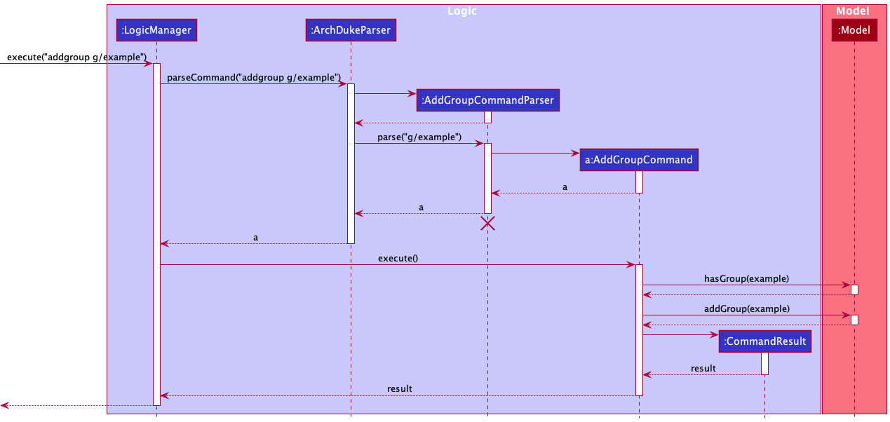
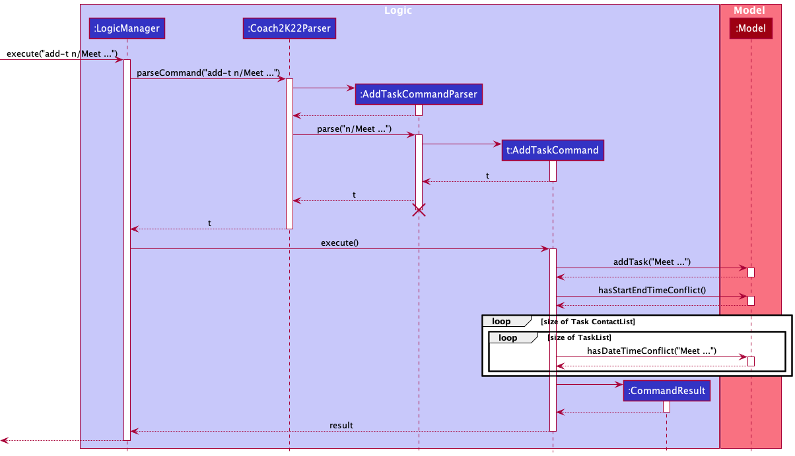
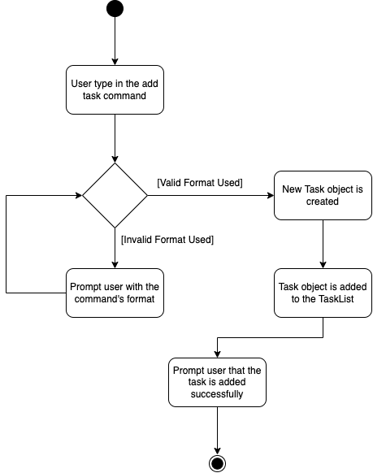
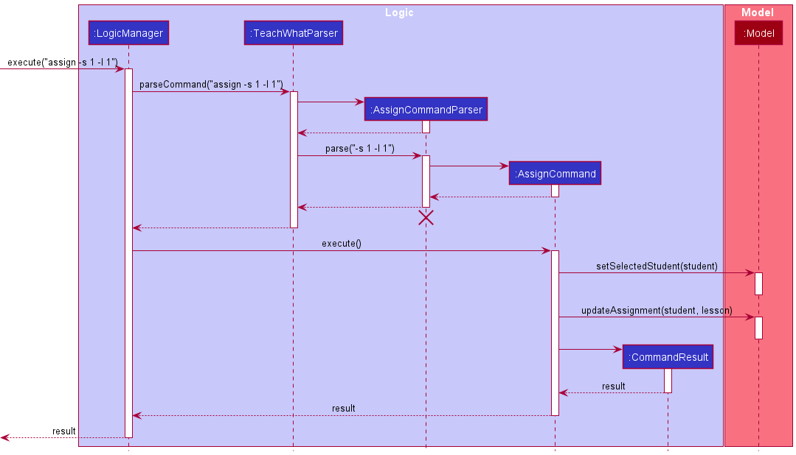

* Table of Contents
{:toc}

--------------------------------------------------------------------------------------------------------------------

## **Acknowledgements**

* {list here sources of all reused/adapted ideas, code, documentation, and third-party libraries -- include links to the original source as well}

--------------------------------------------------------------------------------------------------------------------

## **Setting up, getting started**

Refer to the guide [_Setting up and getting started_](SettingUp.md).

--------------------------------------------------------------------------------------------------------------------

## **Design**

:bulb: **Tip:** The `.puml` files used to create diagrams in this document can be found in the [diagrams](https://github.com/se-edu/addressbook-level3/tree/master/docs/diagrams/) folder. Refer to the [_PlantUML Tutorial_ at se-edu/guides](https://se-education.org/guides/tutorials/plantUml.html) to learn how to create and edit diagrams.

### Architecture

The ***Architecture Diagram*** given above explains the high-level design of the App.

Given below is a quick overview of main components and how they interact with each other.

**Main components of the architecture**

**`Main`** has two classes called [`Main`](https://github.com/se-edu/addressbook-level3/tree/master/src/main/java/seedu/address/Main.java) and [`MainApp`](https://github.com/se-edu/addressbook-level3/tree/master/src/main/java/seedu/address/MainApp.java). It is responsible for,
* At app launch: Initializes the components in the correct sequence, and connects them up with each other.
* At shut down: Shuts down the components and invokes cleanup methods where necessary.

[**`Commons`**](#common-classes) represents a collection of classes used by multiple other components.

The rest of the App consists of four components.

* [**`UI`**](#ui-component): The UI of the App.
* [**`Logic`**](#logic-component): The command executor.
* [**`Model`**](#model-component): Holds the data of the App in memory.
* [**`Storage`**](#storage-component): Reads data from, and writes data to, the hard disk.

**How the architecture components interact with each other**

The *Sequence Diagram* below shows how the components interact with each other for the scenario where the user issues the command `delete 1`.

Each of the four main components (also shown in the diagram above),

* defines its *API* in an `interface` with the same name as the Component.
* implements its functionality using a concrete `{Component Name}Manager` class (which follows the corresponding API `interface` mentioned in the previous point.

For example, the `Logic` component defines its API in the `Logic.java` interface and implements its functionality using the `LogicManager.java` class which follows the `Logic` interface. Other components interact with a given component through its interface rather than the concrete class (reason: to prevent outside component's being coupled to the implementation of a component), as illustrated in the (partial) class diagram below.

The sections below give more details of each component.

### UI component

The **API** of this component is specified in [`Ui.java`](https://github.com/se-edu/addressbook-level3/tree/master/src/main/java/seedu/address/ui/Ui.java)

The UI consists of a `MainWindow` that is made up of parts e.g.`CommandBox`, `ResultDisplay`, `PersonListPanel`, `GroupListPanel`, `StatusBarFooter` etc. 
All these, including the `MainWindow`, inherit from the abstract `UiPart` class which captures the commonalities between classes that represent parts of the visible GUI.

The `UI` component uses the JavaFx UI framework. The layout of these UI parts are defined in matching `.fxml` files that are in the `src/main/resources/view` folder. 
For example, the layout of the [`MainWindow`](https://github.com/se-edu/addressbook-level3/tree/master/src/main/java/seedu/address/ui/MainWindow.java) is specified in [`MainWindow.fxml`](https://github.com/se-edu/addressbook-level3/tree/master/src/main/resources/view/MainWindow.fxml)

The `UI` component,

* executes user commands using the `Logic` component.
* listens for changes to `Model` data so that the UI can be updated with the modified data.
* keeps a reference to the `Logic` component, because the `UI` relies on the `Logic` to execute commands.
* depends on some classes in the `Model` component, as it displays `Person` and `Group` objects residing in the `Model` 

### Logic component

**API** : [`Logic.java`](https://github.com/se-edu/addressbook-level3/tree/master/src/main/java/seedu/address/logic/Logic.java)

Here's a (partial) class diagram of the `Logic` component:

How the `Logic` component works:
1. When `Logic` is called upon to execute a command, it uses the `AddressBookParser` class to parse the user command.
1. This results in a `Command` object (more precisely, an object of one of its subclasses e.g., `AddCommand`) which is executed by the `LogicManager`.
1. The command can communicate with the `Model` when it is executed (e.g. to add a person).
1. The result of the command execution is encapsulated as a `CommandResult` object which is returned back from `Logic`.

The Sequence Diagram below illustrates the interactions within the `Logic` component for the `execute("delete 1")` API call.

:information_source: **Note:** The lifeline for `DeleteCommandParser` should end at the destroy marker (X) but due to a limitation of PlantUML, the lifeline reaches the end of diagram.

Here are the other classes in `Logic` (omitted from the class diagram above) that are used for parsing a user command:

How the parsing works:
* When called upon to parse a user command, the `AddressBookParser` class creates an `XYZCommandParser` (`XYZ` is a placeholder for the specific command name e.g., `AddCommandParser`) which uses the other classes shown above to parse the user command and create a `XYZCommand` object (e.g., `AddCommand`) which the `AddressBookParser` returns back as a `Command` object.
* All `XYZCommandParser` classes (e.g., `AddCommandParser`, `DeleteCommandParser`, ...) inherit from the `Parser` interface so that they can be treated similarly where possible e.g, during testing.

### Model component
**API** : [`Model.java`](https://github.com/se-edu/addressbook-level3/tree/master/src/main/java/seedu/address/model/Model.java)

The `Model` component,

* stores the ArchDuke data i.e., all `Person`, `Group`, `Task` objects (which are contained in a `UniquePersonList`, `UniqueGroupList`, `UniqueTaskList` objects respectively).
* stores the currently 'selected' `Person` objects (e.g., results of a search query) as a separate _filtered_ list which is exposed to outsiders as an unmodifiable `ObservableList<Person>` that can be 'observed' e.g. the UI can be bound to this list so that the UI automatically updates when the data in the list change.
* stores the currently 'selected' `Group` objects (e.g., results of a search query) as a separate _filtered_ list which is exposed to outsiders as an unmodifiable `ObservableList<Group>` that can be 'observed' e.g. the UI can be bound to this list so that the UI automatically updates when the data in the list change.
* stores a `UserPref` object that represents the user’s preferences. This is exposed to the outside as a `ReadOnlyUserPref` objects.
* does not depend on any of the other three components (as the `Model` represents data entities of the domain, they should make sense on their own without depending on other components)

:information_source: **Note:** An alternative (arguably, a more OOP) model is given below. It has a `Tag` list in the `AddressBook`, which `Person` references. This allows `AddressBook` to only require one `Tag` object per unique tag, instead of each `Person` needing their own `Tag` objects. 

### Storage component

**API** : [`Storage.java`](https://github.com/se-edu/addressbook-level3/tree/master/src/main/java/seedu/address/storage/Storage.java)

The `Storage` component,
* can save both ArchDuke data and user preference data in json format, and read them back into corresponding objects.
* inherits from both `AddressBookStorage` and `UserPrefStorage`, which means it can be treated as either one (if only the functionality of only one is needed).
* depends on some classes in the `Model` component (because the `Storage` component's job is to save/retrieve objects that belong to the `Model`)

### Common classes

Classes used by multiple components are in the `seedu.addressbook.commons` package.

--------------------------------------------------------------------------------------------------------------------

## **Implementation**

This section describes some noteworthy details on how certain features are implemented.

## Delete student contact feature

### About delete student contact feature

The delete student contact feature allows users to delete an existing student contact from the student contact list.

## Add group feature

### About add group feature

The add group feature allows users to create a has-yet-to-exist student group in the student group list via the command 
`addgroup g/GROUP_NAME`.

### How it is implemented

The `addgroup` command mechanism is facilitated by the `AddGroupCommand` and the `AddGroupCommandParser`.
It allows users to add a not-already-existing-group to the ArchDuke student group list. 
It uses the `AddressBook#addGroup(Group group)` which is exposed in the `Model` 
interface as `Model#addGroup(Group group)`. Then, the `add(Group groupToAdd)` is called on the `UniqueGroupList`
in `AddressBook` to add the group to the group list.

Given below is the example usage scenario and how the add group mechanism behaves at each step.

#### Parsing user input

1. The user inputs the `addgroup` command and provide the `GROUP_NAME` of the group in which the user wants to add.

2. The `ArchDukeParser` then preliminary process the user input and creates a new `AddGroupCommandParser`.

3. The `AddGroupCommandParser` then parses the user input and check whether all the input attributes are present by checking the presence of the prefixes. 
It also checks whether the command is in the correct format. In this case, the required prefix and attribute is `g/GROUP_NAME`.     At this stage, if not all the prefixes are present, 
`ParseException` would be thrown.

4. If the required prefixes and attributes are present (i.e. `g/GROUP_NAME`), `AddGroupCommandParser` will then call the `ParserUtil#parseGroupName()` 
method to check for the validity of the input `GROUP_NAME`.     At this stage, `ParseException` would be thrown if the 
`GROUP_NAME` specified is invalid.

5. The `AddGroupCommandParser` then creates the `AddGroupCommand` based on the processed input.

#### Command execution

6. The `LogicManager` executes the `AddGroupCommand`.

7. The `AddGroupCommand` calls the `Model#hasGroup()` to check if the group with the same `GROUP_NAME` has already existed in the group list. 
`CommandException` would be thrown if there already existed a group with the same group name.

8. The `AddGroupCommand` then calls the `Model#addGroup()` to add the input group to the list.

#### Displaying of result

9. Finally, the `AddGroupCommand` creates a `CommandResult` with a success message and return it to the `LogicManager` to complete the command execution. 
The GUI would also be updated on this change in the group list and update the display of group list accordingly.

The following sequence diagram shows how the `addgroup` mechanism works:

:information_source: **Note:** The lifeline for `AddGroupCommandParser` should end at the destroy marker (X) but due to a limitation of PlantUML, the lifeline reaches the end of diagram.

The following activity diagram summarizes what happens when a user executes the `addgroup` command:

## Delete group feature

### About delete group feature

The delete group feature allows users to delete an existing student group in 
the student group list via the command `delgroup g/GROUP_NAME`.

### How it is implemented

The `delgroup` command mechanism is facilitated by the `DeleteGroupCommand` and the `DeleteGroupCommandParser`. 
It allows users to delete an already-existing-group from the ArchDuke student group list. It uses the `AddressBook#removeGroup(Group key)`
which is exposed in the `Model` interface as `Model#deleteGroup(Group target)`. Then, the `remove(Group toRemove)` is called on the `UniqueGroupList`
to remove the group from the group list.

Given below is the example usage scenario and how the delete group mechanism behaves at each step.

#### Parsing user input

1. The user inputs the `delgroup` command and provide the `GROUP_NAME` of the group in which the user wants to remove.

2. The `ArchDukeParser` then preliminary process the user input and creates a new `DeleteGroupCommandParser`.

3. The `DeleteGroupCommandParser` then parses the user input and check whether all the input attributes are present by checking the presence of the prefixes.
    It also checks whether the command is in the correct format. In this case, the required prefix and attribute is `g/GROUP_NAME`.     At this stage, if not all the prefixes are present,
   `ParseException` would be thrown.

4. If the required prefixes and attributes are present (i.e. `g/GROUP_NAME`), `DeleteGroupCommandParser` will then call the `ParserUtil#parseGroupName()`
   method to check for the validity of the input `GROUP_NAME`.     At this stage, `ParseException` would be thrown if the
   `GROUP_NAME` specified is invalid.

5. The `DeleteGroupCommandParser` then creates the `DeleteGroupCommand` based on the processed input.

#### Command execution

6. The `LogicManager` executes the `DeleteGroupCommand`.

7. The `DeleteGroupCommand` calls the `Model#getFilteredGroupList()` to get the current unmodifiable view of the filtered group list.

8. The `DeleteGroupCommand` calls the `contains()` method on the obtained filtered group list to check if the group with the same `GROUP_NAME` existed in the group list.
      `CommandException` would be thrown if there exists no group with the same group name.

9. The `DeleteGroupCommand` then calls the `Model#deleteGroup()` to delete the input group to from the group list.

#### Displaying of result

10. Finally, the `DeleteGroupCommand` creates a `CommandResult` with a success message and return it to the `LogicManager` to complete the command execution.
    The GUI would also be updated on this change in the group list and update the display of group list accordingly.

The following sequence diagram shows how the `delgroup` mechanism works:

:information_source: **Note:** The lifeline for `DeleteGroupCommandParser` should end at the destroy marker (X) but due to a limitation of PlantUML, the lifeline reaches the end of diagram.

The following activity diagram summarizes what happens when a user executes the `delgroup` command:

### Design considerations

#### Aspect: What the delgroup command deletes by

* **Alternative 1 (current choice)**: Deletes a group by the group name.

  * Pros: It is more intuitive as user who wants to delete a group would **already know** what group he/she wants to delete, and hence the group name.
  Users would not have to search through the group list to see which index the group he/she wants to delete is located. 
  Searching through the list may be especially troublesome if there are many groups in the group list.
  
  * Cons: User would have to type the entire group name.
  
* **Alternative 2**: Deletes a group by the index of the group in the list.

  * Pros: Users could delete the group by just typing a single number. This may be faster if the group is already visible in the group list without having to search
    (e.g. when the target group to delete is at the top of the list).
  
  * Cons: If there are many groups in the group list, users would have to execute another command (i.e. to find the group to get the group index) 
  before being able to delete the desired group.

#### Aspect: Allowing reference to group name to be case-insensitive

The implementation takes in user experience as one of the most important decision when deciding how a feature should behave. 
Since the implementation chooses to delete a group by its group name, there was a concern about the user having to type possibly lengthy
group name to refer to the target group to delete.  

To enhance the user experience for the target group (i.e. fast typists), the reference to the group is designed such that it is case-insensitive.
This means that the users would not need to worry about cases as long as the spelling and spacing are correct. 
The aim is to make reference to the target group as easy as possible and to minimize typo errors.

## Add task to an existing group feature

### About add task feature

The add task feature allows users to add a yet-to-exist task to an existing
student group via the command `addtask task/TASK_NAME g/GROUP_NAME`.

### How it is implemented

The `addtask` command mechanism is facilitated by the `AddTaskCommand` and the `AddTaskCommandParser`.
It allows users to add a yet-to-exist task to an already existing group in ArchDuke. It uses the `AddressBook#addTassk(Task task, Group group)`
which is exposed in the `Model` interface as `Model#addTask(Task task, Group group)`. Then, the `getGroup(Group group)` is called on the `UniqueGroupList` to get the target group,
and `Group#addTask(Task task)` is called on the target group to add the task to the group.

Given below is the example usage scenario and how add task mechanism behaves at each step.

#### Parsing user input

1. The user inputs the `addtask` command and provide the `TASK_NAME` and `GROUP_NAME` of the task and group
in which the user wants to add.

2. The `ArchDukeParser` then preliminary process the user input and creates a new `AddTaskCommandParser`.

3. The `AddTaskCommandParser` then parses the user input and check whether all the input attributes are present by checking the presence of the prefixes.
   It also checks whether the command is in the correct format. In this case, the required prefix and attribute are `task/TASK_NAME` and `g/GROUP_NAME`.     At this stage, if not all the prefixes are present,
   `ParseException` would be thrown.

4. If the required prefixes and attributes are present (i.e. `task/TASK_NAME` and `g/GROUP_NAME`), `AddTaskCommandParser` will then call the `ParserUtil#parseGroupName()`
   and `ParseUtil#parseTaskName()` to check for the validity of the input `TASK_NAME` and `GROUP_NAME`.     At this stage, `ParseException` would be thrown if the
   `GROUP_NAME` and/or `TASK_NAME` specified is invalid.

5. The `AddTaskCommandParser` then creates the `AddTaskCommand` based on the processed inputs.

#### Command execution

6. The `LogicManager` executes the `AddTaskCommand`.

7. The `AddTaskCommand` calls the `Model#hasGroup()` to check if the group with the same `GROUP_NAME` has existed in the group list.
   `CommandException` would be thrown if there has yet to exist a group with the same group name. 

8. Similarly, the `AddTaskCommand` then call the `Model#hasTask()` to check if the task with the same `TASK_NAME` has already existed in that group.
`CommandException` would be thrown if there is already a task with the same task name in the group.

9. `AddTaskCommand` then call the static `createAddedTaskGroup(Group groupToAddTask, Task taskToAdd, Model model)` to create a new `Group` with the task added.
The task is added through the call of `Model#addTask()` by `AddTaskCommand`.

10. `AddTaskCommand` then call `Model#setGroup(Group target, Group editedGroup)` to replace the old target group with the new group with the task added. 
This will update the `UniqueGroupList` of the new `Group` with the task added.

#### Displaying of result

11. Finally, the `AddTaskCommand` creates a `CommandResult` with a success message and return it to the `LogicManager` to complete the command execution.
    The GUI would also be updated on this change in the group list and update the display of group list accordingly.

The following sequence diagram shows how the `addtask` mechanism works:

:information_source: **Note:** The lifeline for `AddTaskCommandParser` should end at the destroy marker (X) but due to a limitation of PlantUML, the lifeline reaches the end of diagram.

The following activity diagram summarizes what happens when a user executes the `addtask` command:

### Design considerations

#### Aspect: Allowing reference to task name to be case-insensitive

As users are required to type the entire task name to reference a task (i.e. in `addtask` and subsequently in `deltask` commands), 
the reference to a task is implemented in such a way to minimise typo errors and to facilitate target users (i.e. fast typists).
By making the task name case-insensitive, users can easily refer to the particular task so long as the spelling and spacing is correct.

## View task feature

### About view task feature

The view task feature allows users to view tasks in an existing 
student group via the command `viewtask g/GROUP_NAME`.

### How it is implemented

The `viewtask` command mechanism is facilitated by the `ViewTaskCommand` and the `ViewTaskCommandParser`.
It allows users to view tasks in an already existing group in ArchDuke. It uses the `AddressBook#viewTassk(Group group)`
which is exposed in the `Model` interface as `Model#viewTask(Group group)`. Then, the `getGroup(Group group)` is called on the `UniqueGroupList` to get the target group,
and `Group#viewTask()` is called on the target group to view tasks in the group.

Given below is the example usage scenario and how view task mechanism behaves at each step.

#### Parsing user input

1. The user inputs the `viewtask` command and provide the `GROUP_NAME` of the group
   in which the user wants to view tasks.

2. The `ArchDukeParser` then preliminary process the user input and creates a new `ViewTaskCommandParser`.

3. The `ViewTaskCommandParser` then parses the user input and check whether all the input attributes are present by checking the presence of the prefixes.
   It also checks whether the command is in the correct format. In this case, the required prefix and attribute is `g/GROUP_NAME`.     At this stage, if not all the prefixes are present,
   `ParseException` would be thrown.

4. If the required prefixes and attributes is present (i.e. `g/GROUP_NAME`), `ViewTaskCommandParser` will then call the `ParserUtil#parseGroupName()`
   to check for the validity of the input `GROUP_NAME`.     At this stage, `ParseException` would be thrown if the
   `GROUP_NAME` specified is invalid.

5. The `ViewTaskCommandParser` then creates the `ViewTaskCommand` based on the processed inputs.

#### Command execution

6. The `LogicManager` executes the `ViewTaskCommand`.

7. The `ViewTaskCommand` calls the `Model#hasGroup()` to check if the group with the same `GROUP_NAME` has existed in the group list.
   `CommandException` would be thrown if there has yet to exist a group with the same group name.

8. The `ViewTaskCommand` then calls the `Model#viewTask(Group group)` to generate the `String` output of the tasks in the group's task list.

#### Displaying of result

9. Finally, the `ViewTaskCommand` creates a `CommandResult` with the previously generated `String` as message and return it to the `LogicManager` to complete the command execution.

The following sequence diagram shows how the `viewtask` mechanism works:

:information_source: **Note:** The lifeline for `ViewTaskCommandParser` should end at the destroy marker (X) but due to a limitation of PlantUML, the lifeline reaches the end of diagram.

The following activity diagram summarizes what happens when a user executes the `viewtask` command:

## Assign student contact to an existing group feature

### About assign feature

The assign feature allows users to assign a yet-to-assign student contact to an existing
student group via the command `assign INDEX g/GROUP_NAME`.

### How it is implemented

The `assign` command mechanism is facilitated by the `AssignCommand` and the `AssignCommandParser`.
It allows users to add a yet-to-assign student contact to an already existing group in ArchDuke. It uses the `AddressBook#assignPerson(Person personToAssign, Group group)`
which is exposed in the `Model` interface as `Model#assignPerson(Person person, Group group)`. Then, the `Group#AssignPerson(Person person)` is called to 
assign a person to the group. 

Given below is the example usage scenario and how assign mechanism behaves at each step.

#### Parsing user input

1. The user inputs the `assign` command and provide the `INDEX` of the student contact and `GROUP_NAME` of the group
in which the users want to assign the student contact to.

2. The `ArchDukeParser` then preliminary process the user input and creates a new `AssignCommandParser`.

3. The `AassignCommandParser` then parses the user input and check whether all the input attributes are present by checking the presence of the prefixes.
   It also checks whether the command is in the correct format. In this case, the required prefix and attribute is `g/GROUP_NAME`.     At this stage, if not all the prefixes are present,
   `ParseException` would be thrown. 

4. If the required prefixes and attributes is present (i.e. `g/GROUP_NAME`), `AssignCommandParser` will then call the `ParserUtil#parseGroupName()`
   to check for the validity of the input `GROUP_NAME`. It also calls the `ParserUtil#parseIndex()` to check for the validity of the `INDEX`.
       At this stage, `ParseException` would be thrown if the
   `GROUP_NAME` specified is invalid and/or the `INDEX` is invalid.

5. The `AssignCommandParser` then creates the `AssignCommand` based on the processed inputs.

#### Command execution

6. The `LogicManager` executes the `AssignCommand`.

7. The `AssignCommand` calls the `Model#hasGroup()` to check if the group with the same `GROUP_NAME` has existed in the group list.
   `CommandException` would be thrown if there has yet to exist a group with the same group name. Subsequently, `Model#getFilteredGroupList()`
is called to get the unmodifiable view of the group list. The list is then being looped through to obtain the target group.

8. Similarly, `AssignCommand` calls the `Model#getFilteredPersonList()` and get the target student contact by index.

9. `AssignCommand` calls `Group#personExists` on the target group to check if the student contact has already existed in the group.
`CommandException` is thrown if there exists the same person in the group.

10. The `Model#assignPerson(Person person, Group group)` is called to assign the student contact to the target group.

#### Displaying of result

11. Finally, the `AssignCommand` creates a `CommandResult` with a success message and return it to the `LogicManager` to complete the command execution.
     The GUI would also be updated on this change in the group list and update the display of group list accordingly.

The following sequence diagram shows how the `assign` mechanism works:

:information_source: **Note:** The lifeline for `AssignCommandParser` should end at the destroy marker (X) but due to a limitation of PlantUML, the lifeline reaches the end of diagram.

The following activity diagram summarizes what happens when a user executes the `assign` command:

### Design considerations

#### Aspect: What the assign command assigns student contact by

* **Alternative 1 (current choice)**: Assigns by student contact index.

    * Pros: It is fast as the users could just refer to the student contact by a number. This makes the command very short
    as compared to having to type out the student contact's name etc.

    * Cons: If there exists many student contacts in the student contact list, users would have to search through the list to 
    obtain the index of the student contact that the users want to assign to a group. This may result in an additional step of 
    filtering through the list via other commands to obtain the target student contact.

* **Alternative 2**: Assigns by student contact name.

    * Pros: It is arguably more intuitive as the users would already know the name of the student contact in which the users 
    want to assign to the group. 

    * Cons: It may result in long commands as users would have to type in the student contact's name.
  
    * Limitations: Although the reference to the student contact by name might be more intuitive and is a closer representation of 
    how a person is being referred to in the real-world, the current limitation of the app makes it impossible to refer to a student contact
    solely by his name. This is because the current implementation of the app allows any two users to have the same name (i.e. name is not
  a unique identifier of a student contact). In the current implementation, a student contact is uniquely identified by `EMAIL` and/or `PHONE_NUMBER`.
    Hence, reference to a student contact by his name is impossible due to possible duplications in their names.

## Find student contact feature

### About find contact feature

The `find` command allows the search of a contact by attributes via the command `find KEYWORDS` where `KEYWORDS` can be either `NAME` , `PHONE`, `EMAIL`, `ACADEMIC MAJOR` or `TAGS`

### How it is implemented
The feature is made possible through introducing an `AttributeContainsKeywordsPredicate` interface which is
implemented by all the `Person`'s attributes. Hence, there are more classes being introduced -
`NameContainsKeywordsPredicate`, `PhoneContainsKeywordsPredicate` and so on.

Given below is the example usage scenario and how the `find` mechanism behaves at each step.

#### Parsing user input

1. The user inputs the `find` command and provide the input with the attribute of the student contact and its respective prefix (eg. `n/NAME` or `p/PHONE`) in which the user wants to find the contact.

2. The `ArchDukeParser` then preliminary process the user input and creates a new `FindCommandParser`.

3. The `FindCommandParser` then parses the user input and check whether all the input attributes are present by checking the presence of the prefixes.
   It also checks whether the command is in the correct format and ensures that there are no multiples of prefixes. In this case, the required prefix and attribute can be any of the `Person`'s attribute, such as  `n/NAME` or `a/ACADEMIC MAJOR`.     At this stage, if none of the prefixes are present or the input contains multiple prefixes,
   `ParseException` would be thrown.

4. If the required prefix and attribute is present (i.e. `n/NAME`), `FindCommandParser` will then call the `ParserUtil#parseName()`
   to check for the validity of the input `NAME`.  
   
:information_source: **Note:** The `ParserUtil#parse` will follow the input of the prefix (e.g. If the prefix used is `p/` the `ParserUtil` will be `ParserUtil#parsePhone()` or `e/` then the `ParserUtil` will be `ParserUtil#parseEmail()`
 
     At this stage, `ParseException` would be thrown if the
   `NAME` specified is invalid.

5. The `FindCommandParser` then creates the `FindCommand` based on the processed inputs.

#### Command execution

6. The `LogicManager` executes the `FindCommand`.
7. The `FindCommand` calls the `Model#updateFilteredPersonList()` to update the filtered person list based on the user input attributes.
8. The `FindCommand` then calls the `Model#getFilteredPersonList()#size()` to get the size of the person list. The size will correspond to the number of persons listed.

#### Displaying of result
9. Finally, the `FindCommand` creates a `CommandResult` with a success message and return it to the `LogicManager` to complete the command execution.
    The GUI would also be updated on this change in the person list and update the display of person list accordingly.

The following sequence diagram shows how the `find` mechanism works:

:information_source: **Note:** The lifeline for `FindCommandParser` should end at the destroy marker (X) but due to a limitation of PlantUML, the lifeline reaches the end of diagram.

The following activity diagram summarizes what happens when a user executes the `find` command:

### Design considerations

#### Aspect: How the find command finds the student contact 

* **Alternative 1**: finds student contact without any prefixes.
    * Pros: Allows the users to find student contact with ease without remembering any prefixes.
    * Cons: It is hard to determine which attributes the users are referring to. If there are multiple contacts which have similar attribute names, the `find` will not be able to pinpoint on the correct contact. For instance, Contact 1: `Name = Ben Science`, `Academic Major = Mathematics` and Contact 2: `Name = Alice Teo`, `Academic Major = Science`. If the user input `find Science`, the two contacts will be listed and hence the search efficiency is compromised.

* **Alternative 2**: finds through partial search (eg. `Dav` to find `David`)
    * Pros: Allows the users to save time as they are not required to input the full details.
    * Cons: In a situation when there are multiple contacts with similar names (i.e. `Ben`, `Benedict`, `Benny`), a partial search may not be really beneficial as the users would still require to input the almost to full name in order to get the desired person.
  
## \[Proposed\] Undo/redo feature

#### Proposed Implementation

The proposed undo/redo mechanism is facilitated by `VersionedAddressBook`. It extends `AddressBook` with an undo/redo history, stored internally as an `addressBookStateList` and `currentStatePointer`. Additionally, it implements the following operations:

* `VersionedAddressBook#commit()` — Saves the current address book state in its history.
* `VersionedAddressBook#undo()` — Restores the previous address book state from its history.
* `VersionedAddressBook#redo()` — Restores a previously undone address book state from its history.

These operations are exposed in the `Model` interface as `Model#commitAddressBook()`, `Model#undoAddressBook()` and `Model#redoAddressBook()` respectively.

Given below is an example usage scenario and how the undo/redo mechanism behaves at each step.

Step 1. The user launches the application for the first time. The `VersionedAddressBook` will be initialized with the initial address book state, and the `currentStatePointer` pointing to that single address book state.

Step 2. The user executes `delete 5` command to delete the 5th person in the address book. The `delete` command calls `Model#commitAddressBook()`, causing the modified state of the address book after the `delete 5` command executes to be saved in the `addressBookStateList`, and the `currentStatePointer` is shifted to the newly inserted address book state.

Step 3. The user executes `add n/David …​` to add a new person. The `add` command also calls `Model#commitAddressBook()`, causing another modified address book state to be saved into the `addressBookStateList`.

:information_source: **Note:** If a command fails its execution, it will not call `Model#commitAddressBook()`, so the address book state will not be saved into the `addressBookStateList`.

Step 4. The user now decides that adding the person was a mistake, and decides to undo that action by executing the `undo` command. The `undo` command will call `Model#undoAddressBook()`, which will shift the `currentStatePointer` once to the left, pointing it to the previous address book state, and restores the address book to that state.

:information_source: **Note:** If the `currentStatePointer` is at index 0, pointing to the initial AddressBook state, then there are no previous AddressBook states to restore. The `undo` command uses `Model#canUndoAddressBook()` to check if this is the case. If so, it will return an error to the user rather
than attempting to perform the undo.

The following sequence diagram shows how the undo operation works:

:information_source: **Note:** The lifeline for `UndoCommand` should end at the destroy marker (X) but due to a limitation of PlantUML, the lifeline reaches the end of diagram.

The `redo` command does the opposite — it calls `Model#redoAddressBook()`, which shifts the `currentStatePointer` once to the right, pointing to the previously undone state, and restores the address book to that state.

:information_source: **Note:** If the `currentStatePointer` is at index `addressBookStateList.size() - 1`, pointing to the latest address book state, then there are no undone AddressBook states to restore. The `redo` command uses `Model#canRedoAddressBook()` to check if this is the case. If so, it will return an error to the user rather than attempting to perform the redo.

Step 5. The user then decides to execute the command `list`. Commands that do not modify the address book, such as `list`, will usually not call `Model#commitAddressBook()`, `Model#undoAddressBook()` or `Model#redoAddressBook()`. Thus, the `addressBookStateList` remains unchanged.

Step 6. The user executes `clear`, which calls `Model#commitAddressBook()`. Since the `currentStatePointer` is not pointing at the end of the `addressBookStateList`, all address book states after the `currentStatePointer` will be purged. Reason: It no longer makes sense to redo the `add n/David …​` command. This is the behavior that most modern desktop applications follow.

The following activity diagram summarizes what happens when a user executes a new command:

#### Design considerations:

**Aspect: How undo & redo executes:**

* **Alternative 1 (current choice):** Saves the entire address book.
  * Pros: Easy to implement.
  * Cons: May have performance issues in terms of memory usage.

* **Alternative 2:** Individual command knows how to undo/redo by
  itself.
  * Pros: Will use less memory (e.g. for `delete`, just save the person being deleted).
  * Cons: We must ensure that the implementation of each individual command are correct.

_{more aspects and alternatives to be added}_

### \[Proposed\] Data archiving

_{Explain here how the data archiving feature will be implemented}_

--------------------------------------------------------------------------------------------------------------------

## **Documentation, logging, testing, configuration, dev-ops**

* [Documentation guide](Documentation.md)
* [Testing guide](Testing.md)
* [Logging guide](Logging.md)
* [Configuration guide](Configuration.md)
* [DevOps guide](DevOps.md)

--------------------------------------------------------------------------------------------------------------------

## **Appendix: Requirements**

### Product scope

**Target user profile**:

* is a student
* has a need to work collaboratively with other students
* has a need to know the contacts and details of other students
* has a need to manage group tasks
* has a need to get update on progress of the group tasks
* prefer desktop apps over other types
* can type fast
* prefers typing to mouse interactions
* is reasonably comfortable using CLI apps

**Value proposition**: manage student contacts, groups, and tasks faster than a typical mouse/GUI driven app

### User stories

Priorities: High (must have) - `* * *`, Medium (nice to have) - `* *`, Low (unlikely to have) - `*`

| Priority | As a …​                                                              | I want to …​                                                     | So that I can…​                                                                               |
|----------|----------------------------------------------------------------------|------------------------------------------------------------------|-----------------------------------------------------------------------------------------------|
| `* * *`  | student who needs to contact other students for work-related matters | add the contact information of other students into my database   | easily view other students' contact when I need to                                            |
| `* * *`  | student                                                              | delete a student information from my database                    | only keep the information of student contacts who are still relevant to me                    | 
| `* * *`  | student who needs to work in a collaborative work                    | create a student group                                           | classify relevant students together in one place                                              | 
| `* * *`  | student who wants to only keep groups that are presently relevant    | delete a student group                                           | clear the inactive groups out of my group list and not be distracted by outdated information  |
| `* * *`  | student who works on a group project                                 | add other students to my group                                   | remember who are the students in my group                                                     |
| `* * *`  | student                                                              | delete another student                                           | keep only relevant students in the group                                                      |
| `* * *`  | student who works in a collaborative group project                   | add a task to a group                                            | let students in the same group see what are the tasks that need to be completed               |
| `* * *`  | student who works in a collaborative group project                   | delete a task from a group                                       | remove irrelevant tasks from a group and only keep tasks that are still relevant in the group |
| `* * *`  | student who works in a group project with other members              | view who are the students in my group                            | know who my group members are                                                                 |
| `* * *`  | student who needs to keep track of tasks that need to be done        | view the tasks that belong to each group                         | know the list of tasks that need to be completed for that particular group                    |
| `* * *`  | student with many other student contacts in my list                  | search for student contacts based on their information           | easily find student contacts that have the information that I am looking for                  |
| `* *`    | student who needs to keep track of my deadlines                      | add a deadline to a task                                         | keep a record of when a task needs to be done                                                 |
| `* *`    | student with many groups in my list                                  | search for the group I am looking for                            | find the group I am looking for in a shorter amount of time                                   |
| `* *`    | student with many group tasks to complete                            | tag group tasks based on priority (high, medium, low)            | have an idea on which task my group need to start working on first                            |
| `* *`    | student who uses the application for the first time                  | view in-app guidance                                             | know how to navigate through the app when I am still unfamiliar with it                       |
| `* `     | student who wants to keep track of the project progress              | track the progress of the task that is handled by other students | know the overall picture of our project                                                       |
| `*`      | student with bad time management                                     | get a reminder of my impending group projects                    | not forget to complete the tasks by the deadline                                              |
| `*`      | student                                                              | keep track of students who are in mutual groups                  | know who are in the same groups as I am                                                       |

### Use cases

(For all use cases below, the **System** is `ArchDuke` and the **Actor** is the `Student`, unless specified otherwise)

**Use case: UC01 - Add a student contact**

**MSS:**

1. Student requests to add a student contact in ArchDuke.

2. ArchDuke adds and displays the student contact to the contact list.

   Use case ends.

**Extensions**

* 1a. The student contact attributes are in an invalid format.

    * 1a1. ArchDuke displays an error message.
  
      Use case resumes from step 1.

* 1b. The student contact has missing attributes.

    * 1b1. ArchDuke displays an error message.
  
      Use case resumes from step 1.

--------------------------------------------------------------------------------------------------------------------
    
**Use case: UC02 - Delete a student contact**

**MSS:**

1. Student requests to delete a student in the contact list.

2. ArchDuke deletes the particular student contact and no longer display that student contact.

   Use case ends.

**Extensions**

* 1a. The given index of the student contact is invalid.

    * 1a1. ArchDuke shows an error message.
  
       Use case resumes from step 1.
  
* 1b. The student contact list is empty.

    Use case ends. 

--------------------------------------------------------------------------------------------------------------------

**Use case: UC03 - List student contacts**

**MSS:**

1. User requests to list student contacts.

2. ArchDuke displays a list of student contacts.

    Use case ends.

**Extensions**

* 2a. The student contact list is empty.

   Use case ends.

--------------------------------------------------------------------------------------------------------------------

**Use case: UC04 - Find student contacts**

**MSS:**

1. User requests to filter/find student contacts.

2. ArchDuke filters and displays all the relevant student contacts based on the input attributes.

   Use case ends.

**Extensions**

* 1a. User enters an invalid find command format.

  * 1a1. ArchDuke shows an error message.
  
    Use case resumes from step 1.

* 1b. The student contact list is empty.

    Use case ends.

--------------------------------------------------------------------------------------------------------------------

**Use case: UC05 - Add a student group**

**MSS:**

1. User requests to add a student group.

2. ArchDuke adds the group and display the group.

   Use case ends.

**Extensions**

* 1a. The group command format is invalid.

    * 1a1. ArchDuke shows an error message.

      Use case resumes from step 1.

* 1b. The group name is invalid.

  * 1b1. ArchDuke shows an error message.
  
    Use case resumes from step 1.

* 1c. The group already exists in ArchDuke.

  * 1c1. ArchDuke shows an error message.
  
    Use case resumes from step 1.

--------------------------------------------------------------------------------------------------------------------

**Use case: UC06 - Delete a student group**

**MSS:**

1. User requests to delete a group in the group list.

2. ArchDuke deletes the group and no longer display the group.

   Use case ends.

**Extensions**

* 1a. The group command format is invalid.

    * 1a1. ArchDuke shows an error message.
  
       Use case resumes from step 1.

* 1b. The group name is invalid.

    * 1b1. ArchDuke shows an error message.

      Use case resumes from step 1.

* 1c. The group does not exist in ArchDuke.

    * 1c1. ArchDuke shows an error message.
  
      Use case resumes from step 1.
  
* 1d. The group list is empty.

  Use case ends.

--------------------------------------------------------------------------------------------------------------------

**Use case: UC07 - Assign a student to a group**

**MSS:**

1. User requests to add a student to a specific group.

2. ArchDuke adds the student to the group and display the student contact in the group.

   Use case ends.

**Extensions**

* 1a. The assign command format is invalid.

    * 1a1. ArchDuke shows an error message.
  
      Use case resumes from step 1.

* 1b. The group name is invalid.

    * 1b1. ArchDuke shows an error message.

      Use case resumes from step 1.

* 1c. The group does not exist in ArchDuke.

    * 1c1. ArchDuke shows an error message.
      
      Use case resumes from step 1.
  
* 1d. The student index is invalid.

    * 1d1. ArchDuke shows an error message.

       Use case resumes from step 1.
  
* 1e. The target student contact already exists in the group.

  * 1e1. ArchDuke shows an error message.
  
      Use case resumes from step 1.

--------------------------------------------------------------------------------------------------------------------

**Use case: UC08 - Deassign a student contact from a group**  

**MSS:**

1. User requests to deassign a student from a specific group.

2. ArchDuke deassigns the student from the group and no longer displays the student contact in the group.

   Use case ends.

**Extensions**

* 1a. The deassign command format is invalid.

  * 1a1. ArchDuke shows an error message.
  
    Use case resumes from step 1.
  
* 1b. The group name is invalid.

  * 1b1. ArchDuke shows an error message.
  
    Use case resumes from step 1.
  
* 1c. The group does not exist in ArchDuke.

  * 1c1. ArchDuke shows an error message.
  
    Use case resumes from step 1.
  
* 1d. The student index is invalid.

  * 1d1. ArchDuke shows an error message.
  
    Use case resumes from step 1.
  
* 1e. The student contact is not previously assigned in the group.

  * 1e1. ArchDuke shows an error message.
  
    Use case resumes from step 1.

* 1f. The student contact list in the target group is empty.

    Use case ends.

--------------------------------------------------------------------------------------------------------------------

**Use case: UC09 - View student contacts in a group**

**MSS:**

1. User requests to view student contacts in a specific group.

2. ArchDuke displays all student contacts currently assigned to the group.

    Use case ends.

**Extensions**

* 1a. The view contact command format is invalid.

  * 1a1. ArchDuke shows an error message.
  
    Use case resumes from step 1.

* 1b. The group name is invalid.

  * 1b1. ArchDuke shows an error message.
  
    Use case resumes from step 1.

* 1c. The group does not exist in ArchDuke.

  * 1c1. ArchDuke shows an error message.
  
    Use case resumes from step 1.

--------------------------------------------------------------------------------------------------------------------

**Use case: UC10 - Add a task in a group**

**MSS:**

1. User requests to add a specific task to a specific group.

2. ArchDuke adds the specific task to the group and displays the task in the group.

   Use case ends.

**Extensions**

* 1a. The add task command format is invalid.

* 1b. The group name is invalid.

    * 1b1. ArchDuke shows an error message.

       Use case resumes from step 1.

* 1c. The group does not exist in ArchDuke.

  * 1c1. ArchDuke shows an error message.
  
      Use case resumes from step 1.
  
* 1d. The task name is invalid.

  * 1d1. ArchDuke shows an error message.
  
      Use case resumes from step 1.
  
* 1e. The task already exists in the target group.

  * 1e1. ArchDuke shows an error message.
  
      Use case resumes from step 1.

--------------------------------------------------------------------------------------------------------------------

**Use case: UC11 - Delete a task from a group**

**MSS:**

1. User requests to delete a specific task from a specific group.

2. ArchDuke deletes the specific task from the group and no longer displays the task in the group.
   
   Use case ends.

**Extensions**

* 1a. The delete task command format is invalid.

    * 1a1. ArchDuke shows an error message.
  
        Use case resumes from step 1.
  
* 1b. The group name is invalid.

    * 1b1. ArchDuke shows an error message.
  
        Use case resumes from step 1.
  
* 1c. The group does not exist in ArchDuke.

    * 1c1. ArchDuke shows an error message.
  
        Use case resumes from step 1.
      
* 1d. The task name is invalid.

    * 1d1. ArchDuke shows an error message.

        Use case resumes from step 1.

* 1e. The task does not exist in the target group.

    * 1e1. ArchDuke shows an error message.

        Use case resumes from step 1.
  
* 1f. The task list in the target group is empty.

    Use case ends.

--------------------------------------------------------------------------------------------------------------------    

**Use case: UC12 - View tasks in a group**

**MSS:**

1. User requests to view tasks that belong to a specific group.

2. ArchDuke displays all tasks in that group.

   Use case ends.

**Extensions**

* 1a. The view task command format is invalid.

    * 1a1. ArchDuke shows an error message.

        Use case resumes from step 1.
  
* 1b. The group name is invalid.

    * 1b1. ArchDuke shows an error message.

        Use case resumes from step 1.
  
* 1c. The group does not exist in ArchDuke.

  * 1c1. ArchDuke shows an error message.

  Use case resumes from step 1.

--------------------------------------------------------------------------------------------------------------------

**Use case: UC13 - View help window**

**MSS:**

1. User requests to view help window in ArchDuke.

2. ArchDuke pops up help window.

   Use case ends.

--------------------------------------------------------------------------------------------------------------------

**Use case: UC14 - Exit the program**

**MSS:**

1. User requests to exit ArchDuke.

2. ArchDuke exits.

   Use case ends.

--------------------------------------------------------------------------------------------------------------------

**Use case: UC15 - Clear the data**

**MSS:**

1. User requests to clear all data in ArchDuke.

2. ArchDuke clears all data.

   Use case ends.

--------------------------------------------------------------------------------------------------------------------

### Non-Functional Requirements

1. The application should work on any _mainstream OS_ as long as it has Java `11` is installed.
2. The application should be able to hold up to 1000 student contacts without a noticeable sluggishness in performance for typical usage.
3. The application should be able to be usable enough for a beginner who just started using student contact management systems.
4. The application should be intuitive enough for a beginner who is new to Command Line Application.
5. The application should be able to work without a need for the user to install Gradle/JavaFX.
6. The application is not required to support multiple users on a single device.
7. The application is not required to support any other language other than English.
8. The user interface should be intuitive and usable enough for users who are not IT-savvy.
9. A user with above average typing speed for regular English text (i.e. not code, not system admin commands) should be able to accomplish most of the tasks faster using commands than using the mouse.
10. The response to any commands carried out by the user should become visible within 5 seconds.

### Glossary

* **Academic Major**: A student's major in university.
* **Attribute**: A set of specific value for a given object that defines the property or characteristic of that object.
* **Group list**: Every existing groups in ArchDuke.
* **Group name**: An identifier for a group that suggests the function of that group.
* **Group task**: A piece of work to be done or undertaken by one or more student contacts in a group.
* **Index**: A number in front of a student contact, used to reference that particular student contact.
* **Mainstream OS**: Windows, Linux, Unix, macOS.
* **Student contact**: A contact of a student.
* **Student contact list**: Every existing student contacts in ArchDuke or in a group.
* **Student group**: A number of student contact that are classed together. A group can have zero to any number of student contacts. A student contact can be assigned to a group.
* **Tag**: An optional one-word identifier of a student contact. A student contact can have multiple tags.
* **Task list**: Every existing tasks in a group.

--------------------------------------------------------------------------------------------------------------------

## **Appendix: Instructions for manual testing**

### Prefix summary
These are the list of prefixes used in the commands for manual testing.

| Prefix  | Representation   | 
|---------|------------------|
| `n/`    | `NAME`           | 
| `p/`    | `PHONE_NUMBER`   | 
| `e/`    | `EMAIL`          | 
| `a/`    | `ACADEMIC_MAJOR` | 
| `t/`    | `TAG`            | 
| `g/`    | `GROUP_NAME`     | 
| `task/` | `TASK_NAME`      | 

Given below are instructions to test the app manually.

:information_source: **Note:** These instructions only provide a starting point for testers to work on;
testers are expected to do more *exploratory* testing.

### Launch and shutdown

1. Initial launch

   1. Download the jar file and copy into an empty folder.

   2. Double-click the jar file.  
   Expected: Shows the GUI with a set of sample student contacts and student groups. 
   The window size may not be optimum.

2. Saving window preferences

   1. Resize the window to an optimum size. Move the window to a different location. Close the window.

   2. Re-launch the app by double-clicking the jar file. 
       Expected: The most recent window size and location is retained.

### Listing student contacts

Command: `list`  
More information on usage: [list command](UserGuide.html#listing-all-persons--list)

1. Test case: `list`  
   Expected: All student contacts shown in the student contact list.

### Clearing data

Command: `clear`  
More information on usage: [clear command](UserGuide.html#clearing-all-entries-clear)

1. Test case: `clear`  
   Expected: All data is cleared from ArchDuke.

### Exiting ArchDuke

Command: `exit`  
More information on usage: [exit command](UserGuide.html#exiting-the-program--exit)

1. Test case: `exit`  
   Expected: Exits ArchDuke, and all data is being saved.

### Help

Command: `help`  
More information on usage: [help command](UserGuide.html#viewing-help--help)

1. Test case: `help`  
   Expected: Help window pops up. 

2. Test case: Press the `F1` key  
   Expected: Similar to previous.

### Adding a student contact

Command: `add`  
More information on usage: [add command](UserGuide.html#add-student-contact-information-add)

1. Adding a student contact while all student contacts are being shown.

   1. Prerequisites: List all student contacts using the `list` command. 
   
   2. Test case: `add n/John Doe p/98765432 e/johndoe@u.nus.edu a/Computer Science t/friends t/owesMoney`  
   Expected: A student contact with the name `John Doe` with the following attributes added to the student contact list. 
   The student contact is added to the last index of the student contact list. The student contact card appeared at the last in the list.
   The details of the added student contact is shown in the success message.
   
   3. Test case: `add n/John Doe p/23456789 e/jd@u.nus.edu a/Computer Science t/friends t/owesMoney`  
   Expected: A student contact with the name `John Doe` with the following attributes added to the student contact list.
   Note that the `NAME` of this student contact is the same as that of test case 2. However, the student contact's `PHONE_NUMBER` and `EMAIL` are **different**.
   The student contact is added to the last index of the student contact list. The student contact card appeared at the last in the list.
   The details of the added student contact is shown in the success message.
   
   4. Other incorrect add student contact commands to try: `add`, `add n/John Doe` etc.
   Expected: No student contact added to the student contact list. Error details shown in the error message.

2. Adding a student contact with duplicate/identical `PHONE_NUMBER` and/or `EMAIL` attributes.

    1. Prerequisites: There exists a student contact in the list with given `PHONE_NUMBER` and `EMAIL` attributes:  
        `PHONE_NUMBER`: 23456789  
        `EMAIL`: jd@u.nus.edu  
        Example: `n/John Doe p/23456789 e/jd@u.nus.edu a/Computer Science t/friends t/owesMoney` and `n/John Doe p/98765432 e/johndoe@u.nus.edu a/Computer Science t/friends t/owesMoney`

    2. Test case: `add n/John Doe p/98765432 e/john@u.nus.edu a/Computer Science t/friends t/owesMoney`  
       Expected: No student contact added to the student contact list because the student contact has the same `PHONE_NUMBER` as someone else in the list.
       Error details shown in the error message.

    3. Test case: `add n/John Doe p/12345678 e/jd@u.nus.edu a/Computer Science t/friends t/owesMoney`  
       Expected: No student contact added to the student contact list because the student contact ahs the same `EMAIL` as someone else in the list.
       Error details shown in the error message.

3. Adding a student contact while the student contact list is being filtered.

    1. Prerequisites: Filter the student contacts by attributes using the `find` command.
   
    2. Test case: Similar to previous.  
    Expected: Similar to each respective test cases. However, the student contact list is reset to show all student contacts.

### Deleting a student contact

Command: `delete`  
More information on usage: [delete command](UserGuide.html#delete-student-contact-information-delete)

1. Deleting a student contact while all student contacts are being shown.

   1. Prerequisites: List all student contacts using the `list` command.

   2. Test case: `delete 1` 
      Expected: First student contact is deleted from the list. 
      Details of the deleted student contact shown in the status message. 
      The student contact is also deleted from all previously assigned groups.

   3. Test case: `delete 0` 
      Expected: No student contact is deleted. Error details shown in the error message. 

   4. Other incorrect delete commands to try: `delete`, `delete x` (where x is larger than the student contact list size) 
      Expected: Similar to previous.

2. Deleting a student contact while the student contact list is being filtered.

    1. Prerequisites: Filter the student contacts by attributes using the `find` command.
   
    2. Test case: Similar to previous.  
        Expected: Similar to previous.

### Finding student contacts by attributes

Command: `find`  
More information on usage: [find command](UserGuide.html#locating-student-contacts-by-attributes-find)

1. Finding a student contact while all student contacts are being shown.
    
    1. Prerequisites: List all student contacts using the `list` command. 
   
    2. Test case: `find n/Alex`  
       Expected: All student contacts with the word `Alex` in the name shown.
   
    3. Test case: `find p/99272758`  
       Expected: A student contact with the phone number `99272758`.
   
    4. Test case: `find e/berniceyu@u.nus.edu`  
       Expected: A student contact with the email `berniceyu@u.nus.edu`.
   
    5. Test case: `find a/computer science`  
       Expected: All student contacts with the word `computer` and/or `science` in their academic major (e.g. computer science, science, material science).
   
    6. Test case: `find t/friends`  
        Expected: All student contacts with the tag `friends`.

    7. Other incorrect find commands to try: `find`, `find n/` etc.  
       Expected: No student contacts filtered. Error details shown in the error message.

2. Finding a student contact while the student contact list is being filtered.

    1. Prerequisites: Filter the student contacts by attributes using the `find` command.
   
    2. Test case: Similar to previous.  
       Expected: Similar to previous.

### Creating a group

Command: `addgroup`  
More information on usage: [addgroup command](UserGuide.html#create-a-group-addgroup)

1. Adding a group that has yet to exist in ArchDuke.

   1. Test case: `addgroup g/NUS`  
      Expected: A group with the name `NUS` added to the group list. The group is added to the last index of the group list.
      The group card appeared at the last in the list. The details of the added group is shown in the success message.
   
   2. Test case: `addgroup g/NUS Fintech Club g/NUS`  
      Expected: A group with the name `NUS` added to the group list. The group `NUS Fintech Club` is not added to the group list.
      This is because only the last occurrence of the parameter will be taken.
   
   4. Other incorrect add group commands to try: `addgroup`, `addgroup g/`  
      Expected: No group added. Error details shown in the error message.
   
4. Adding a group that already exist in ArchDuke.

   1. Prerequisite: There exists a group with the group name `NUS Fintech Society` (case-insensitive).
   
   2. Test case: `addgroup g/NUS Fintech Society`  
      Expected: No group added because the group with the exact same name already exists. 
      Error details shown in the error message.
   
   3. Test case: `addgroup g/nus fintech society`  
      Expected: No group added because the group with the same name but different case already exists. 
      Error details shown in the error message.
   
### Deleting a group

Command: `delgroup`  
More information on usage: [delgroup command](UserGuide.html#delete-a-group-delgroup)

1. Deleting a group that exists in ArchDuke.

   1. Prerequisite: There exists a group with the group name `NUS Data Science Society` (case-insensitive) in ArchDuke.

   2. Test case: `delgroup g/NUS Data Science Society`  
      Expected: The group with the name `NUS Data Science Society` (case-insensitive) deleted from the group list. 
      The group card disappeared from the group list. The details of the deleted group is shown in the success message.
   
   3. Other incorrect delete group commands to try: `delgroup`, `delgroup g/`, `delgroup t/` etc.
      Expected: No group deleted from the group list. Error details shown in the error message.
   
2. Deleting a group that does not exist in ArchDuke.

   1. Prerequisite: There exists no group with the group name `NUSSU` (case-insensitive) in ArchDuke. 
      
   2. Test case: `delgroup g/NUSSU`  
      Expected: No group deleted from the group list. Error details shown in the error message.

### Assigning a student to a group

Command: `assign`  
More information on usage: [assign command](UserGuide.html#assign-a-student-to-a-group-assign)

1. Assigning a student contact while all student contacts are being shown.

   1. Prerequisites: List all student contacts using the `list` command. 
   There exists a group with the name `NUS Fintech Society` (case-insensitive) in ArchDuke. The student contact has yet to exist in the group.
   
   2. Test case: `assign 3 g/NUS Fintech Society`  
      Expected: Third student contact is assigned to the group `NUS Fintech Society`. The student contact appeared in the group.
      The details of the assigned student contact and the target group is shown in the success message.
   
   3. Test case: `assign 0 g/NUS Fintech Society`  
      Expected: No student contact is assigned to the group. Error details shown in the error message.
   
   4. Other incorrect assign commands to try: `assign`, `assign x` (where x is larger than the student contact list size) 
      Expected: Similar to previous.

2. Assigning a student contact while all student contacts are being shown to a group that does not exist.

   1. Prerequisites: List all student contacts using the `list` command. There exists no group with the group name `NUSSU`.
   
   2. Test case: `assign 1 g/NUSSU`  
      Expected: No student contact is assigned to the group. Error details shown in the error message.
   
   3. Test case: `assign 0 g/NUSSU`  
      Expected: Similar to the previous.

3. Assigning a student contact while all student contacts are being shown. The student contact already exists in the group.

   1. Prerequisites: List all student contacts using the `list` command. 
   There exists the first student contact in the group `NUS Fintech Society`.
   
   2. Test case: `assign 1 g/NUS Fintech Society`  
      Expected: No student contact is assigned to the group. Error details shown in the error message.

4. Assigning a student contact while the student contact list is being filtered.

   1. Prerequisites: Filter the student contacts by attributes using the `find` command.

   2. Test case: Similar to previous.  
      Expected: Similar to previous.

### Deassigning a student to from group

Command: `deassign`  
More information on usage: [deassign command](UserGuide.html#deassign-a-student-to-a-group-deassign)

1. Deassigning a student contact while all student contacts are being shown.

   1. Prerequisites: List all student contacts using the `list` command. 
   There exists the first student contact in the group `NUS Fintech Society`.
   
   2. Test case: `deassign 1 g/NUS Fintech Society`  
      Expected: First student contact is deassigned from the group `NUS Fintech Society`. The student contact disappeared from the group.
      The details of the deassigned student contact and the target group is shown in the success message.
   
   3. Test case: `deassign 0 g/NUS Fintech Society`  
      Expected: No student contact is deassigned from the group. Error details shown in the error message.
   
   4. Other incorrect deassign commands to try: `deassign`, `deassign x` (where x is larger than the student contact list size) 
      Expected: Similar to previous.
   
2. Deassigning a student contact while all student contacts are being shown. The target group does not exist in ArchDuke.

   1. Prerequisites: List all student contacts using the `list` command. There exists no group with the group name `NUSSU`.
   
   2. Test case: `deassign 1 g/NUSSU`  
      Expected: No student contact is deassigned from the group. Error details shown in the error message.

3. Deassigning a student contact while all student contacts are being shown. The target student contact has not been assigned to the group.

    1. Prerequisites: List all student contacts using the `list` command. 
   The fourth student contact does not exist in the group `NUS Fintech Society`. 
   The group `NUS Fintech Society` (case-insensitive) exists in ArchDuke.
   
    2. Test case: `deassign 4 g/NUS Fintech Society`  
        Expected: No student contact is deassigned from the group. Error details shown in the error message.
   
4. Deassigning a student contact while the student contact list is being filtered.

   1. Prerequisites: Filter the student contacts by attributes using the `find` command.

   2. Test case: Similar to previous.  
   Expected: Similar to previous.

### Viewing student contacts from a group

Command: `viewcontact`  
More information on usage: [viewcontact command](UserGuide.html#view-student-contacts-in-an-existing-group-viewcontact)

1. Viewing student contacts in an existing group in ArchDuke.

   1. Prerequisites: There exists a group with the group name `NUS Fintech Society` (case-insensitive) in ArchDuke.
   
   2. Test case: `viewcontact g/NUS Fintech Society`  
      Expected: All student contacts assigned to the group `NUS Fintech Society` is shown on the result display.

   3. Other incorrect view contact commands to try: `viewcontact`, `viewcontact g/`, `viewcontact t/` etc.  
      Expected: No student contact is shown on the result display. Error details shown in the error message.
   
2. Viewing student contacts in a group that does not exist.

   1. Prerequisites: There exists no group with the group name `NUSSU` in ArchDuke.
   
   2. Test case: `viewcontact g/NUSSU`  
      Expected: No student contact is shown on the result display. Error details shown in the error message.
   
### Adding a task to a group

Command: `addtask`  
More information on usage: [addtask command](UserGuide.html#add-a-task-in-a-group-addtask)

1. Adding a task that has yet to exist in an existing group.

   1. Prerequisites: There exists a group with the group name `NUS Fintech Society` (case-insensitive) in ArchDuke. 
   There exists no task with the task name `write proposal` (case-insensitive) in the group.
   
   2. Test case: `addtask task/write proposal g/NUS Fintech Society`  
      Expected: The task with the task name `write proposal` is added to the group `NUS Fintech Society`.
      The task appeared inside the group's task list. 
      The details of the added task is shown in the success message.
   
   3. Test case: `addtask task/submit proposal g/NUS Fintech Society task/write proposal`  
      Expected: The task with the task name `write proposal` is added to the group `NUS Fintech Society`.
      The task with the task name `submit proposal` is not added to any group as only the last occurrence of the parameter will be taken.
      The task appeared inside the group's task list. The details of the added task is shown in the success message.

   4. Test case: `addtask task/submit proposal g/NUS Data Science Society addtask task/write proposal g/NUS Fintech Society`  
      Expected: Similar to previous.
   
   5. Other incorrect add task commands to try: `addtask`, `addtask task/`, `addtask task/proposal g/` etc.  
         Expected: No task is added to a group. Error details shown in the error message.
   
2. Adding a task that has already existed in an existing group.

   1. Prerequisites: There exists a task with the task name `Website design review` (case-insensitive) 
   in an existing group with the group name `NUS Fintech Society` in ArchDuke.
   
   2. Test case: `addtask task/website design review g/NUS Fintech Society`  
       Expected: No task is added to the group. Error details shown in the error message.
   
3. Adding a task to a non-existing group.

   1. Prerequisites: There exists no group with the group name `NUSSU` in ArchDuke.
   
   2. Test case: `addtask task/conduct interview g/NUSSU`  
      Expected: No task is added to a group. Error details shown in the error message.

### Deleting a task from a group

Command: `deltask`  
More information on usage: [deltask command](UserGuide.html#delete-a-task-in-a-group-deltask)

1. Deleting an existing task from an existing group in ArchDuke.

   1. Prerequisites: There exists a task with the task name `Website design review` (case-insensitive)
      in an existing group with the group name `NUS Fintech Society` in ArchDuke.
   
   2. Test case: `deltask task/website design review g/NUS Fintech Society`  
      Expected: A task with the task name `website design review` is deleted from a group with the group name `NUS Fintech Society`.
      The task is removed from the group's task list. The details of the deleted task is shown in the success message.
   
   3. Test case: `deltask task/write proposal task/website design review g/NUS Fintech Society`  
      Expected: Similar to previous as only the last occurrence of the parameter will be taken.
   
   4. Test case: `deltask task/write proposal task/website design reivew g/NUS Data Science Society g/NUS Fintech Society`  
      Expected: Similar to previous as only the last occurrence of the parameters will be taken.
   
   5. Other incorrect delete task commands to try: `deltask`, `deltask task/`, `deltask task/proposal g/` etc.  
      Expected: No task is deleted from a group. Error details shown in the error message.

2. Deleting a non-existing task from an existing group in ArchDuke.

   1. Prerequisites: There exists a group with the group name `NUS Fintech Society` (case-insensitive) in ArchDuke. 
      There exists no task with the task name `recruit new members` (case-insensitive) in the group.
   
   2. Test case: `deltask task/recruit new members g/NUS Fintech Society`  
      Expected: No task is deleted from the group. Error details shown in the error message.
   
4. Deleting a task from a non-existing group in ArchDuke.

   1. Prerequisites: There exists no group with the group name `NUSSU` (case-insensitive) in ArchDuke.
   
   2. Test case: `deltask task/write proposal g/NUSSU`  
      Expected: No task is deleted from a group. Error details shown in the error message.

### Displaying tasks in a group

Command: `viewtask`  
More information on usage: [viewtask command](UserGuide.html#displays-the-tasks-in-a-group-viewtask)

1. Viewing tasks in an existing group in ArchDuke.

    1. Prerequisites: There exists a group with the group name `NUS Fintech Society` (case-insensitive) in ArchDuke.

    2. Test case: `viewtask g/NUS Fintech Society`  
       Expected: All tasks added to the group `NUS Fintech Society` is shown on the result display.

    3. Other incorrect view contact commands to try: `viewtask`, `viewtask g/`, `viewtask t/` etc.  
       Expected: No task is shown on the result display. Error details shown in the error message.

2. Viewing tasks in a group that does not exist.

    1. Prerequisites: There exists no group with the group name `NUSSU` in ArchDuke.

    2. Test case: `viewtask g/NUSSU`  
       Expected: No task is shown on the result display. Error details shown in the error message.
    
### Saving data

1. Dealing with missing/corrupted data files

   1. Open the `archduke.jar` file and do any types of modification on the student contact list or group list.
   
   2. Inside the data folder, edit the `addressbook.json` file by doing any of the following and save the modified `addressbook.json` file exit and reopen the app: 
   
      1. Invalid student contact
      
         1. Test case: Invalid `PHONE_NUMBER`  
         Copy an existing phone number of a student contact, and paste it to the phone attribute of another student contact.  
         Expected: ArchDuke starts with an empty student contact list and student group list.
         
         2. Test case: Invalid `EMAIL`  
         Copy an existing email of a student contact, and paste it to the email attribute of another student contact.  
         Expected: Similar to previous.
      
      2. Invalid group name
      
         1. Test case: Invalid `GROUP_NAME`  
         Copy an existing group name and paste it to the group name attribute of another group.  
         Expected: Similar to previous.
         
      3. Invalid task name
      
         1. Test case: Invalid `TASK_NAME`  
         Copy an existing task name and paste it to the other task attribute **within the same group**.  
         Expected: Only one task with that name will appear inside the group. 
         If the task name differs in case, only the first occurrence will appear inside the task list.  
         
2. Dealing with missing files.

   1. Test case: Exit ArchDuke, then delete `data/addressbook.json`. Reopens Archduke.   
      Expected: All student contacts and groups will be deleted. ArchDuke will start with sample data.
   
   2. Test case: Exit ArchDuke, then delete `config.json` file. Reopens ArchDuke.  
      Expected: ArchDuke starts as usual.
   
   3. Test case: Exit ArchDuke, then delete `preferences.json` file. Reopens ArchDuke.  
      Expected: Previous user preferences such as window sizes will be reset. 
      ArchDuke starts with the default GUI settings.
