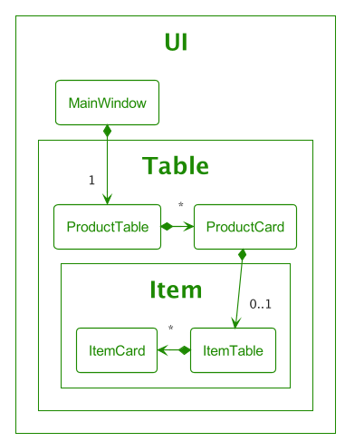
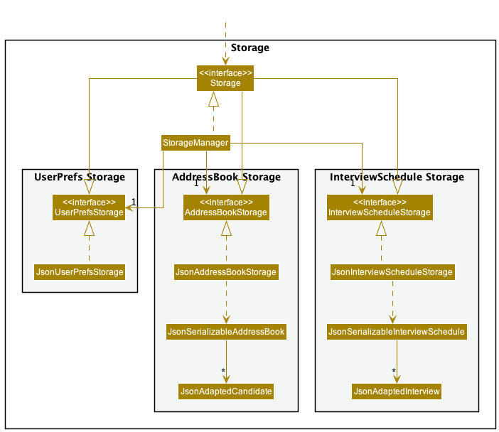

* Table of Contents
{:toc}

--------------------------------------------------------------------------------------------------------------------

## **Acknowledgements**

* This project is based on the AddressBook-Level3 project created by the [SE-EDU initiative](https://se-education.org).

--------------------------------------------------------------------------------------------------------------------

## **Setting up, getting started**

Refer to the guide [_Setting up and getting started_](SettingUp.md).

--------------------------------------------------------------------------------------------------------------------

## **Design**

:bulb: **Tip:** The `.puml` files used to create diagrams in this document can be found in the [diagrams](https://github.com/se-edu/addressbook-level3/tree/master/docs/diagrams/) folder. Refer to the [_PlantUML Tutorial_ at se-edu/guides](https://se-education.org/guides/tutorials/plantUml.html) to learn how to create and edit diagrams.

### Architecture

The ***Architecture Diagram*** given above explains the high-level design of the App.

Given below is a quick overview of main components and how they interact with each other.

**Main components of the architecture**

**`Main`** has two classes called [`Main`](https://github.com/se-edu/addressbook-level3/tree/master/src/main/java/seedu/address/Main.java) and [`MainApp`](https://github.com/se-edu/addressbook-level3/tree/master/src/main/java/seedu/address/MainApp.java). It is responsible for,
* At app launch: Initializes the components in the correct sequence, and connects them up with each other.
* At shut down: Shuts down the components and invokes cleanup methods where necessary.

[**`Commons`**](#common-classes) represents a collection of classes used by multiple other components.

The rest of the App consists of four components.

* [**`UI`**](#ui-component): The UI of the App.
* [**`Logic`**](#logic-component): The command executor.
* [**`Model`**](#model-component): Holds the data of the App in memory.
* [**`Storage`**](#storage-component): Reads data from, and writes data to, the hard disk.

**How the architecture components interact with each other**

The *Sequence Diagram* below shows how the components interact with each other for the scenario where the user issues the command `delete 1`.

Each of the four main components (also shown in the diagram above),

* defines its *API* in an `interface` with the same name as the Component.
* implements its functionality using a concrete `{Component Name}Manager` class (which follows the corresponding API `interface` mentioned in the previous point.

For example, the `Logic` component defines its API in the `Logic.java` interface and implements its functionality using the `LogicManager.java` class which follows the `Logic` interface. Other components interact with a given component through its interface rather than the concrete class (reason: to prevent outside component's being coupled to the implementation of a component), as illustrated in the (partial) class diagram below.

The sections below give more details of each component.

### UI component

The **API** of this component is specified in [`Ui.java`](https://github.com/AY2122S2-CS2103T-T09-4/tp/tree/master/src/main/java/seedu/ibook/ui/i.java)

The UI consists of a `MainWindow` that is made up of parts e.g.`CommandBox`, `ResultWindow`, `Table`, `Popup` etc. The `MainWindow` and `UiComponent` inherits from `UiPart` class which captures the commonalities between classes that represent parts of the visible GUI.

`UiComponent` is an abstract class that contains a reference to the MainWindow. Notice how all the other Ui components inherit from `UiComponent`. This is to enable the individual Ui components to navigate back to MainWindow. The navigation is helpful for certain Ui components that requires to call the methods resides in MainWindow. For example, `CommandBox` calls method `executeCommand` in `MainWindow` when user enter a command.

#### The Structure of The Table Component

The diagram above shows the internal structure of the `Table` component.

The `MainWindow` contains a `Table`, which holds a `TableHeader` and a `TableContent`.

`TableContent` has multiple `ProductCard` that represents each `Product` in the table.

Here, `ProductCard` and `TableContent` has a dependency on `Model` to get the attributes of a `Product`

As usual, all Ui components are inherited from `UiComponent` for navigability back to `MainWindow`

#### The Structure of The Popup Component

The diagram above shows the internal structure of the `Popup` component.

Firstly, `MainWindow` contains a `PopupHandler` that provides several APIs for operations related to popup.

Every popup is inherited from the `Popup` abstract class which contains the implementation of the common attribute across all popups. The abstract class `Popup` is again inherited from `UiComponent` for navigability to `MainWindow`

Popups depends on several classes in `Logic` and `Model`. 

`Model` is needed to show the relevant product information to the user. `Logic` on the other hand, is required to forge commands to add product and update product.

The `UI` component uses the JavaFx UI framework. The layout of these UI parts are defined in matching `.fxml` files that are in the `src/main/resources/view` folder. For example, the layout of the [`MainWindow`](https://github.com/AY2122S2-CS2103T-T09-4/tp/tree/master/src/main/java/seedu/ibook/ui/MainWindow.java) is specified in [`MainWindow.fxml`](https://github.com/AY2122S2-CS2103T-T09-4/tp/tree/master/src/main/resources/view/MainWindow.fxml)

The `UI` component,

* executes user commands using the `Logic` component.
* listens for changes to `Model` data so that the UI can be updated with the modified data.
* keeps a reference to the `Logic` component, because the `UI` relies on the `Logic` to execute commands.
* depends on some classes in the `Model` component, as it displays `Product` object residing in the `Model`.

### Logic component

**API** : [`Logic.java`](https://github.com/AY2122S2-CS2103T-T09-4/tp/blob/master/src/main/java/seedu/ibook/logic/Logic.java)

Here's a (partial) class diagram of the `Logic` component:

How the `Logic` component works:
1. When `Logic` is called upon to execute a command, it uses the `IBookParser` class to parse the user command.
1. This results in a `Command` object (more precisely, an object of one of its subclasses e.g., `AddCommand`) which is executed by the `LogicManager`.
1. The command can communicate with the `Model` when it is executed (e.g. to add a product).
1. The result of the command execution is encapsulated as a `CommandResult` object which is returned back from `Logic`.

The Sequence Diagram below illustrates the interactions within the `Logic` component for the `execute("delete 1")` API call.

:information_source: **Note:** The lifeline for `DeleteCommandParser` should end at the destroy marker (X) but due to a limitation of PlantUML, the lifeline reaches the end of diagram.

Here are the other classes in `Logic` (omitted from the class diagram above) that are used for parsing a user command:

How the parsing works:
* When called upon to parse a user command, the `IBookParser` class creates an `XYZCommandParser` (`XYZ` is a placeholder for the specific command name e.g., `AddCommandParser`) which uses the other classes shown above to parse the user command and create a `XYZCommand` object (e.g., `AddCommand`) which the `IBookParser` returns back as a `Command` object.
* All `XYZCommandParser` classes (e.g., `AddCommandParser`, `DeleteCommandParser`, ...) inherit from the `Parser` interface so that they can be treated similarly where possible e.g, during testing.

### Model component
**API** : [`Model.java`](https://github.com/se-edu/addressbook-level3/tree/master/src/main/java/seedu/address/model/Model.java)

The `Model` component,

* stores the IBook data i.e., all `Product` objects (which are contained in a `UniqueProductList` object).
* stores the currently 'selected' `Product` objects (e.g., results of a search query) as a separate _filtered_ list which is exposed to outsiders as an unmodifiable `ObservableList<Product>` that can be 'observed' e.g. the UI can be bound to this list so that the UI automatically updates when the data in the list change.
* stores a `UserPrefs` object that represents the user’s preferences. This is exposed to the outside as a `ReadOnlyUserPrefs` objects.
* does not depend on any of the other three components (as the `Model` represents data entities of the domain, they should make sense on their own without depending on other components)

A more detailed representation of the `Product` class is shown below which includes more details regarding the `Item` class.

### Storage component

**API** : [`Storage.java`](https://github.com/AY2122S2-CS2103T-T09-4/tp/blob/master/src/main/java/seedu/ibook/storage/Storage.java)

The `Storage` component,
* can save both IBook data and user preference data in json format, and read them back into corresponding objects.
* inherits from both `IBookStorage` and `UserPrefStorage`, which means it can be treated as either one when only one functionality is needed.
* depends on some classes in the `Model` component (because the `Storage` component's job is to save/retrieve objects that belong to the `Model`)

### Common classes

Classes used by multiple components are in the `seedu.addressbook.commons` package.

--------------------------------------------------------------------------------------------------------------------

## **Implementation**

This section describes some noteworthy details on how certain features are implemented.

### Undo/redo feature

#### Implementation

The undo/redo mechanism is facilitated by `ReversibleIBook`. It extends `IBook` with versions of methods that are reversible and uses `StateChangeRecorder` to record all changes made to `IBook`, which internally store changes as a `StateChange`. `ReversibleIBook` implements the following operations:

* `ReversibleIBook#prepareForChanges()` — Prepares a clean workspace to record next possible changes.
* `ReversibleIBook#saveChanges()` — Saves all changes made to `Ibook` as a `StateChange` (recorded and stored in `StateChangeRecorder`).
* `ReversibleIBook#undo()` — Reverts the most currently changes.
* `ReversibleIBook#redo()` — Restores the most currently undone changes.

These operations are exposed in the `Model` interface as `Model#prepareIBookForChanges()`, `Model#saveIBookChanges()`, `Model#undoIBook()` and `Model#redoIBook()` respectively.

Given below is an example usage scenario and how the undo/redo mechanism behaves at each step.

Step 1. The user launches the application for the first time. The `ReversibleIBook` will be initialized, which in turn initializes `StateChangeRecorder` with a `stateChanges` list consisting of zero `StateChange` record.

Step 2. The user executes `delete 3` command to delete the 3rd product in the iBook. The `delete` command calls `Model#saveIBookChanges()` after its execution, causing changes made to iBook to be recorded as a `StateChange` and stored in the `stateChanges` list. The `currentStateChange` is now pointing to this most recent `StateChange`.

Step 3. The user executes `update 1 n~Maggie​` to add a new product. This command also calls `Model#saveIBookChanges()`, causing another `StateChange` to be saved into the `stateChanges` list.

:information_source: **Note:** If a command fails its execution, it will not call `Model#saveIBookChanges()`, so no `StateChange` will be saved into the `stateChanges` list.

 
Step 4. The user now decides that adding the product was a mistake, and decides to undo that action by executing the `undo` command. The `undo` command will call `Model#undoIBook()`, which will get and execute the actions needed to revert this change. `currentStateChange` will then move once to the left, pointing to the most recent `stateChange` (with respect to the state of `IBook` after the `undo` command).

:information_source: **Note:** If the `currentStateChange` is not pointing to a valid `StateChange` (for example when there is no record in the `stateChanges` list), then there are no changes to revert. The `undo` command uses `Model#canUndoIBook()` to check if this is the case. If so, it will return an error to the user rather than attempting to perform the undo.

 
The following sequence diagram shows how the undo operation works:

:information_source: **Note:** The lifeline for `UndoCommand` should end at the destroy marker (X) but due to a limitation of PlantUML, the lifeline reaches the end of diagram.

 
The `redo` command does exactly the opposite — it calls `Model#redoIBook()`, which moves the `currentStateChange` once to the right, pointing to the previously reverted changes, then perform the actions needed to restore them back.
  
  

:information_source: **Note:** If the `currentStateChange` is pointing at the latest record of the `stateChanges` list, then there are no reverted changes to restore. The `redo` command uses `Model#canRedoIBook()` to check if this is the case. If so, it will return an error to the user rather than attempting to perform the redo.

 
Step 5. The user then decides to execute the command `list`. Commands that do not make any changes to `Ibook`, such as `list`, will usually not call `Model#saveIBookChanges()`, `Model#undoIBook()` or `Model#redoIBook()`. Thus, state change records in `StateChangeRecorder` remain unchanged.

Step 6. The user executes `clear`, which again will call `Model#saveIBookChanges()` at the end of its execution. Since the `currentStateChange` is not pointing at the end of the `stateChanges` list, all state changes after the `currentStateChange` will be cleared. Reason: It does not make sense to redo the `update 1 n~Maggie​` command. This is the convention that most modern desktop applications follow.

The following activity diagram summarizes what happens when a user executes a new command:

#### Design considerations:

**Aspect: How undo & redo executes:**

* **Alternative 1:** Saves the entire `Ibook`.
  * Pros: Easy to implement.
  * Cons: May have performance issues in terms of memory usage.

* **Alternative 2 (current choice):** Individual method that makes changes to `IBook` knows how to undo/redo by itself.
  * Pros: Will use less memory (e.g. for `delete`, just save the product being deleted).
  * Cons: We must ensure that the implementation of each individual method are correct.

### \[Proposed\] Data archiving

_{Explain here how the data archiving feature will be implemented}_

--------------------------------------------------------------------------------------------------------------------

## **Documentation, logging, testing, configuration, dev-ops**

* [Documentation guide](Documentation.md)
* [Testing guide](Testing.md)
* [Logging guide](Logging.md)
* [Configuration guide](Configuration.md)
* [DevOps guide](DevOps.md)

--------------------------------------------------------------------------------------------------------------------

## **Appendix: Requirements**

### Product scope

**Target user profile**: A storekeeper who

* has a need to manage different products in the store
* is comfortable with CLI but prefers GUI for certain occasions
* is forgetful and easily loses track of expiry dates in  a store
* is forgetful and sometimes forgets command syntax
* prefer desktop apps over other types

**Value proposition**: manage products and their expiry dates with ease using CLI 

### User stories

Priorities: High (must have) - `* * *`, Medium (nice to have) - `* *`, Low (unlikely to have) - `*`

| Priority | As a …​                    | I want to …​                                                            | So that I can…​                                        |
|----------|----------------------------|-------------------------------------------------------------------------|--------------------------------------------------------|
| `* * *`  | user                       | add a product                                                           | input product data that I want to store                |
| `* * *`  | user                       | list all products added                                                 | check on all important details of all itemms at once   |
| `* * *`  | user                       | search for specific products by category                                | find the relevant products and its details quickly     |
| `* * *`  | user                       | delete a product                                                        | remove entries that I no longer need                   |
| `* * *`  | user                       | update a product's information                                          | keep the details relevant                              |
| `* *`    | beginner user              | learn about the basic features                                          | quickly get started with using the app                 |
| `* *`    | user                       | get reminders on which stocks are nearing the expiry dates              | prioritize their sales                                 |
| `* *`    | user familiar with the app | receive orders from an item and update in the app                       | easily manage large orders of several products         |
| `* *`    | user familiar with the app | add customer records                                                    | keep track of their spending habits                    |
| `* *`    | user familiar with the app | archive customer records                                                | ignore customers that are no longer active             |
| `* *`    | professional user          | automate the reduction of the price of items when near the expiry dates | easily sell out the products via a discount            |
| `* `     | user                       | import existing products to the application                             | transition to this app quickly                         |
| `* `     | user familiar with the app | create multiple accounts for my staff to use                            | restrict the access rights that they have              |
| `* `     | user familiar with the app | delete staff accounts                                                   | prevent staff no longer working from using the account |
| `* `     | user familiar with the app | add custom permissions for the staff accounts                           | modify their access rights related to their job scope  |
| `* `     | professional user          | create and use my own shortcut commands                                 | accomplish my task faster                              |

*{More to be added}*

### Use cases

(For all use cases below, the **System** is the `IBook` and the **Actor** is the `user`, unless specified otherwise)

#### UC1: Listing products

**MSS**

1. User requests to list products according to a filter
2. IBook shows a list of products

**Extensions**

* 2a. The list is empty.

  Use case ends.

#### UC2: Adding a product

**MSS**

1. User request to add a product to IBook
2. IBook adds the product

**Extensions**

* 1a. Required fields are all present but are invalid.

    * 1a1. IBook shows an error message.

      Use case resumes at step 1.

* 1b. Not all required fields are present (eg Name).

    * 1b1. IBook shows an error message.

      Use case resumes at step 1.

* 1c. Optional fields like Category is missing.

    * 1c1. IBook automatically sets the category to miscellaneous.
    
      Use case resumes at step 1.

#### UC3: Delete a product

**MSS**

1. User requests to list products ([UC1](#uc1-listing-products))
2. User requests to delete a product in the list specified by the index
3. IBook deletes the product

    Use case ends.

**Extensions**

* 2a. The given index is invalid.

    * 2a1. IBook shows an error message.

      Use case resumes at step 1.

#### UC4: Update a product

**MSS**

1. User requests to list products ([UC1](#uc1-listing-products))
2. User requests to update a product in the list specified by the index 
3. IBook updates the product

    Use case ends.

**Extensions**

* 2a. The given index is invalid.

    * 2a1. IBook shows an error message.

      Use case resumes at step 1.

*{More to be added}*

### Non-Functional Requirements

1. Should work on any _mainstream OS_ as long as it has Java `11` or above installed.
2. Should be able to hold up to 1000 products without a noticeable sluggishness in performance for typical usage.
3. A user with above average typing speed for regular English text (i.e. not code, not system admin commands) should be able to accomplish most of the tasks faster using commands than using the mouse.
4. Data should be auto saved locally each time a new command has been entered. 
5. Should reload saved data accurately provided that data is not corrupted.
6. System should respond within 3 seconds.
7. UI should be clear and easy to use.

*{More to be added}*

### Glossary

* **Mainstream OS**: Windows, Linux, Unix, OS-X

--------------------------------------------------------------------------------------------------------------------

## **Appendix: Instructions for manual testing**

Given below are instructions to test the app manually.

:information_source: **Note:** These instructions only provide a starting point for testers to work on;
testers are expected to do more *exploratory* testing.

### Launch and shutdown

1. Initial launch

   1. Download the jar file and copy into an empty folder

   1. Double-click the jar file Expected: Shows the GUI with a set of sample contacts. The window size may not be optimum.

1. Saving window preferences

   1. Resize the window to an optimum size. Move the window to a different location. Close the window.

   1. Re-launch the app by double-clicking the jar file. 
       Expected: The most recent window size and location is retained.

1. _{ more test cases …​ }_

### Deleting a person

1. Deleting a person while all persons are being shown

   1. Prerequisites: List all persons using the `list` command. Multiple persons in the list.

   1. Test case: `delete 1` 
      Expected: First contact is deleted from the list. Details of the deleted contact shown in the status message. Timestamp in the status bar is updated.

   1. Test case: `delete 0` 
      Expected: No person is deleted. Error details shown in the status message. Status bar remains the same.

   1. Other incorrect delete commands to try: `delete`, `delete x`, `...` (where x is larger than the list size) 
      Expected: Similar to previous.

1. _{ more test cases …​ }_

### Saving data

1. Dealing with missing/corrupted data files

   1. _{explain how to simulate a missing/corrupted file, and the expected behavior}_

1. _{ more test cases …​ }_
