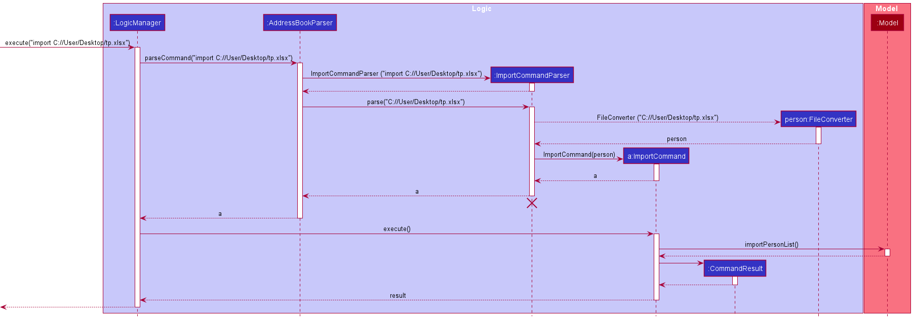

## Table of Contents

* [**Introduction**](#introduction)
* [**Setting up, getting started**](#setting-up-getting-started)
* [**About**](#about)
  * [Purpose](#purpose)
  * [Scope](#scope)
  * [Developer guide navigation](#developer-guide-navigation)
* [**Design**](#design)
  * [Architecture](#architecture)
  * [UI component](#ui-component)
  * [Logic component](#logic-component)
  * [Model component](#model-component)
  * [Storage component](#storage-component)
  * [Common classes](#common-classes)
  * [**Implementation**](#implementation)
    * [Find command feature](#find-command-feature)
      * [What it does](#what-it-does)
      * [Implementation](#implementation-1)
      * [Design considerations](#design-considerations)
    * [Sort command feature](#sort-command-feature)
      * [What it does](#what-it-does-1)
      * [Implementation](#implementation-2)
      * [Design considerations](#design-considerations-1)
    * [Import and Export command feature](#import-and-export-command-feature)
      * [What it does](#what-it-does-2)
      * [Implementation](#implementation-3)
      * [Design considerations](#design-considerations-2)
    * [Show status](#show-status)
      * [What it does](#what-it-does-3)
      * [Implementation](#implementation-4)
      * [Design considerations](#design-considerations-3)
    * [Suggest command feature](#suggest-command-feature)
        * [What it does](#what-it-does-4)
        * [Implementation](#implementation-5)
        * [Design considerations](#design-considerations-4)
* [**Documentation, logging, testing, configuration, dev-ops**](#documentation-logging-testing-configuration-dev-ops)
* [**Appendix A: Requirements**](#appendix-a-requirements)
  * [Product scope](#product-scope)
  * [User stories](#user-stories)
  * [Use cases](#use-cases)
  * [Non-Functional Requirements](#non-functional-requirements)
* [**Appendix B: Glossary**](#appendix-b-glossary)
* [**Appendix C: Instructions for manual testing**](#appendix-c-instructions-for-manual-testing)
  * [Launch and shutdown](#launch-and-shutdown)
  * [Adding a show](#adding-a-show)
  * [Deleting a show](#deleting-a-show)
  * [Editing a show](#editing-a-show)
  * [Saving data](#saving-data)
  * [Finding a show](#finding-a-show)
  * [Sorting the list of shows](#sorting-the-list-of-shows)
  * [Suggesting a show](#suggesting-a-show)
  * [Importing Trackermon data](#importing-trackermon-data)
  * [Exporting Trackermon data](#exporting-trackermon-data)

## **Introduction**

Trackermon is a **desktop application** for **tracking and managing shows, optimized for use via a Command Line Interface (CLI)** while still having the **benefits of a Graphical User Interface (GUI)**. Trackermon helps people track and remember what shows they have watched, are currently watching, or plan to watch.

[return to top ](#table-of-contents)

## **Setting up, getting started**

Refer to the guide [_Setting up and getting started_](SettingUp.md).

[return to top ](#table-of-contents)

## **About**

### Purpose

This document specifies architecture and software design decisions for the application, Trackermon.

### Scope

The developer guide allows developers who want to work on Trackermon to gain a better understanding of the application's implementation.

### Developer guide navigation

| Syntax                                                                    | Description                                             |
|---------------------------------------------------------------------------|---------------------------------------------------------|
| 
:bulb: 
            | A small but useful piece of information                 |
| 
:information_source: 
 | Additional information                                  |
| 
:exclamation: 
      | Important information to take note                      |
| \<Instructions for Parameters\>                                           | Represents certain requirements you will need to follow |

[return to top ](#table-of-contents)

## **Design**

:bulb: **Tip:** The `.puml` files used to create diagrams in this document can be found in the [diagrams](https://github.com/AY2122S2-CS2103T-T09-3/tp/tree/master/docs/diagrams/) folder. Refer to the [_PlantUML Tutorial_ at se-edu/guides](https://se-education.org/guides/tutorials/plantUml.html) to learn how to create and edit diagrams.

### Architecture

The ***Architecture Diagram*** given above explains the high-level design of the Application.

Given below is a quick overview of main components and how they interact with each other.

**Main components of the architecture**

**`Main`** has two classes called [`Main`](https://github.com/AY2122S2-CS2103T-T09-3/tp/tree/master/src/main/java/seedu/trackermon/Main.java) and [`MainApp`](https://github.com/AY2122S2-CS2103T-T09-3/tp/tree/master/src/main/java/seedu/trackermon/MainApp.java). It is responsible for,
* At application launch: Initializes the components in the correct sequence, and connects them up with each other.
* At shut down: Shuts down the components and invokes cleanup methods where necessary.

[**`Commons`**](#common-classes) represents a collection of classes used by multiple other components.

The rest of the Application consists of four components.

* [**`UI`**](#ui-component): The UI of the Application.
* [**`Logic`**](#logic-component): The command executor.
* [**`Model`**](#model-component): Holds the data of the Application in memory.
* [**`Storage`**](#storage-component): Reads data from, and writes data to, the hard disk.

**How the architecture components interact with each other**

The *Sequence Diagram* below shows how the components interact with each other for the scenario where the user issues the command `delete 1`.

Each of the four main components (also shown in the diagram above),

* defines its *API* in an `interface` with the same name as the Component.
* implements its functionality using a concrete `{Component Name}Manager` class (which follows the corresponding API `interface` mentioned in the previous point.

For example, the `Logic` component defines its API in the `Logic.java` interface and implements its functionality using the `LogicManager.java` class which follows the `Logic` interface. Other components interact with a given component through its interface rather than the concrete class (reason: to prevent outside component's being coupled to the implementation of a component), as illustrated in the (partial) class diagram below.

The sections below give more details of each component.

[return to top ](#table-of-contents)

---

### UI component

The **API** of this component is specified in [`Ui.java`](https://github.com/AY2122S2-CS2103T-T09-3/tp/tree/master/src/main/java/seedu/trackermon/ui/Ui.java)

The UI consists of a `MainWindow` that is made up of parts e.g.`CommandBox`, `ResultDisplay`, `ShowListPanel`, `StatusBarFooter` etc. All these, including the `MainWindow`, inherit from the abstract `UiPart` class which captures the commonalities between classes that represent parts of the visible GUI.

The `UI` component uses the JavaFx UI framework. The layout of these UI parts are defined in matching `.fxml` files that are in the `src/main/resources/view` folder. For example, the layout of the [`MainWindow`](https://github.com/AY2122S2-CS2103T-T09-3/tp/tree/master/src/main/java/seedu/trackermon/ui/MainWindow.java) is specified in [`MainWindow.fxml`](https://github.com//AY2122S2-CS2103T-T09-3/tp/tree/master/src/main/resources/view/MainWindow.fxml)

The `UI` component,

* executes user commands using the `Logic` component.
* listens for changes to `Model` data so that the UI can be updated with the modified data.
* keeps a reference to the `Logic` component, because the `UI` relies on the `Logic` to execute commands.
* depends on some classes in the `Model` component, as it displays `Show` object residing in the `Model`.

[return to top ](#table-of-contents)

---

### Logic component

**API** : [`Logic.java`](https://github.com/AY2122S2-CS2103T-T09-3/tp/tree/master/src/main/java/seedu/trackermon/logic/Logic.java)

Here's a (partial) class diagram of the `Logic` component:

How the `Logic` component works:
1. When `Logic` is called upon to execute a command, it uses the `TrackermonParser` class to parse the user command.
1. This results in a `Command` object (more precisely, an object of one of its subclasses e.g., `AddCommand`) which is executed by the `LogicManager`.
1. The command can communicate with the `Model` when it is executed (e.g. to add a show).
1. The result of the command execution is encapsulated as a `CommandResult` object which is returned back from `Logic`.

The Sequence Diagram below illustrates the interactions within the `Logic` component for the `execute("delete 1")` API call.

:information_source: **Note:** The lifeline for `DeleteCommandParser` should end at the destroy marker (X) but due to a limitation of PlantUML, the lifeline reaches the end of diagram.

Here are the other classes in `Logic` (omitted from the class diagram above) that are used for parsing a user command:

How the parsing works:
* When called upon to parse a user command, the `TrackermonParser` class creates an `XYZCommandParser` (`XYZ` is a placeholder for the specific command name e.g., `AddCommandParser`) which uses the other classes shown above to parse the user command and create a `XYZCommand` object (e.g., `AddCommand`) which the `TrackermonParser` returns back as a `Command` object.
* All `XYZCommandParser` classes (e.g., `AddCommandParser`, `DeleteCommandParser`, ...) inherit from the `Parser` interface so that they can be treated similarly where possible e.g, during testing.

[return to top ](#table-of-contents)

---

### Model component

**API** : [`Model.java`](https://github.com/AY2122S2-CS2103T-T09-3/tp/tree/master/src/main/java/seedu/trackermon/model/Model.java)

The `Model` component,

* stores the show list data i.e., all `Show` objects (which are contained in a `UniqueShowList` object).
* stores the currently 'selected' `Show` objects (e.g., results of a search query) as a separate _filtered_ list which is exposed to outsiders as an unmodifiable `ObservableList<Show>` that can be 'observed' e.g. the UI can be bound to this list so that the UI automatically updates when the data in the list change.
* stores a `UserPref` object that represents the user’s preferences. This is exposed to the outside as a `ReadOnlyUserPref` objects.
* does not depend on any of the other three components (as the `Model` represents data entities of the domain, they should make sense on their own without depending on other components)

:information_source: **Note:** An alternative (arguably, a more OOP) model is given below. It has a `Tag` list in the `ShowList`, which `Show` references. This allows `ShowList` to only require one `Tag` object per unique tag, instead of each `Show` needing their own `Tag` objects. 

[return to top ](#table-of-contents)

---

### Storage component

**API** : [`Storage.java`](https://github.com/AY2122S2-CS2103T-T09-3/tp/blob/master/src/main/java/seedu/trackermon/storage/Storage.java)

The `Storage` component,
* can save both show list data and user preference data in json format, and read them back into corresponding objects.
* inherits from both `ShowListStorage` and `UserPrefStorage`, which means it can be treated as either one (if only the functionality of only one is needed).
* depends on some classes in the `Model` component (because the `Storage` component's job is to save/retrieve objects that belong to the `Model`)

[return to top ](#table-of-contents)

---

### Common classes

Classes used by multiple components are in the `seedu.trackermon.commons` package.

[return to top ](#table-of-contents)

## **Implementation**

This section describes some noteworthy details on how certain features are implemented.

### Find command feature

#### What it does
Looks for a show in a list of shows and displays all the shows that match the user's input. If the user's input does not contain any prefixes, `find` will do a general search through all fields in the `Show` class.

#### Implementation

After executing the `find` command, `FindCommandParser` will map any prefixes in the user's input to Trackermon's prefix syntax. It will check if there are any prefixes in the input. 
- If prefixes are specified, a `FindCommand` object will be created with predicates looking through the specified prefixes. 
- Else, a general show predicate will be created by scanning through the name, status, rating and tag fields of the `Show` class. 

Then, `LogicManager` will execute the given `findCommand` object and scan through the shows in the model's list of shows while checking if any shows matches the user's input. The model is then updated with the filtered show list.

:information_source: **Note:** The sequence diagram below illustrates the parsing implementation of `FindCommandParser`.

Given below is an example usage scenario and the step-by-step flow of the find command.

Step 1: The user launches Trackermon and is presented with a list of all shows retrieved from local storage `trackermon.json`.

Step 2: The user executes `find t/Anime` to find a show.

Step 3: The `find` command will check and see whether any shows contain the tag `Anime` using the `Model#updateFilteredShowList` method.

Step 4:
`Model#updateFilteredShowList` will be called and model will be updated without modifying the original show list. If no shows match the keywords given by the user, an empty list will be displayed.

**:information_source: Note:** 
`find Anime` will also work, however it will scan through the name, status, rating and tag fields instead of the tag field only.

The following activity diagram summarizes what happens when a user executes a valid find command:

#### Design considerations:
- **Alternative 1 (current choice):** The `find` command checks for keywords after the prefix. 
  - If there are no prefixes, it will perform a general search using `ShowContainsKeywordsPredicate` which scans through the name, status, rating and tag fields in the `Show` class. 
  - Else, `ArgumentMultimap#arePrefixesPresent` will check and return a new predicate for each value after each prefix if it is present and then generate a keyword predicate that will match values in that field.

  A for loop is implemented for the name, status, rating and tag predicates. This will allow an `AND` search within a list of keywords within these four parameters. The user does not need to type in the full word for any find searches as each predicate uses a fragmented search.
  - Pros: Abstraction of predicates and encapsulating the checking of shows allows the predicates to be used more flexibly elsewhere to match other shows.
  - Cons: More abstraction may make developers take a longer time to extend the functionality if new prefixes are being added.  

- **Alternative 2:** Directly check whether the show is in the show list in `FindCommandParser` without a predicate.
  - Pros: Developers can easily understand the code and its functionality as all the code is consolidated in a single class.
  - Cons: Bad coding and Object-Oriented Programming (OOP) practices is prominent due to the lack of abstraction.

[return to top ](#table-of-contents)

---

### Sort command feature

#### What it does
Sorts the list of shows according to the user's input prefix. If the input does not contain any prefixes, sort will default to organizing the shows in ascending order by name. The format for sort is `sort [n/ORDER] [s/ORDER] [t/ORDER] [r/ORDER] [so/SEQUENCE]`. If two or more of the above prefixes are being used, sort will prioritise sorting by name, then status, followed by rating, and finally tags. Use `so/` to change the priority. `SEQUENCE` is the order of all the prefixes used to sort the show list, and it must contain the full names of the prefixes used.

#### Implementation
After entering the sort command, the `ArgumentTokenizer` in parser will map any prefixes in the user's input to Trackermon's prefix syntax. Then, the parser will do a check whether there are any prefixes in the input. If prefixes are specified, a `SortCommand` object will be created with `Comparator` according to the specified prefixes. Else, a `NameComparator` will be created, which can be used to sort names in ascending order. `SortCommand` is a class that inherits the `Command` abstract class. `SortCommand` implements the `execute()` method from the `Command` abstract class where on execution, sorts `Model`'s list of shows according to the `Comparator`. `Model` is then updated with the sorted show list.

Given below is an example usage scenario and the step-by-step flow of the sort command.

Step 1: The user launches Trackermon and enters `sort n/asc s/dsc` to sort the list of shows.

Step 2: The sort command parser will check for prefixes and generate the appropriate `Comparator` for the `SortCommand`. In this case it generate a `NameComparator().thenComparing(StatusComparator().reverse()))`

Step 3: When the sort command executes, it will call the `Model#updateSortedShowList` method.

Step 4: The sorted list in `Model` will apply the `Comparator` and `Model` will be updated in order by ascending name then descending status.

The following activity diagram summarizes what happens when a user executes a `SortCommand`:

After the user input the sort command, `SortCommandParser` will parse the command arguments. A map is then used to keep track of which order prefixes (`n/`, `s/`, `t/`, `r/`) are being used and also how they are being ordered. If the user uses `so/` it will reorder the Map based on the input `SEQUENCE`. Afterwards a `Comparator` is being built according the Map and passed into `SortCommand`. `SortCommand` executes and `Model` will update the list accordingly. 

The following sequence diagram summarizes what happens when a user executes a `SortCommand`, in this case, sort without any prefixes:

#### Design considerations:
- **Alternative 1:** The `sort` command checks for the optional prefix. If the user's input contains no prefixes, sort will sort by name in ascending order. If both prefixes for ascending and descending are used, it will only sort by ascending. If both prefixes for name and status are used, by default, it will sort by name.

  - Pros: No invalid commands input by the users
  - Cons: Users need to get used to the prefixes used.

- **Alternative 2 (current choice):** The `sort` command checks for the non-optional prefix. Users have to provide valid input to specify which attribute to sort by and by ascending or descending. 
    - Pros: Users have fewer prefixes to remember
    - Cons: Users need to remember valid inputs

[return to top ](#table-of-contents)

---

### Import and Export command feature

#### What it does
Allows the user to quickly import/export existing Trackermon data for ease of updating multiple copies of Trackermon data across different platforms.

#### Implementation
When the import/export command is executed, a `JsonFileManager` is created. The `JsonFileManager` creates the File Explorer GUI using `JavaFx`'s `FileChooser` library, and handles the logic behind import/export. The user can then use the File Explorer GUI to select which file they want to import, or where they want to export Trackermon data.

For `import`: 

After the file is selected, `ImportCommand` calls the `JsonFileManager#importFile(dataPath)` method. This method overwrites the file provided in dataPath with the selected file. 
`ImportCommand` passes in the file path of the data that Trackermon is currently using. 
After the file is overwritten, `ImportCommand` returns a `CommandResult` to `LogicManager`. 
In `LogicManager`, the new data will be read and converted into an `Optional<ReadOnlyShowList>`. 
The old data is stored as another `ReadOnlyShowList`, and `Model#setShowList` is called to update `Model`'s show list with the new data if it exists. 
If the new data does not exist, the show list will not be updated. Finally, `Storage#saveShowList` is called to update the actual data file.

:information_source: **Note:** The sequence diagram below illustrates the interaction between `LogicManager`, `ImportCommand`, `JsonFileManager`, and `CommandResult`.

For `export`:

After the location is selected, `ExportCommand` calls the `JsonFileManager#exportFile(dataPath)` method. 
This method writes the data file into a file at the selected location provided by dataPath. 
After the data is written into the new file, `ExportCommand` returns a `CommandResult` to `LogicManager`.

:information_source: **Note:** The sequence diagram below illustrates the interaction between `LogicManager`, `ExportCommand`, `JsonFileManager`, and `CommandResult`.

#### Design considerations:
Implementing the FileChooser library allows us to create a File Explorer GUI similar to the user's Operating System's native File Explorer GUI.

[return to top ](#table-of-contents)

---

### Show status

#### What it does
`Status` class is an attribute within the `Show` class. `Status` represents the watch status of the show, and can be represented by `completed`, `watching`, or `plan-to-watch`. 

#### Implementation

`Status` class is implemented as a `enum` class. Enumerations are a list of named constants, where the named constants are `completed`, `watching` and `plan-to-watch`. 

#### Design considerations:

- **Alternative 1 (current choice):** 
  `Status` is implemented as a `enum` class. Enumerations offer compile time type safety, reducing the risk of runtime errors. Enumeration implementation has better space complexity. With the `enum` implementation, all the shows would reference the same `enum` static class. However, for the class implementation, a new `Status` instance is  instantiated each time a `Show` object is created.
  - Pros: Offers compile time type safety.
  - Cons: Harder to implement for people who are not familiar with `enum` class.

- **Alternative 2 :** `Status` is implemented as a regular class that encapsulates a String or Integer which would represent the status of the show (`watching`, `completed` and `plan-to-watch`). 
  - Pros: Easier to implement as it is what most people are more familiar with.
  - Cons: Lack of compile time safety.

[return to top ](#table-of-contents)

---

### Suggest command feature

#### What it does

Returns a single show from the current displayed list of shows

#### Implementation

After executing the `suggest` command, Trackermon creates a `SuggestCommand` object.
Then, `LogicManager` will execute the given `SuggestCommand`. Upon execution of the `SuggestCommand`'s execute method,
it will obtain the currently displayed list of shows via the `Model#getFilteredShowList` method.

In the event that the list is empty, an error message will inform users that
there are no shows currently in the displayed show list. Similarly, if there is only one show 
present in the list, it will inform the user that there is only one show in the currently displayed 
show list. 

A random show is then selected from the list of displayed shows and a `SameShowPredicate` is constructed using said show.

The random show is then displayed in the show list using the `Model#updateFilteredShowList` and the `SameShowPredicate` as its parameter.

Below is the example usage scenario and the step-by-step flow of the suggest command.

Step 1: The user launches Trackermon and is presented with a list of all shows retrieved from
local storage `trackermon.json`.

Step 2: The user executes the suggest command to get a random show from the currently displayed 
list of shows.

Step 3: The suggest command will then check to ensure that the currently displayed list of shows
contains two or more shows.

Step 4: In the event that there are no shows or only one show currently being displayed, Trackermon will return 
an error message. Else, a random show will then be selected from the currently displayed list 
of shows.

Step 5: `Model#updateFilteredShowList` will then be called and `Model` will be updated with the 
selected show.

#### Design considerations:

- **Alternative 1 (current choice):** Returns a random show from the currently displayed list.
  - Pros: - Simple and easy to use.
  - Cons: - If the user wants to get another suggestion, they have to call the list command to get a full list of shows again.

- **Alternative 2 :** Returns a random show from the list of all shows currently in Trackermon.
  - Pros: - If the user wants to get another suggestion, they can just call suggest another time.
  - Cons: - Users are unable to get a suggestion from a filtered list of shows.

[return to top ](#table-of-contents)

---

## **Documentation, logging, testing, configuration, dev-ops**

* [Documentation guide](Documentation.md)
* [Testing guide](Testing.md)
* [Logging guide](Logging.md)
* [Configuration guide](Configuration.md)
* [DevOps guide](DevOps.md)

[return to top ](#table-of-contents)

## **Appendix A: Requirements**

### Product scope

**Target user profile**:

* wants to keep track of their shows.
* prefers desktop applications over other interfaces.
* can type fast and prefers typing to mouse interactions.
* wants to be able to maintain a local copy of their list of shows

**Value proposition**:

* Helps users keep track of all their shows in a single application.
* No need to create an account unlike traditional web based services.
* Able to keep a local copy of their list of shows.
* Clean and minimal user interface.

[return to top ](#table-of-contents)

---

### User stories

Priorities: High (must have) - `* * *`, Medium (nice to have) - `* *`, Low (unlikely to have) - `*`

| Priority | As a…​                       | I want to…​                                           | So that I can…​                                                        |
|----------|------------------------------|-------------------------------------------------------|------------------------------------------------------------------------|
| `* * *`  | user                         | add shows                                             | add new shows into the list                                            |
| `* * *`  | user                         | delete shows  		                                      | remove wrong entries in the list                                       |
| `* * *`  | user                         | find a show                                           | search whether a specific show is in the list                          |
| `* * *`  | user                         | list out all of my shows                              | see the details of all my shows in the list                            |
| `* * *`  | user                         | edit a show from the list                             | change the name, status, rating, comment or tag of my show in the list |
| `* *`    | new user                     | see usage instructions                                | refer to instructions when I forget how to use the application         |
| `* * `   | long time user               | find shows of specific genres                         | recommend those shows to my friends                                    |
| `* * `   | long time user               | find a show I may or may not have watched             | decide whether to watch that show or not                               |
| `* * `   | long time user               | find whether a show I am watching is completed or not | continue watching it if it is not completed                               |
| `* * `   | long time user               | sort the list of shows                                | view the list in an organised manner                                   |
| `* * `   | user with multiple computers | import or export the show data easily                 | keep updated copies of the show data                                   |
| `* * `   | indecisive user              | get a suggestion                                      | easily decide what show to watch                                    |
| `* * `   | user                         | comment on shows                                      | record my opinions about a show                                        |
| `* * `   | user                         | rate shows                                            | keep track of whether a show is good or bad                            |
| `* * `   | user                         | tag shows                                             | keep track of what genre the show belongs to                           |

[return to top ](#table-of-contents)

---

### Use cases

(For all use cases below, the **System** is `Trackermon` and the **Actor** is the `user`, unless specified otherwise)

**Use case: UC01 - Add a show**

**Preconditions: Trackermon application is started.**

**Guarantees: Show will be added into Trackermon only if the user input matches the command format.**

**MSS**

1.  User requests to <ins>list shows (UC03)</ins>.
2.  User adds a show in Trackermon.
3.  Trackermon stores the show in its storage.

    Use case ends.

**Extensions**

* 2a. User adds a duplicate show.

    * 2a1. Trackermon shows an error message to the user.

      Use case resumes at step 2.

* 2b. User enters command with the wrong syntax.

    * 2b1. Trackermon shows an error message to the user.

      Use case resumes at step 2.

[return to top ](#table-of-contents)

---

**Use case: UC02 - Delete a show**

**Preconditions: Trackermon application is started.**

**Guarantees: Show will be deleted from Trackermon only if the user input matches the command format.**

**MSS**

1.  User requests to <ins>list shows (UC03)</ins>.
2.  User requests to delete a specific show in the list.
3.  Trackermon deletes the show.

    Use case ends.

**Extensions**

* 2a. The given index is invalid.

    * 2a1. Trackermon shows an error message to the user.

      Use case resumes at step 2.

[return to top ](#table-of-contents)

---

**Use case: UC03 - List a show**

**Preconditions: Trackermon application is started.**

**Guarantees: A list of shows will be displayed for the user.**

**MSS**

1. User requests to list shows.
2. Trackermon shows a list of shows.

    Use case ends.

**Extensions**

* 2a. The list is empty.

  Use case ends.

[return to top ](#table-of-contents)

---

**Use case: UC04 - View a list of commands**

**Preconditions: Trackermon application is started.**

**Guarantees: A URL to the user-guide will be provided together with a command summary table.**

**MSS**

1.  User requests a list of commands that are available in Trackermon.
2.  Trackermon shows the URL of the user-guide that contains a list of commands available in Trackermon. In addition, a command summary table will be provided.

    Use case ends.

[return to top ](#table-of-contents)

---

**Use case: UC05 - Exit Trackermon**

**Preconditions: Trackermon application is started.**

**Guarantees: Trackermon will exit.**

**MSS**

1. User enters the command in Trackermon.
2. Trackermon saves all changes into the disk.
3. Trackermon closes.

   Use case ends.

[return to top ](#table-of-contents)

---

**Use case: UC06 - Edit a show**

**Preconditions: Trackermon application is started.**

**Guarantees: Show will be edited from Trackermon only if the user input matches the command format.**

**MSS**

1.  User requests to <ins>list shows (UC03)</ins>.
2.  User requests to edit a specific show in the list.
3.  Trackermon edits the show.

    Use case ends.

**Extensions**

* 2a. The given index is invalid.

    * 2a1. Trackermon shows an error message to the user.

      Use case resumes at step 2.

[return to top ](#table-of-contents)

---

**Use case: UC07 - Find a show**

**Preconditions: Trackermon application is started.**

**Guarantees: Show will be found in Trackermon only if the user input matches the command format.**

**MSS**

1. User requests to find shows.
2. Trackermon searches the existing show list.
3. Trackermon shows a list of shows that matches the keyword entered by user.

    Use case ends.

**Extensions**

* 1a. User does not provide a keyword for a prefix.

    * 1a1. Trackermon shows an error message to the user.

      Use case resumes at step 1.

[return to top ](#table-of-contents)

---

**Use case: UC08 - Sort the list of shows**

**Preconditions: Trackermon application is started.**

**Guarantees: A list of sorted shows will be displayed for the user.**

**MSS**

1. User requests to sort the current list of shows.
2. Trackermon sorts the show list.
3. Trackermon shows a list of shows in the sorted order.

   Use case ends.

[return to top ](#table-of-contents)

---

**Use case: UC09 - Quickly import shows**

**Preconditions: Trackermon application is started and there is pre-existing Trackermon data to import.**

**Guarantees: User's current Trackermon data will be replaced with imported Trackermon data.**

**MSS**

1. User requests to import Trackermon data.
2. Trackermon opens the file explorer GUI.
3. User selects the desired file to import.
4. Trackermon closes the file explorer GUI.
5. Trackermon imports the chosen file data.
6. Trackermon displays imported list of shows.

   Use case ends.

**Extensions**

* 2a. User closes the file explorer GUI.
    * 2a1. Trackermon shows an error message to the user.

      Use case ends.
    
* 5a. Chosen file is a corrupted JSON file.

    * 5a1. Trackermon shows an error message to the user.

      Use case ends.

[return to top ](#table-of-contents)

---

**Use case: UC10 - Quickly export shows**

**Preconditions: Trackermon application is started.**

**Guarantees: User's current Trackermon data will replace contents of selected file.**

**MSS**

1. User requests to export Trackermon data.
2. Trackermon displays the file explorer GUI.
3. User navigates to the desired directory or file to export Trackermon data to.
4. Trackermon closes the file explorer GUI.
5. Trackermon exports the chosen file data.

   Use case ends.

**Extensions**

* 2a. User closes the file explorer GUI.

    * 2a1. Trackermon shows an error message to the user.

      Use case ends.

* 3a. User changes default name to save exported data.
   Use case resumes at step 4.

[return to top ](#table-of-contents)

---

**Use case: UC11 - Suggest a show**

**Preconditions: Trackermon application is started.**

**Guarantees: A random show from the currently displayed list of shows will be displayed.**

**MSS**

1. User requests to <ins>list shows (UC03)</ins>.
2. User requests a suggestion from Trackermon.
3. Trackermon returns a random show.

   Use case ends.

**Extensions**

* 1a. The displayed list is empty.

  * 1a1. Trackermon shows an error message to the user.

    Use case ends.

* 1a. The displayed list contains only one show.

  * 1a1. Trackermon shows an error message to the user.
    
    Use case ends.

[return to top ](#table-of-contents)

---

### Non-Functional Requirements

1.  Should work on any [_Mainstream OS_](#appendix-b-glossary) as long as it has Java `11` or above installed.
2.  Should be able to hold up to 1000 shows without a noticeable sluggishness in performance for typical usage.
3.  A user with above average typing speed for regular English text (i.e. not code, not system admin commands) should be able to accomplish most of the tasks faster using [CLI](#appendix-b-glossary) compared to [GUI](#appendix-b-glossary).

[return to top ](#table-of-contents)

---

## **Appendix B: Glossary**

| Term              | Description                                                                                   |
|-------------------|-----------------------------------------------------------------------------------------------|
| **Mainstream OS** | Windows, Linux, Unix, OS-X                                                                    |
| **Parameter**     | Information passed in as part of a command with its type identified by a prefix (e.g. `NAME`) |
| **JavaFx**        | 	JavaFX is a set of Java graphics libraries for creating Java GUI applications                |
| **Command Line Interface (CLI)**   | A Command Line Interface connects you to a computer program or operating system. Through the CLI, you can interact with a system or application by typing in text (commands).        | 
| **Graphical User Interface (GUI)** | A form of user interface that allows you to interact with electronic devices through graphical icons instead of text-based user interfaces, typed command labels or text navigation.        |

[return to top ](#table-of-contents)

## **Appendix C: Instructions for manual testing**

Given below are instructions to test Trackermon manually.

:information_source: **Note:** These instructions only provide a starting point for testers to work on;
testers are expected to do more *exploratory* testing.

### Launch and shutdown

1. Launching Trackermon.
   1. Prerequisites: Have a copy of `trackermon.jar` in your computer.
      1. [Download](https://github.com/AY2122S2-CS2103T-T09-3/tp/releases) the jar file and copy the file into an empty folder.
   2. Double-click the jar file.
   3. Test case: Initial launch  
      Expected: Application launched with a set of sample shows.  
   4. Test case: Subsequent Launch   
      Expected: Application launched with user saved shows.  
2. Saving window preferences
   1. Launch Trackermon.   
      Expected: The window size may not be optimum.  
   2. Resize the window to an optimum size. Move the window to a different location. Close the window.
   3. Re-launch Trackermon.   
      Expected: The most recent window size and location is retained.

[return to top ](#table-of-contents)

---

### Adding a show

1. Prerequisites: None.
2. Test case: Adding a valid show
   1. Condition: Show named `Inception` must not exist in the show list.
   2. Command: `add n/Inception s/watching`   
      Expected: Show is added into the show list. Added show details shown in the result display.  
3. Test case: Adding an invalid show
   1. Condition: Show named `"Inception"` exists in the show list.
   2. Command: `add n/Inception s/watching`   
      Expected: Show is not added into the show list. Error details shown in the result display.

[return to top ](#table-of-contents)

---

### Deleting a show

1. Prerequisites: None, but if the list is empty, all deletions will result in an error.
   1. [Add shows](#adding-a-show) into the show list.
2. List all shows using the `list` command.
3. Test case: Deleting a show based on list index
   1. Condition: Range of shows must be within size of show list.
   2. Command: `delete 1`   
      Expected: Show at specified index is deleted from the list. Deleted show details shown in the result display.  
4. Test case: Invalid delete index
   1. Condition: Range of shows must be outside of list size.
   2. Command: `delete 0` `delete` `delete <out_of_bound_integer>`   
      Expected: No show is deleted. Error details shown in the result display.

[return to top ](#table-of-contents)

---

### Editing a show

1. Prerequisites: None, but if the list is empty, all edits will result in an error.
   1. [Add shows](#adding-a-show) into the show list.
2. List all shows using the `list` command.
3. Test case: Edit show name
   1. Condition: Show named `One Piece` must not exist in the show list.
   2. Command: `edit 1 n/One Piece`  
      Expected: Name of show at specified index is changed to `One Piece`. Edited show details shown in the result display.  
4. Test case: Edit show status
   1. Condition: None, if show status is already `completed`, expected output will be the same.
   2. Command: `edit 1 s/completed`  
      Expected: Status of show at specified index is changed to `completed`. Edited show details shown in the result display.  
5. Test case: Invalid edit index
   1. Condition: Range of shows must be outside of list size.
   2. Command: `edit 0` `edit 1` `edit <out_of_bound_integer>` `edit`  
      Expected: No show is edited. Error details shown in the result display.  
6. Test case: Invalid edit name
   1. Condition: Show named `Inception` exists in the show list that is not currently being edited. 
   2. Command: `edit <index of show to be edited> n/Inception`  
      Expected: No show is edited. Error details shown in the result display.

[return to top ](#table-of-contents)

---

### Saving data

1. Saving data between sessions
   1. Launch Trackermon.
   2. Modify the show list using any commands that affect the details of a show.
   3. Relaunch Trackermon.   
      Expected: The most recent changes made to the shows is retained.  
2. Dealing with missing files
   1. Prerequisites: JSON file is missing.
      1. Delete the `data/trackermon.json` file to simulate a missing file.
   2. Launch Trackermon.   Expected: Trackermon starts with the default list of show list.  
3. Dealing with corrupted files
   1. Prerequisites: JSON file is corrupted.
      1. Modify the `data/trackermon.json` file with any software that would break the JSON format to simulate corrupted file.
   2. Launch Trackermon.   Expected: Trackermon starts with an empty show list.

[return to top ](#table-of-contents)

---

### Finding a show

1. Finding a show (General Find)
   1. Prerequisites: None, but if the list is empty, all searches will lead to no results.
      1. [Add shows](#adding-a-show) into the show list.

   2. Test case: Find single keyword
      1. Command: `find shingeki`  
         Expected: Looks through the name, status, rating and tag fields for any partial or full word of `shingeki` then displays them on the show list.  
         E.g. `shingeki` from name, status, rating, or tag fields will be matched.  
      
   3. Test case: Find multiple keywords
      1. Command: `find shingeki shutter`  
         Expected: Looks through the name, status, rating and tag fields for any partial or full word of `shingeki` or `shutter` then displays them on the show list.  
         E.g. `shingeki` or `shutter` from name, status, rating, or tag fields will be matched (`OR` search).
   
      2. Command: `find 86 shutter`  
         Expected: Looks through the name, status, rating and tag fields for any partial or full word of `86` or `shutter` then displays them on the show list.  
         E.g. `86` or `shutter` from name, status, rating, or tag fields will be matched (`OR` search).

   4. Test case: Invalid command format
      1. Command: `find`  
         Expected: No show is found. Error details shown in the result display, with a result message saying `Invalid command format!...`.  
   
   5. Test case: Unknown command
      1. Command: `find2`  
         Expected: No show is found. Error details shown in the result display, with a result message saying `Unknown command`.  
      
2. Find a show (Precise Find)
   1. Prerequisites: None, but if the list is empty, all searches will lead to no results.
      1. [Add shows](#adding-a-show) into the show list.
   
   2. Test case: Finding with a single prefix
      1. Command: `find n/shingeki`  
         Expected: Looks through the name field for any partial or full word of `shingeki` then displays them on the show list.  
         E.g. `shingeki` from the name field will be matched.  
      2. Command: `find n/shingeki no kyojin`  
         Expected: Looks through the name field for any partial or full word of `shingeki` and `no` and `kyojin` then displays them on the show list.  
         E.g. `shingeki` and `no` and `kyojin` from the name field will be matched (`AND` search within a single prefix).  
   
   3. Test case: Finding with multiple prefixes
      1. Command: `find n/shingeki s/completed`  
         Expected: Looks through the name field for any partial or full word of `shingeki` and the status field for any partial or full word of `completed` then displays them on the show list.  
         E.g. **Both** `shingeki` from the name field and `completed` from the status field must be present to be matched (`AND` search between multiple prefixes).
   
      2. Command: `find n/shingeki t/seinen`  
         Expected: Looks through the name field for any partial or full word of `shingeki` and the tag field for any partial or full word of `seinen` then displays them on the show list.  
         E.g. **Both** `shingeki` from the name field and `seinen` from the tag field must be present to be matched (`AND` search between multiple prefixes).
   
      3. Command: `find n/shingeki no kyojin r/5`  
         Expected: Looks through the name field for any partial or full word of `shingeki` and `no` and `kyojin` and the rating field for number of `5` then displays them on the show list.  
         E.g. `shingeki` and `no` and `kyojin` from the name field and `5` from the rating field will be matched (`AND` search within a single prefix and `AND` search between multiple prefixes).
   
   4. Test case: Invalid command format
      1. Command: `find n/`  
         Expected: No show is found. Error details shown in the result display, with a result message saying `Invalid command format!...`.  
      2. Command: `find t/Action Anime`  
         Expected: No show is found. Error details shown in the result display, with a result message saying `Invalid command format!...`.  
   
   5. Test case: Multiple of the same prefix
      1. Command: `find n/shingeki n/shutter`  
         Expected: Looks through the name field for any partial or full word of `shutter` then displays them on the show list (Ignores the first instance of n/)  
         E.g. `shutter` from the name field will be matched.

[return to top ](#table-of-contents)

---

### Sorting the list of shows

1. Prerequisites: None, but if the list is empty, all sorts will lead to no results.
   1. [Add shows](#adding-a-show) into the show list.
2. Test case: Sort with no prefix
   1. Command: `sort`  
      Expected: The list of shows will default to being sorted by name in ascending order.  

3. Test case: Sort with single prefix 
   1. Command: `sort n/asc`  
      Expected: The list of shows is sorted by name in ascending order.
   
   2. Command: `sort n/dsc`  
      Expected: The list of shows is sorted by name in descending order.

   3. Command: `sort s/asc`  
      Expected: The list of shows is sorted by status in ascending order.
   
   4. Command: `sort s/dsc`  
      Expected: The list of shows is sorted by status in descending order.
   
   5. Command: `sort t/asc`  
      Expected: The list of shows is sorted by tag in ascending order.

   6. Command: `sort t/dsc`  
      Expected: The list of shows is sorted by tag in descending order.
   
   7. Command: `sort r/asc`  
      Expected: The list of shows is sorted by rating in ascending order.

   8. Command: `sort r/dsc`  
      Expected: The list of shows is sorted by rating in descending order.
   
4. Test case: Sort with multiple same prefixes 
   1. Command: `sort n/dsc n/asc`  
      Expected: The list of shows is sorted by name in ascending order.
   
   2. Command: `sort s/dsc s/asc`  
      Expected: The list of shows is sorted by status in ascending order. 
   
5. Test case: Sort with multiple different prefixes
   1. Command: `sort r/asc s/dsc`  
      Expected: The list of shows is sorted by status in descending order followed by rating in ascending order.
   
   2. Command: `sort n/asc s/dsc so/statusname` 
      Expected: The list of shows is sorted by status in descending order followed by name in ascending order.

[return to top ](#table-of-contents)

---

### Suggesting a show

1. Prerequisites: None.
2. Command: `suggest`
3. Test case: Displayed list of shows is empty.
    1. Expected: Trackermon returns an error message informing user that displayed list of shows is empty.  
4. Test case: Displayed list of shows only contains one show.
    1. Expected: Trackermon returns an error message informing user that there is only one show in the displayed list of shows.  
5. Test case: Displayed list of shows with two or more show.
    1. Expected: Trackermon returns a random show from the displayed list of shows.

[return to top ](#table-of-contents)

---

### Importing Trackermon data

1. Prerequisites: Another valid copy of Trackermon data exists.
2. Ensure that current Trackermon data is different from data we plan to import.
3. Launch Trackermon.
4. Command: `import`
5. Test case: Importing valid data
   1. Condition: Valid Trackermon data file exists in storage.
   2. Action: Select valid Trackermon data file to import. 
      Expected: Import succeeds, current show list is replaced with imported Trackermon data's show list.  
6. Test case: Cancelling import
   1. Action: Click "Cancel" button in File Explorer GUI. 
      Expected: Trackermon displays message saying `Import data aborted.`  
7. Test case: Importing corrupted Trackermon data file
   1. Condition: Corrupted Trackermon data file exists in storage. Manually edit `data/trackermon.json` to break JSON formatting. An example would be removing the opening curly braces.
   2. Action: Select corrupted Trackermon data file to import. 
      Expected: Trackermon displays error message saying `Could not read import data: File may be corrupted.`

[return to top ](#table-of-contents)

---

### Exporting Trackermon data

1. Prerequisites: None.
3. Command: `export`
4. Test case: Exporting data to directory without existing `trackermon.json`
    1. Condition: Directory without existing `trackermon.json` exists.
    2. Action: Select directory fulfilling condition to export Trackermon data to. 
       Expected: Export succeeds, selected directory now has `trackermon.json` file containing exported show data.  
5. Test case: Exporting data to directory with existing `trackermon.json`
    1. Condition: Directory with existing `trackermon.json` exists.
    2. Action: Select directory fulfilling condition to export Trackermon data to. 
       Expected: Trackermon displays pop-up box informing user that `trackermon.json` exists, and asks if the user wants to replace it.  
6. Test case: Renaming exported data in File Explorer GUI.
    1. Action: Replace `trackermon` in File Explorer GUI with `testdata`, and export it to a directory not containing `testdata.json`. 
       Expected: Export succeeds, selected directory now has `testdata.json` file containing exported show data.  
7. Test case: Cancelling export
    1. Action: Click "Cancel" button in File Explorer GUI. 
       Expected: Trackermon displays message saying `Export data aborted.`

[return to top ](#table-of-contents)

---
