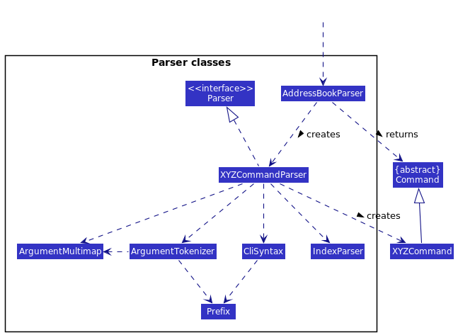
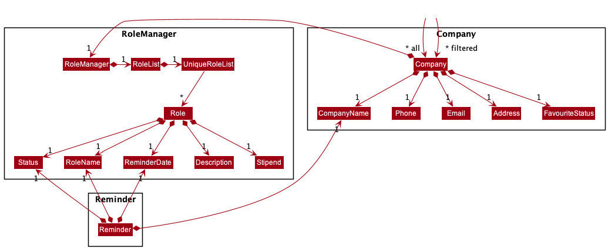
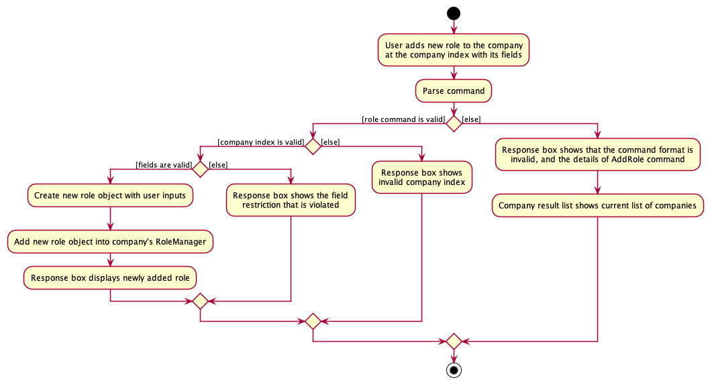
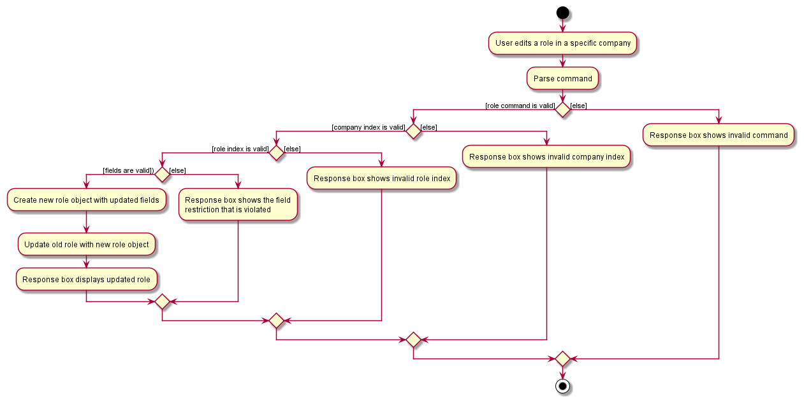
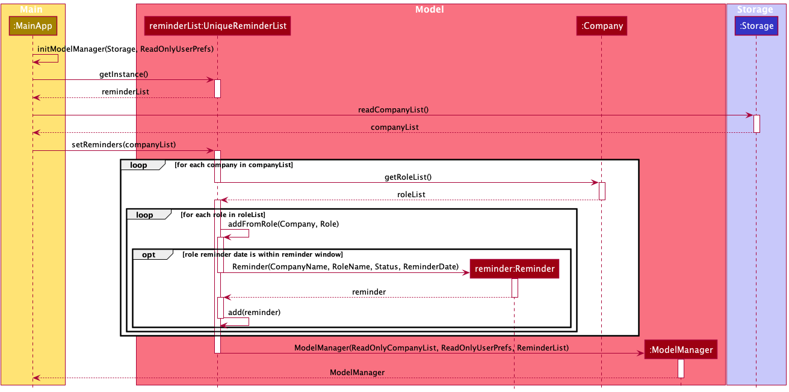

# Table of Contents 
* [Acknowledgements](#acknowledgements)
* [Setting up, getting started](#setting-up-getting-started)
* [Design](#design)
    * [Architecture](#architecture)
    * [UI Component](#ui-component)
    * [Logic Component](#logic-component)
    * [Model Component](#model-component)
    * [Storage Component](#storage-component)
* [Implementation](#implementation)
    * [Add role feature](#add-role-feature)
      * [Implementation](#implementation-add)
      * [Design considerations](#design-considerations-add)
    * [Edit role feature](#edit-role-feature)
      * [Implementation](#implementation-edit)
      * [Design considerations](#design-considerations-edit)
    * [Delete role feature](#delete-role-feature)
      * [Implementation](#implementation-delete)
      * [Design considerations](#design-considerations-delete)
    * [Find feature](#find-feature)
      * [Implementation](#implementation-find)
      * [Design considerations](#design-considerations-find)
    * [Reminder feature](#reminder-feature)
        * [Implementation](#implementation-reminder)
    * [Set reminder window feature](#set-reminder-window-feature)
        * [Implementation](#implementation-set-reminder-window)
    * [Favourite feature](#favourite-feature)
      * [Implementation](#implementation-favourite)
      * [Design considerations](#design-considerations-favourite)
* [Documentation, logging, testing, configuration, dev-ops](#documentation-logging-testing-configuration-dev-ops)
* [Appendix: Requirements](#requirements)
  * [Product scope](#product-scope)
  * [User stories](#user-stories)
  * [Use cases](#use-cases)
  * [Non-Functional Requirements](#non-functional-requirements)
  * [Glossary](#glossary)
* [Appendix: Instructions for manual testing](#instructions-for-manual-testing)
  * [Start and exit the application](#start-and-exit-the-application)
  * [Adding a company](#adding-a-company)
  * [Editing a company](#editing-a-company)
  * [Deleting a company](#deleting-a-company)
  * [Editing a role](#editing-a-role)
  * [Using the reminder feature](#using-reminders)
* [Appendix: Effort](#effort)

--------------------------------------------------------------------------------------------------------------------

## Acknowledgements 

* This project is created based on the AddressBook-Level3 project by the [SE-EDU initiative](https://se-education.org).

--------------------------------------------------------------------------------------------------------------------

## Setting up, getting started 

Refer to the guide [Setting up and getting started](SettingUp.md).

--------------------------------------------------------------------------------------------------------------------

## Design 

:bulb: if the image is too small, try opening it in a new tab by right-clicking the image and select "Open image in new tab" for a better view.

### Architecture 

The Architecture Diagram given above explains the high-level design of the Tinner. Tinner follows a multi-layered architecture where the lower layers are independent of higher layers. For example, `Main` can use methods found in `Storage` but not the other way around.
Below is a quick overview of main components and how they interact with each other.

**`Main`** has two classes called [`Main`](https://github.com/AY2122S2-CS2103T-T17-1/tp/blob/master/src/main/java/seedu/tinner/Main.java) and [`MainApp`](https://github.com/AY2122S2-CS2103T-T17-1/tp/blob/master/src/main/java/seedu/tinner/MainApp.java). It is responsible for,

* At app launch: Initializes the components in the correct sequence, and connects them up with each other.
* At shut down: Shuts down the components and invokes cleanup methods where necessary.

[**`Commons`**](#common-classes) represents a collection of classes used by multiple other components.

The rest of the App consists of four components.

* [**`UI`**](#ui-component): The UI of the App.
* [**`Logic`**](#logic-component): The command executor.
* [**`Model`**](#model-component): Holds the data of the App in memory.
* [**`Storage`**](#storage-component): Reads data from, and writes data to, the hard disk.

Each of the four components,

* defines its _API_ in an `interface` with the same name as the Component.
* exposes its functionality using a concrete `{Component Name}Manager` class (which implements the corresponding API `interface` mentioned in the previous point.

For example, the `Logic` component (see the class diagram given below) defines its API in the `Logic.java` interface and exposes its functionality using the `LogicManager.java` class which implements the `Logic` interface.

**How the architecture components interact with each other**

The _Sequence Diagram_ below shows how the components interact with each other for the scenario where the user issues the command `deleteCompany 1` when in project view.

The sections below give more details of each component.

### UI Component 

**API** :
[`Ui.java`](https://github.com/AY2122S2-CS2103T-T17-1/tp/blob/master/src/main/java/seedu/tinner/ui/Ui.java)

The UI consists of a `MainWindow` that is made up of parts e.g.`CommandBox`, `ResultDisplay`, `CompanyListPanel`, `StatusBarFooter` etc. All these, including the `MainWindow`, inherit from the abstract `UiPart` class which captures the commonalities between classes that represent parts of the visible GUI.

The `CommandBox` and `ResultDisplay` appear at the top of the application for the user
to interact with the application.

The `CompanyListPanel` appears at the center of the application displaying key information of `Company`
from `CompanyCard`.

The `RoleListPanel` appears at the bottom of `CompanyCard` displaying key information of `Role` from `RoleCard`.

The `ReminderWindow` appears as a separate window displaying key information of `Reminder` from `ReminderCard`.

The `UI` component uses the JavaFx UI framework. The layout of these UI parts are defined in matching `.fxml` files that are in the `src/main/resources/view` folder. For example, the layout of the `MainWindow` is specified in `MainWindow.fxml`

The `UI` component,
* executes user commands using the `Logic` component.
* listens for changes to `Model` data so that the `UI` can be updated with the modified data.
* keeps a reference to the `Logic` component, because the `UI` relies on the `Logic` to execute commands.
* depends on some classes in the `Model` component, as it displays `Company` and `Role` objects residing in the `Model`.

### Logic Component 

**API** :
[`Logic.java`](https://github.com/AY2122S2-CS2103T-T17-1/tp/blob/master/src/main/java/seedu/tinner/logic/Logic.java)

How the `Logic` component works:

* When `Logic` is called upon to execute a command, it uses the `CompanyListParser` class to parse the user command.
* This results in a `Command` object (or more precisely, an object of one of its subclasses e.g., `AddCompanyCommand`) which is executed by the `LogicManager`.
* The command can communicate with the `Model` when it is executed (e.g. to add a company).
* The result of the command execution is encapsulated as a `CommandResult` object which is returned back from `Logic`.

The Sequence Diagram below illustrates the interactions within the `Logic` component for the `execute("deleteCompany 1")` API call.

:information_source: **Note:** The lifeline for `DeleteCompanyCommandParser` should end at the destroy marker (X) but due to a limitation of PlantUML, the lifeline reaches the end of diagram.

The other classes in `Logic` (omitted from the class diagram above) that are used for parsing a user command can be represented as follows:

How the parsing works:

* When called upon to parse a user command, the `CompanyListParser` class creates an `XYZCommandParser` (`XYZ` is a placeholder for the specific command name e.g., `AddCompanyCommandParser`) which uses the other classes shown above (e.g. `ArgumentMultimap`, `ParserUtil`, etc.) to parse the user command and create a `XYZCommand` object (e.g., `AddCompanyCommand`) which the `CompanyListParser` returns back as a `Command` object.
* All `XYZCommandParser` classes (e.g., `AddCompanyCommandParser`, `DeleteCompanyCommandParser`, …) inherit from the `Parser` interface so that they can be treated similarly where possible e.g, during testing.

### Model Component 

Breakdown of the Company, RoleManager and Reminder packages:

**API** :
[`Model.java`](https://github.com/AY2122S2-CS2103T-T17-1/tp/blob/master/src/main/java/seedu/tinner/model/Model.java)

The `Model` component,

* stores the company list data i.e., all `Company` objects (which are contained in a `UniqueCompanyList` object).
* stores the currently selected `Company`, `Role` and `Reminder` objects (e.g., results of a search query) as a separate filtered list which is exposed to outsiders as an unmodifiable `ObservableList` that can be ‘observed’ e.g. the UI can be bound to this list so that the UI automatically updates when the data in the list change.
* stores a `UserPref` object that represents the user’s preferences. This is exposed to the outside as a `ReadOnlyUserPref` objects.
* the `Reminder` objects store data of a role in a company that has a reminder date which is within the reminder window.
* does not depend on any of the other three components (as the `Model` represents data entities of the domain, they should make sense on their own without depending on other components)

### Storage Component 

**API** :
[`Storage.java`](https://github.com/AY2122S2-CS2103T-T17-1/tp/blob/master/src/main/java/seedu/tinner/storage/Storage.java)

The `Storage` component,

* can save `UserPref` objects in json format and read it back.
* can save `JsonAdaptedCompany` objects in `JsonSerializableCompanyList` in json format and read it back.
* can save `JsonAdaptedRole` objects in `JsonAdaptedCompany` in json format and read it back
* inherits from both `CompanyListStorage` and `UserPrefStorage`,meaning that it can be
  treated as either one (if the functionality of only one is required)
* depends on classes like `Company` and `Role` in the `Model` component (as it is the `Storage` component's
  job to save/retrieve objects that belong to the `Model`)

The `JsonAdaptedCompany` also contains a list of roles in `List<JsonAdaptedRole>` format, as show in the class diagram above.

--------------------------------------------------------------------------------------------------------------------

## Implementation 

Due to some of our features having duality in its implementaion, we have decided to omit those features exclusive
to `company` that have a `role` counterpart. This is due to the `role` counterpart being more complicated as it builds
directly on top of the features exclusive to `company`.

### Add role feature 
The `addRole` command for the `Role` item allows the user to add a new role by specifying
the company index this role is attached to, and the details of the role with the appropriate prefix.

The fields of the `Role` that are necessary are as follows:
* `RoleName`
* `Status`

The fields of the `Role` that are optional are as follows:
* `ReminderDate`
* `Description`
* `Stipend`

#### Implementation 

  
The `addRole` command is primarily implemented by `AddRoleCommandParser` a class that extends `Parser`, 
and `AddRoleCommand`, which is a class that extends `Command`.

The `AddRoleCommandParser` has three main objective
1. Ensure user inputs all necessary fields.
2. Ensure validity of all fields from user input.
3. If 1 and 2 are satisfied, store the user inputs into a new `Role` object.

If all three objectives are achieved, the newly created `Role` object would then be passed to `AddRoleCommand`
Upon completion of executing `addRole` command, the displayed list of roles would be dynamically updated accordingly.

Given below is an example usage scenario and how the add role feature behaves at each step:
1. The user executes the command `addRole 1 n/Data Analyst s/applying r/31-07-2022 23:59` to add a new role into the 1st company.
2. Then the `AddRoleCommandParser#parse()` parses and creates a `Role` object with fields to be added such as the roleName `Data Analyst` before creating an instance of `AddRoleCommand` with it.
3. The `AddRoleCommandParser` returns the `AddRoleCommand` to the `LogicManager`. `LogicManager` invokes `AddRoleCommand#execute()` which validates if role is present according to the company and role indexes, if so add the new role into the company's `RoleManager`.
4. The `LogicManager` then returns the `CommandResult` to `MainWindow` in order to display changes to the user.

The following sequence diagram shows how the `addRole` command operation works with the
valid user input `addRole 1 n/Data Analyst s/applying r/31-07-2022 23:59`:

The following activity diagram summarizes what happens when a user executes an `addRole` command:    

#### Design considerations 
* Alternative 1 (current choice): Abstract `Role`'s storage to be handled by `RoleManager`
    * Pros: 
      * Reduce coupling between `Role` and `Company` as the `addRole` feature is implemented
      via the `Role`'s model instead of the `Company`'s model.
      * `Company` does not need to worry about the implementation details of `Role`,
      which it shouldn't in the first place.
    * Cons:
      * Increases code duplication as `Company` class has to retain methods which acts as signals for
      invoking execution of methods in `Role`.
* Alternative 2 (used in v1.2): `Role` is stored in a Java List as an attribute of `Company` class
    * Pros: 
      * All commands related to `Role` can be implemented and handled on `Company` level, reduces code repetition.
      * `AddRole` feature could be achieved via calling on an attribute of `Company`.
    * Cons:
      * Exposes the internal implementation of `Role` to `Company` even though they are different.
      * Increases coupling between `Role` and `Company`.

### Edit role feature 
The `editRole` command for the `Role` item allows the user to update any fields by specifying
the company index, role index and prefixes of the fields to be updated.

The aforementioned fields of the `Role` that can be modified are as follows:
* `RoleName`
* `Status`
* `ReminderDate`
* `Description`
* `Stipend`

#### Implementation 

  
The `editRole` command is primarily implemented by `EditRoleCommandParser` a class that
extends `Parser`, and `EditRoleCommand`, which is a class that extends `Command`. The `EditRoleCommand` has
an inner class `EditRoleDescriptor` that holds the changes to fields of the `Role` to be modified.
Upon completion of executing `editRole` command, the displayed list of roles would be dynamically updated accordingly.

Given below is an example usage scenario and how the edit role feature behaves at each step:
1. The user executes the command `editRole 1 1 d/react js` to edit the description in the 1st role from the 1st company.
2. Then the `EditRoleCommandParser#parse()` parses and creates an `EditRoleDescriptor` object with fields to be modified such as the description `react js` before creating an instance of `EditRoleCommand` with it.
3. The `EditRoleCommandParser` returns the `EditRoleCommand` to `LogicManager`. `LogicManager` invokes `EditRoleCommand#execute()` which validates the company and role indexes, if so edit its description to the user input.
4. The `LogicManager` then returns the `CommandResult` to `MainWindow` in order to display changes to the user.

The following sequence diagram shows how the `editRole` command operation works with the valid user input `editRole 1 1 d/react js`:
  

The following activity diagram summarizes what happens when a user executes an `editRole` command:    

#### Design considerations 
* Alternative 1 (current choice): Logic components interact with the `Model` interface solely and not directly with model’s internal components: `Company`, `RoleManager`, `UniqueRoleList`.
    * Pros:
      * The `Model` interface acts as a Façade to allow clients such as `Logic` to access to the functionalities of its internal components without exposing the implementation details.
      Thus, reducing coupling between `Model` and other components as all functionalities of modifying `Role` can be accessed via the `Model` interface.
      * This increases maintainability as `EditRoleCommand` will only interact with `Model` interface with little concern to any changes in the implementation details of the internal components of `Model`.
    * Cons:
      * This requires additional code within `Model` as more methods are needed for other components to access the functionality of its internal components.
* Alternative 2 (used in v1.2): `Model` allows clients to access its internal components directly such as `Company`, `RoleManager`, `UniqueRoleList` to modify `Role`.
  * Pros:
    * No additional code is needed as clients can operate directly on the internals of `Model`.
  * Cons:
    * This exposes the internal implementation of `Model` and increases coupling between `EditRoleCommand` and, `Company`, `RoleManager` and `UniqueRoleList`.
    * It is harder to maintain as any changes to the internal implementation of `Model` will affect the implementation of `EditRoleCommand`.

### Delete role feature 
The `deleteRole` command for the `Role` item allows the user to delete any role under a `Company` item by specifying the company index and role index that which are associated with the `Role` item to be deleted.

#### Implementation 

The `deleteRole` command relies on the `DeleteRoleCommandParser`, a class that extends `Parser`, as well as `DeleteRoleCommand`, which is a class that extends `Command`.
The `DeleteRoleCommand`, upon completion, dynamically updates the displayed list of roles accordingly.

Given below is an example usage scenario and how the delete role feature behaves at each step:
1. The user executes the command `deleteRole 1 1` to delete the 1st role from the 1st company.
2. Then the `DeleteRoleCommandParser#parse()` parses and creates an instance of `DeleteRoleCommand` with the company index and role index parsed.
3. The `DeleteRoleCommandParser` returns the `DeleteRoleCommand` to `LogicManager`. `LogicManager` invokes `DeleteRoleCommand#execute()` which validates if role is present according to the company and role indexes, if so deletes the role.
4. The `LogicManager` then returns the `CommandResult` to `MainWindow` in order to display the changes to the user.

The following sequence diagram shows how the `deleteRole` command operation works with the user input `deleteRole 1 1`:

The following activity diagram summarizes what happens when a user executes an `deleteRole` command:    

#### Design considerations 
* Alternative 1 (current choice): Split `delete` feature into `deleteCompany` and `deleteRole`
    * Pros:
        * Prevents users from accidentally deleting an entire company when intended action was to only delete roles.
        * More intuitive to users as it is easier to associate the differences with words compared to format of command. 
    * Cons:
        * Increases code repetition due to both delete features have similar components.
* Alternative 2 (used in v1.2): Have a unified `delete` feature that changes functionality based off user input.
    * Pros:
        * Reduce code repetition due to not having two different class and two different parsers.
    * Cons:
        * User might accidentally delete an entire `company` if command was sent too early, resulting in the `company` and all associated `roles` being deleted.
        * Due to the lack of an undo feature, this is can be a massive problem.

### Find feature 

The `find` feature allows users to filter the company list to find roles by specifying company name keywords and role name keywords.

#### Implementation 

Given below is an example usage scenario and how the find feature behaves at each step:
1. The user executes the command `find c/meta r/software mobile` to find roles whose role names contain role name keywords `software` or `mobile`, which belong to companies whose company names contains the company name keyword `meta`.
2. Then the `FindCommandParser#parse()` creates a `CompanyNameContainsKeywordsPredicate` object and a `RoleNameContainsKeywordsPredicate` object with the role name keywords and company name keyword.
3. The `FindCommand#execute()` method will update the `model` using the `Model#updateFilteredCompanyList()` method, displaying only roles that match the keywords, and the companies that they belong to.
4. The `Parser` returns the `FindCommand` to `LogicManager` which then returns the `CommandResult` to `MainWindow` in order to display the changes to the user.

The following sequence diagram shows how the `find` command operation works with the user input `find c/meta r/software mobile`:

The following activity diagram summarises what happens when a user executes the `find` command:

#### Design considerations 

* Alternative 1 (current choice): The use of one unified `find` command with prefixes `c/` and `r/` to concurrently filter the company list by role name and company name.
    * Pros:
        * Users are able to quickly sieve through the company list to find the specific roles.
    * Cons:
        * Increased dependencies and coupling between components, as `model` now depends on both classes `CompanyNameContainsKeywordsPredicate` and `RoleNameContainsKeywordsPredicate`.
* Alternative 2 (used in v1.2): `find` only allows users to filter the company list by company name keywords and not role name keywords.
    * Pros:
        * Reduced coupling between components as `model` depends on `CompanyNameContainsKeywordsPredicate` but not `RoleNameContainsKeywordsPredicate`.
    * Cons:
        * Users have less flexibility in searching for specific roles, especially when they have applied for multiple roles within the same company. They can only find all roles which belong to specific companies.

### Reminder feature 
Whenever the user starts up the application, a reminder pane will automatically open along with the main window, showing all roles and their respective companies that have reminder dates that are within the reminder window.

The fields of the `Reminder` that will be shown are as follows:
* `Company Name`
* `RoleName`
* `ReminderDate`
* `Status`

#### Implementation 

Given below is an example scenario on how the reminder feature works:
1. The user has a role in a company with a reminder date of 30-04-2022 23:59.
2. Assuming that the reminder window is at its default of 7 days, and today is within 7 days from 30th April 2022, when the user opens the application, the reminder pane will display the given role and its relevant fields as mentioned above.

The following sequence diagram shows how the reminder feature works:

The following activity diagram summarises what happens when the user opens the application to see upcoming reminders:

### Set reminder window feature 

The `setWindow` feature allows users to set the reminder window to a specific number of days. Any roles stored in the company list that fall within the set window will be displayed in the reminder pane that automatically opens up on start.

#### Implementation 

Given below is an example usage scenario and how the set reminder window feature behaves at each step:
1. The user executes the command `setWindow 14` to set the reminder window to 14 days.
2. Then the `SetReminderWindowCommandParser#parse()` creates an instance of `SetReminderWindowCommand` by passing the number of days to which the reminder window will be set.
3. The `SetReminderWindowCommand#execute()` method will update the `model` using the `Model#setReminderWindow()` method, which consequently updates `userPrefs` by calling the `UserPrefs#setReminderWindow()` method to update the reminder window as stored in the user preferences.
4. The `Parser` returns the `SetReminderWindowCommand` to `LogicManager` which then returns the `CommandResult` to `MainWindow` in order display the changes to the user.

The following sequence diagram shows how the `setWindow` command operation works with the user input `setWindow 14`:

The following activity diagram summarises what happens when a user executes the `setWindow` command:

### Favourite feature 

The `favourite` feature allows users to highlight specific companies. Favourited companies are indicated using a star beside their company name in the GUI.

#### Implementation 

Given below is an example usage scenario and how the favourite feature behaves at each step:
1. The user executes the command `favourite 1` to favourite the first company within the displayed company list.
2. Then the `FavouriteCompanyCommandParser#parse()` creates an instance of `FavouriteCompanyCommand` by passing the company index to be favourited.
3. The `FavouriteCompanyCommand#execute()` method will update the `model` with the favourited company using the `Model#setCompany()` method, replacing the previous company that was not favourited.
4. The `model` is then updated with the `Model#updateFilteredCompanyList()` method, displaying all companies and roles in the company list.
5. The `Parser` returns the `FavouriteCompanyCommand` to `LogicManager` which then returns the `CommandResult` to `MainWindow` in order to display the changes to the user.

The following sequence diagram shows how the `favourite` command operation works with the user input `favourite 1`:

The following activity diagram summarises what happens when a user executes the `favourite` command:

#### Design considerations 

* Alternative 1 (current choice): Although both `favourite` and `editCompany` commands edit fields within a specified company, we decided to make them two separate commands.
    * Pros:
        * Users are able to favourite roles much more easily by just providing the index.
        * More intuitive to users to use `favourite` rather than `editCompany` to favourite a company.
    * Cons:
        * This feature was more challenging to implement as compared to simply integrating the functionality of `favourite` into `editCompany`.
* Alternative 2: Allowing the favourite status field of a company to be modified through `editCompany`.
    * Pros:
        * Users can modify all fields within a company, including the favourite status, with the use of one single command. 
    * Cons:
        * It is less straightforward for users to use `editCompany` to favourite a company. This also means that the favourite status field will not stand out to users.

--------------------------------------------------------------------------------------------------------------------

## Documentation, logging, testing, configuration, dev-ops 

* [Documentation guide](Documentation.md)
* [Testing guide](Testing.md)
* [Logging guide](Logging.md)
* [Configuration guide](Configuration.md)
* [DevOps guide](DevOps.md)

--------------------------------------------------------------------------------------------------------------------

## Requirements 

### Product scope 

**Target user profile**:

Students who...

* want to keep track of tech internships
* are disorganised and tend to miss deadlines
* prefer desktop apps over other types
* can type fast
* prefer typing to mouse interactions
* are reasonably comfortable using CLI apps

**Value proposition**:

1. **Tracks** essential information such as statuses and deadlines at a glance.
2. **Reminds** you of important deadlines so that you will not miss anything about your application.
3. Allows you to **Review** the process and take down notes so that you can ace your next application.

### User stories 

Priorities: High (must have) - `* * *`, Medium (nice to have) - `* *`, Low (unlikely to have) - `*`

| Priority | As a …​        | I want to …​                                                               | So that I can…​                                          |
|----------|----------------|----------------------------------------------------------------------------|----------------------------------------------------------|
| `* * *`  | user           | add a new company                                                          | add new internship roles to said company                 |
| `* * *`  | user           | add a new internship role                                                  | keep track of said internship application process        |
| `* * *`  | user           | delete a company                                                           | remove companies that I am no longer interested in       |
| `* * *`  | user           | delete an internship role                                                  | remove internship roles that are outdated or complete    |
| `* * *`  | user           | see a summary of my internship applications at a glance                    | have a general overview of the status of my applications |
| `* *`    | user           | search keywords like company name, internship roles, etc.                  | locate my internship application quickly                 |
| `* *`    | user           | sort applications in chronological order of deadlines                      | keep track of the timeline of applications               |
| `* *`    | user           | modify each item                                                           | keep Tinner and all its contents up to date              |
| `* *`    | user           | be reminded of upcoming deadlines                                          | be on time with my applications                          |
| `* *`    | organised user | tag applications and events                                                | keep items compartmentalised and thus easier to access   |
| `* *`    | new user       | learn how to use the application via a guide                               | use the application periodically with ease               |
| `* *`    | user           | mark certain entries as my favourites                                      | view those that I am more interested in at a glance      |
| `*`      | user           | sort company names in alphabetical order                                   | locate a company that I may have forgotten about         |
| `*`      | user           | export calendar dates of important events into a .ics or .pdf file         | keep track of my events on an external platform          |
| `*`      | long term user | archive/hide irrelevant events                                             | not get distracted by what is not important              |
| `*`      | user           | export a list of interview reviews of different companies into a .csv file | share my experience with juniors and peers               |

### Use cases 

(For all use cases below, the **System** is the `Tinner` and the **Actor** is the `user`, unless specified otherwise)

**Use case: UC01 - Add a company**

Guarantees: a company will be successfully created

**MSS**

1. User requests to add a specific company and its information in the list
2. Tinner adds a company to the list
3. Tinner displays the list of companies

   Use case ends

**Extensions**

&emsp;1a. The input does not adhere to the command format  
&emsp;&emsp;1a1. Tinner shows an invalid input format error message  
&emsp;&emsp;&emsp;&emsp; Use case resumes at step 1

&emsp;1b. The specific company is already stored  
&emsp;&emsp;1b1. Tinner shows a duplicate company error message  
&emsp;&emsp;&emsp;&emsp;Use case resumes at step 1

**Use case: UC02 - Edit a company** 

Precondition: there exists at least one company in Tinner

**MSS**
1. User request to edit certain details of a specific company
2. Tinner edits certain details specified by the user
3. Tinner displays the list of companies with updated details

    Use case ends

**Extensions**  
&emsp;1a. The input does not adhere to the command format  
&emsp;&emsp;1a1. Tinner shows an invalid input format error message  
&emsp;&emsp;&emsp;&emsp;Use case resumes at step 1

&emsp;1b. Company already exists in Tinner format  
&emsp;&emsp;1b1. Tinner shows error that company is duplicated  
&emsp;&emsp;&emsp;&emsp;Use case resumes at step 1

&emsp;1c. Field restrictions violated  
&emsp;&emsp;1c1. Tinner shows error that a specific restriction is violated   
&emsp;&emsp;&emsp;&emsp;Use case resumes at step 1

**Use case: UC03 - Delete a company**

Precondition: there exists at least one company in Tinner

Guarantees: a company is successfully removed from Tinner

**MSS**

1. User requests to view a list of companies
2. Tinner shows a list of companies and the associated internship roles
3. User requests to delete a specific company in the list
4. Tinner deletes the company

   Use case ends

**Extensions**

&emsp;3a. The input does not adhere to the command format  
&emsp;&emsp;3a1. Tinner shows an invalid input format error message  
&emsp;&emsp;&emsp;&emsp;Use case resumes at step 2

&emsp;3b. The input company index is invalid  
&emsp;&emsp;3b1. Tinner shows a company index out of bounds error message  
&emsp;&emsp;&emsp;&emsp;Use case resumes at step 2

**Use case: UC04- Add an internship role**

Precondition: the company to which the internship role will belong has already been created

Guarantees: an internship role will be successfully created

**MSS**

1. User requests to view a list of companies 
2. User requests to add an internship role and provides the relevant details 
3. Tinner adds the internship role to the list of roles of the specific company

   Use case ends

**Extensions**

&emsp;1a. The input does not adhere to the command format  
&emsp;&emsp;1a1. Tinner shows an invalid input format error message  
&emsp;&emsp;&emsp;&emsp;Use case resumes at step 1

**Use case: UC05 - Edits an internship role** 

Precondition: there exists at least one role associated with a company in Tinner

**MSS**

1. User requests to edit a specific internship role of a company 
2. Tinner edits certain details specified by the user 
3. Tinner displays the list of companies with roles and its updated details
   
    Use case ends

**Extensions**  
&emsp; 1a. The input does not adhere to the command format  
&emsp; &emsp; 1a1. Tinner shows an invalid input format error message  
&emsp; &emsp; &emsp; &emsp;  Use case resumes at step 1

&emsp; 1b. The input company index is invalid  
&emsp; &emsp; 1b1. Tinner shows error that the company index is invalid  message  
&emsp; &emsp; &emsp; &emsp;  Use case resumes at step 1

&emsp; 1c. The input internship role index is invalid  
&emsp; &emsp; 1c1. Tinner shows error that the role index is invalid message  
&emsp; &emsp; &emsp; &emsp;  Use case resumes at step 1

&emsp; 1d. Role already exists in Tinner format  
&emsp;&emsp; 1d1. Tinner shows error that role is duplicated  
&emsp;&emsp;&emsp;&emsp; Use case resumes at step 1

&emsp; 1e. Field restrictions violated  
&emsp;&emsp; 1e1. Tinner shows error that a specific restriction is violated  
&emsp;&emsp;&emsp;&emsp; Use case resumes at step 1

**Use case: UC06 - Delete an internship role**

Precondition: there exists at least one internship role associated with a company 

Guarantees: a specified internship role is successfully removed from the associated company

**MSS**

1. User requests to view a list of companies
2. Tinner shows a list of companies and the associated internship roles
3. User requests to delete a specific internship role of a company in the list
4. Tinner deletes the internship role

   Use case ends

**Extensions**

&emsp;a. The input does not adhere to the command format  
&emsp;&emsp;3a1. Tinner shows an invalid input format error message  
&emsp;&emsp;&emsp;&emsp; Use case resumes at step 2

&emsp;3b. The input company index is invalid  
&emsp;&emsp;3b1. Tinner shows a company index out of bounds error message  
&emsp;&emsp;&emsp;&emsp;Use case resumes at step 2

&emsp;3c. The input internship role index is invalid  
&emsp;&emsp;c1. Tinner shows an internship role index out of bounds error message  
&emsp;&emsp;&emsp;&emsp;Use case resumes at step 2

**Use case: UC07 - List all companies**

Precondition: there exist at least one company stored in Tinner

Guarantees: every company stored in Tinner will be shown

**MSS**

1. User requests to view a list of companies
2. Tinner displays all companies in its storage

   Use case ends

**Use case: UC08 - Using the reminder feature**

Precondition: there exist at least one company stored in Tinner

Guarantees: every role in companies that have reminder dates within the reminder window from today will be shown

**MSS**

1. The user [adds a role(UC02)](#uc02) or [edits a role(UC05)](#uc05) that has a reminder date.
2. Tinner shows success message and adds/edits the role.
3. The user closes the application and opens it up again immediately or some time in the future
4. Tinner displays all roles in companies that have reminder dates within the reminder window from today's date
    
   Use case ends

**Use case: UC09 - Using the set reminder window feature**

Guarantees: the reminder window will be successfully updated

**MSS**

1. User requests to update reminder window to a new reminder window
2. Tinner updates the reminder window
3. The updated reminder window is reflected upon restarting the application
    
   Use case ends

**Extensions**

&emsp;1a. The input reminder window is invalid (i.e. negative or bigger than 30)  
&emsp;&emsp;1a1. Tinner shows an invalid input reminder window error message  
&emsp;&emsp;&emsp;&emsp;Use case resumes at step 1

**Use case: UC10 - Favouriting a company and viewing all favourited companies**

Precondition: there exist at least one company in Tinner

Guarantees: a company is successfully favourited within Tinner

**MSS**

1. User requests to view a list of companies
2. Tinner shows a list of companies and the associated internship roles
3. User requests to favourite a specific company in the list
4. Tinner favourites the company
5. User requests to view all favourited companies
6. Tinner shows a list of all favourited companies and their associated internship roles
  
   Use case ends

**Extensions**

&emsp;3a. The input does not adhere to the command format  
&emsp;&emsp;3a1. Tinner shows an invalid input format error message  
&emsp;&emsp;&emsp;&emsp;Use case resumes at step 2

&emsp;3b. The input company index is invalid  
&emsp;&emsp;3b1. Tinner shows a company index out of bounds error message  
&emsp;&emsp;&emsp;&emsp;Use case resumes at step 2

&emsp;3c. The specific company to be favourited had already been favourited  
&emsp;&emsp;3c1. Tinner shows a company already favourited error message  
&emsp;&emsp;&emsp;&emsp;Use case resumes at step 2

**Use case: UC11 - Unfavouriting a company**

Precondition: there exist at least one company in Tinner 

Guarantees: a company is successfully unfavourited within Tinner

**MSS**

1. User requests to view a list of companies
2. Tinner shows a list of companies and the associated internship roles
3. User requests to unfavourite a specific company in the list
4. Tinner unfavourites the company

   Use case ends

**Extensions**

&emsp;3a. The input does not adhere to the command format  
&emsp;&emsp;3a1. Tinner shows an invalid input format error message  
&emsp;&emsp;&emsp;&emsp;Use case resumes at step 2

&emsp;3b. The input company index is invalid  
&emsp;&emsp;3b1. Tinner shows a company index out of bounds error message  
&emsp;&emsp;&emsp;&emsp;Use case resumes at step 2

&emsp;3c. The specific company to be unfavourited is already unfavourited 
&emsp;&emsp;3c1. Tinner shows a company already unfavourited error message  
&emsp;&emsp;&emsp;&emsp;Use case resumes at step 2

### Non-Functional Requirements 

1. Should work on any _mainstream OS_ as long as it has Java `11` or above installed
2. Should be able to hold up to 1000 items (companies and internship roles) without a noticeable sluggishness in performance for typical usage
3. Should require no installation
4. A user with above average typing speed for regular English text (i.e. not code, not system admin commands) should be able to accomplish most of the tasks faster using commands than using the mouse
5. Should be responsive and have a latency of less than 3 seconds

### Glossary 

* **Mainstream OS**: Windows, Linux, Unix, macOS
* **CLI**: Command Line Interface
* **MSS**: Main Success Scenario
* **[Command Box](https://ay2122s2-cs2103t-t17-1.github.io/tp/UserGuide.html#navigation)**: Text field for users to key in their commands                                                                                                                             
* **[Response Box](https://ay2122s2-cs2103t-t17-1.github.io/tp/UserGuide.html#navigation)**:  Tinner's response to user's commands.  If the command was successful, Tinner would respond with what it did. Else it tells you what went wrong and any tips to fix it

## Appendix: Instructions for manual testing 

### Start and exit the application 
1. To start the application
   1. Download the tinner.jar file and copy into an empty folder. 
   2. On the command terminal, run the following command in the directory containing tinner.jar: `java -jar tinner.jar`  
   Expected: Shows the GUI with internship application examples. 
2. To exit the application
   1. Enter `exit` in the command box.   
   Expected: The application will close shortly. 
   

### Adding a company 
1. Test case: `addCompany n/Govtech p/9222222 e/xyz@gov.com a/10 Pasir Panjang Rd, #10-01 Mapletree Business City, Singapore 117438`
   1. Expected: Company list is updated with the addition of "GovTech". The response box shows the details of all the fields added.
2. Test case: `addCompany n/Tik Tok e/xyz@tiktok.com`
   1. Expected: Company list is updated with the addition of "Tik Tok". The response box shows the details of the fields added.
3. Test case: `addCompany e/t@tesla.com p/99944426 n/Tesla`
   1. Expected: Company list is updated with the addition of "Tesla". The response box shows the details of the fields added.
4. Test case: `addCompany n/Tinner p/ e/t@tinner.com a/fairy land`
   1. Expected: Company list is not updated. The response box shows error message that there must be a value after a prefix.
5. Other incorrect test cases to try: `addCompany`, and other prefixes without value e.g. `add n/`.
   1. Expected: Company list is not updated. The response box shows an error message that it is an invalid command with additional information of the correct command format. 

### Editing a company 
1. Prerequisites: At least 2 companies must exist and listed using the `list` command
2. Test case: `editCompany 1 1 n/Tik Tok`
    1. Expected: The name of 1st company is changed to "TikTok".
       The response box shows the updated details of all the fields of the edited company. The company list is updated with the changes.
3. Test case: `editCompany 2 n/Tik Tok`
    1. Expected: The name 2nd company is not updated.
       The response box shows error message that the company already exists in the company list.
4. Other incorrect test cases to try: `editCompany`, `editCompany x n/VAlID_COMPANY_NAME` where x is an integer larger than the size of the company list or negative integer values.
    1. Expected: The intended company with index `x` is not updated.
   The response box shows error message that it is an invalid command or company index provided is invalid. 

### Deleting a company 
1. Prerequisites: At least 2 companies must exist and listed using the `list` command
2. Test case: `deleteCompany 1`
   1. Expected: First company with its roles included if any, is removed from the company list. 
   The response box shows the details of the deleted company.
3. Other incorrect test cases to try: `deleteCompany`, `deleteCompany x` where x is an integer larger than the size of the company list or negative integer values.
   1. Expected: Company with index `x` is not deleted. The response box shows error message that it is an invalid command or company index provided is invalid.

### Favouriting a company 
1. Prerequisites: At least 2 companies must exist with the first company in the company list already favourited (indicated with a star beside its name in the GUI), and listed using the `list` command
2. Test case: `favourite 2`
    1. Expected: Second company in the displayed company list is favourited.
       The response box shows the details of the favourited company.
3. Test case: `favourite 1`
    1. Expected: First company in the displayed company list is not favourited again as it is already favourited.
       The response box shows a message indicating that the company is already favourited.
4. Other incorrect test cases to try: `favourite`, `favourite x` where x is an integer larger than the size of the company list or negative integer values.
    1. Expected: Company with index `x` is not favourited. The response box shows error message that it is an invalid command or company index provided is invalid.

### Unfavouriting a company 
1. Prerequisites: At least 2 companies must exist with the first company in the company list already favourited (indicated with a star beside its name in the GUI), and listed using the `list` command
2. Test case: `unfavourite 1`
    1. Expected: First company in the displayed company list is unfavourited.
       The response box shows the details of the unfavourited company.
3. Test case: `unfavourite 2`
    1. Expected: Second company in the displayed company list is not unfavourited as it is already unfavourited.
       The response box shows a message indicating that the company is already unfavourited.
4. Other incorrect test cases to try: `unfavourite`, `unfavourite x` where x is an integer larger than the size of the company list or negative integer values.
    1. Expected: Company with index `x` is not favourited. The response box shows error message that it is an invalid command or company index provided is invalid.

### Editing a role 
1. Prerequisites: At least 1 companies with 2 roles must exist and listed using the `list` command
2. Test case: `editRole 1 1 n/Frontend Engineer`
   1. Expected: The name of 1st role from the 1st company is changed to "Frontend Engineer".
   The response box shows the updated details of all the fields of the edited role. The company list is updated with the changes. 
3. Test case: `editRole 1 2 n/Frontend Engineer`
   1. Expected: The name of 2nd role from the 1st company is not updated.
   The response box shows error message that the role already exists in the company. 
4. Test case: `editRole 1 1 $/0`
   1. Expected: The stipend of 1st role from the 1st company is not updated.
      The response box shows error message that stipend must be a positive number.
5. Test case: `editRole 1 1 $/10000000000` or `editRole 1 1 $/0`
   1. Expected: The stipend of 1st role from the 1st company is not updated.
   The response box shows error message that stipend must be a positive value and input of stipend should be at most 10 digits long.
6. Other incorrect test cases to try: `editRole`, `editRole x1 x2 n/VAlID_ROLE_NAME` where x1 or x2 are integers larger than the size of the company list and role list respectively or negative integer values. 
   1. Expected: The intended company with index `x1` and role with index `x2` is not updated.
   The response box shows error message that it is an invalid command or company/role index provided is invalid.

### Using the reminder feature 
1. Prerequisites: At least 1 company with one role must exist and is listed on index 1 using the `list` command, test cases assume default reminder window of 7 days is used
2. Test case: `editRole 1 n/Software Engineer r/<INSERT DATE THAT IS WITHIN 7 DAYS FROM TODAY>` (e.g. if today is 06-04-2022, test case should use any date between 06-04-2022 to 13-04-2022)
   1. Expected: When you close and reopen the application, the reminder pane will show the added role.
3. Test case: `editRole 1 n/Software Engineer r/<INSERT DATE THAT IS IN THE PAST>` (e.g. if today is 06-04-2022 , use any date before then like 05-04-2022)
   1. Expected: The response box shows an error message that the reminder date should not be in the past.
4. Test case: `editRole 1 n/Software Engineer r/<INSERT INVALID DATE>` (e.g. 31-04-2022)
   1. Expected: THe response box shows an error message that the reminder date should be a valid date.

### Finding a role 
1. Prerequisites: There must be 2 companies which are listed using the `list` command. The first company must have the name `meta` containing a role with the name `software engineer` followed by another role with the name `data engineer`. The second company must have the name `google` containing a role with the name `mobile engineer` followed by another role with the name `data engineer`.
2. Test case: `find c/meta`
    1. Expected: Only the first company is displayed with both its roles.
3. Test case: `find r/engineer`
    1. Expected: Both companies are displayed with all their roles.
4. Test case: `find c/google r/data`
    1. Expected: Only the second company is displayed with only its `data engineer` role shown.
5. Test case: `find r/data`
    1. Expected: Both companies are displayed with only their respective `data engineer` roles shown.
6. Test case: `find c/meta r/engineer`
    1. Expected: Only the first company is displayed with both its roles.
7. Test case: `find c/meta r/mobile`  
    1. Expected: No companies are displayed.
8. Test case: `find r/mobile data software`
    1. Expected: Both companies are displayed with all their roles.
9. Other incorrect test cases to try: `find`, `find c/`, `find c/ r/`, `find test`, `find a/ b/`
    1. Expected: The response box shows an error message that it is an invalid command with additional information of the correct command format.

## Appendix: Effort 

Tinner is a challenging venture as we are modifying the AB3 address book application to an internship application. The introduction of `Role` requires much consideration into the interaction, management and storage of information within and across components to ensure ample usage of Object-Oriented Programming (OOP) and Design Patterns. Moreover, there were many modifications to AB3's commands, such as `find` to optimise searches on internship applications within Tinner. As a result, there were major changes in components such as `Model` and `Logic` while seeking out the best design practices. Additionally, the `Reminder` feature requires a separate window thus, designing a new interface is required to display essential information.

Some of the difficulties and challenges faced when implementing the features are as followed:  
* `addRole`, `editRole`, `deleteRole`:  Even though the implementation of `Role` commands are adapted from the commands in AB3, it was challenging due to the close coupling between `Company` and `Role`. While having separate logic and commands for both entities, there is also a need to ensure data consistency for cases such as `Role` cannot exist without `Company`. Thus, features such as `deleteCompany` have a cascade effect where the removing of a company will remove all `Role` associated with it.  
* `find`: The implementation of the find was different from that of AB3's as we needed to account for two separate search predicates: company and role. Thus, it was rather complicated due to the fact that we had to run the company list through multiple filters based on different search scenarios such as when just the role is specified, just the company is specified, or both.  
* `reminder`: The implementation of the reminder system was rather tricky because it was our first time using the singleton pattern across the application. The UniqueReminderList behaves as a class that contains a single instance of a reminder list that can be retrieved with getInstance(); this took a while to get used to as it meant that the reminder list could be readily retrieved from almost anywhere within the application. The second hurdle was the implementation of the actual reminder window, since it involved the creation of new UI components and entailed several changes to the UniqueReminderList in terms of how Reminder items were retrieved. Wireframing software like Figma especially came in handy when drafting out the UI components before the writing them in JavaFX.  
* `setWindow`: The implementation of the setWindow command is quite unique as it is the only command that edits the UserPrefs. Challenges faced with this implementation included the testing of the command as the update of the reminder window only occurs after the application is restarted, making it only possible to test manually.  

Overall, we estimate our effort to be 20% more than the implementation of AB3. This is due to the implementation of `Role` as a key entity with many closely coupled relationships with other components. Also, managing both `Role` and `Company` entities separately, and we implemented close to double the key features implemented in AB3. 

