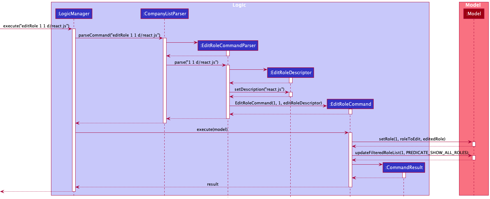

# **Table of Contents** 
* [Acknowledgements](#acknowledgements)
* [Setting up, getting started](#setting-up-getting-started)
* [Design](#design)
    * [Architecture](#architecture)
    * [UI Component](#ui-component)
    * [Logic Component](#logic-component)
    * [Model Component](#model-component)
    * [Storage Component](#storage-component)
* [Implementation](#implementation)
    * [Find feature](#find-feature)
        * [Implementation](#implementation-find)
    * [Edit role feature](#edit-role-feature)
        * [Implementation](#implementation-edit)
        * [Design considerations](#design-considerations-edit)
    * [Delete role feature](#delete-role-feature)
      * [Implementation](#implementation-delete)
* [Documentation, logging, testing, configuration, dev-ops](#documentation-logging-testing-configuration-dev-ops)
* [Appendix: Requirements](#requirements)
  * [Product scope](#product-scope)
  * [User stories](#user-stories)
  * [Use cases](#use-cases)
  * [Non-Functional Requirements](#non-functional-requirements)
  * [Glossary](#glossary)
* [Appendix: Instructions for manual testing](#instructions-for-manual-testing)
  * [Start and exit the application](#start-and-exit-the-application)
  * [Adding a company](#adding-a-company)
  * [Editing a company](#editing-a-company)
  * [Deleting a company](#deleting-a-company)
  * [Editing a role](#editing-a-role)

--------------------------------------------------------------------------------------------------------------------

## **Acknowledgements** 

* This project is created based on the AddressBook-Level3 project by the [SE-EDU initiative](https://se-education.org).

--------------------------------------------------------------------------------------------------------------------

## **Setting up, getting started** 

Refer to the guide [Setting up and getting started](SettingUp.md).

--------------------------------------------------------------------------------------------------------------------

## **Design** 

### Architecture 

The Architecture Diagram given above explains the high-level design of the Tinner. Tinner follows a multi-layered architecture where the lower layers are independent of higher layers. For example, `Main` can use methods found in `Storage` but not the other way around.
Below is a quick overview of main components and how they interact with each other.

**`Main`** has two classes called [`Main`](https://github.com/AY2122S2-CS2103T-T17-1/tp/blob/master/src/main/java/seedu/tinner/Main.java) and [`MainApp`](https://github.com/AY2122S2-CS2103T-T17-1/tp/blob/master/src/main/java/seedu/tinner/MainApp.java). It is responsible for,

* At app launch: Initializes the components in the correct sequence, and connects them up with each other.
* At shut down: Shuts down the components and invokes cleanup methods where necessary.

[**`Commons`**](#common-classes) represents a collection of classes used by multiple other components.

The rest of the App consists of four components.

* [**`UI`**](#ui-component): The UI of the App.
* [**`Logic`**](#logic-component): The command executor.
* [**`Model`**](#model-component): Holds the data of the App in memory.
* [**`Storage`**](#storage-component): Reads data from, and writes data to, the hard disk.

Each of the four components,

* defines its _API_ in an `interface` with the same name as the Component.
* exposes its functionality using a concrete `{Component Name}Manager` class (which implements the corresponding API `interface` mentioned in the previous point.

For example, the `Logic` component (see the class diagram given below) defines its API in the `Logic.java` interface and exposes its functionality using the `LogicManager.java` class which implements the `Logic` interface.

**How the architecture components interact with each other**

The _Sequence Diagram_ below shows how the components interact with each other for the scenario where the user issues the command `deleteCompany 1` when in project view.

The sections below give more details of each component.

### UI Component 

**API** :
[`Ui.java`](https://github.com/AY2122S2-CS2103T-T17-1/tp/blob/master/src/main/java/seedu/tinner/ui/Ui.java)

The UI consists of a `MainWindow` that is made up of parts e.g.`CommandBox`, `ResultDisplay`, `CompanyListPanel`, `StatusBarFooter` etc. All these, including the `MainWindow`, inherit from the abstract `UiPart` class which captures the commonalities between classes that represent parts of the visible GUI.

The `CommandBox` and `ResultDisplay` appear at the top of the application for the user
to interact with the application.

The `CompanyListPanel` appears at the center of the application displaying key information of `Company`
from `CompanyCard`.

The `RoleListPanel` appears at the bottom of `CompanyCard` displaying key information of `Role` from `RoleCard`.

The `UI` component uses the JavaFx UI framework. The layout of these UI parts are defined in matching `.fxml` files that are in the `src/main/resources/view` folder. For example, the layout of the `MainWindow` is specified in `MainWindow.fxml`

The `UI` component,
* executes user commands using the `Logic` component.
* listens for changes to `Model` data so that the `UI` can be updated with the modified data.
* keeps a reference to the `Logic` component, because the `UI` relies on the `Logic` to execute commands.
* depends on some classes in the `Model` component, as it displays `Company` and `Role` objects residing in the `Model`.

### Logic Component 

**API** :
[`Logic.java`](https://github.com/AY2122S2-CS2103T-T17-1/tp/blob/master/src/main/java/seedu/tinner/logic/Logic.java)

How the `Logic` component works:

* When `Logic` is called upon to execute a command, it uses the `CompanyListParser` class to parse the user command.
* This results in a `Command` object (or more precisely, an object of one of its subclasses e.g., `AddCompanyCommand`) which is executed by the `LogicManager`.
* The command can communicate with the `Model` when it is executed (e.g. to add a company).
* The result of the command execution is encapsulated as a `CommandResult` object which is returned back from `Logic`.

The Sequence Diagram below illustrates the interactions within the `Logic` component for the `execute("deleteCompany 1")` API call.

:information_source: **Note:** The lifeline for `DeleteCompanyCommandParser` should end at the destroy marker (X) but due to a limitation of PlantUML, the lifeline reaches the end of diagram.

The other classes in `Logic` (omitted from the class diagram above) that are used for parsing a user command can be represented as follows:

How the parsing works:

* When called upon to parse a user command, the `CompanyListParser` class creates an `XYZCommandParser` (`XYZ` is a placeholder for the specific command name e.g., `AddCompanyCommandParser`) which uses the other classes shown above (e.g. `ArgumentMultimap`, `ParserUtil`, etc.) to parse the user command and create a `XYZCommand` object (e.g., `AddCompanyCommand`) which the `CompanyListParser` returns back as a `Command` object.
* All `XYZCommandParser` classes (e.g., `AddCompanyCommandParser`, `DeleteCompanyCommandParser`, …) inherit from the `Parser` interface so that they can be treated similarly where possible e.g, during testing.

### Model Component 

Breakdown of the Company and RoleManager packages:

**API** :
[`Model.java`](https://github.com/AY2122S2-CS2103T-T17-1/tp/blob/master/src/main/java/seedu/tinner/model/Model.java)

The `Model` component,

* stores the company list data i.e., all `Company` objects (which are contained in a `UniqueCompanyList` object).
* stores the currently selected `Company`, `Role` and `Reminder` objects (e.g., results of a search query) as a separate filtered list which is exposed to outsiders as an unmodifiable `ObservableList` that can be ‘observed’ e.g. the UI can be bound to this list so that the UI automatically updates when the data in the list change.
* stores a `UserPref` object that represents the user’s preferences. This is exposed to the outside as a `ReadOnlyUserPref` objects.
* the `Reminder` objects store data of a role in a company that has a reminder date that is within the reminder window.
* does not depend on any of the other three components (as the `Model` represents data entities of the domain, they should make sense on their own without depending on other components)

### Storage Component 

**API** :
[`Storage.java`](https://github.com/AY2122S2-CS2103T-T17-1/tp/blob/master/src/main/java/seedu/tinner/storage/Storage.java)

The `Storage` component,

* can save `UserPref` objects in json format and read it back.
* can save `JsonAdaptedCompany` objects in `JsonSerializableCompanyList` in json format and read it back.
* can save `JsonAdaptedRole` objects in `JsonAdaptedCompany` in json format and read it back
* inherits from both `CompanyListStorage` and `UserPrefStorage`,meaning that it can be
  treated as either one (if the functionality of only one is required)
* depends on classes like `Company` and `Role` in the `Model` component (as it is the `Storage` component's
  job to save/retrieve objects that belong to the `Model`)

The `JsonAdaptedCompany` also contains a list of roles in `List<JsonAdaptedRole>` format, as show in the class diagram above.

--------------------------------------------------------------------------------------------------------------------

## **Implementation** 

### Find feature 

The `find` feature allows users to filter the company list by specifying company name keywords and role name keywords.

#### Implementation 
The `find` command is primarily implemented by `FindCommandParser` a class that extends `Parser`, and `FindCommand`, which is a class that extends `Command`. For each `find` command, a `Predicate<Company>` object and a `Predicate<Role>` object will be created. Both `Predicate` objects contain a `test` function to determine whether the given company or role matches the keywords provided in the user input.

* Upon a valid user's input using the `find` command, the `FindCommandParser#parse()`creates a `CompanyNameContainsKeywordsPredicate` which extends `Predicate<Company>`, and a `RoleNameContainsKeywordsPredicate` which extends `Predicate<Role>`.
* The `FindCommandParser#parse()` then uses the `CompanyNameContainsKeywordsPredicate` object and the `RoleNameContainsKeywordsPredicate` object to instantiate the `FindCommand`.
* Then invoking the `FindCommand#execute()` method will update the `model` using the `Model#updateFilteredRoleList()` method, displaying only companies and roles that match the user input.

The following sequence diagram shows how the `find` command operation works with the user input `find c/meta r/software mobile`:

Note that the lifeline of FindCommandParser should end at the destroy marker but due to the limitations of PlantUML, we are unable to depict it.

1. The user will first enter the input `find c/meta r/software mobile`, the `CompayListParser#parseCommand()` method will parse the information `c/meta r/software mobile` to `FindCommandParser` using the method `parse()` based on the keyword `find`.
2. The `FindCommandParser#parse()` method will create a `CompanyNameContainsKeywordsPredicate` object with the company name keywords specified after the prefix `c/` and the role name keywords specified after the prefix `r/`. The `RoleNameContainsKeywordsPredicate` is also created using the role name keywords specified after the prefix `r/`. If a prefix is present, keywords that follow the prefix must be present or else it would be deemed an invalid command.
3. Note that the `CompanyNameContainsKeywordsPredicate` is created using both company name keywords and role name keywords because companies are only displayed if they contain at least one role which matches the role name keywords
4. Either prefix `c/` or `r/` can be absent. Both cannot be absent within the same command or else it would give rise to an invalid command. If absent, an empty array with no keywords is passed as input in the creation of either or both `CompanyNameContainsKeywordsPredicate` and `RoleNameContainsKeywordsPredicate`.
5. Then the `FindCommandParser#parse()` method will create an `FindCommand` object with the `CompanyNameContainsKeywordsPredicate` object and the `RoleNameContainsKeywordsPredicate` object.  
6. The `FindCommand` object will be returned to the `LogicManager` and will then invoke the `FindCommand#execute()` method to implement the changes.
7. The `Model#updateFilteredCompanyList()` is invoked and filters the list of companies to display only companies which match the company name keywords.
8. Similarly, the `Model#updateFilteredRoleList()` also filters the list of roles within each company to display only roles which match the role name keywords.  
9. Upon successful operation, a new `CommandResult` object is returned to the `LogicManager`.

### Edit role feature 
The `editRole` command for the `Role` item allows the user to update any fields by specifying
the company index, role index and prefixes of the fields to be updated.

The aforementioned fields of the `Role` that can be modified are as follows:
* `RoleName`
* `Status`
* `ReminderDate`
* `Description`
* `Stipend`

#### Implementation 

  
The `editRole` command is primarily implemented by `EditRoleCommandParser` a class that
extends `Parser`, and `EditRoleCommand`, which is a class that extends `Command`. The `EditRoleCommand` has
an inner class `EditRoleDescriptor` that holds the changes to fields of the `Role` to be modified.

Given below is an example usage scenario and how the edit role feature behaves at each step:
1. The user executes the command `editRole 1 1 d/react js` to edit the description in the 1st role from the 1st company.
2. Then the `EditRoleCommandParser#parse()` creates an `EditRoleDescriptor` object with fields to be modified such as the description `react js` for the `EditRoleCommand`.
3. The `Parser` returns the `CommandResult` which is then executed by LogicManager.

The following sequence diagram shows how the `editRole` command operation works with the valid user input `editRole 1 1 d/react js`:
  

#### Design considerations 
* Alternative 1 (current choice): Logic components interact with the `Model` interface solely and not directly with model’s internal components: `Company`, `RoleManager`, `UniqueRoleList`.
    * Pros:
      * The `Model` interface acts as a Façade to allow clients such as `Logic` to access to the functionalities of its internal components without exposing the implementation details.
      Thus, reducing coupling between `Model` and other components as all functionalities of modifying `Role` can be accessed via the `Model` interface.
      * This increases maintainability as `EditRoleCommand` will only interact with `Model` interface with little concern to any changes in the implementation details of the internal components of `Model`.
    * Cons:
      * This requires additional code within `Model` as more methods are needed for other components to access the functionality of its internal components.
* Alternative 2 (used in v1.2): `Model` allows clients to access its internal components directly such as `Company`, `RoleManager`, `UniqueRoleList` to modify `Role`.
  * Pros:
    * No additional code is needed as clients can operate directly on the internals of `Model`.
  * Cons:
    * This exposes the internal implementation of `Model` and increases coupling between `EditRoleCommand` and, `Company`, `RoleManager` and `UniqueRoleList`.
    * It is harder to maintain as any changes to the internal implementation of `Model` will affect the implementation of `EditRoleCommand`.

### Delete role feature 
The `deleteRole` command for the `Role` item allows the user to delete any role under a `Company` item by specifying the company index and role index that which are associated with the `Role` item to be deleted.

#### Implementation 
The `deleteRole` command relies on the `DeleteRoleCommandParser`, a class that extends `Parser`, as well as `DeleteRoleCommand`, which is a class that extends `Command`. The `DeleteRoleCommand`, upon execution, dynamically updates the displayed list of roles accordingly.

* Upon a valid user's input using the `deleteRole` command, the `DeleteRoleCommandParser#parse()` retrieves the indices of the role to be deleted from the parsed user input.
* The `DeleteRoleCommandParser#parse()` then instantiates a `DeleteRoleCommand` that possesses the aforementioned indices.
* Then invoking the `DeleteRoleCommand#execute()` method will update the internal `CompanyList` and `FilteredList<Company>` of the `ModelManager` to reflect the role deletion.

The following sequence diagram shows how the `deleteRole` command operation works with the user input `deleteRole 1 1`:

1. The user first enters the input `deleteRole 1 1`, the `CompayListParser#parseCommand()` method parses the information `1 1` to `DeleteRoleCommandParser` using the method `parse()` based on the keyword `deleteRole`.
2. The `DeleteRoleCommandParser#parse()` method creates an instance of `DeleteCommand` by passing the company index and role index of the role that is to be deleted.
4. The `DeleteRoleCommand` object is returned to the `LogicManager` and invokes the `DeleteRoleCommand#execute()` method to implement the deletion.
5. The  `DeleteRoleCommand#execute()` checks the validity of both the indexes, and invokes the `Model#deleteRole()` method using the stored company index and role index.
6. The  `Model#deleteRole()` – with the indices – deletes the relevant role from the internal `CompanyList` in the `ModelManager`, from which the changes are also reflected visually in the filtered company list.
7. Upon successful operation, a new `CommandResult` object is returned to the `LogicManager`.

### Reminder feature 
Whenever the user starts up the application, a reminder pane will automatically open along with the main window, showing all roles and their respective companies that have reminder dates that are within the reminder window.

The fields of the `Reminder` that will be shown are as follows:
* `Company Name`
* `RoleName`
* `ReminderDate`
* `Status`

####Implementation 

Given below is an example scenario on how the reminder feature works:
1. The user has a role in a company with a reminder date of 30-04-2022 23:59.
2. Assuming that the reminder window is at its default of 7 days, and today is within 7 days from 30th April 2022, when the user opens the application, the reminder pane will display the given role and its relevant fields as mentioned above.

The following sequence diagram shows how the reminder feature works:

--------------------------------------------------------------------------------------------------------------------

## **Documentation, logging, testing, configuration, dev-ops** 

* [Documentation guide](Documentation.md)
* [Testing guide](Testing.md)
* [Logging guide](Logging.md)
* [Configuration guide](Configuration.md)
* [DevOps guide](DevOps.md)

--------------------------------------------------------------------------------------------------------------------

## **Requirements** 

### Product scope 

**Target user profile**:

Students who...

* want to keep track of tech internships
* are disorganised and tend to miss deadlines
* prefer desktop apps over other types
* can type fast
* prefer typing to mouse interactions
* are reasonably comfortable using CLI apps

**Value proposition**:

* Track (View all your internship applications at a glance)
* Remind (Be reminded of your upcoming assessments)
* Review (Comment on each stage of the application process for future self-improvement or review the company’s hiring process)

### User stories 

Priorities: High (must have) - `* * *`, Medium (nice to have) - `* *`, Low (unlikely to have) - `*`

| Priority | As a …​        | I want to …​                                                               | So that I can…​                                          |
|----------|----------------|----------------------------------------------------------------------------|----------------------------------------------------------|
| `* * *`  | user           | add a new company                                                          | add new internship roles to said company                 |
| `* * *`  | user           | add a new internship role                                                  | keep track of said internship application process        |
| `* * *`  | user           | delete a company                                                           | remove companies that I am no longer interested in       |
| `* * *`  | user           | delete an internship role                                                  | remove internship roles that are outdated or complete    |
| `* * *`  | user           | see a summary of my internship applications at a glance                    | have a general overview of the status of my applications |
| `* *`    | user           | search keywords like company name, internship roles, etc.                  | locate my internship application quickly                 |
| `* *`    | user           | sort company names in alphabetical order                                   | locate a company that I may have forgotten about         |
| `* *`    | user           | sort applications in chronological order of deadlines                      | keep track of the timeline of applications               |
| `* *`    | user           | modify each item                                                           | keep Tinner and all its contents up to date              |
| `* *`    | user           | be reminded of upcoming deadlines                                          | be on time with my applications                          |
| `* *`    | organised user | tag applications and events                                                | keep items compartmentalised and thus easier to access   |
| `* *`    | long term user | archive/hide irrelevant events                                             | not get distracted by what is not important              |
| `* *`    | new user       | learn how to use the application via a guide                               | use the application periodically with ease               |
| `*`      | user           | export calendar dates of important events into a .ics or .pdf file         | keep track of my events on an external platform          |
| `*`      | user           | export a list of interview reviews of different companies into a .csv file | share my experience with juniors and peers               |
| `*`      | user           | mark certain entries as my favourites                                      | view those that I am more interested in at a glance      |

*{More to be added}*

### Use cases 

(For all use cases below, the **System** is the `Tinner` and the **Actor** is the `user`, unless specified otherwise)

**Use case: UC01 - Add a company**

Guarantees: a company will be successfully created

**MSS**

1. User requests to add a specific company and its information in the list
2. Tinner adds a company to the list
3. Tinner displays the list of companies

   Use case ends

**Extensions**

 1a. The input does not adhere to the command format  
  1a1. Tinner shows an invalid input format error message  
     Use case resumes at step 1

 1b. The specific company is already stored  
  1b1. Tinner shows a duplicate company error message  
     Use case resumes at step 1

**Use case: UC02 - Add an internship role**

Precondition: the company to which the internship role will belong has already been created

Guarantees: an internship role will be successfully created

**MSS**

1. User requests to view a list of companies
2. User requests to add an internship role and provides the relevant details
3. Tinner adds the internship role to the list of roles of the specific company

   Use case ends

**Extensions**

 1a. The input does not adhere to the command format  
  1a1. Tinner shows an invalid input format error message  
     Use case resumes at step 1

**Use case: UC03 - Delete a company**

Precondition: there exists at least one company in the list of companies

Guarantees: a company is successfully removed from the list of companies

**MSS**

1. User requests to view a list of companies
2. Tinner shows a list of companies and the associated internship roles
3. User requests to delete a specific company in the list
4. Tinner deletes the company

   Use case ends

**Extensions**

 3a. The input does not adhere to the command format  
  3a1. Tinner shows an invalid input format error message  
     Use case resumes at step 2

 3b. The input company index is invalid  
  3b1. Tinner shows a company index out of bounds error message  
     Use case resumes at step 2

**Use case: UC04 - Delete an internship role**

Precondition: there exists at least one internship role associated with a company in the list of companies

Guarantees: a specified internship role is successfully removed from the associated company

**MSS**

1. User requests to view a list of companies
2. Tinner shows a list of companies and the associated internship roles
3. User requests to delete a specific internship role of a company in the list
4. Tinner deletes the internship role

   Use case ends

**Extensions**

 3a. The input does not adhere to the command format  
  3a1. Tinner shows an invalid input format error message  
     Use case resumes at step 2

 3b. The input company index is invalid  
  3b1. Tinner shows a company index out of bounds error message  
     Use case resumes at step 2

 3c. The input internship role index is invalid  
  3c1. Tinner shows an internship role index out of bounds error message  
     Use case resumes at step 2

**Use case: UC05 - List all companies**

Precondition: there exist at least one company stored in Tinner

Guarantees: every company stored in Tinner will be shown

**MSS**

1. User requests to view a list of companies
2. Tinner displays all companies in its storage

   Use case ends

**Use case: UC06 - Adding or editing a role with a reminder date**

Precondition: there exist at least one company stored in Tinner

Guarantees: every role in companies that have reminder dates within the reminder window from today will be shown

1. The user [adds a role(UC02)]() or [edits a role(UCXX)]() that has a reminder date.
2. Tinner shows success message and adds/edits the role.
3. The user closes the application and opens it up again immediately or some time in the future
4. Tinner displays all roles in companies that have reminder dates within the reminder window from today's date/
    Use case ends

*{More to be added}*

### Non-Functional Requirements 

1. Should work on any _mainstream OS_ as long as it has Java `11` or above installed
2. Should be able to hold up to 1000 items (companies and internship roles) without a noticeable sluggishness in performance for typical usage
3. Should require no installation
4. A user with above average typing speed for regular English text (i.e. not code, not system admin commands) should be able to accomplish most of the tasks faster using commands than using the mouse
5. Should be responsive and have a latency of less than 3 seconds

*{More to be added}*

### Glossary 

* **Mainstream OS**: Windows, Linux, Unix, macOS
* **CLI**: Command Line Interface
* **MSS**: Main Success Scenario

## Appendix: Instructions for manual testing 

### Start and exit the application 
1. To start the application
   1. Download the tinner.jar file and copy into an empty folder. 
   2. On the command terminal, run the following command in the directory containing tinner.jar: `java -jar tinner.jar`  
   Expected: Shows the GUI with internship application examples. 
2. To exit the application
   1. Enter `exit` in the command box.   
   Expected: The application will close shortly. 
   

### Adding a company 
1. Test case: `addCompany n/Govtech p/9222222 e/xyz@gov.com a/10 Pasir Panjang Rd, #10-01 Mapletree Business City, Singapore 117438`
   1. Expected: Company list is updated with the addition of "GovTech". The response box shows the details of all the fields added.
2. Test case: `addCompany n/Tik Tok e/xyz@tiktok.com`
   1. Expected: Company list is updated with the addition of "Tik Tok". The response box shows the details of the fields added.
3. Test case: `addCompany e/t@tesla.com p/99944426 n/Tesla`
   1. Expected: Company list is updated with the addition of "Tesla". The response box shows the details of the fields added.
4. Test case: `addCompany n/Tinner p/ e/t@tinner.com a/fairy land`
   1. Expected: Company list is not updated. The response box shows error message that there must be a value after a prefix.
5. Other incorrect test cases to try: `addCompany`, and other prefixes without value e.g. `add n/`.
   1. Expected: Company list is not updated. The response box shows error message that it is an invalid command with additional information of the correct format. 

### Editing a company 
1. Prerequisites: At least 2 companies must exist and listed using the `list` command
2. Test case: `editCompany 1 1 n/Tik Tok`
    1. Expected: The name of 1st company is changed to "TikTok".
       The response box shows the updated details of all the fields of the edited company. The company list is updated with the changes.
3. Test case: `editCompany 2 n/Tik Tok`
    1. Expected: The name 2nd company is not updated.
       The response box shows error message that the company already exists in the company list.
4. Other incorrect test cases to try: `editCompany x n/VAlID_COMPANY_NAME` where x is an integer larger than the size of the company list or negative integer values.
    1. Expected: The intended company with index `x` is not updated.
   The response box shows error message that company/ role index is invalid

### deleting a company 
1. Prerequisites: At least 2 companies must exist and listed using the `list` command
2. Test case: `deleteCompany 1`
   1. Expected: First company with its roles included if any, is removed from the company list. 
   The response box shows the details of the deleted company.
3. Other incorrect test cases to try: `deleteCompany x` where x is an integer larger than the size of the company list or negative integer values.
   1. Expected: Company with index `x` is not deleted. The response box shows error message that the company index provided is invalid.

### Editing a role 
1. Prerequisites: At least 1 companies with 2 roles must exist and listed using the `list` command
2. Test case: `editRole 1 1 n/Frontend Engineer`
   1. Expected: The name of 1st role from the 1st company is changed to "Frontend Engineer".
   The response box shows the updated details of all the fields of the edited role. The company list is updated with the changes. 
3. Test case: `editRole 1 2 n/Frontend Engineer`
   1. Expected: The name of 2nd role from the 1st company is not updated.
   The response box shows error message that the role already exists in the company. 
4. Test case: `editRole 1 1 $/0`
   1. Expected: The stipend of 1st role from the 1st company is not updated.
      The response box shows error message that stipend must be a positive number.
5. Test case: `editRole 1 1 $/10000000000` or `editRole 1 1 $/0`
   1. Expected: The stipend of 1st role from the 1st company is not updated.
   The response box shows error message that stipend must be a positive value and input of stipend should be at most 10 digits long.
6. Other incorrect test cases to try: `editRole x1 x2 n/VAlID_ROLE_NAME` where x1 or x2 are integers larger than the size of the company list and role list respectively or negative integer values. 
   1. Expected: The intended company with index `x1` and role with index `x2` is not updated.
   The response box shows error message that company/ role index is invalid

### Using the reminder feature 
1. Prerequisites: At least 1 company with one role must exist and is listed on index 1 using the `list` command, test cases assume default reminder window of 7 days is used
2. Test case: `editRole 1 n/Software Engineer r/<INSERT DATE THAT IS WITHIN 7 DAYS FROM TODAY>` (e.g. if today is 06-04-2022, test case should use any date between 06-04-2022 to 13-04-2022)
   1. Expected: When you close and reopen the application, the reminder pane will show the added role.
3. Test case: `editRole 1 n/Software Engineer r/<INSERT DATE THAT IS IN THE PAST>` (e.g. if today is 06-04-2022 , use any date before then like 05-04-2022)
   1. Expected: The response box shows an error message that the reminder date should not be in the past.
4. Test case: `editRole 1 n/Software Engineer r/<INSERT INVALID DATE>` (e.g. 31-04-2022)
   1. Expected: THe response box shows an error message that the reminder date should be a valid date.